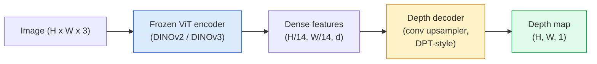

# Monocular Depth 与 Geometry Estimation

> depth map 是一张单通道图像，其中每个 pixel 表示到 camera 的距离。过去，如果没有 stereo 或 LiDAR，仅从一帧 RGB 预测它被认为是不可能的。到 2026 年，一个冻结的 ViT encoder 加上轻量级 head，就能达到与 ground truth 仅相差几个百分点的效果。

**类型：** 构建 + 使用
**语言：** Python
**前置要求：** Phase 4 Lesson 14 (ViT), Phase 4 Lesson 17 (Self-Supervised Vision), Phase 4 Lesson 07 (U-Net)
**时间：** 约 60 分钟

## 学习目标

- 区分 relative depth 和 metric depth，并说明每个生产级 model（MiDaS, Marigold, Depth Anything V3, ZoeDepth）解决的是哪一种
- 使用 Depth Anything V3（DINOv2 backbone）在无需 calibration 的情况下，为任意单张图像预测 depth
- 解释为什么 monocular depth 能从单张图像中成立（perspective cues、texture gradients、learned priors），以及它无法恢复什么（absolute scale、occluded geometry）
- 使用 depth map 和 pinhole camera intrinsics 将 2D detections 提升为 3D points

## 问题

Depth 是 2D computer vision 中缺失的轴。给定 RGB，你知道物体在 image plane 中出现的位置；但你不知道它们有多远。Depth sensors（stereo rigs、LiDAR、time-of-flight）可以直接解决这个问题，但它们昂贵、脆弱，并且 range 受限。

Monocular depth estimation，即从单张 RGB frame 预测 depth，过去常常产生模糊且不可靠的输出。到 2026 年，大型 pretrained encoders 改变了这一点：Depth Anything V3 使用冻结的 DINOv2 backbone，并生成能够泛化到 indoor、outdoor、medical 和 satellite domains 的 depth maps。Marigold 将 depth 重新表述为 conditional diffusion 问题。ZoeDepth 回归真实的 metric distances。

Depth 也是 2D detection 和 3D understanding 之间的桥梁：将 detected box 的 pixels 乘以 depth，就可以把 2D object 提升为 3D point cloud。这是每个 AR occlusion system、每条 obstacle-avoidance pipeline，以及每个“拿起杯子”的 robot 的核心。

## 概念

### Relative vs metric depth

- **Relative depth** — 没有真实世界单位的有序 `z` values。“Pixel A 比 pixel B 更近，但距离比例并没有锚定到 metres。”
- **Metric depth** — 从 camera 出发、以 metres 计的绝对距离。要求 model 学到 image cues 与真实距离之间的统计关系。

MiDaS 和 Depth Anything V3 生成 relative depth。Marigold 生成 relative depth。ZoeDepth、UniDepth 和 Metric3D 生成 metric depth。Metric models 对 camera intrinsics 敏感；relative models 则不敏感。

### Encoder-decoder 模式



Depth Anything V3 冻结 encoder，只训练 DPT-style decoder。encoder 提供丰富的 features；decoder 将这些 features 插值回 image resolution，并回归 depth。

### 为什么单张图像也能产生 depth

一张 2D 图像包含许多与 depth 相关的 monocular cues：

- **Perspective** — 3D 中的平行线在 2D 中会收敛。
- **Texture gradient** — 远处的表面具有更小、更密集的 texture。
- **Occlusion order** — 更近的 objects 会遮挡更远的 ones。
- **Size constancy** — 已知 objects（cars、humans）提供近似 scale。
- **Atmospheric perspective** — 在 outdoor scenes 中，远处 objects 看起来更朦胧、更偏蓝。

在数十亿张图像上训练的 ViT 会内化这些 cues。只要数据足够多、backbone 足够强，monocular depth 即使没有任何显式 3D supervision，也能达到合理精度。

### Monocular depth 不能做什么

- 没有 intrinsics 或场景中的已知 object 时，无法得到 **absolute metric scale**。network 可以预测“cup 距离是 spoon 的两倍”，但不知道 cup 是 1 m 还是 10 m 远。
- **Occluded geometry** — 椅子的背面不可见，无法可靠推断。
- **真正无 texture / reflective surfaces** — mirrors、glass、uniform walls。network 会报告看似合理但错误的 depth。

### 2026 年的 Depth Anything V3

- 使用原生 DINOv2 ViT-L/14 作为 encoder（冻结）。
- DPT decoder。
- 在来自多样来源的 posed image pairs 上训练（除了 photometric consistency，不需要显式 depth supervision）。
- 能够从 **任意数量的 visual inputs 中预测空间一致的 geometry，无论是否已知 camera poses**。
- 在 monocular depth、any-view geometry、visual rendering、camera pose estimation 上达到 SOTA。

这是 2026 年需要 depth 时应调用的 drop-in model。

### Marigold — 用于 depth 的 diffusion

Marigold（Ke et al., CVPR 2024）将 depth estimation 重新表述为 conditional image-to-image diffusion。Conditioning：RGB。Target：depth map。使用 pretrained Stable Diffusion 2 U-Net 作为 backbone。输出的 depth maps 在 object boundaries 处格外清晰。权衡：inference 比 feed-forward models 更慢（10-50 个 denoising steps）。

### Intrinsics 和 pinhole camera

要将带有 depth `d` 的 pixel `(u, v)` 提升为 camera coordinates 中的 3D point `(X, Y, Z)`：

```
fx, fy, cx, cy = camera intrinsics
X = (u - cx) * d / fx
Y = (v - cy) * d / fy
Z = d
```

Intrinsics 来自 EXIF metadata、calibration pattern，或 monocular intrinsics estimator（Perspective Fields、UniDepth）。没有 intrinsics 时，你仍然可以通过假设 60-70° FOV 和中等分辨率 principal points 来渲染 point cloud，这适合 visualisation，但不适合 measurement。

### Evaluation

两个标准 metrics：

- **AbsRel**（absolute relative error）：`mean(|d_pred - d_gt| / d_gt)`。越低越好。生产级 models 通常为 0.05-0.1。
- **delta < 1.25**（threshold accuracy）：满足 `max(d_pred/d_gt, d_gt/d_pred) < 1.25` 的 pixels 占比。越高越好。SOTA 通常为 0.9+。

对于 relative depth（Depth Anything V3、MiDaS），evaluation 使用这两个 metrics 的 scale-and-shift invariant 版本。

## 构建

### 步骤 1： Depth metrics

```python
import torch

def abs_rel_error(pred, target, mask=None):
    if mask is not None:
        pred = pred[mask]
        target = target[mask]
    return (torch.abs(pred - target) / target.clamp(min=1e-6)).mean().item()


def delta_accuracy(pred, target, threshold=1.25, mask=None):
    if mask is not None:
        pred = pred[mask]
        target = target[mask]
    ratio = torch.maximum(pred / target.clamp(min=1e-6), target / pred.clamp(min=1e-6))
    return (ratio < threshold).float().mean().item()
```

在 evaluation 前，始终 mask 无效的 depth pixels（zero、NaN、saturated）。

### 步骤 2：Scale-and-shift alignment

对于 relative-depth models，在计算 metrics 前先将 prediction 对齐到 ground truth。对 `a * pred + b = target` 做 least-squares fit：

```python
def align_scale_shift(pred, target, mask=None):
    if mask is not None:
        p = pred[mask]
        t = target[mask]
    else:
        p = pred.flatten()
        t = target.flatten()
    A = torch.stack([p, torch.ones_like(p)], dim=1)
    coeffs, *_ = torch.linalg.lstsq(A, t.unsqueeze(-1))
    a, b = coeffs[:2, 0]
    return a * pred + b
```

在评估 MiDaS / Depth Anything 时，先运行 `align_scale_shift`，再运行 `abs_rel_error`。

### 步骤 3： 将 depth 提升为 point cloud

```python
import numpy as np

def depth_to_point_cloud(depth, intrinsics):
    H, W = depth.shape
    fx, fy, cx, cy = intrinsics
    v, u = np.meshgrid(np.arange(H), np.arange(W), indexing="ij")
    z = depth
    x = (u - cx) * z / fx
    y = (v - cy) * z / fy
    return np.stack([x, y, z], axis=-1)


depth = np.random.uniform(0.5, 4.0, (240, 320))
intr = (320.0, 320.0, 160.0, 120.0)
pc = depth_to_point_cloud(depth, intr)
print(f"point cloud shape: {pc.shape}  (H, W, 3)")
```

一个函数，适用于所有 3D-lifted application。将 point cloud 导出为 `.ply`，并在 MeshLab 或 CloudCompare 中打开。

### 步骤 4： 用 synthetic depth scene 做 smoke test

```python
def synthetic_depth(size=96):
    yy, xx = np.meshgrid(np.arange(size), np.arange(size), indexing="ij")
    # Floor: linear gradient from near (top) to far (bottom)
    depth = 1.0 + (yy / size) * 4.0
    # Box in the middle: closer
    mask = (np.abs(xx - size / 2) < size / 6) & (np.abs(yy - size * 0.6) < size / 6)
    depth[mask] = 2.0
    return depth.astype(np.float32)


gt = torch.from_numpy(synthetic_depth(96))
pred = gt + 0.3 * torch.randn_like(gt)  # simulated prediction
aligned = align_scale_shift(pred, gt)
print(f"before align  absRel = {abs_rel_error(pred, gt):.3f}")
print(f"after align   absRel = {abs_rel_error(aligned, gt):.3f}")
```

### 步骤 5： Depth Anything V3 使用方式（reference）

```python
import torch
from transformers import pipeline
from PIL import Image

pipe = pipeline(task="depth-estimation", model="LiheYoung/depth-anything-v2-large")

image = Image.open("street.jpg").convert("RGB")
out = pipe(image)
depth_np = np.array(out["depth"])
```

三行。`out["depth"]` 是 PIL grayscale；转换为 numpy 后用于数学计算。对于 Depth Anything V3，发布后替换 model id 即可；API 保持不变。

## 使用

- **Depth Anything V3**（Meta AI / ByteDance, 2024-2026）— relative depth 的默认选择。生产中最快的 ViT-large-backbone model。
- **Marigold**（ETH, 2024）— 最高 visual quality，inference 慢。
- **UniDepth**（ETH, 2024）— metric depth，并带 camera intrinsics estimation。
- **ZoeDepth**（Intel, 2023）— metric depth；较旧，但仍然可靠。
- **MiDaS v3.1** — legacy 但稳定；适合作为 comparison baseline。

典型 integration pattern：

1. RGB frame 到达。
2. Depth model 生成 depth map。
3. Detector 生成 boxes。
4. 通过 depth 将 box centroids 提升到 3D；如果有 point cloud，则与其合并。
5. 下游：AR occlusion、path planning、object-size estimation、stereo replacement。

对于 real-time 使用，Depth Anything V2 Small（INT8 quantised）在 consumer GPU 上以 518x518 可达到约 30 fps。

## 交付

本课会生成：

- `outputs/prompt-depth-model-picker.md` — 根据 latency、metric-vs-relative 需求和 scene type，在 Depth Anything V3、Marigold、UniDepth、MiDaS 之间做选择。
- `outputs/skill-depth-to-pointcloud.md` — 一个从 depth maps 构建 point clouds 的 skill，正确处理 intrinsics 并导出到 `.ply`。

## 练习

1. **（Easy）** 在你桌面的任意 10 张图像上运行 Depth Anything V2。将 depth 保存为 grayscale PNGs 并检查。找出一个预测 depth 看起来错误的 object，并解释为什么 monocular cues 失败了。
2. **（Medium）** 给定 Depth Anything V2 的 RGB + depth，将其提升为 point cloud 并用 `open3d` 渲染。比较两个 scenes（indoor / outdoor），并记录哪个看起来更可信。
3. **（Hard）** 拍摄五对图像，每对只改变一个已知 object 的位置（例如 bottle 向近处移动 30 cm）。使用 UniDepth 在两张图像上预测 metric depth。报告预测的 distance delta 与真实 30 cm 的差异。

## 关键术语

| Term | 人们常说 | 实际含义 |
|------|----------------|----------------------|
| Monocular depth | "Single-image depth" | 从一帧 RGB 进行 depth estimation，不使用 stereo 或 LiDAR |
| Relative depth | "Ordered depth" | 没有真实世界单位的有序 z-values |
| Metric depth | "Absolute distance" | 以 metres 表示的 depth；需要 calibration 或使用 metric supervision 训练的 model |
| AbsRel | "Absolute relative error" | |d_pred - d_gt| / d_gt 的平均值；标准 depth metric |
| Delta accuracy | "delta < 1.25" | prediction 位于 ground truth 25% 以内的 pixels 占比 |
| Pinhole camera | "fx, fy, cx, cy" | 用于将 (u, v, d) 提升到 (X, Y, Z) 的 camera model |
| DPT | "Dense Prediction Transformer" | 位于冻结 ViT encoders 之上的 conv-based decoder，用于 depth |
| DINOv2 backbone | "The reason it works" | 无需 depth labels 即可跨 domains 泛化的 self-supervised features |

## 延伸阅读

- [Depth Anything V3 paper page](https://depth-anything.github.io/) — 使用 DINOv2 encoder 的 SOTA monocular depth
- [Marigold (Ke et al., CVPR 2024)](https://marigoldmonodepth.github.io/) — 基于 diffusion 的 depth estimation
- [UniDepth (Piccinelli et al., 2024)](https://arxiv.org/abs/2403.18913) — 带 intrinsics 的 metric depth
- [MiDaS v3.1 (Intel ISL)](https://github.com/isl-org/MiDaS) — canonical relative-depth baseline
- [DINOv3 blog post (Meta)](https://ai.meta.com/blog/dinov3-self-supervised-vision-model/) — 提升 depth accuracy 的 encoder family
