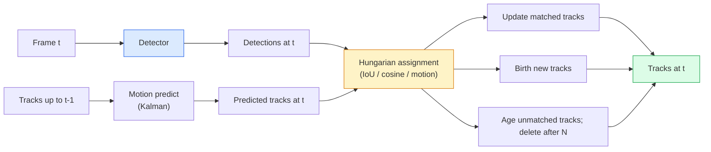

# Multi-Object Tracking 与 Video Memory

> Tracking 是 detection 加 association。检测每一帧。按 ID 将当前帧的 detections 匹配到上一帧的 tracks。

**Type:** Build
**Languages:** Python
**Prerequisites:** Phase 4 Lesson 06 (YOLO Detection), Phase 4 Lesson 08 (Mask R-CNN), Phase 4 Lesson 24 (SAM 3)
**Time:** ~60 分钟

## 学习目标

- 区分 tracking-by-detection 与 query-based tracking，并说出算法家族名称（SORT, DeepSORT, ByteTrack, BoT-SORT, SAM 2 memory tracker, SAM 3.1 Object Multiplex）
- 从零实现 IoU + Hungarian assignment，用于经典 tracking-by-detection
- 解释 SAM 2 的 memory bank，以及为什么它比基于 IoU 的 association 更能处理 occlusion
- 读懂三种 tracking metrics（MOTA, IDF1, HOTA），并为给定 use case 选择最重要的一项

## 问题

Detector 会告诉你单帧中的 objects 在哪里。Tracker 会告诉你 frame `t` 中的哪个 detection 与 frame `t-1` 中的某个 detection 是同一个 object。没有这一点，你就无法统计 objects 穿过一条线的次数，无法在 occlusion 中持续跟踪一颗球，也无法知道“car #4 已经在车道里停留了 8 秒”。

Tracking 对每个面向视频的产品都至关重要：sports analytics、surveillance、autonomous driving、medical video analysis、wildlife monitoring、wordmark counting。核心构件是共通的：per-frame detector、motion model（Kalman filter 或更丰富的模型）、association step（基于 IoU / cosine / learned features 的 Hungarian algorithm），以及 track lifecycle（birth, update, death）。

2026 年带来了两种新模式：**SAM 2 memory-based tracking**（用 feature-memory 替代 motion-model association）和 **SAM 3.1 Object Multiplex**（为同一概念的多个 instances 共享 memory）。本课先讲经典栈，再讲基于 memory 的方法。

## 核心概念

### Tracking-by-detection



你在 2026 年会遇到的每个 tracker，都是这个循环的变体。差异在于：

- **SORT** (2016): Kalman filter + IoU Hungarian。简单、快速，没有 appearance model。
- **DeepSORT** (2017): SORT + 每条 track 一个基于 CNN 的 appearance feature（ReID Embedding）。更能处理交叉场景。
- **ByteTrack** (2021): 将低置信度 detections 作为第二阶段进行 association；不需要 appearance features，但在 MOT17 上表现领先。
- **BoT-SORT** (2022): Byte + camera motion compensation + ReID。
- **StrongSORT / OC-SORT** — ByteTrack 的后继方法，具备更好的 motion 与 appearance。

### 一段话理解 Kalman filter

Kalman filter 为每条 track 维护一个带 covariance 的状态 `(x, y, w, h, dx, dy, dw, dh)`。在每一帧，它先用 constant-velocity model **predict** 状态，然后用匹配到的 detection **update**。当 predict 的 uncertainty 较高时，update 会更信任 detection。这会产生平滑轨迹，并让 track 能够穿过短暂 occlusion（1-5 帧）继续存在。

每个经典 tracker 都会在 motion-prediction step 使用 Kalman filter。

### Hungarian algorithm

给定一个 `M x N` cost matrix（tracks x detections），寻找使总 cost 最小的一对一 assignment。Cost 通常是 `1 - IoU(track_bbox, detection_bbox)`，或者 appearance features 的负 cosine similarity。Runtime 是 O((M+N)^3)；当 M、N 最高约为 1000 时，通过 `scipy.optimize.linear_sum_assignment` 在 Python 中足够快。

### ByteTrack 的关键思想

标准 trackers 会丢弃低置信度 detections（< 0.5）。ByteTrack 会保留它们作为 **second-stage candidates**：先将 tracks 与高置信度 detections 匹配，然后让未匹配的 tracks 用稍微宽松的 IoU threshold 尝试匹配低置信度 detections。这样可以恢复短暂 occlusions，并减少人群附近的 ID switches。

### SAM 2 memory-based tracking

SAM 2 通过维护 per-instance spatio-temporal features 的 **memory bank** 来处理视频。给定某一帧上的 prompt（click、box、text）后，它会将该 instance 编码进 memory。在后续帧中，memory 会与新帧 features 做 cross-attention，decoder 则为新帧中的同一 instance 生成 mask。

没有 Kalman filter，也没有 Hungarian assignment。Association 隐含在 memory-attention 操作中。

优点：
- 对大范围 occlusions 鲁棒（memory 会跨多帧携带 instance identity）。
- 与 SAM 3 的 text prompts 结合时支持 open-vocabulary。
- 无需单独的 motion model。

缺点：
- 对 many-object tracking 来说比 ByteTrack 更慢。
- Memory bank 会增长；context window 受限。

### SAM 3.1 Object Multiplex

此前的 SAM 2 / SAM 3 tracking 会为每个 instance 保留独立的 memory bank。50 个 objects 就是 50 个 memory banks。Object Multiplex（2026 年 3 月）将它们压缩为一个带有 **per-instance query tokens** 的 shared memory。Cost 随 instances 数量呈次线性增长。

Multiplex 是 2026 年 crowd tracking 的新默认选择：concert crowds、warehouse workers、traffic intersections。

### 需要掌握的三种 metrics

- **MOTA (Multi-Object Tracking Accuracy)** — 1 - (FN + FP + ID switches) / GT。按 error type 加权；这是一个将 detection 和 association failures 混合在一起的单一 metric。
- **IDF1 (ID F1)** — ID precision 与 recall 的 harmonic mean。专注衡量每条 ground-truth track 在时间上保持其 ID 的程度。对 ID-switch-sensitive tasks 来说比 MOTA 更好。
- **HOTA (Higher Order Tracking Accuracy)** — 分解为 detection accuracy (DetA) 与 association accuracy (AssA)。自 2020 年以来的社区标准；最全面。

对于 surveillance（who is who）：报告 IDF1。对于 sports analytics（counting passes）：HOTA。对于一般学术比较：HOTA。

## 构建它

### 步骤 1： 基于 IoU 的 cost matrix

```python
import numpy as np


def bbox_iou(a, b):
    """
    a, b: [x1, y1, x2, y2] 的 (N, 4) arrays。
    返回 (N_a, N_b) IoU matrix。
    """
    ax1, ay1, ax2, ay2 = a[:, 0], a[:, 1], a[:, 2], a[:, 3]
    bx1, by1, bx2, by2 = b[:, 0], b[:, 1], b[:, 2], b[:, 3]
    inter_x1 = np.maximum(ax1[:, None], bx1[None, :])
    inter_y1 = np.maximum(ay1[:, None], by1[None, :])
    inter_x2 = np.minimum(ax2[:, None], bx2[None, :])
    inter_y2 = np.minimum(ay2[:, None], by2[None, :])
    inter = np.clip(inter_x2 - inter_x1, 0, None) * np.clip(inter_y2 - inter_y1, 0, None)
    area_a = (ax2 - ax1) * (ay2 - ay1)
    area_b = (bx2 - bx1) * (by2 - by1)
    union = area_a[:, None] + area_b[None, :] - inter
    return inter / np.clip(union, 1e-8, None)
```

### 步骤 2： 最小 SORT 风格 tracker

为简洁起见，省略固定 constant-velocity Kalman；这里使用简单的 IoU association；在生产环境中，Kalman predict 是必不可少的。`sort` Python package 提供完整版本。

```python
from scipy.optimize import linear_sum_assignment


class Track:
    def __init__(self, tid, bbox, frame):
        self.id = tid
        self.bbox = bbox
        self.last_frame = frame
        self.hits = 1

    def update(self, bbox, frame):
        self.bbox = bbox
        self.last_frame = frame
        self.hits += 1


class SimpleTracker:
    def __init__(self, iou_threshold=0.3, max_age=5):
        self.tracks = []
        self.next_id = 1
        self.iou_threshold = iou_threshold
        self.max_age = max_age

    def step(self, detections, frame):
        if not self.tracks:
            for d in detections:
                self.tracks.append(Track(self.next_id, d, frame))
                self.next_id += 1
            return [(t.id, t.bbox) for t in self.tracks]

        track_boxes = np.array([t.bbox for t in self.tracks])
        det_boxes = np.array(detections) if len(detections) else np.empty((0, 4))

        iou = bbox_iou(track_boxes, det_boxes) if len(det_boxes) else np.zeros((len(track_boxes), 0))
        cost = 1 - iou
        cost[iou < self.iou_threshold] = 1e6

        matched_track = set()
        matched_det = set()
        if cost.size > 0:
            row, col = linear_sum_assignment(cost)
            for r, c in zip(row, col):
                if cost[r, c] < 1.0:
                    self.tracks[r].update(det_boxes[c], frame)
                    matched_track.add(r); matched_det.add(c)

        for i, d in enumerate(det_boxes):
            if i not in matched_det:
                self.tracks.append(Track(self.next_id, d, frame))
                self.next_id += 1

        self.tracks = [t for t in self.tracks if frame - t.last_frame <= self.max_age]
        return [(t.id, t.bbox) for t in self.tracks]
```

60 行。接收 per-frame detections，返回 per-frame track IDs。真实系统还会加入 Kalman predict、ByteTrack 的 second-stage re-match，以及 appearance features。

### 步骤 3： Synthetic trajectory test

```python
def synthetic_frames(num_frames=20, num_objects=3, H=240, W=320, seed=0):
    rng = np.random.default_rng(seed)
    starts = rng.uniform(20, 200, size=(num_objects, 2))
    velocities = rng.uniform(-5, 5, size=(num_objects, 2))
    frames = []
    for f in range(num_frames):
        dets = []
        for i in range(num_objects):
            cx, cy = starts[i] + f * velocities[i]
            dets.append([cx - 10, cy - 10, cx + 10, cy + 10])
        frames.append(dets)
    return frames


tracker = SimpleTracker()
for f, dets in enumerate(synthetic_frames()):
    tracks = tracker.step(dets, f)
```

三个位于直线运动中的 objects 应该能在全部 20 帧中保持各自的 ID。

### 步骤 4： ID-switch metric

```python
def count_id_switches(tracks_per_frame, gt_per_frame):
    """
    tracks_per_frame:  list of list of (track_id, bbox)
    gt_per_frame:      list of list of (gt_id, bbox)
    返回 ID switches 的数量。
    """
    prev_assignment = {}
    switches = 0
    for tracks, gts in zip(tracks_per_frame, gt_per_frame):
        if not tracks or not gts:
            continue
        t_boxes = np.array([b for _, b in tracks])
        g_boxes = np.array([b for _, b in gts])
        iou = bbox_iou(g_boxes, t_boxes)
        for g_idx, (gt_id, _) in enumerate(gts):
            j = iou[g_idx].argmax()
            if iou[g_idx, j] > 0.5:
                t_id = tracks[j][0]
                if gt_id in prev_assignment and prev_assignment[gt_id] != t_id:
                    switches += 1
                prev_assignment[gt_id] = t_id
    return switches
```

这是一个简化的、接近 IDF1 的 metric：统计一个 ground-truth object 更换其 assigned predicted track ID 的次数。真实的 MOTA / IDF1 / HOTA 工具位于 `py-motmetrics` 和 `TrackEval` 中。

## 使用它

2026 年的生产级 trackers：

- `ultralytics` — YOLOv8 + 内置 ByteTrack / BoT-SORT。`results = model.track(source, tracker="bytetrack.yaml")`。默认选择。
- `supervision` (Roboflow) — ByteTrack wrappers 加 annotation utilities。
- SAM 2 / SAM 3.1 — 通过 `processor.track()` 进行 memory-based tracking。
- Custom stack: detector (YOLOv8 / RT-DETR) + `sort-tracker` / `OC-SORT` / `StrongSORT`。

选择方式：

- 30+ fps 下的 pedestrians / cars / boxes：**ByteTrack with ultralytics**。
- 人群中某一类的大量 instances：**SAM 3.1 Object Multiplex**。
- 带有可识别 appearance 的 heavy occlusions：**DeepSORT / StrongSORT**（ReID features）。
- Sports / complex interactions：**BoT-SORT** 或 learned trackers（MOTRv3）。

## 交付它

本课会产出：

- `outputs/prompt-tracker-picker.md` — 根据 scene type、occlusion patterns 和 latency budget 选择 SORT / ByteTrack / BoT-SORT / SAM 2 / SAM 3.1。
- `outputs/skill-mot-evaluator.md` — 编写一个完整 evaluation harness，用于针对 ground-truth tracks 评估 MOTA / IDF1 / HOTA。

## 练习

1. **(Easy)** 用上面的 synthetic tracker 分别运行 3、10 和 30 个 objects。报告每种情况下的 ID-switch count。找出简单的 IoU-only association 从哪里开始失效。
2. **(Medium)** 在 association 之前加入 constant-velocity Kalman predict step。展示短暂（2-3 帧）occlusions 不再导致 ID switches。
3. **(Hard)** 集成 SAM 2 的 memory-based tracker（通过 `transformers`）作为替代 tracker backend。在一段 30 秒的人群 clip 上同时运行 SimpleTracker 和 SAM 2，并比较 ID-switch counts；为 5 个显著人物手动标注 ground-truth IDs。

## 关键术语

| Term | 常见说法 | 实际含义 |
|------|----------------|----------------------|
| Tracking-by-detection | “先 detect 再 associate” | Per-frame detector + 基于 IoU / appearance 的 Hungarian assignment |
| Kalman filter | “Motion predict” | Linear dynamics + covariance，用于平滑 track predictions 和处理 occlusion |
| Hungarian algorithm | “Optimal assignment” | 求解 minimum-cost bipartite matching 问题；`scipy.optimize.linear_sum_assignment` |
| ByteTrack | “低置信度 second pass” | 将未匹配 tracks 重新匹配到低置信度 detections，以恢复短暂 occlusions |
| DeepSORT | “SORT + appearance” | 添加 ReID feature 用于跨帧匹配；更利于保持 ID |
| Memory bank | “SAM 2 trick” | 跨帧存储的 per-instance spatio-temporal features；cross-attention 替代显式 association |
| Object Multiplex | “SAM 3.1 shared memory” | 使用带 per-instance queries 的单一 shared memory，实现快速 many-object tracking |
| HOTA | “现代 tracking metric” | 分解为 detection 和 association accuracy；社区标准 |

## 延伸阅读

- [SORT (Bewley et al., 2016)](https://arxiv.org/abs/1602.00763) — 最小 tracking-by-detection 论文
- [DeepSORT (Wojke et al., 2017)](https://arxiv.org/abs/1703.07402) — 添加 appearance feature
- [ByteTrack (Zhang et al., 2022)](https://arxiv.org/abs/2110.06864) — 低置信度 second pass
- [BoT-SORT (Aharon et al., 2022)](https://arxiv.org/abs/2206.14651) — camera motion compensation
- [HOTA (Luiten et al., 2020)](https://arxiv.org/abs/2009.07736) — 分解式 tracking metric
- [SAM 2 video segmentation (Meta, 2024)](https://ai.meta.com/sam2/) — memory-based tracker
- [SAM 3.1 Object Multiplex (Meta, March 2026)](https://ai.meta.com/blog/segment-anything-model-3/)
