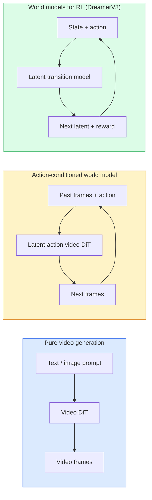

# World Models 与 Video Diffusion

> 一个能够预测场景未来几秒的视频模型，就是一个世界模拟器。把这个预测条件化在动作上，你就得到一个 learned game engine。

**Type:** Learn + Build
**Languages:** Python
**Prerequisites:** Phase 4 Lesson 10 (Diffusion), Phase 4 Lesson 12 (Video Understanding), Phase 4 Lesson 23 (DiT + Rectified Flow)
**Time:** ~75 分钟

## 学习目标
- 解释纯视频生成模型（Sora 2）与 action-conditioned world model（Genie 3, DreamerV3）之间的区别
- 描述 video DiT：spatio-temporal patches、3D position encoding、跨 `(T, H, W)` tokens 的 joint attention
- 追踪 World Model 如何接入 robotics：VLM 规划 → video model 模拟 → inverse dynamics 输出动作
- 针对给定 use case（creative video、interactive sim、autonomous-driving synthesis）在 Sora 2、Genie 3、Runway GWM-1 Worlds、Wan-Video 和 HunyuanVideo 之间做选择

## 问题
视频生成和 World Model 在 2026 年走向融合。一个能够生成连贯一分钟视频的模型，在某种意义上已经学会了世界如何运动：object permanence、gravity、causality、style。如果你把这个预测条件化在动作上（向左走、打开门），video model 就会变成一个可学习的 simulator，可以替代 game engine、driving simulator 或 robotics environment。

其影响非常具体。Genie 3 可以从单张图像生成可玩的环境。Runway GWM-1 Worlds 合成无限可探索的场景。Sora 2 生成带有同步音频和建模物理效果的一分钟视频。NVIDIA Cosmos-Drive、Wayve Gaia-2 和 Tesla DrivingWorld 为 autonomous-vehicle training data 生成真实感驾驶视频。World Model 范式正在悄然接管 robotics 中的 sim-to-real。

本课是 Phase 4 的“大图景”课程。它把 image generation、video understanding 和 agentic reasoning 连接成主流研究正在转向的 architecture pattern。

## 概念
### World Model 的三类体系



- **Sora 2** 是基于 prompts 条件化的纯视频生成。没有动作接口。你无法在 rollout 中途“操控”它。
- **Genie 3**、**GWM-1 Worlds**、**Mirage / Magica** 是 action-conditioned world models。它们从观测视频中推断 latent actions，然后把未来帧预测条件化在动作上。它们是交互式的：你按键或移动 camera，场景就会响应。
- **DreamerV3** 和经典 RL World Model 家族在 latent space 中进行预测，并带有显式 action conditioning，基于 reward signal 训练。视觉性较弱；但对 sample-efficient RL 更有用。

### Video DiT architecture

```
Video latent:          (C, T, H, W)
Patchify (spatial):    grid of P_h x P_w patches per frame
Patchify (temporal):   group P_t frames into a temporal patch
Resulting tokens:      (T / P_t) * (H / P_h) * (W / P_w) tokens
```

Positional encoding 是 3D 的：针对每个 `(t, h, w)` 坐标使用 rotary 或 learned embedding。Attention 可以是：

- **Full joint** — 所有 tokens attend 到所有 tokens。对于 N 个 tokens 是 O(N^2)。对长视频来说代价过高。
- **Divided** — 交替执行 temporal attention（相同 spatial position、跨时间：`(H*W) * T^2`）和 spatial attention（相同 timestep、跨空间：`T * (H*W)^2`）。TimeSformer 和大多数 video DiTs 都使用这种方式。
- **Window** — 在 `(t, h, w)` 中使用局部 windows。Video Swin 使用这种方式。

每个 2026 年的视频 Diffusion 模型都会使用这三种模式之一，再加上 AdaLN conditioning（Lesson 23）和 rectified flow。

### 基于动作的 Conditioning：latent action models

Genie 通过判别式地预测一对连续帧之间的动作，为每一帧学习一个 **latent action**。然后模型的 decoder 条件化在推断出的 latent action 上，而不是显式键盘按键上。在 inference 时，用户可以指定一个 latent action（或从新的 prior 中 sample 一个），模型会生成与该动作一致的下一帧。

Sora 完全跳过了动作接口。它的 decoder 从过去的 spacetime tokens 预测下一个 spacetime tokens。Prompt 只条件化起点；生成中途没有东西可以操控它。

### Physical plausibility

Sora 2 的 2026 年发布明确宣传了 **physical plausibility**：重量、平衡、object permanence、cause-and-effect。团队通过人工评分的 plausibility scores 衡量；与 Sora 1 相比，该模型在掉落物体、角色碰撞以及故意失败（一次没跳成功）等场景上有明显改进。

Plausibility 仍然是主要失败模式。2024-2025 年人们吃意大利面或用玻璃杯喝水的视频暴露了模型缺乏持久 object representation 的问题。2026 年模型（Sora 2、Runway Gen-5、HunyuanVideo）减少了这些问题，但没有消除。

### 自动驾驶 world models

Driving world models 会生成基于 trajectories、bounding boxes 或 navigation maps 条件化的真实道路场景。用法：

- **Cosmos-Drive-Dreams** (NVIDIA) — 为 RL training 生成数分钟驾驶视频。
- **Gaia-2** (Wayve) — 用于 policy evaluation 的 trajectory-conditioned scene synthesis。
- **DrivingWorld** (Tesla) — 模拟多样的天气、time-of-day 和交通条件。
- **Vista** (ByteDance) — 响应式驾驶场景合成。

它们替代了昂贵的真实世界数据采集，用于覆盖 corner cases，例如夜间行人乱穿马路、结冰路口、罕见车辆类型；否则这些情况需要数百万英里的驾驶才能采集到。

### 机器人技术栈：VLM + video model + inverse dynamics

正在出现的三组件 robotics loop：

1. **VLM** 解析目标（“拿起红色杯子”），规划 high-level action sequence。
2. **Video generation model** 模拟执行每个动作会是什么样子，预测未来 N 帧 observations。
3. **Inverse dynamics model** 提取会产生这些 observations 的具体 motor commands。

这替代了 reward shaping 和 sample-heavy RL。World Model 负责想象；inverse dynamics 在执行层面闭环。Genie Envisioner 是一个实例；许多研究团队正在收敛到这种结构。

### Evaluation

- **Visual quality** — FVD (Fréchet Video Distance)、用户研究。
- **Prompt alignment** — 每帧 CLIPScore、VQA-style evaluation。
- **Physical plausibility** — 在 benchmark suite 上人工评分（Sora 2 的内部 benchmark、VBench）。
- **Controllability**（针对 interactive world models）— action → observation consistency；你能否回到之前的状态？

### 2026 年的模型版图

| Model | Use | Parameters | Output | License |
|-------|-----|------------|--------|---------|
| Sora 2 | text-to-video, audio | — | 1-min 1080p + audio | API only |
| Runway Gen-5 | text/image-to-video | — | 10s clips | API |
| Runway GWM-1 Worlds | interactive world | — | infinite 3D rollout | API |
| Genie 3 | interactive world from image | 11B+ | playable frames | research preview |
| Wan-Video 2.1 | open text-to-video | 14B | high-quality clips | non-commercial |
| HunyuanVideo | open text-to-video | 13B | 10s clips | permissive |
| Cosmos / Cosmos-Drive | autonomous driving sim | 7-14B | driving scenes | NVIDIA open |
| Magica / Mirage 2 | AI-native game engine | — | modifiable worlds | product |

## 构建它
### 步骤 1： video 的 3D patchify

```python
import torch
import torch.nn as nn


class VideoPatch3D(nn.Module):
    def __init__(self, in_channels=4, dim=64, patch_t=2, patch_h=2, patch_w=2):
        super().__init__()
        self.proj = nn.Conv3d(
            in_channels, dim,
            kernel_size=(patch_t, patch_h, patch_w),
            stride=(patch_t, patch_h, patch_w),
        )
        self.patch_t = patch_t
        self.patch_h = patch_h
        self.patch_w = patch_w

    def forward(self, x):
        # x: (N, C, T, H, W)
        x = self.proj(x)
        n, c, t, h, w = x.shape
        tokens = x.reshape(n, c, t * h * w).transpose(1, 2)
        return tokens, (t, h, w)
```

一个 stride 等于 kernel 的 3D conv 会充当 spatio-temporal patchifier。`(T, H, W) -> (T/2, H/2, W/2)` 的 tokens 网格。

### 步骤 2： 3D rotary position encoding

Rotary Position Embeddings (RoPE) 分别沿 `t`、`h`、`w` 轴应用：

```python
def rope_3d(tokens, t_dim, h_dim, w_dim, grid):
    """
    tokens: (N, T*H*W, D)
    grid: (T, H, W) sizes
    t_dim + h_dim + w_dim == D
    """
    T, H, W = grid
    n, seq, d = tokens.shape
    if t_dim + h_dim + w_dim != d:
        raise ValueError(f"t_dim+h_dim+w_dim ({t_dim}+{h_dim}+{w_dim}) must equal D={d}")
    assert seq == T * H * W
    t_idx = torch.arange(T, device=tokens.device).repeat_interleave(H * W)
    h_idx = torch.arange(H, device=tokens.device).repeat_interleave(W).repeat(T)
    w_idx = torch.arange(W, device=tokens.device).repeat(T * H)
    # Simplified: just scale channels by frequencies. Real RoPE rotates pairs.
    freqs_t = torch.exp(-torch.log(torch.tensor(10000.0)) * torch.arange(t_dim // 2, device=tokens.device) / (t_dim // 2))
    freqs_h = torch.exp(-torch.log(torch.tensor(10000.0)) * torch.arange(h_dim // 2, device=tokens.device) / (h_dim // 2))
    freqs_w = torch.exp(-torch.log(torch.tensor(10000.0)) * torch.arange(w_dim // 2, device=tokens.device) / (w_dim // 2))
    emb_t = torch.cat([torch.sin(t_idx[:, None] * freqs_t), torch.cos(t_idx[:, None] * freqs_t)], dim=-1)
    emb_h = torch.cat([torch.sin(h_idx[:, None] * freqs_h), torch.cos(h_idx[:, None] * freqs_h)], dim=-1)
    emb_w = torch.cat([torch.sin(w_idx[:, None] * freqs_w), torch.cos(w_idx[:, None] * freqs_w)], dim=-1)
    return tokens + torch.cat([emb_t, emb_h, emb_w], dim=-1)
```

这里是简化的 additive form。真实 RoPE 会按频率旋转成对 channels；位置信息是一样的。

### 步骤 3： Divided attention block

```python
class DividedAttentionBlock(nn.Module):
    def __init__(self, dim=64, heads=2):
        super().__init__()
        self.time_attn = nn.MultiheadAttention(dim, heads, batch_first=True)
        self.space_attn = nn.MultiheadAttention(dim, heads, batch_first=True)
        self.ln1 = nn.LayerNorm(dim)
        self.ln2 = nn.LayerNorm(dim)
        self.ln3 = nn.LayerNorm(dim)
        self.mlp = nn.Sequential(nn.Linear(dim, 4 * dim), nn.GELU(), nn.Linear(4 * dim, dim))

    def forward(self, x, grid):
        T, H, W = grid
        n, seq, d = x.shape
        # time attention: same (h, w), across t
        xt = x.view(n, T, H * W, d).permute(0, 2, 1, 3).reshape(n * H * W, T, d)
        a, _ = self.time_attn(self.ln1(xt), self.ln1(xt), self.ln1(xt), need_weights=False)
        xt = (xt + a).reshape(n, H * W, T, d).permute(0, 2, 1, 3).reshape(n, seq, d)
        # space attention: same t, across (h, w)
        xs = xt.view(n, T, H * W, d).reshape(n * T, H * W, d)
        a, _ = self.space_attn(self.ln2(xs), self.ln2(xs), self.ln2(xs), need_weights=False)
        xs = (xs + a).reshape(n, T, H * W, d).reshape(n, seq, d)
        xs = xs + self.mlp(self.ln3(xs))
        return xs
```

time attention 在每个 spatial position 内跨时间 attend；space attention 在每一帧内跨位置 attend。用两个 O(T^2 + (HW)^2) 操作，替代一个 O((THW)^2) 操作。这是 TimeSformer 和每个现代 video DiT 的核心。

### 步骤 4： 组合一个 tiny video DiT

```python
class TinyVideoDiT(nn.Module):
    def __init__(self, in_channels=4, dim=64, depth=2, heads=2):
        super().__init__()
        self.patch = VideoPatch3D(in_channels=in_channels, dim=dim, patch_t=2, patch_h=2, patch_w=2)
        self.blocks = nn.ModuleList([DividedAttentionBlock(dim, heads) for _ in range(depth)])
        self.out = nn.Linear(dim, in_channels * 2 * 2 * 2)

    def forward(self, x):
        tokens, grid = self.patch(x)
        for blk in self.blocks:
            tokens = blk(tokens, grid)
        return self.out(tokens), grid
```

这不是一个可工作的 video generator；它是一个结构演示，证明每个部分的 shape 都正确。

### 步骤 5： 检查 shapes

```python
vid = torch.randn(1, 4, 8, 16, 16)  # (N, C, T, H, W)
model = TinyVideoDiT()
out, grid = model(vid)
print(f"input  {tuple(vid.shape)}")
print(f"tokens grid {grid}")
print(f"output {tuple(out.shape)}")
```

patching 之后预期 `grid = (4, 8, 8)` 且 `out = (1, 256, 32)`；head 随后投影到每个 token 对应的 spatio-temporal patches，准备 un-patchify 回视频。

## 使用它
2026 年的生产访问模式：

- **Sora 2 API** (OpenAI) — text-to-video、同步音频。Premium pricing。
- **Runway Gen-5 / GWM-1** (Runway) — image-to-video、interactive worlds。
- **Wan-Video 2.1 / HunyuanVideo** — 开源自托管。
- **Cosmos / Cosmos-Drive** (NVIDIA) — driving simulation open weights。
- **Genie 3** — research preview，需要申请访问。

构建 interactive world-model demo：从 Wan-Video 开始以获得质量，再叠加一个 latent-action adapter 来实现交互性。对于 autonomous driving simulation：Cosmos-Drive 是 2026 年的 open reference。

现实中的 robotics stack：

1. Language goal -> VLM (Qwen3-VL) -> high-level plan。
2. Plan -> latent-action video model -> imagined rollout。
3. Rollout -> inverse dynamics model -> low-level actions。
4. 执行 Actions -> observation fed back into step 1。

## 交付它
本课产出：

- `outputs/prompt-video-model-picker.md` — 根据 task、license 和 latency，在 Sora 2 / Runway / Wan / HunyuanVideo / Cosmos 之间做选择。
- `outputs/skill-physical-plausibility-checks.md` — 一个定义自动化检查（object permanence、gravity、continuity）的 skill，用于在交付前检查任何生成视频。

## 练习
1. **(Easy)** 计算一个 5 秒 360p 视频在 patch-t=2、patch-h=8、patch-w=8 时的 token count。推理这个规模下 attention 的内存需求。
2. **(Medium)** 把上面的 divided attention block 替换成 full joint attention block，并测量 shape 和 parameter count。解释为什么真实 video models 必须使用 divided attention。
3. **(Hard)** 构建一个最小 latent-action video model：使用 `(frame_t, action_t, frame_{t+1})` triples 数据集（任意简单 2D game），训练一个基于 action embeddings 条件化的 tiny video DiT，并展示不同动作会产生不同的下一帧。

## 关键术语
| Term | What people say | What it actually means |
|------|----------------|----------------------|
| World model | “Learned simulator” | 一个在给定 state 和 action 时预测未来 observations 的模型 |
| Video DiT | “Spacetime transformer” | 使用 3D patchification 和 divided attention 的 Diffusion transformer |
| Latent action | “Inferred control” | 从帧对中推断出的离散或连续 action latent；用于条件化 next-frame generation |
| Divided attention | “Time then space” | 每个 block 中的两个 attention 操作：先跨时间，再跨空间，用来让 O(N^2) 保持可控 |
| Object permanence | “Things stay real” | video models 必须学会的场景属性；在食物、玻璃器皿上的经典失败模式 |
| FVD | “Fréchet Video Distance” | FID 的视频等价物；主要 visual quality metric |
| Inverse dynamics model | “Observations to actions” | 给定 `(state, next state)`，输出连接二者的 action；闭合 robotics loop |
| Cosmos-Drive | “NVIDIA driving sim” | 用于 RL 和 evaluation 的 open-weights autonomous-driving world model |

## 延伸阅读
- [Sora technical report (OpenAI)](https://openai.com/index/video-generation-models-as-world-simulators/)
- [Genie: Generative Interactive Environments (Bruce et al., 2024)](https://arxiv.org/abs/2402.15391) — latent action world models
- [TimeSformer (Bertasius et al., 2021)](https://arxiv.org/abs/2102.05095) — 用于 video transformers 的 divided attention
- [DreamerV3 (Hafner et al., 2023)](https://arxiv.org/abs/2301.04104) — 用于 RL 的 world models
- [Cosmos-Drive-Dreams (NVIDIA, 2025)](https://research.nvidia.com/labs/toronto-ai/cosmos-drive-dreams/) — driving world model
- [Top 10 Video Generation Models 2026 (DataCamp)](https://www.datacamp.com/blog/top-video-generation-models)
- [From Video Generation to World Model — survey repo](https://github.com/ziqihuangg/Awesome-From-Video-Generation-to-World-Model/)
