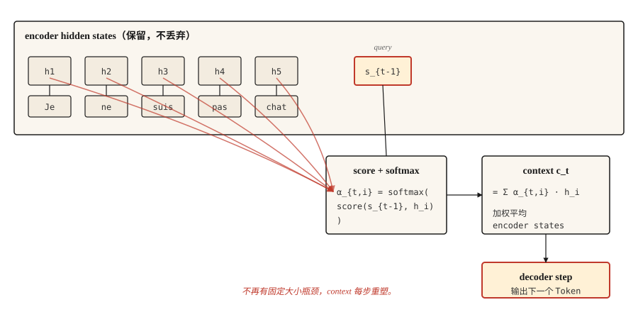

# Attention Mechanism — 突破

> Decoder 不再盯着一个压缩摘要费力辨认，而是开始查看整个 source。此后的一切都是 attention 加 engineering。

**Type:** Build
**Languages:** Python
**先修要求：** Phase 5 · 09（Sequence-to-Sequence Models）
**Time:** ~45 分钟

## 问题

Lesson 09 以一次可度量的失败收尾。一个在玩具 copy 任务上训练的 GRU encoder-decoder，长度为 5 时 accuracy 为 89%，长度到 80 时接近随机。原因是结构性的，不是训练 bug：encoder 提取到的每一 bit 信息都必须塞进一个固定大小的 hidden state，而 decoder 再也看不到别的东西。

Bahdanau、Cho 和 Bengio 在 2014 年发表了一个三行修复。不要只把最终 encoder state 给 decoder，而是保留每个 encoder state。在每个 decoder step，计算 encoder states 的加权平均，其中权重表示“decoder 现在需要看 encoder 位置 `i` 多少？”这个加权平均就是 context，并且它在每个 decoder step 都会变化。

这就是完整想法。Transformers 扩展了它。Self-attention 把它应用到单个 sequence。Multi-head attention 并行运行它。但 2014 版本已经打破了瓶颈；一旦你有了它，转向 transformers 就是 engineering，而不是概念变化。

## 概念



在每个 decoder step `t`：

1. 使用前一个 decoder hidden state `s_{t-1}` 作为 **query**。
2. 将它与每个 encoder hidden state `h_1, ..., h_T` 打分。每个 encoder 位置一个 scalar。
3. 对 scores 做 softmax，得到 attention weights `α_{t,1}, ..., α_{t,T}`，它们总和为 1。
4. Context vector `c_t = Σ α_{t,i} * h_i`。encoder states 的加权平均。
5. Decoder 接收 `c_t` 加上前一个 output token，生成下一个 token。

加权平均才是重点。当 decoder 需要把 "Je" 翻译成 "I" 时，它会让 "Je" 上方的 encoder state 权重大，其他位置权重小。当它需要 "not" 时，它会让 "pas" 权重大。Context vector 在每一步都会重塑。

## Shapes（最容易咬人的地方）

这是每个 attention implementation 第一次都会出错的地方。慢慢读。

| Thing | Shape | Notes |
|-------|-------|-------|
| Encoder hidden states `H` | `(T_enc, d_h)` | 如果是 BiLSTM，`d_h = 2 * d_hidden` |
| Decoder hidden state `s_{t-1}` | `(d_s,)` | 一个 vector |
| Attention score `e_{t,i}` | scalar | 每个 encoder 位置一个 |
| Attention weight `α_{t,i}` | scalar | 对所有 `i` 做 softmax 之后 |
| Context vector `c_t` | `(d_h,)` | 与一个 encoder state 的 shape 相同 |

**Bahdanau（additive）score。** `e_{t,i} = v_α^T * tanh(W_a * s_{t-1} + U_a * h_i)`。

- `s_{t-1}` 的 shape 是 `(d_s,)`，`h_i` 的 shape 是 `(d_h,)`。
- `W_a` 的 shape 是 `(d_attn, d_s)`。`U_a` 的 shape 是 `(d_attn, d_h)`。
- 它们在 tanh 内部相加后的 shape 是 `(d_attn,)`。
- `v_α` 的 shape 是 `(d_attn,)`。与 `v_α` 做 inner product 会坍缩成一个 scalar。**这就是 `v_α` 的作用。**它不是魔法。它是把 attention-dim vector 转成 scalar score 的 projection。

**Luong（multiplicative）score。** 三个变体：

- `dot`: `e_{t,i} = s_t^T * h_i`。要求 `d_s == d_h`。硬性约束。如果你的 encoder 是 bidirectional，就跳过。
- `general`: `e_{t,i} = s_t^T * W * h_i`，其中 `W` 的 shape 是 `(d_s, d_h)`。移除了维度相等的约束。
- `concat`: 本质上是 Bahdanau 形式。很少使用，因为前两个更便宜。

**一个值得点名的 Bahdanau / Luong gotcha。** Bahdanau 使用 `s_{t-1}`（生成当前 word *之前* 的 decoder state）。Luong 使用 `s_t`（生成*之后*的 state）。把它们混起来会产生非常难 debug 的微妙错误 gradients。选一篇 paper，然后坚持它的约定。


```figure
attention-heatmap
```

## 构建它

### 步骤 1： additive（Bahdanau）attention

```python
import numpy as np


def additive_attention(decoder_state, encoder_states, W_a, U_a, v_a):
    projected_dec = W_a @ decoder_state
    projected_enc = encoder_states @ U_a.T
    combined = np.tanh(projected_enc + projected_dec)
    scores = combined @ v_a
    weights = softmax(scores)
    context = weights @ encoder_states
    return context, weights


def softmax(x):
    x = x - np.max(x)
    e = np.exp(x)
    return e / e.sum()
```

根据上表检查你的 shapes。`encoder_states` 的 shape 是 `(T_enc, d_h)`。`projected_enc` 的 shape 是 `(T_enc, d_attn)`。`projected_dec` 的 shape 是 `(d_attn,)`，并会 broadcast。`combined` 的 shape 是 `(T_enc, d_attn)`。`scores` 的 shape 是 `(T_enc,)`。`weights` 的 shape 是 `(T_enc,)`。`context` 的 shape 是 `(d_h,)`。可以发布了。

### 步骤 2： Luong dot 和 general

```python
def dot_attention(decoder_state, encoder_states):
    scores = encoder_states @ decoder_state
    weights = softmax(scores)
    return weights @ encoder_states, weights


def general_attention(decoder_state, encoder_states, W):
    projected = W.T @ decoder_state
    scores = encoder_states @ projected
    weights = softmax(scores)
    return weights @ encoder_states, weights
```

每个都是三行。这就是 Luong 的 paper 能成立的原因。在大多数任务上 accuracy 相同，代码少得多。

### 步骤 3： 一个完整的数值示例

给定三个 encoder states（大致对应 "cat"、"sat"、"mat"）以及一个最接近第一个 state 的 decoder state，attention distribution 会集中在位置 0。如果 decoder state 移动到更接近最后一个 encoder state，attention 就会移动到位置 2。Context vector 会随之跟踪。

```python
H = np.array([
    [1.0, 0.0, 0.2],
    [0.5, 0.5, 0.1],
    [0.1, 0.9, 0.3],
])

s_close_to_cat = np.array([0.9, 0.1, 0.2])
ctx, w = dot_attention(s_close_to_cat, H)
print("weights:", w.round(3))
```

```
weights: [0.464 0.305 0.231]
```

第一行获胜。然后把 decoder state 移到更接近第三个 encoder state，观察 weights 如何移动。就是这样。Attention 是显式 alignment。

### 步骤 4： 为什么这是通往 transformers 的桥梁

把上面的语言翻译成 Q/K/V：

- **Query** = decoder state `s_{t-1}`
- **Key** = encoder states（我们拿来打分的对象）
- **Value** = encoder states（我们加权求和的对象）

在 classical attention 中，keys 和 values 是同一个东西。Self-attention 将它们分离：你可以让一个 sequence query 自身，并为 K 和 V 使用不同的 learned projections。Multi-head attention 用不同的 learned projections 并行运行它。Transformers 把整个 stage 堆叠很多次，并去掉 RNNs。

数学是相同的。Shapes 是相同的。从 Bahdanau attention 到 scaled dot-product attention 的教学跃迁，主要只是 notation。

## 使用它

PyTorch 和 TensorFlow 直接提供 attention。

```python
import torch
import torch.nn as nn

mha = nn.MultiheadAttention(embed_dim=128, num_heads=8, batch_first=True)
query = torch.randn(2, 5, 128)
key = torch.randn(2, 10, 128)
value = torch.randn(2, 10, 128)

output, weights = mha(query, key, value)
print(output.shape, weights.shape)
```

```
torch.Size([2, 5, 128]) torch.Size([2, 5, 10])
```

这就是一个 transformer attention layer。Query batch 有 5 个位置，key/value batch 有 10 个位置，每个都是 128-dim，8 个 heads。`output` 是新的 context-augmented queries。`weights` 是你可以可视化的 5x10 alignment matrix。

### Classical attention 什么时候仍然重要

- 教学。single-head、single-layer、基于 RNN 的版本让每个概念都可见。
- Transformers 放不下的 on-device sequence 任务。
- 任何 2014-2017 年的 paper。不知道 Bahdanau 的约定，你会读错它。
- MT 中的细粒度 alignment analysis。Raw attention weights 即使在 transformer models 上也是 interpretability tool，而读懂它们需要知道它们是什么。

### attention-weight-as-explanation 陷阱

Attention weights 看起来可解释。它们是跨位置求和为一的 weights；你可以画出来；高值表示“看了这里”。Reviewers 很喜欢它们。

它们没有看起来那么可解释。Jain 和 Wallace（2019）表明，在一些任务中，attention distributions 可以被置换，并被任意替代方案替换，而不改变 model predictions。没有 ablation 或 counterfactual check，永远不要把 attention weights 报告为 reasoning 证据。

## 发布它

保存为 `outputs/prompt-attention-shapes.md`：

```markdown
---
name: attention-shapes
description: Debug shape bugs in attention implementations.
phase: 5
lesson: 10
---

给定一个损坏的 attention implementation，你需要识别 shape mismatch。输出：

1. 哪个 matrix 的 shape 错了。命名这个 tensor。
2. 它的 shape 应该是什么，从 (d_s, d_h, d_attn, T_enc, T_dec, batch_size) 推导。
3. 一行修复。Transpose、reshape 或 project。
4. 一个捕获 regressions 的测试。通常是：assert `output.shape == (batch, T_dec, d_h)` and `weights.shape == (batch, T_dec, T_enc)` and `weights.sum(dim=-1) close to 1`。

拒绝建议会静默 broadcast 的修复。被 broadcast 隐藏的 bugs 之后会表现为静默 accuracy degradation，这是最糟糕的一类 attention bug。

对于 Bahdanau 混淆，坚持 decoder input 是 `s_{t-1}`（pre-step state）。对于 Luong，是 `s_t`（post-step state）。对于 dot-product，把 query 和 key 之间的 dimension mismatch 标记为新手最常见错误。
```

## 练习

1. **Easy.** 实现 `softmax` masking，使 encoder 中的 padding tokens 获得零 attention weight。在包含可变长度 sequences 的 batch 上测试。
2. **Medium.** 给 Luong `general` 形式添加 multi-head attention。把 `d_h` 拆成 `n_heads` 组，每个 head 运行 attention，然后 concatenate。验证 single-head 情况与你之前的实现一致。
3. **Hard.** 在 lesson 09 的玩具 copy 任务上训练一个带 Bahdanau attention 的 GRU encoder-decoder。绘制 accuracy vs sequence length。与 no-attention baseline 比较。你应该会看到长度增加时差距扩大，这确认 attention 抬高了瓶颈。

## 关键术语
| Term | What people say | What it actually means |
|------|-----------------|-----------------------|
| Attention | 看东西 | 对 value sequence 做加权平均，weights 由 query-key similarity 计算。 |
| Query, Key, Value | QKV | 三个 projections：Q 发问，K 是要匹配的内容，V 是要返回的内容。 |
| Additive attention | Bahdanau | Feed-forward score: `v^T tanh(W q + U k)`。 |
| Multiplicative attention | Luong dot / general | Score 是 `q^T k` 或 `q^T W k`。更便宜，在大多数任务上 accuracy 相同。 |
| Alignment matrix | 好看的图 | Attention weights 作为 `(T_dec, T_enc)` 网格。读取它可以看到 model attend 到了什么。 |

## 延伸阅读
- [Bahdanau, Cho, Bengio (2014). Neural Machine Translation by Jointly Learning to Align and Translate](https://arxiv.org/abs/1409.0473) — 这篇 paper。
- [Luong, Pham, Manning (2015). Effective Approaches to Attention-based Neural Machine Translation](https://arxiv.org/abs/1508.04025) — 三种 score variants 及其比较。
- [Jain and Wallace (2019). Attention is not Explanation](https://arxiv.org/abs/1902.10186) — 可解释性注意事项。
- [Dive into Deep Learning — Bahdanau Attention](https://d2l.ai/chapter_attention-mechanisms-and-transformers/bahdanau-attention.html) — 使用 PyTorch 的可运行 walkthrough。
