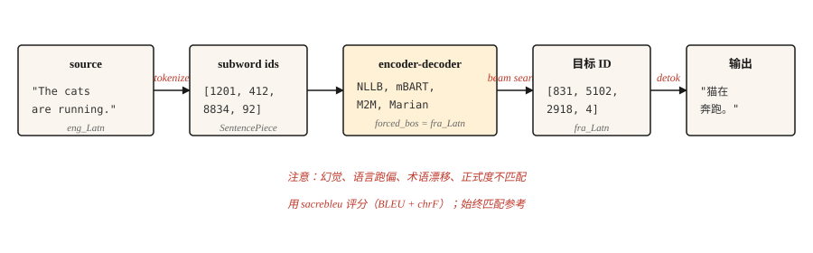

# Machine Translation

> Translation 是为 NLP 研究买单了三十年的任务，而且现在仍在继续买单。

**Type:** Build
**Languages:** Python
**先修要求：** Phase 5 · 10 (Attention), Phase 5 · 04 (GloVe, FastText, Subword)
**Time:** ~75 minutes

## 问题
一个 model 读取一种语言的句子，并生成另一种语言的句子。长度会变化。词序会变化。有些源语言词会映射到多个目标语言词，反之亦然。习语拒绝一对一映射。英语里的 "I miss you" 在法语里是 "tu me manques" —— 字面意思是 "you are lacking to me"。没有任何词级 alignment 能在这种情况下保留下来。

Machine Translation 是迫使 NLP 发明 encoder-decoders、Attention、Transformers，并最终推动整个 LLM paradigm 形成的任务。每一步进展的出现，都是因为 translation quality 可衡量，而人类与机器之间的差距又顽固存在。

本课跳过历史课，讲解 2026 年的可用 pipeline：pretrained multilingual encoder-decoder（NLLB-200 或 mBART）、subword tokenization、beam search、BLEU 和 chrF evaluation，以及仍会未经发现就进入 production 的少数 failure modes。

## 概念


现代 MT 是在 parallel text 上训练的 Transformer encoder-decoder。encoder 读取按其语言 tokenization 处理后的 source。decoder 通过 cross-attention（lesson 10）使用 encoder 的 output，一次生成一个 subword。decoding 使用 beam search 来避开 greedy-decoding trap。output 会被 detokenized、detruecased，并与 reference 评分对比。

三个 operational choices 决定真实世界中的 MT quality。

- **Tokenizer.** SentencePiece BPE 在混合语言 corpus 上训练。跨语言 shared vocabulary 正是 NLLB 能实现 zero-shot language pairs 的原因。
- **Model size.** NLLB-200 distilled 600M 可以在 laptop 上运行。NLLB-200 3.3B 是已发布的 production default。54.5B 是 research ceiling。
- **Decoding.** 通用内容使用 beam width 4-5。使用 length penalty 避免 output 过短。在需要 terminology consistency 时使用 constrained decoding。


```figure
seq2seq-alignment
```

## 构建它
### 步骤 1： 一个 pretrained MT call

```python
from transformers import AutoTokenizer, AutoModelForSeq2SeqLM

model_id = "facebook/nllb-200-distilled-600M"
tok = AutoTokenizer.from_pretrained(model_id, src_lang="eng_Latn")
model = AutoModelForSeq2SeqLM.from_pretrained(model_id)

src = "The cats are running."
inputs = tok(src, return_tensors="pt")

out = model.generate(
    **inputs,
    forced_bos_token_id=tok.convert_tokens_to_ids("fra_Latn"),
    num_beams=5,
    length_penalty=1.0,
    max_new_tokens=64,
)
print(tok.batch_decode(out, skip_special_tokens=True)[0])
```

```text
Les chats courent.
```

这里有三件事很重要。`src_lang` 告诉 tokenizer 应用哪种 script 和 segmentation。`forced_bos_token_id` 告诉 decoder 要生成哪种语言。两者都是 NLLB-specific tricks；mBART 和 M2M-100 使用各自的约定，不能互换。

### 步骤 2： BLEU 和 chrF

BLEU 衡量 output 与 reference 之间的 n-gram overlap。四种 reference n-gram sizes（1-4）、precisions 的 geometric mean，以及针对过短 output 的 brevity penalty。分数范围是 [0, 100]。常用。解释起来令人沮丧：30 BLEU 是 "usable"；40 是 "good"；50 是 "exceptional"；低于 1 BLEU 的差异属于 noise。

chrF 衡量 character-level F-score。对于形态丰富的语言更敏感，因为 BLEU 会低估 matches。通常会与 BLEU 一起报告。

```python
import sacrebleu

hypotheses = ["Les chats courent."]
references = [["Les chats courent."]]

bleu = sacrebleu.corpus_bleu(hypotheses, references)
chrf = sacrebleu.corpus_chrf(hypotheses, references)
print(f"BLEU: {bleu.score:.1f}  chrF: {chrf.score:.1f}")
```

始终使用 `sacrebleu`。它会标准化 tokenization，让分数能在 papers 之间比较。自己手写 BLEU computation 正是误导性 benchmarks 的来源。

### 三层评估层级 (2026)

现代 MT evaluation 使用三类互补的 metric families。上线时至少使用其中两类。

- **Heuristic**（BLEU, chrF）。快速、reference-based、可解释，但对 paraphrase 不敏感。用于 legacy comparison 和 regression detection。
- **Learned**（COMET, BLEURT, BERTScore）。在 human judgment 上训练的 Neural models；比较 translation 与 source 和 reference 的 semantic similarity。自 2023 年以来，COMET 与 MT research 的关联最高，并且在 quality matters 的场景中是 2026 年的 production default。
- **LLM-as-judge**（reference-free）。提示一个 large model 根据 fluency、adequacy、tone、cultural appropriateness 为 translations 打分。当 rubric 设计良好时，GPT-4-as-judge 与人类一致性的匹配率约为 80%。用于没有 reference 的 open-ended content。

实用的 2026 stack：用 `sacrebleu` 计算 BLEU 和 chrF，用 `unbabel-comet` 计算 COMET，并用 prompted LLM 作为最终面向人类的 signal。在信任任何 metric 用于 production data 之前，先用 50-100 个 human-labeled examples 进行校准。

Reference-free metrics（COMET-QE, BLEURT-QE, LLM-as-judge）让你可以在没有 reference 的情况下评估 translations，这对于不存在 reference translations 的 long-tail language pairs 很重要。

### 步骤 3： production 中会坏在哪里

上面的工作 pipeline 在 80% 的情况下会流畅翻译，而在剩下 20% 的情况下会悄悄失败。具名的 failure modes：

- **Hallucination.** Model 发明 source 中不存在的内容。常见于不熟悉的 domain vocabulary。症状：output 很流畅，但声称了 source 没有陈述的 facts。Mitigation：对 domain terms 使用 constrained decoding，对 regulated content 使用 human review，并监控 output 是否比 input 长很多。
- **Off-target generation.** Model 翻译成错误语言。NLLB 在 rare language pairs 上尤其容易出现这个问题。Mitigation：验证 `forced_bos_token_id`，并始终用 language-ID model check 检查 output。
- **Terminology drift.** "Sign up" 在 doc 1 中变成 "s'inscrire"，在 doc 2 中变成 "créer un compte"。对于 UI text 和 user-facing strings，consistency 比 raw quality 更重要。Mitigation：glossary-constrained decoding 或 post-edit dictionary。
- **Formality mismatch.** 法语 "tu" vs "vous"，日语 politeness levels。model 会选择 training 中更常见的形式。对于 customer-facing content，这通常是错的。Mitigation：如果 model 支持，用 formality token 作为 prompt prefix，或者在 formal-only corpora 上 fine-tune 一个 small model。
- **Length explosion on short input.** 很短的 input sentences 经常产生过长 translations，因为在低于约 5 个 source tokens 时 length penalty 会突然失效。Mitigation：使用与 source length 成比例的 hard max-length cap。

### 步骤 4： 为一个 domain 进行 fine-tuning

Pretrained models 是 generalists。Legal、medical 或 game-dialog translation 会明显受益于在 domain parallel data 上 fine-tuning。配方并不奇特：

```python
from transformers import Trainer, TrainingArguments
from datasets import Dataset

pairs = [
    {"src": "The defendant pleaded guilty.", "tgt": "L'accusé a plaidé coupable."},
]

ds = Dataset.from_list(pairs)


def preprocess(ex):
    return tok(
        ex["src"],
        text_target=ex["tgt"],
        truncation=True,
        max_length=128,
        padding="max_length",
    )


ds = ds.map(preprocess, remove_columns=["src", "tgt"])

args = TrainingArguments(output_dir="out", per_device_train_batch_size=4, num_train_epochs=3, learning_rate=3e-5)
Trainer(model=model, args=args, train_dataset=ds).train()
```

几千个高质量 parallel examples 胜过几十万个 noisy web-scraped examples。training data quality 是 production 中最大的单一杠杆。

## 使用它
2026 年的 MT production stack：

| Use case | Recommended starting point |
|---------|---------------------------|
| Any-to-any, 200 languages | `facebook/nllb-200-distilled-600M`（laptop）或 `nllb-200-3.3B`（production） |
| English-centric, high quality, 50 languages | `facebook/mbart-large-50-many-to-many-mmt` |
| Short runs, cheap inference, English-French/German/Spanish | Helsinki-NLP / Marian models |
| Latency-critical browser-side | ONNX-quantized Marian（~50 MB） |
| Maximum quality, willing to pay | GPT-4 / Claude / Gemini with translation prompts |

截至 2026 年，LLMs 在若干 language pairs 上已经超过 specialized MT models，尤其是在 idiomatic content 和 long context 上。取舍是 per-token cost 和 latency。当 context length、stylistic consistency 或通过 prompting 实现 domain adaptation 比 throughput 更重要时，选择 LLM。

## 交付它
保存为 `outputs/skill-mt-evaluator.md`：

```markdown
---
name: mt-evaluator
description: Evaluate a machine translation output for shipping.
version: 1.0.0
phase: 5
lesson: 11
tags: [nlp, translation, evaluation]
---

给定 source text 和 candidate translation，输出：

1. Automatic score estimate。你预期的 BLEU 和 chrF ranges。说明是否有 reference。
2. 五点 human-verifiable check list：(a) content preservation（无 hallucinations），(b) correct language，(c) register / formality match，(d) terminology consistency with glossary if provided，(e) 无 truncation 或 length explosion。
3. 一个需要探查的 domain-specific issue。例如 legal：named entities 和 statute citations。medical：drug names 和 dosages。UI：placeholder variables `{name}`。
4. Confidence flag。"Ship" / "Ship with review" / "Do not ship"。将它与 step 2 中发现的问题 severity 绑定。

如果 output 没有 language-ID check，拒绝 ship translation。除非 user 明确选择 reference-free scoring（COMET-QE, BLEURT-QE），否则拒绝在没有 reference 的情况下 evaluate。标记任何超过 1000 tokens 的内容，因为它很可能需要 chunked translation。
```

## 练习
1. **Easy.** 使用 `nllb-200-distilled-600M` 将一个 5 句英文段落翻译成法语，再翻译回英语。衡量 round-trip 与 original 的接近程度。你应该会看到 semantic preservation，同时伴随 word-choice drift。
2. **Medium.** 使用 `fasttext lid.176` 或 `langdetect` 对 translation outputs 实现 language-ID check。将其集成到 MT call 中，让 off-target generations 在返回前被捕获。
3. **Hard.** 在你选择的 5,000-pair domain corpus 上 fine-tune `nllb-200-distilled-600M`。在 fine-tuning 前后，用 held-out set 测量 BLEU。报告哪些类型的 sentences 得到改善，哪些出现 regression。

## 关键术语
| Term | What people say | What it actually means |
|------|-----------------|-----------------------|
| BLEU | Translation score | 带 brevity penalty 的 N-gram precision。[0, 100]。 |
| chrF | Character F-score | Character-level F-score。对形态丰富的语言更敏感。 |
| NMT | Neural MT | 在 parallel text 上训练的 Transformer encoder-decoder。2017+ default。 |
| NLLB | No Language Left Behind | Meta 的 200-language MT model family。 |
| Constrained decoding | Controlled output | 强制特定 tokens 或 n-grams 在 output 中出现 / 不出现。 |
| Hallucination | Invented content | source 不支持的 model output。 |

## 延伸阅读
- [Costa-jussà et al. (2022). No Language Left Behind: Scaling Human-Centered Machine Translation](https://arxiv.org/abs/2207.04672) — NLLB paper。
- [Post (2018). A Call for Clarity in Reporting BLEU Scores](https://aclanthology.org/W18-6319/) — 为什么 `sacrebleu` 是报告 BLEU 的唯一正确方式。
- [Popović (2015). chrF: character n-gram F-score for automatic MT evaluation](https://aclanthology.org/W15-3049/) — chrF paper。
- [Hugging Face MT guide](https://huggingface.co/docs/transformers/tasks/translation) — 实用的 fine-tuning walkthrough。
