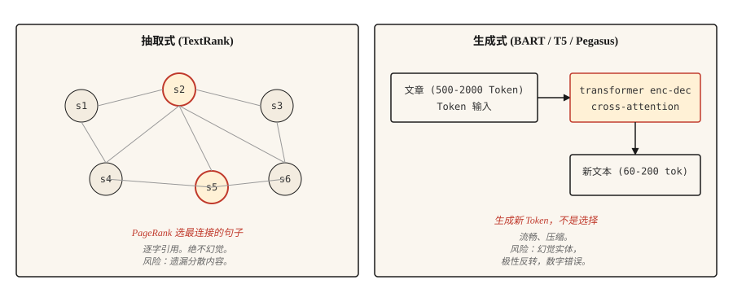

# Text Summarization

> Extractive 系统告诉你文档说了什么。Abstractive 系统告诉你作者想表达什么。任务不同，陷阱也不同。

**类型：** Build
**语言：** Python
**先修：** Phase 5 · 02 (BoW + TF-IDF), Phase 5 · 11 (Machine Translation)
**时间：** ~75 分钟

## 问题

一篇 2,000 词的新闻文章进入你的 feed。你需要用 120 词抓住它的核心。你可以从文章中选出三个最重要的句子（extractive），也可以用自己的话重写内容（abstractive）。二者都叫 summarization。它们是完全不同的问题。

Extractive summarization 是一个排序问题。给每个句子打分，返回前 `k` 个。输出总是语法正确的，因为它是逐字从原文中提取的。风险在于遗漏分散在全文各处的内容。

Abstractive summarization 是一个生成问题。一个 transformer 在输入条件下生成新文本。输出流畅且压缩度高，但可能 hallucinate 源文中不存在的事实。风险是自信地编造。

本课会构建两者，并展示各自固有的 failure mode。

## 概念



**Extractive。** 将文章视为一个 graph，其中 nodes 是句子，edges 是相似度。在 graph 上运行 PageRank（或类似方法），根据句子与其他所有内容的连接程度给句子打分。得分最高的句子就是 summary。经典实现是 **TextRank**（Mihalcea and Tarau, 2004）。

**Abstractive。** 在 document-summary pairs 上 fine-tune 一个 transformer encoder-decoder（BART、T5、Pegasus）。在 inference 时，model 读取文档，并通过 cross-attention 逐 token 生成 summary。Pegasus 尤其使用 gap-sentence pretraining objective，使它在不需要太多 fine-tuning 的情况下非常适合 summarization。

使用 **ROUGE**（Recall-Oriented Understudy for Gisting Evaluation）评估。ROUGE-1 和 ROUGE-2 衡量 unigram 和 bigram overlap。ROUGE-L 衡量 longest common subsequence。越高越好，但 40 ROUGE-L 算“good”，50 算“exceptional”。每篇论文都会报告这三项。使用 `rouge-score` package。

```figure
summarize-collapse
```

## 构建

### 步骤 1： TextRank（extractive）

```python
import math
import re
from collections import Counter


def sentence_split(text):
    return re.split(r"(?<=[.!?])\s+", text.strip())


def similarity(s1, s2):
    w1 = Counter(s1.lower().split())
    w2 = Counter(s2.lower().split())
    intersection = sum((w1 & w2).values())
    denom = math.log(len(w1) + 1) + math.log(len(w2) + 1)
    if denom == 0:
        return 0.0
    return intersection / denom


def textrank(text, top_k=3, damping=0.85, iterations=50, epsilon=1e-4):
    sentences = sentence_split(text)
    n = len(sentences)
    if n <= top_k:
        return sentences

    sim = [[0.0] * n for _ in range(n)]
    for i in range(n):
        for j in range(n):
            if i != j:
                sim[i][j] = similarity(sentences[i], sentences[j])

    scores = [1.0] * n
    for _ in range(iterations):
        new_scores = [1 - damping] * n
        for i in range(n):
            total_out = sum(sim[i]) or 1e-9
            for j in range(n):
                if sim[i][j] > 0:
                    new_scores[j] += damping * sim[i][j] / total_out * scores[i]
        if max(abs(s - ns) for s, ns in zip(scores, new_scores)) < epsilon:
            scores = new_scores
            break
        scores = new_scores

    ranked = sorted(range(n), key=lambda k: scores[k], reverse=True)[:top_k]
    ranked.sort()
    return [sentences[i] for i in ranked]
```

有两件事值得点名。similarity function 使用 log-normalized word overlap，这是原始 TextRank 变体。TF-IDF vectors 的 cosine 也可行。damping factor 0.85 和 iteration count 是 PageRank 的默认值。

### 步骤 2： 使用 BART 做 abstractive

```python
from transformers import pipeline

summarizer = pipeline("summarization", model="facebook/bart-large-cnn")

article = """(long news article text)"""

summary = summarizer(article, max_length=120, min_length=60, do_sample=False)
print(summary[0]["summary_text"])
```

BART-large-CNN 在 CNN/DailyMail corpus 上 fine-tuned。它开箱即可生成 news-style summaries。对于其他领域（scientific papers、dialog、legal），使用对应的 Pegasus checkpoint，或在你的 target data 上 fine-tune。

### 步骤 3： ROUGE evaluation

```python
from rouge_score import rouge_scorer

scorer = rouge_scorer.RougeScorer(["rouge1", "rouge2", "rougeL"], use_stemmer=True)
scores = scorer.score(reference_summary, generated_summary)
print({k: round(v.fmeasure, 3) for k, v in scores.items()})
```

始终使用 stemming。否则，"running" 和 "run" 会被算作不同词，ROUGE 会低估。

### ROUGE 之外（2026 summarization eval）

二十年来，ROUGE 一直是主导性的 summarization metric，但在 2026 年它单独使用已经不够。一项针对 NLG papers 的大规模 meta-analysis 显示：

- **BERTScore**（contextual embedding similarity）在 2023 年前后持续获得采用，现在多数 summarization papers 会与 ROUGE 一起报告。
- **BARTScore** 将 evaluation 视为 generation：根据 pretrained BART 在给定 source 时赋予 summary 的 likelihood 来打分。
- **MoverScore**（contextual embeddings 上的 Earth Mover's Distance）在 2025 summarization benchmarks 中达到第一，因为它比 ROUGE 更好地捕捉 semantic overlap。
- **FactCC** 和 **QA-based faithfulness** 在 2021-2023 年很常见，现在经常被 **G-Eval** 替代（一个 GPT-4 prompt chain，通过 chain-of-thought reasoning 对 coherence、consistency、fluency、relevance 打分）。
- **G-Eval** 和类似 LLM-judge 方法在 rubric 设计良好时，与人类判断约有 80% 一致。

Production recommendation：报告 ROUGE-L 用于 legacy comparison，BERTScore 用于 semantic overlap，G-Eval 用于 coherence 和 factuality。用 50-100 条 human-labeled summaries 做校准。

### 步骤 4： factuality 问题

Abstractive summaries 容易出现 hallucination。Extractive summaries 的 hallucination 风险低得多，因为输出是逐字从源文中提取的，尽管如果源句被去上下文化、过时，或引用顺序错误，它们仍可能误导。这是 production systems 在 compliance-adjacent content 中仍偏好 extractive methods 的最主要原因。

需要点名的 hallucination 类型：

- **Entity swap。** Source 写的是 "John Smith." Summary 写成 "John Brown."
- **Number drift。** Source 写的是 "25,000." Summary 写成 "25 million."
- **Polarity flip。** Source 写的是 "rejected the offer." Summary 写成 "accepted the offer."
- **Fact invention。** Source 没有提到 CEO。Summary 说 CEO 批准了。

有效的 evaluation approaches：

- **FactCC。** 一个 binary classifier，训练目标是 source sentence 与 summary sentence 之间的 entailment。预测 factual/not-factual。
- **QA-based factuality。** 让 QA model 提出答案在 source 中的问题。如果 summary 支持不同答案，则标记。
- **Entity-level F1。** 比较 source 与 summary 中的 named entities。只出现在 summary 中的 entities 可疑。

对于任何面向用户且 factuality 重要的内容（news、medical、legal、financial），extractive 是更安全的默认选择。Abstractive 需要在流程中加入 factuality check。

## 使用

2026 stack：

| Use case | Recommended |
|---------|-------------|
| News, 3-5 sentence summary, English | `facebook/bart-large-cnn` |
| Scientific papers | `google/pegasus-pubmed` or a tuned T5 |
| Multi-document, long-form | Any LLM with 32k+ context, prompted |
| Dialog summarization | `philschmid/bart-large-cnn-samsum` |
| Extractive, low hallucination risk by construction | TextRank or `sumy`'s LSA / LexRank |

当 compute 不是约束时，long context LLMs 在 2026 年通常胜过 specialized models。tradeoff 是 cost 和 reproducibility；specialized models 给出更一致的输出。

## 发布

保存为 `outputs/skill-summary-picker.md`：

```markdown
---
name: summary-picker
description: 选择 extractive 或 abstractive、指定 library、factuality check。
version: 1.0.0
phase: 5
lesson: 12
tags: [nlp, summarization]
---

给定一个任务（document type、compliance requirement、length、compute budget），输出：

1. Approach。Extractive 或 abstractive。用一句话解释原因。
2. Starting model / library。写出名称。`sumy.TextRankSummarizer`、`facebook/bart-large-cnn`、`google/pegasus-pubmed`，或一个 LLM prompt。
3. Evaluation plan。ROUGE-1、ROUGE-2、ROUGE-L（使用带 stemming 的 rouge-score）。如果是 abstractive，再加 factuality check。
4. 一个需要探查的 failure mode。Entity swap 是 abstractive news summarization 中最常见的问题；标记 source entities 未出现在 summary 中的 samples。

如果没有 factuality gate，则拒绝对 medical、legal、financial 或 regulated content 使用 abstractive summarization。将超过 model context window 的输入标记为需要 chunked map-reduce summarization（而不是简单 truncation）。
```

## 练习

1. **Easy。** 在 5 篇新闻文章上运行 TextRank。将 top-3 句子与 reference summary 比较。测量 ROUGE-L。你应该能在 CNN/DailyMail-style articles 上看到 30-45 ROUGE-L。
2. **Medium。** 实现 entity-level factuality：从 source 和 summary 中抽取 named entities（spaCy），计算 source entities 在 summary 中的 recall，以及 summary entities 相对 source 的 precision。高 precision、低 recall 表示安全但简略；低 precision 表示 hallucinated entities。
3. **Hard。** 在 50 篇 CNN/DailyMail articles 上比较 BART-large-CNN 与一个 LLM（Claude 或 GPT-4）。报告 ROUGE-L、factuality（通过 entity F1）和 cost per summary。记录各自胜出的场景。

## 关键术语

| Term | 人们怎么说 | 实际含义 |
|------|------------|----------|
| Extractive | 选句子 | 从 source 中逐字返回句子。永不 hallucinate。 |
| Abstractive | 重写 | 在 source 条件下生成新文本。可能 hallucinate。 |
| ROUGE | Summary metric | system output 与 reference 之间的 N-gram / LCS overlap。 |
| TextRank | Graph-based extractive | sentence similarity graph 上的 PageRank。 |
| Factuality | 是否正确 | summary claims 是否由 source 支持。 |
| Hallucination | 编造内容 | summary 中 source 不支持的内容。 |

## 延伸阅读

- [Mihalcea and Tarau (2004). TextRank: Bringing Order into Texts](https://aclanthology.org/W04-3252/) — extractive 经典论文。
- [Lewis et al. (2019). BART: Denoising Sequence-to-Sequence Pre-training](https://arxiv.org/abs/1910.13461) — BART 论文。
- [Zhang et al. (2019). PEGASUS: Pre-training with Extracted Gap-sentences](https://arxiv.org/abs/1912.08777) — Pegasus 和 gap-sentence objective。
- [Lin (2004). ROUGE: A Package for Automatic Evaluation of Summaries](https://aclanthology.org/W04-1013/) — ROUGE paper。
- [Maynez et al. (2020). On Faithfulness and Factuality in Abstractive Summarization](https://arxiv.org/abs/2005.00661) — factuality landscape paper。
