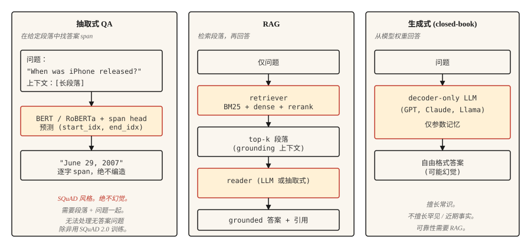

# Question Answering 系统

> 三类系统塑造了现代 QA。Extractive 找到 spans。Retrieval-augmented 将它们 grounding 到 documents 中。Generative 生成 answers。每一个现代 AI assistant 都是这三者的混合。

**Type:** Build
**Languages:** Python
**先修要求：** Phase 5 · 11 (Machine Translation), Phase 5 · 10 (Attention)
**Time:** ~75 minutes

## 问题

用户输入 "When did the first iPhone launch?"，期望得到 "June 29, 2007." 不是 "Apple's history is long and varied." 也不是孤零零的 "2007"，没有句子承载。需要的是一个直接、grounded、正确的答案。

过去十年，三种 architecture 主导了 QA。

- **Extractive QA。** 给定一个 question 和一个已知包含 answer 的 passage，在 passage 中找到 answer span 的 start 和 end indices。SQuAD 是 canonical benchmark。
- **Open-domain QA。** passage 没有给出。先 retrieve 相关 passage，然后 extract 或 generate 一个 answer。这是今天每个 RAG pipeline 的基石。
- **Generative / Closed-book QA。** 一个 large language model 从它的 parametric memory 中回答。没有 retrieval。Inference 最快，但事实可靠性最低。

2026 年的趋势是 hybrid：retrieve 最好的几个 passages，然后 prompt 一个 generative model，让它基于这些 passages 作答。这就是 RAG，lesson 14 会深入讲 retrieval 这一半。本课构建 QA 这一半。

## 概念



**Extractive。** 用 transformer（BERT family）一起 encode question 和 passage。训练两个 heads，分别预测 answer 的 start 和 end token indices。Loss 是在 valid positions 上的 cross-entropy。输出是 passage 中的一个 span。按构造不会 hallucinate，也按构造无法处理 passage 不能回答的问题。

**Retrieval-augmented (RAG)。** 两个阶段。首先，retriever 从 corpus 中找到 top-`k` passages。其次，reader（extractive 或 generative）使用这些 passages 生成 answer。retriever-reader 拆分让两者可以独立训练和评估。现代 RAG 通常还会在两者之间加入 reranker。

**Generative。** 一个 decoder-only LLM（GPT、Claude、Llama）从 learned weights 中回答。没有 retrieval step。对 common knowledge 表现出色，对 rare 或 recent facts 可能灾难性失败。hallucination rate 与 pretraining data 中的 fact frequency 负相关。

## 构建它

### 步骤 1： 使用 pretrained model 做 extractive QA

```python
from transformers import pipeline

qa = pipeline("question-answering", model="deepset/roberta-base-squad2")

passage = (
    "Apple Inc. released the first iPhone on June 29, 2007. "
    "The device was announced by Steve Jobs at Macworld in January 2007."
)
question = "When was the first iPhone released?"

answer = qa(question=question, context=passage)
print(answer)
```

```python
{'score': 0.98, 'start': 57, 'end': 70, 'answer': 'June 29, 2007'}
```

`deepset/roberta-base-squad2` 在 SQuAD 2.0 上训练，其中包含 unanswerable questions。默认情况下，`question-answering` pipeline 即使在 model 的 null score 获胜时，也会返回得分最高的 span，它*不会*自动返回空答案。要获得显式的 "no answer" 行为，请在 pipeline call 中传入 `handle_impossible_answer=True`：此时只有当 null score 超过所有 span score 时，pipeline 才会返回空答案。无论哪种方式，都要始终检查 `score` 字段。

### 步骤 2： 一个 retrieval-augmented pipeline（草图）

```python
from sentence_transformers import SentenceTransformer
import numpy as np

encoder = SentenceTransformer("sentence-transformers/all-MiniLM-L6-v2")

corpus = [
    "Apple Inc. released the first iPhone on June 29, 2007.",
    "Macworld 2007 featured the iPhone announcement by Steve Jobs.",
    "Android launched in 2008 as Google's mobile operating system.",
    "The first iPod was released in 2001.",
]
corpus_embeddings = encoder.encode(corpus, normalize_embeddings=True)


def retrieve(question, top_k=2):
    q_emb = encoder.encode([question], normalize_embeddings=True)
    sims = (corpus_embeddings @ q_emb.T).squeeze()
    order = np.argsort(-sims)[:top_k]
    return [corpus[i] for i in order]


def answer(question):
    passages = retrieve(question, top_k=2)
    combined = " ".join(passages)
    return qa(question=question, context=combined)


print(answer("When was the first iPhone released?"))
```

两阶段 pipeline。Dense retriever（Sentence-BERT）通过 semantic similarity 找到相关 passages。Extractive reader（RoBERTa-SQuAD）从合并后的 top passages 中抽取 answer span。适用于小型 corpora。对于百万文档级 corpus，使用 FAISS 或 vector database。

### 步骤 3： 使用 RAG 做 generative

```python
def rag_generate(question, llm):
    passages = retrieve(question, top_k=3)
    prompt = f"""Context:
{chr(10).join('- ' + p for p in passages)}

Question: {question}

Answer using only the context above. If the context does not contain the answer, say "I don't know."
"""
    return llm(prompt)
```

prompt pattern 很重要。明确告诉 model 基于 context 作答，并在 context 不足时返回 "I don't know"，相比 naive prompting，可将 hallucination rates 降低 40-60%。更复杂的 patterns 会加入 citations、confidence scores 和 structured extraction。

### 步骤 4： 反映真实世界的 evaluation

SQuAD 使用 **Exact Match (EM)** 和 **token-level F1**。EM 是 normalization 后的严格匹配（lowercase、strip punctuation、remove articles），要么 prediction 完全匹配，要么得 0 分。F1 基于 prediction 和 reference 之间的 token overlap 计算，并给予部分分数。两者都会低估 paraphrases："June 29, 2007" vs "June 29th, 2007" 通常会得到 0 EM（ordinal 打破了 normalization），但仍会因为 tokens overlap 获得可观的 F1。

对于 production QA：

- **Answer accuracy**（LLM-judged 或 human-judged，因为 metrics 无法捕捉 semantic equivalence）。
- **Citation accuracy。** 引用的 passage 是否真的支持 answer？可以通过 generated citations 与 retrieved passages 之间的 string match 自动检查，难度很低。
- **Refusal calibration。** 当 answer 不在 retrieved passages 中时，系统是否正确说出 "I don't know"？衡量 false confidence rate。
- **Retrieval recall。** 在评估 reader 之前，先衡量 retriever 是否把正确 passage 放进了 top-`k`。reader 无法修复缺失的 passage。

### RAGAS：2026 年的 production eval framework

`RAGAS` 是专为 RAG systems 设计的，并且是 2026 年的 shipping default。它在不需要 gold references 的情况下，为四个维度打分：

- **Faithfulness。** answer 中的每个 claim 是否来自 retrieved context？通过基于 NLI 的 entailment 衡量。这是你的主要 hallucination metric。
- **Answer relevance。** answer 是否回应了 question？通过从 answer 生成 hypothetical questions，并与真实 question 比较来衡量。
- **Context precision。** 在 retrieved chunks 中，实际相关的比例是多少？Low precision = prompt 中的 noise。
- **Context recall。** retrieved set 是否包含所有需要的信息？Low recall = reader 无法成功。

Reference-free scoring 让你可以在没有 curated gold answers 的情况下评估 live production traffic。对于 exact-match metrics 无用的 open-ended questions，在其上叠加 LLM-as-judge。

`pip install ragas`。接入你的 retriever + reader。每个 query 得到四个 scalars。对 regressions 发出 alert。

## 使用它

2026 年的 stack。

| Use case | Recommended |
|---------|-------------|
| 给定 passage，找到 answer span | `deepset/roberta-base-squad2` |
| 在固定 corpus 上，closed-book 不可接受 | RAG: dense retriever + LLM reader |
| 对 document store 做 real-time QA | RAG with hybrid (BM25 + dense) retriever + reranker (lesson 14) |
| Conversational QA（follow-up questions） | LLM with conversation history + RAG on each turn |
| 高度事实性、regulated domains | 对 authoritative corpus 做 Extractive；绝不单独使用 generative |

Extractive QA 在 2026 年已经不流行，因为带 LLMs 的 RAG 能处理更多情况。但在需要 literal quotation 的场景中，它仍然会上线：legal research、regulatory compliance、audit tools。

## 交付它

保存为 `outputs/skill-qa-architect.md`：

```markdown
---
name: qa-architect
description: Choose QA architecture, retrieval strategy, and evaluation plan.
version: 1.0.0
phase: 5
lesson: 13
tags: [nlp, qa, rag]
---

Given requirements (corpus size, question type, factuality constraint, latency budget), output:

1. Architecture. Extractive, RAG with extractive reader, RAG with generative reader, or closed-book LLM. One-sentence reason.
2. Retriever. None, BM25, dense (name the encoder), or hybrid.
3. Reader. SQuAD-tuned model, LLM by name, or "domain-fine-tuned DistilBERT."
4. Evaluation. EM + F1 for extractive benchmarks; answer accuracy + citation accuracy + refusal calibration for production. Name what you are measuring and how you are measuring it.

Refuse closed-book LLM answers for regulatory or compliance-sensitive questions. Refuse any QA system without a retrieval-recall baseline (you cannot evaluate the reader without knowing the retriever surfaced the right passage). Flag questions that require multi-hop reasoning as needing specialized multi-hop retrievers like HotpotQA-trained systems.
```

## 练习

1. **Easy。** 在上面的 10 个 Wikipedia passages 上设置 SQuAD extractive pipeline。手工制作 10 个 questions。衡量 answer 正确的频率。如果 passages 和 questions 干净，你应该会看到 7-9 个正确。
2. **Medium。** 添加一个 refusal classifier。当 top retrieval score 低于阈值（比如 0.3 cosine）时，返回 "I don't know"，而不是调用 reader。在 held-out set 上调整 threshold。
3. **Hard。** 在你选择的 10,000-document corpus 上构建一个 RAG pipeline。实现 hybrid retrieval（BM25 + dense）和 RRF fusion（见 lesson 14）。衡量有无 hybrid step 时的 answer accuracy。记录哪些 question types 受益最大。

## 关键术语
| Term | What people say | What it actually means |
|------|-----------------|-----------------------|
| Extractive QA | 找到 answer span | 在给定 passage 中预测 answer 的 start 和 end indices。 |
| Open-domain QA | 对 corpus 做 QA | 没有给定 passage；必须先 retrieve，再 answer。 |
| RAG | Retrieve then generate | Retrieval-augmented generation。Retriever + reader pipeline。 |
| SQuAD | Canonical benchmark | Stanford Question Answering Dataset。EM + F1 metrics。 |
| Hallucination | 编造出来的 answer | Reader output 不受 retrieved context 支持。 |
| Refusal calibration | 知道什么时候闭嘴 | 系统在无法回答时正确说出 "I don't know"。 |

## 延伸阅读
- [Rajpurkar et al. (2016). SQuAD: 100,000+ Questions for Machine Comprehension of Text](https://arxiv.org/abs/1606.05250) — benchmark 论文。
- [Karpukhin et al. (2020). Dense Passage Retrieval for Open-Domain QA](https://arxiv.org/abs/2004.04906) — DPR，QA 的 canonical dense retriever。
- [Lewis et al. (2020). Retrieval-Augmented Generation for Knowledge-Intensive NLP Tasks](https://arxiv.org/abs/2005.11401) — 命名 RAG 的论文。
- [Gao et al. (2023). Retrieval-Augmented Generation for Large Language Models: A Survey](https://arxiv.org/abs/2312.10997) — 全面的 RAG survey。
