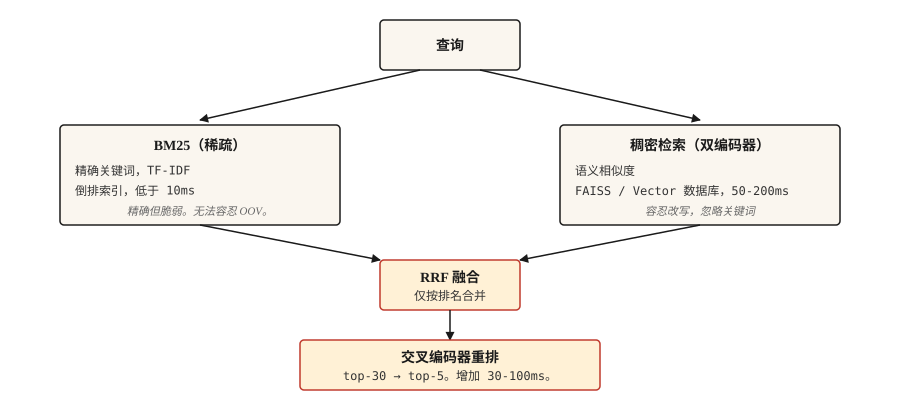

# Information Retrieval 与 Search

> BM25 精确但脆弱。Dense 覆盖面广，但会漏掉关键词。Hybrid 是 2026 年的默认选择。其他都是 tuning。

**Type:** Build
**Languages:** Python
**Prerequisites:** Phase 5 · 02 (BoW + TF-IDF), Phase 5 · 04 (GloVe, FastText, Subword)
**Time:** ~75 分钟

## 问题

用户输入 "what happens if someone lies to get money"，期望找到真正覆盖该情形的法条："Section 420 IPC." Keyword search 会完全错过它（没有共享词汇）。如果 Embedding 不是在法律文本上训练的，semantic search 也会错过它。真实的 search 必须同时处理这两类问题。

IR 是每个 RAG system、每个 search bar、每个文档站点 fuzzy lookup 底层的 pipeline。2026 年能在生产中工作的架构不是单一方法。它是一条由互补方法组成的链，每一环都在捕捉前一环的失败。

本课会构建每个部分，并说明每个部分捕捉哪些失败。

## 概念



四层。按需选择。

1. **Sparse retrieval (BM25)。** 快，对 exact match 很精确，但对 semantics 很差。运行在 inverted index 上。在数百万文档上每次 query 低于 10ms。能正确找出 statute references、product codes、error messages、named entities。
2. **Dense retrieval。** 将 query 和 documents 编码为 Vector。Nearest neighbor search。捕捉 paraphrases 和 semantic similarity。会漏掉只差一个字符的 exact keyword matches。使用 FAISS 或 Vector DB 时，每次 query 约 50-200ms。
3. **Fusion。** 合并 sparse 和 dense 的 ranked lists。Reciprocal Rank Fusion (RRF) 是简单的默认选择，因为它忽略 raw scores（它们处在不同尺度上），只使用 rank positions。当你知道某个 signal 在你的 domain 中占主导时，可以选择 weighted fusion。
4. **Cross-encoder rerank。** 从 fusion 结果中取 top-30。运行 cross-encoder（query + document 一起输入，对每个 pair 打分）。保留 top-5。Cross-encoders 比 bi-encoders 每个 pair 更慢，但准确得多。你通过只在 top-30 上运行它们来摊薄成本。

三路 retrieval（BM25 + dense + learned-sparse，如 SPLADE）在 2026 benchmarks 中优于两路方法，但需要 learned-sparse indexes 的基础设施。对大多数团队来说，两路加 cross-encoder rerank 是最佳平衡点。

```figure
gx-hybrid-retrieval
```

## 构建它

### 步骤 1： 从零实现 BM25

```python
import math
import re
from collections import Counter

TOKEN_RE = re.compile(r"[a-z0-9]+")


def tokenize(text):
    return TOKEN_RE.findall(text.lower())


class BM25:
    def __init__(self, corpus, k1=1.5, b=0.75):
        if not corpus:
            raise ValueError("corpus must not be empty")
        self.corpus = [tokenize(d) for d in corpus]
        self.k1 = k1
        self.b = b
        self.n_docs = len(self.corpus)
        self.avg_dl = sum(len(d) for d in self.corpus) / self.n_docs
        self.df = Counter()
        for doc in self.corpus:
            for term in set(doc):
                self.df[term] += 1

    def idf(self, term):
        n = self.df.get(term, 0)
        return math.log(1 + (self.n_docs - n + 0.5) / (n + 0.5))

    def score(self, query, doc_idx):
        q_tokens = tokenize(query)
        doc = self.corpus[doc_idx]
        dl = len(doc)
        freq = Counter(doc)
        score = 0.0
        for term in q_tokens:
            f = freq.get(term, 0)
            if f == 0:
                continue
            numerator = f * (self.k1 + 1)
            denominator = f + self.k1 * (1 - self.b + self.b * dl / self.avg_dl)
            score += self.idf(term) * numerator / denominator
        return score

    def rank(self, query, top_k=10):
        scored = [(self.score(query, i), i) for i in range(self.n_docs)]
        scored.sort(reverse=True)
        return scored[:top_k]
```

有两个参数值得了解。`k1=1.5` 控制 term-frequency saturation；值越高，term repetition 的权重越大。`b=0.75` 控制 length normalization；0 表示忽略 document length，1 表示完全 normalize。这些默认值来自原始论文中 Robertson 的建议，很少需要 tuning。

### 步骤 2： 使用 bi-encoder 做 dense retrieval

```python
from sentence_transformers import SentenceTransformer
import numpy as np


def build_dense_index(corpus, model_id="sentence-transformers/all-MiniLM-L6-v2"):
    encoder = SentenceTransformer(model_id)
    embeddings = encoder.encode(corpus, normalize_embeddings=True)
    return encoder, embeddings


def dense_search(encoder, embeddings, query, top_k=10):
    q_emb = encoder.encode([query], normalize_embeddings=True)
    sims = (embeddings @ q_emb.T).flatten()
    order = np.argsort(-sims)[:top_k]
    return [(float(sims[i]), int(i)) for i in order]
```

对 Embedding 做 L2-normalize，使 dot product 等于 cosine。`all-MiniLM-L6-v2` 是 384-dim，速度快，对大多数英文 retrieval 来说足够强。多语言任务使用 `paraphrase-multilingual-MiniLM-L12-v2`。若追求最高准确率，使用 `bge-large-en-v1.5` 或 `e5-large-v2`。

### 步骤 3: Reciprocal Rank Fusion

```python
def reciprocal_rank_fusion(rankings, k=60):
    scores = {}
    for ranking in rankings:
        for rank, (_, doc_idx) in enumerate(ranking):
            scores[doc_idx] = scores.get(doc_idx, 0.0) + 1.0 / (k + rank + 1)
    fused = sorted(scores.items(), key=lambda x: x[1], reverse=True)
    return [(score, doc_idx) for doc_idx, score in fused]
```

`k=60` 常量来自原始 RRF 论文。更高的 `k` 会弱化 rank differences 的贡献；更低的 `k` 会让 top ranks 占主导。60 是论文默认值，很少需要 tuning。

### 步骤 4：hybrid search + rerank

```python
from sentence_transformers import CrossEncoder

reranker = CrossEncoder("cross-encoder/ms-marco-MiniLM-L-6-v2")


def hybrid_search(query, bm25, encoder, dense_embeddings, corpus, top_k=5, pool_size=30, reranker=reranker):
    sparse_ranking = bm25.rank(query, top_k=pool_size)
    dense_ranking = dense_search(encoder, dense_embeddings, query, top_k=pool_size)
    fused = reciprocal_rank_fusion([sparse_ranking, dense_ranking])[:pool_size]

    pairs = [(query, corpus[doc_idx]) for _, doc_idx in fused]
    scores = reranker.predict(pairs)
    reranked = sorted(zip(scores, [doc_idx for _, doc_idx in fused]), reverse=True)
    return reranked[:top_k]
```

三个阶段组合在一起。BM25 找 lexical matches。Dense 找 semantic matches。RRF 合并两种 rankings，不需要 score calibration。Cross-encoder 使用 query-document pairs 一起对 top-30 重新打分，从而捕捉 bi-encoder 错过的细粒度 relevance。保留 top-5。

### 步骤 5： evaluation

| Metric | 含义 |
|--------|---------|
| Recall@k | 在正确 document 存在的 queries 中，它出现在 top-k 中的频率是多少？ |
| MRR (Mean Reciprocal Rank) | 第一个 relevant document 的 1/rank 的平均值。 |
| nDCG@k | 考虑 relevance 的等级差异，而不仅是 binary relevant/not。 |

对于 RAG 来说，retriever 的 **Recall@k** 是最重要的数字。如果正确 passage 不在 retrieved set 中，reader 就无法回答。

Debugging 提示：对于失败的 queries，diff sparse 和 dense rankings。如果其中一个找到了正确 document，而另一个没有，那么你遇到了 vocabulary mismatch（修复：补上缺失的一半）或 semantic ambiguity（修复：更好的 Embedding 或 reranker）。

## 使用它

2026 年的 stack：

| Scale | Stack |
|-------|-------|
| 1k-100k docs | In-memory BM25 + `all-MiniLM-L6-v2` embeddings + RRF。不需要单独 DB。 |
| 100k-10M docs | dense 使用 FAISS 或 pgvector + BM25 使用 Elasticsearch / OpenSearch。并行运行。 |
| 10M+ docs | Qdrant / Weaviate / Vespa / Milvus，带 hybrid support。在 top-30 上做 cross-encoder rerank。 |
| Best-quality frontier | 三路（BM25 + dense + SPLADE）+ ColBERT late-interaction reranking |

无论你选择什么，都要为 evaluation 预留预算。先 benchmark retrieval recall，再 benchmark end-to-end RAG accuracy。reader 无法修复 retriever 漏掉的内容。

### 2026 production RAG 中来之不易的经验

- **80% 的 RAG 失败可追溯到 ingestion 和 chunking，而不是 model。** 团队花几周时间替换 LLMs、tuning prompts，而 retrieval 每三次 query 就悄悄返回错误 context。先修复 chunking。
- **Chunking strategy 比 chunk size 更重要。** Fixed-size splits 会破坏 tables、code 和 nested headers。Sentence-aware 是默认选择；对于 technical docs 和 product manuals，semantic 或基于 LLM 的 chunking 值得投入。
- **Parent-doc pattern。** 检索小的 "child" chunks 以获得 precision。当来自同一 parent section 的多个 children 出现时，换入 parent block 以保留 context。这会稳定提升 answer quality，而且不需要 retraining。
- **k_rerank=3 通常是最优。** 超过这个数量的每个额外 chunk 都会增加 Token cost 和 generation latency，却不会提升 answer quality。如果对你来说 k=8 仍然优于 k=3，说明 reranker 表现不足。
- **HyDE / query expansion。** 从 query 生成一个 hypothetical answer，对它做 embed，再 retrieve。它能弥合短问题与长文档之间的 phrasing gap。无需 training 即可免费提升 precision。
- **Context budget 低于 8K tokens。** 如果在这个上限上持续命中，说明 reranker threshold 太宽松。
- **Version everything。** Prompts、chunking rules、embedding model、reranker。任何 drift 都会悄悄破坏 answer quality。基于 faithfulness、context precision 和 unanswered-question rate 的 CI gates 会在用户看到 regression 前阻止它们。
- **三路 retrieval（BM25 + dense + learned-sparse，如 SPLADE）优于两路方法**，这在 2026 benchmarks 上尤其体现在混合 proper nouns 与 semantics 的 queries。基础设施支持 SPLADE indexes 时就上线它。

根据 2026 年行业测量，合理的 retrieval design 可将 hallucinations 降低 70-90%。大多数 RAG 性能收益来自更好的 retrieval，而不是 model fine-tuning。

## 交付它

保存为 `outputs/skill-retrieval-picker.md`：

```markdown
---
name: retrieval-picker
description: 为给定 corpus 和 query pattern 选择 retrieval stack。
version: 1.0.0
phase: 5
lesson: 14
tags: [nlp, retrieval, rag, search]
---

给定 requirements（corpus size、query pattern、latency budget、quality bar、infra constraints），输出：

1. Stack。BM25 only、dense only、hybrid (BM25 + dense + RRF)、hybrid + cross-encoder rerank，或三路 (BM25 + dense + learned-sparse)。
2. Dense encoder。命名具体 model。匹配 language(s)、domain 和 context length。
3. Reranker。如果使用，命名具体 cross-encoder model。标明 rerank 会在 top-30 上额外增加 30-100ms latency。
4. Evaluation plan。Recall@10 是主要 retriever metric。MRR 用于 multi-answer。先建立 baseline，再用 incremental improvements 与它对比。

除非用户有证据证明 dense 能处理 exact matches，否则拒绝为包含 named entities、error codes 或 product SKUs 的 corpora 推荐 dense-only。对于 final top-5 决定用户答案的 high-stakes retrieval（legal、medical），拒绝跳过 reranking。
```

## 练习

1. **Easy.** 在一个 500-document corpus 上实现上面的 `hybrid_search`。测试 20 个 queries。比较 BM25-only、dense-only 和 hybrid 在 5 上的 recall。
2. **Medium.** 添加 MRR calculation。对于每个已知正确 document 的 test query，找出正确 doc 在 BM25、dense 和 hybrid rankings 中的 rank。报告每种方法的 MRR。
3. **Hard.** 使用 MultipleNegativesRankingLoss (Sentence Transformers) 在你的 domain 上 fine-tune 一个 dense encoder。从 500 个 query-document pairs 构建 training set。比较 fine-tune 前后的 recall。

## 关键术语
| Term | 人们通常怎么说 | 它实际是什么意思 |
|------|-----------------|-----------------------|
| BM25 | Keyword search | Okapi BM25。按 term frequency、IDF 和 length 为 documents 打分。 |
| Dense retrieval | Vector search | 将 query + doc 编码为 vectors，寻找 nearest neighbors。 |
| Bi-encoder | Embedding model | 独立编码 query 和 doc。query time 很快。 |
| Cross-encoder | Reranker model | 将 query + doc 一起编码。慢但准确。 |
| RRF | Rank fusion | 通过求和 `1/(k + rank)` 合并两个 rankings。 |
| Recall@k | Retrieval metric | relevant doc 位于 top-k 中的 queries 占比。 |

## 延伸阅读
- [Robertson and Zaragoza (2009). The Probabilistic Relevance Framework: BM25 and Beyond](https://www.staff.city.ac.uk/~sbrp622/papers/foundations_bm25_review.pdf) — BM25 的权威论述。
- [Karpukhin et al. (2020). Dense Passage Retrieval for Open-Domain QA](https://arxiv.org/abs/2004.04906) — DPR，经典 bi-encoder。
- [Formal et al. (2021). SPLADE: Sparse Lexical and Expansion Model](https://arxiv.org/abs/2107.05720) — 弥合与 dense 差距的 learned-sparse retriever。
- [Cormack, Clarke, Büttcher (2009). Reciprocal Rank Fusion outperforms Condorcet and individual Rank Learning Methods](https://plg.uwaterloo.ca/~gvcormac/cormacksigir09-rrf.pdf) — RRF 论文。
- [Khattab and Zaharia (2020). ColBERT: Efficient and Effective Passage Search](https://arxiv.org/abs/2004.12832) — late-interaction 检索。
