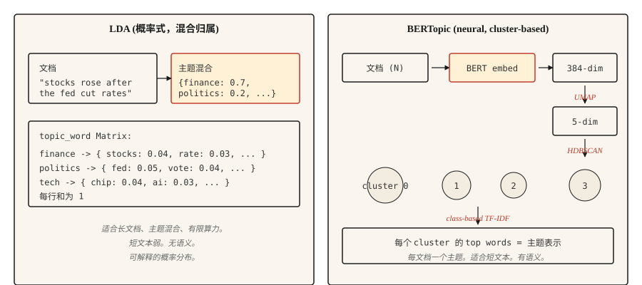

# Topic Modeling — LDA and BERTopic

> LDA：文档是主题的混合，主题是词上的分布。BERTopic：文档在 Embedding 空间中聚类，聚类就是主题。目标相同，基础原语不同。

**类型：** 学习
**语言：** Python
**先修要求：** Phase 5 · 02 (BoW + TF-IDF), Phase 5 · 03 (Word2Vec)
**时间：** ~45 分钟

## 问题

你有 10,000 条客户支持工单、50,000 篇新闻文章，或 200,000 条 tweets。你需要在不阅读它们的情况下知道这个集合在讲什么。你没有带标签的类别。你甚至不知道存在多少个类别。

Topic Modeling 可以在无监督的情况下回答这个问题。给它一个 corpus，它会返回一小组连贯的主题，并为每个文档返回这些主题上的分布。

两类算法家族占主导。LDA (2003) 将每个文档视为 latent topics 的混合，并将每个主题视为词上的分布。推断是 Bayesian 的。在你需要 mixed-membership 主题分配和可解释的词级概率分布时，它仍然用于生产环境。

BERTopic (2020) 用 BERT 编码文档，用 UMAP 降维，用 HDBSCAN 聚类，并通过 class-based TF-IDF 提取主题词。它在短文本、社交媒体，以及任何语义相似性比词重叠更重要的场景中表现更好。一个文档得到一个主题，这是它对长篇内容的一个限制。

本课会为两者建立直觉，并说明面对给定 corpus 时应该选择哪一个。

## 概念



**LDA 生成故事。** 每个主题是词上的分布。每个文档是主题的混合。要在文档中生成一个词，先从该文档的混合中采样一个主题，再从该主题的分布中采样一个词。推断则反过来：给定观测到的词，推断每个文档的主题分布和每个主题的词分布。Collapsed Gibbs sampling 或 variational Bayes 负责数学计算。

关键 LDA 输出：

- `doc_topic`: matrix `(n_docs, n_topics)`，每一行求和为 1（文档的主题混合）。
- `topic_word`: matrix `(n_topics, vocab_size)`，每一行求和为 1（主题的词分布）。

**BERTopic pipeline。**

1. 用 sentence transformer 编码每个文档（例如 `all-MiniLM-L6-v2`）。384-dim vectors。
2. 用 UMAP 将维度降到 ~5 维。BERT embeddings 对聚类来说维度太高。
3. 用 HDBSCAN 聚类。它是基于密度的，会产生大小可变的聚类和一个“outlier”标签。
4. 对每个聚类，在该聚类的文档上计算 class-based TF-IDF，以提取 top words。

输出是每个文档一个主题（外加一个 -1 outlier 标签）。也可以通过 HDBSCAN 的 probability vector 获得 soft membership。

## 构建它

### 步骤 1： 通过 scikit-learn 使用 LDA

```python
from sklearn.feature_extraction.text import CountVectorizer
from sklearn.decomposition import LatentDirichletAllocation
import numpy as np


def fit_lda(documents, n_topics=5, max_features=1000):
    cv = CountVectorizer(
        max_features=max_features,
        stop_words="english",
        min_df=2,
        max_df=0.9,
    )
    X = cv.fit_transform(documents)
    lda = LatentDirichletAllocation(
        n_components=n_topics,
        random_state=42,
        max_iter=50,
        learning_method="online",
    )
    doc_topic = lda.fit_transform(X)
    feature_names = cv.get_feature_names_out()
    return lda, cv, doc_topic, feature_names


def print_top_words(lda, feature_names, n_top=10):
    for idx, topic in enumerate(lda.components_):
        top_idx = np.argsort(-topic)[:n_top]
        words = [feature_names[i] for i in top_idx]
        print(f"topic {idx}: {' '.join(words)}")
```

注意：移除了 stopwords，min_df 和 max_df 会过滤稀有词和无处不在的词；使用 CountVectorizer（而不是 TfidfVectorizer），因为 LDA 期望原始计数。

### 步骤 2： BERTopic（生产）

```python
from bertopic import BERTopic

topic_model = BERTopic(
    embedding_model="sentence-transformers/all-MiniLM-L6-v2",
    min_topic_size=15,
    verbose=True,
)

topics, probs = topic_model.fit_transform(documents)
info = topic_model.get_topic_info()
print(info.head(20))
valid_topics = info[info["Topic"] != -1]["Topic"].tolist()
for topic_id in valid_topics[:5]:
    print(f"topic {topic_id}: {topic_model.get_topic(topic_id)[:10]}")
```

对 `Topic != -1` 的过滤会移除 BERTopic 的 outlier bucket（HDBSCAN 无法聚类的文档）。`min_topic_size` 控制 HDBSCAN 的最小聚类大小；BERTopic 库的默认值是 10。这个示例为了本课规模显式设置为 15。对于超过 10,000 个文档的 corpus，将它增加到 50 或 100。

### 步骤 3： 评估

两种方法都会输出主题词。问题是这些词是否连贯。

- **Topic coherence (c_v)。** 在滑动窗口上下文中结合 top-word pairs 的 NPMI（normalized pointwise mutual information），将分数聚合成 topic vectors，并通过 cosine similarity 比较这些 vectors。越高越好。使用 `gensim.models.CoherenceModel` 并设置 `coherence="c_v"`。
- **Topic diversity。** 所有主题 top words 中唯一词的比例。越高越好（主题不会重叠）。
- **定性检查。** 阅读每个主题的 top words。它们是否命名了一个真实事物？人类判断仍然是最后一道防线。

## 何时选择哪一个

| Situation | Pick |
|-----------|------|
| 短文本（tweets、reviews、headlines） | BERTopic |
| 带有主题混合的长文档 | LDA |
| 无 GPU / compute 受限 | LDA or NMF |
| 需要文档级多主题分布 | LDA |
| 用于主题标注的 LLM 集成 | BERTopic（直接支持） |
| 资源受限的 edge deployment | LDA |
| 最大语义连贯性 | BERTopic |

最大的实践考量是文档长度。BERT embeddings 会截断；LDA 计数可以处理任意长度。对于长于 embedding model 上下文的文档，要么 chunk + aggregate，要么使用 LDA。

## 使用它

2026 stack：

- **BERTopic。** 短文本以及任何语义重要场景的默认选择。
- **`gensim.models.LdaModel`。** 用于生产的经典 LDA，成熟且经过实战检验。
- **`sklearn.decomposition.LatentDirichletAllocation`。** 用于实验的简单 LDA。
- **NMF。** Non-negative matrix factorization。LDA 的快速替代方案，在短文本上质量相近。
- **Top2Vec。** 与 BERTopic 设计相似。社区更小，但在一些 benchmarks 上表现不错。
- **FASTopic。** 更新，在非常大的 corpora 上比 BERTopic 更快。
- **LLM-based labeling。** 运行任意聚类，然后 prompt 一个 model 为每个 cluster 命名。

## 交付它

保存为 `outputs/skill-topic-picker.md`：

```markdown
---
name: topic-picker
description: 为一个 corpus 选择 LDA 或 BERTopic。指定 library、knobs、evaluation。
version: 1.0.0
phase: 5
lesson: 15
tags: [nlp, topic-modeling]
---

给定一个 corpus 描述（文档数量、平均长度、领域、语言、compute budget），输出：

1. Algorithm。LDA / NMF / BERTopic / Top2Vec / FASTopic。一句话理由。
2. Configuration。主题数量：`recommended = max(5, round(sqrt(n_docs)))`，对少于 40,000 个 docs 的 corpora 上限为 200；只有当 corpus 确实很大（>40k）时才允许 >200，并说明增加的 compute cost。`min_df` / `max_df` filters 和 neural approaches 的 embedding model 也应放在这里。
3. Evaluation。通过 `gensim.models.CoherenceModel` 计算 topic coherence (c_v)、topic diversity，以及 20-sample human read。
4. Failure mode to probe。对 LDA，是吸收 stopwords 和高频词的 "junk topics"。对 BERTopic，是吞下模糊文档的 -1 outlier cluster。

如果文档长于 embedding model 的 context window 且没有 chunking strategy，则拒绝 BERTopic。如果文本非常短（tweets、少于 10 个 Token 的 reviews）导致 coherence 崩溃，则拒绝 LDA。将任何低于 5 的 n_topics 选择标记为可能错误；将少于 40k docs 的 corpora 上 >200 的选择标记为可能过度切分。
```

## 练习

1. **Easy。** 在 20 Newsgroups dataset 上用 5 个主题拟合 LDA。打印每个主题的 top 10 words。手动标注每个主题。算法是否找到了真实类别？
2. **Medium。** 在同一个 20 Newsgroups subset 上拟合 BERTopic。将找到的主题数量、top words 和定性 coherence 与 LDA 比较。哪一个更清晰地呈现了真实类别？
3. **Hard。** 在你的 corpus 上计算 LDA 和 BERTopic 的 c_v coherence。分别用 5、10、20、50 个主题运行。绘制 coherence vs topic count。报告哪种方法在不同主题数量下更稳定。

## 关键术语

| Term | What people say | What it actually means |
|------|-----------------|-----------------------|
| Topic | corpus 在讲的东西 | 词上的概率分布（LDA），或相似文档的 cluster（BERTopic）。 |
| Mixed membership | 文档属于多个主题 | LDA 为每个文档分配所有主题上的分布。 |
| UMAP | 降维 | 保留局部结构的 manifold learning；用于 BERTopic。 |
| HDBSCAN | 密度聚类 | 找到大小可变的 clusters；为 outliers 产生 "noise" label (-1)。 |
| c_v coherence | 主题质量指标 | 滑动窗口内 top topic words 的平均 pointwise mutual information。 |

## 延伸阅读

- [Blei, Ng, Jordan (2003). Latent Dirichlet Allocation](https://www.jmlr.org/papers/volume3/blei03a/blei03a.pdf) — LDA 论文。
- [Grootendorst (2022). BERTopic: Neural topic modeling with a class-based TF-IDF procedure](https://arxiv.org/abs/2203.05794) — BERTopic 论文。
- [Röder, Both, Hinneburg (2015). Exploring the Space of Topic Coherence Measures](https://svn.aksw.org/papers/2015/WSDM_Topic_Evaluation/public.pdf) — 引入 c_v 及相关方法的论文。
- [BERTopic documentation](https://maartengr.github.io/BERTopic/) — 生产参考。示例非常好。
