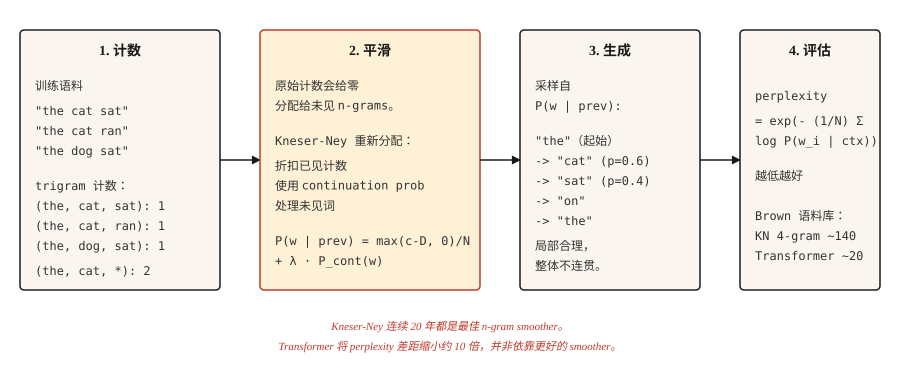

# Transformer 之前的文本生成 —— N-gram 语言模型

> 如果一个词令人意外，模型就不好。Perplexity 把意外程度变成数字。Smoothing 让它保持有限。

**Type:** Build
**Languages:** Python
**先修要求：** Phase 5 · 01 (文本处理), Phase 2 · 14 (Naive Bayes)
**Time:** ~45 分钟

## 问题

在 Transformer 之前，在 RNN 之前，在 word Embedding 之前，语言模型通过统计一个词跟在前面 `n-1` 个词之后的频率来预测下一个词。统计 "the cat" → "sat" 47 次，"the cat" → "jumped" 12 次，"the cat" → "refrigerator" 0 次。归一化后得到一个概率分布。

这就是 n-gram 语言模型。从 1980 到 2015 年，每个语音识别器、每个拼写检查器、每个基于短语的 Machine Translation 系统都在使用它。当你需要便宜的端侧语言建模时，它今天仍然在运行。

真正有意思的问题是如何处理未见过的 n-gram。原始的基于计数的模型会给任何没见过的东西分配零概率，这会造成灾难，因为句子很长，而几乎每个长句都至少包含一个未见过的序列。五十年的 smoothing 研究解决了这个问题。Kneser-Ney smoothing 就是结果，现代 Deep Learning 继承了它的经验传统。

## 概念



**N-gram probability:** `P(w_i | w_{i-n+1}, ..., w_{i-1})`。固定 `n`（通常 trigram 用 3，4-gram 用 4）。根据计数计算：

```text
P(w | context) = count(context, w) / count(context)
```

**零计数问题。** 任何训练中没见过的 n-gram 都会得到零概率。2007 年一项关于 Brown corpus 的研究发现，即使是 4-gram 模型，也有 30% 的 held-out 4-gram 在训练中未出现。不做 smoothing，就无法在任何真实文本上评估。

**Smoothing 方法，按复杂度递增：**

1. **Laplace (add-one)。** 给每个计数加 1。简单，但在稀有事件上很糟糕。
2. **Good-Turing。** 基于频率的频率，把概率质量从高频事件重新分配给未见事件。
3. **Interpolation。** 用可调权重组合 n-gram、(n-1)-gram 等估计。
4. **Backoff。** 如果 n-gram 计数为零，就回退到 (n-1)-gram。Katz backoff 会对其归一化。
5. **Absolute discounting。** 从所有计数中减去一个固定折扣 `D`，再重新分配给未见事件。
6. **Kneser-Ney。** Absolute discounting 加上一个巧妙的低阶模型选择：使用 *continuation probability*（一个词出现在多少种 context 中），而不是原始频率。

Kneser-Ney 的洞见很深。"San Francisco" 是常见 bigram。Unigram "Francisco" 主要出现在 "San" 之后。朴素的 absolute discounting 会给 "Francisco" 很高的 unigram 概率（因为计数很高）。Kneser-Ney 注意到 "Francisco" 只出现在一个 context 中，因此相应降低它的 continuation probability。结果：一个以 "Francisco" 结尾的新 bigram 会得到合适的低概率。

**评估：perplexity。** 在 held-out 测试集上，每个词平均负 log-likelihood 的指数。越低越好。Perplexity 为 100 意味着模型的困惑程度相当于在 100 个词中均匀随机选择。

```text
perplexity = exp(- (1/N) * Σ log P(w_i | context_i))
```

## 构建它

### 步骤 1： trigram 计数

```python
from collections import Counter, defaultdict


def train_ngram(corpus_tokens, n=3):
    ngrams = Counter()
    contexts = Counter()
    for sentence in corpus_tokens:
        padded = ["<s>"] * (n - 1) + sentence + ["</s>"]
        for i in range(len(padded) - n + 1):
            ctx = tuple(padded[i:i + n - 1])
            word = padded[i + n - 1]
            ngrams[ctx + (word,)] += 1
            contexts[ctx] += 1
    return ngrams, contexts


def raw_probability(ngrams, contexts, context, word):
    ctx = tuple(context)
    if contexts.get(ctx, 0) == 0:
        return 0.0
    return ngrams.get(ctx + (word,), 0) / contexts[ctx]
```

输入是 Tokenized sentence 的列表。输出是 n-gram 计数和 context 计数。`<s>` 和 `</s>` 是句子边界。

### 步骤 2： Laplace smoothing

```python
def laplace_probability(ngrams, contexts, vocab_size, context, word):
    ctx = tuple(context)
    numerator = ngrams.get(ctx + (word,), 0) + 1
    denominator = contexts.get(ctx, 0) + vocab_size
    return numerator / denominator
```

给每个计数加 1。能 smoothing，但会把过多概率质量分配给未见事件，也会伤害已知的稀有事件。

### 步骤 3： Kneser-Ney（bigram，interpolated）

```python
def kneser_ney_bigram_model(corpus_tokens, discount=0.75):
    unigrams = Counter()
    bigrams = Counter()
    unigram_contexts = defaultdict(set)

    for sentence in corpus_tokens:
        padded = ["<s>"] + sentence + ["</s>"]
        for i, w in enumerate(padded):
            unigrams[w] += 1
            if i > 0:
                prev = padded[i - 1]
                bigrams[(prev, w)] += 1
                unigram_contexts[w].add(prev)

    total_unique_bigrams = sum(len(ctx_set) for ctx_set in unigram_contexts.values())
    continuation_prob = {
        w: len(ctx_set) / total_unique_bigrams for w, ctx_set in unigram_contexts.items()
    }

    context_totals = Counter()
    for (prev, w), count in bigrams.items():
        context_totals[prev] += count

    unique_follow = defaultdict(set)
    for (prev, w) in bigrams:
        unique_follow[prev].add(w)

    def prob(prev, w):
        count = bigrams.get((prev, w), 0)
        denom = context_totals.get(prev, 0)
        if denom == 0:
            return continuation_prob.get(w, 1e-9)
        first_term = max(count - discount, 0) / denom
        lambda_prev = discount * len(unique_follow[prev]) / denom
        return first_term + lambda_prev * continuation_prob.get(w, 1e-9)

    return prob
```

三个活动部件。`continuation_prob` 捕捉“这个词出现在多少种不同 context 中？”（Kneser-Ney 的创新）。`lambda_prev` 是 discount 释放出来的概率质量，用来给 backoff 加权。最终概率是折扣后的主项加上加权的 continuation 项。

### 步骤 4： 用 sampling 生成文本

```python
import random


def generate(prob_fn, vocab, prefix, max_len=30, seed=0):
    rng = random.Random(seed)
    tokens = list(prefix)
    for _ in range(max_len):
        candidates = [(w, prob_fn(tokens[-1], w)) for w in vocab]
        total = sum(p for _, p in candidates)
        r = rng.random() * total
        acc = 0.0
        for w, p in candidates:
            acc += p
            if r <= acc:
                tokens.append(w)
                break
        if tokens[-1] == "</s>":
            break
    return tokens
```

按概率成比例 sampling。每个 seed 总会给出不同输出。对于类似 beam search 的输出，在每一步选择 argmax（greedy），并加入一个小的随机性旋钮（temperature）。

### 步骤 5： perplexity

```python
import math


def perplexity(prob_fn, sentences):
    total_log_prob = 0.0
    total_tokens = 0
    for sentence in sentences:
        padded = ["<s>"] + sentence + ["</s>"]
        for i in range(1, len(padded)):
            p = prob_fn(padded[i - 1], padded[i])
            total_log_prob += math.log(max(p, 1e-12))
            total_tokens += 1
    return math.exp(-total_log_prob / total_tokens)
```

越低越好。对于 Brown corpus，一个调得好的 4-gram KN 模型 perplexity 大约能达到 140。Transformer LM 在同一个测试集上能达到 15-30。差距大约是 10x。这就是这个领域继续前进的原因。

## 使用它

- **经典 NLP 教学。** 你能获得的关于 smoothing、MLE 和 perplexity 最清晰的入门。
- **KenLM。** 生产级 n-gram 库。在语音和 MT 系统中作为 rescorer 使用，适合低延迟场景。
- **端侧 autocomplete。** 键盘里的 trigram 模型。仍然如此。
- **Baselines。** 在宣称你的 Neural LM 很好之前，一定先计算 n-gram LM perplexity。如果你的 Transformer 没有大幅击败 KN，那就有问题。

## 交付它
保存为 `outputs/prompt-lm-baseline.md`：

```markdown
---
name: lm-baseline
description: 在训练 Neural LM 之前，构建一个可复现的 n-gram 语言模型 baseline。
phase: 5
lesson: 16
---

给定一个 corpus 和目标用途（next-word prediction、rescoring、perplexity baseline），输出：

1. N-gram order。通用英语使用 trigram；如果 corpus 很大，使用 4-gram；语音 rescoring 使用 5-gram。
2. Smoothing。Modified Kneser-Ney 是默认选择；Laplace 只用于教学。
3. Library。生产使用 `kenlm`，教学使用 `nltk.lm`，只有为了学习才自己实现。
4. Evaluation。在训练集和测试集之间使用一致 Tokenization 的 held-out perplexity。

拒绝报告在被比较系统之间使用不同 Tokenization 计算出的 perplexity —— perplexity 数字只有在完全相同的 Tokenization 下才可比较。标记测试集中的 OOV rate；除非在训练期间预留特殊的 <UNK> Token，否则 KN 对 OOV 处理很差。
```

## 练习

1. **Easy.** 在一个 1,000 句的 Shakespeare corpus 上训练 trigram LM。生成 20 个句子。它们会在局部上看起来合理，但整体上不连贯。这是经典演示。
2. **Medium.** 为你的 KN 模型在 held-out Shakespeare split 上实现 perplexity。与 Laplace 对比。你应该会看到 KN 将 perplexity 降低 30-50%。
3. **Hard.** 构建一个 trigram 拼写纠错器：给定一个拼错的词及其 context，生成修正候选，并按 LM 下的 context probability 排序。在 Birkbeck spelling corpus（公开）上评估。

## 关键术语
| Term | 人们通常怎么说 | 它实际是什么意思 |
|------|-----------------|-----------------------|
| N-gram | 词序列 | `n` 个连续 Token 的序列。 |
| Smoothing | 避免零 | 重新分配概率质量，使未见事件获得非零概率。 |
| Perplexity | LM 质量指标 | held-out 数据上的 `exp(-average log-prob)`。越低越好。 |
| Backoff | 回退到更短 context | 如果 trigram 计数为零，就使用 bigram。Katz backoff 将其形式化。 |
| Kneser-Ney | n-gram 的最佳 smoothing | Absolute discounting + 低阶模型的 continuation probability。 |
| Continuation probability | KN 专用 | `P(w)` 按 `w` 出现的 context 数量加权，而不是按原始计数加权。 |

## 延伸阅读
- [Jurafsky and Martin — Speech and Language Processing, Chapter 3 (2026 draft)](https://web.stanford.edu/~jurafsky/slp3/3.pdf) — n-gram LM 和 smoothing 的经典处理。
- [Chen and Goodman (1998). An Empirical Study of Smoothing Techniques for Language Modeling](https://dash.harvard.edu/handle/1/25104739) — 确立 Kneser-Ney 作为最佳 n-gram smoother 的论文。
- [Kneser and Ney (1995). Improved Backing-off for M-gram Language Modeling](https://ieeexplore.ieee.org/document/479394) — 原始 KN 论文。
- [KenLM](https://kheafield.com/code/kenlm/) — 快速的生产级 n-gram LM，2026 年仍用于延迟敏感应用。
