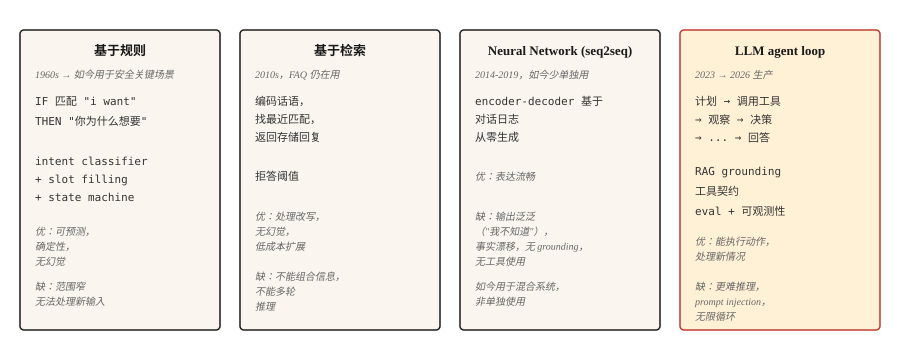

# Chatbot — 从基于规则到 Neural，再到 LLM Agent

> ELIZA 使用模式匹配进行回复。DialogFlow 映射 Intent。GPT 根据权重回答。Claude 运行 Tool 并执行验证。每个时代都解决了上一个时代最严重的失败。

**Type:** Learn
**Languages:** Python
**Prerequisites:** Phase 5 · 13（问答），Phase 5 · 14（信息检索）
**Time:** ~75 分钟

## 问题

用户说：“我想更改航班。”系统必须弄清楚用户想做什么、还缺少哪些信息、如何获取这些信息，以及如何完成操作。然后用户又说：“等等，如果我改成取消呢？”系统必须记住 Context、切换任务并保留状态。

对于 ML 系统而言，对话很难。输入是开放式的。输出必须在多个轮次中保持连贯。系统可能还需要对现实世界采取行动，例如更改航班或从银行卡扣款。每一个错误步骤都会直接暴露给用户。

Chatbot 架构经历了四种范式的更替，每一种新范式的出现，都是因为上一种范式的失败过于明显。本课将按顺序介绍它们。2026 年的生产环境是后两种范式的混合体。

## 概念



### 脚本统治的半个世纪，1950-2001

第一种范式并非只持续了五年，而是持续了五十年。理解它的演进过程很重要，因为其中的每个系统本质上都是同一台机器——匹配输入、输出预设回复、更新少量状态——而五十年来不断为这台机器添加规则，始终未能实现通用能力。正是这个上限催生了第二到第四种范式。

**1950 年。** Turing 没有直接回答“机器能否思考？”，而是提出了一个可操作的替代问题：如果询问者无法通过电传打字机分辨机器与人，那么这个哲学问题就不再重要。在该领域尚未拥有名称之前，对话就已经成为它的 Benchmark。

**1956 年。** 这个名称出现了——Dartmouth 的一个夏季研讨会创造了 "artificial intelligence" 一词，其基本猜想是，智能的每个特征“原则上都可以得到足够精确的描述，从而制造出能够模拟它的机器”。提案为取得实质性进展安排了两个月。

**1966 年。** ELIZA 推出了你将在第 1 步构建的反射技巧：分解规则从输入中提取片段，重组规则再将这些片段以问题形式复述出来。总计约 200 个模式、零状态、零理解能力——但用户仍然向它倾诉秘密。Weizenbaum 在余下的职业生涯中一直对如此少的机制竟能产生这种效果感到不安。

**1972 年。** PARRY 由 Stanford 开发，用于模拟偏执，它添加了 ELIZA 所缺少的部分：内部状态。表示恐惧、愤怒和不信任的数值变量会在每个轮次中更新，并决定接下来触发哪个脚本，因此相同的输入会根据此前的对话产生不同响应。在一项隐藏身份的对话记录测试中，精神科医生区分 PARRY 和人类患者的表现与随机猜测相当。它是 Persona Conditioning 的直接祖先——一个用三个浮点数实现的 System Prompt。同年，这两个 Bot 通过 ARPANET 相互对话：一个治疗师脚本采访一个偏执状态机，这是网络上的首次 Bot 对 Bot 对话。

**1995 年。** ALICE 使用 AIML 扩展了 ELIZA 的方法。AIML 是一种用于模式与模板配对的 XML 方言。它包含约 40,000 个手写 Category，并三次赢得 Loebner Prize。它证明了基于规则系统的 Scaling Law：更多规则可以买来更高的覆盖率，却永远买不到通用性。每一条规则都是必须由某个人维护的负担。

**2001 年。** SmarterChild 将这套方法带给了 3,000 万即时通信用户，并加入后端查询——天气、股票、电影场次——再将结果Embedding模板。仔细看，它就是披着 2001 年外衣的 Tool Calling：解析 Intent、调用服务、将结果渲染进回复。

五十年，一种机制，不断增加的规则数量。这种范式的终结并不是因为有人证伪了它，而是因为手写状态机的维护成本会随覆盖范围线性增长，而用户的期望则会随着他们上周刚刚见过的产品不断提高。

```figure
chatbot-lineage
```

**基于规则（ELIZA、AIML、DialogFlow）。** 手工编写的模式匹配用户输入并生成响应。Intent Classifier 将请求路由到预定义流程。Slot Filling 状态机收集必需信息。它在设计时限定的狭窄范围内表现出色，一旦超出范围便立即失败。在不能容忍 Hallucination 的安全关键领域（银行身份验证、航空订票），它至今仍在生产环境中使用。

**基于检索。** 类似 FAQ 的系统。对每一组（话语、响应）进行编码。在运行时，编码用户消息，并检索最接近的已存储响应。可以把它理解为 Zendesk 经典的“相似文章”功能。它比规则更能处理改写表达。由于不执行生成，因此不会产生 Hallucination。

**Neural（Seq2Seq）。** 在对话日志上 Training 的 Encoder-Decoder。它从头生成响应，语言流畅，但容易产生通用输出（“我不知道”）和事实偏移，也从未可靠地紧扣主题。这就是 Google、Facebook 和 Microsoft 在 2016-2019 年推出的 Chatbot 都令人失望的原因。

**LLM Agent。** 在一个能够规划、调用 Tool 并验证结果的循环中封装 Language Model。它不是拥有长 Prompt 的 Chatbot，而是一个 Agent Loop：规划 → 调用 Tool → 观察结果 → 决定下一步。检索优先的 Grounding（RAG）可阻止它产生 Hallucination。Tool Call 则让它真正完成任务。这就是 2026 年的架构。

这四种范式并非依次完全替代彼此。2026 年的生产级 Chatbot 会经过全部四种范式进行路由：身份验证和破坏性操作使用基于规则的方法，FAQ 使用检索，自然表达使用 Neural Generation，存在歧义的开放式查询则使用 LLM Agent。

## 动手构建

### 第 1 步：基于规则的模式匹配

```python
import re


class RulePattern:
    def __init__(self, pattern, response_template):
        self.regex = re.compile(pattern, re.IGNORECASE)
        self.template = response_template


PATTERNS = [
    RulePattern(r"my name is (\w+)", "Nice to meet you, {0}."),
    RulePattern(r"i (need|want) (.+)", "Why do you {0} {1}?"),
    RulePattern(r"i feel (.+)", "Why do you feel {0}?"),
    RulePattern(r"(.*)", "Tell me more about that."),
]


def rule_based_respond(user_input):
    for pattern in PATTERNS:
        m = pattern.regex.match(user_input.strip())
        if m:
            return pattern.template.format(*m.groups())
    return "I don't understand."
```

用 20 行代码实现 ELIZA。反射技巧（"I feel sad" → "Why do you feel sad"）是 Weizenbaum 1966 年提出的经典心理治疗师演示。它至今仍具有教学价值。

### 第 2 步：基于检索（FAQ）

这个说明性代码片段需要执行 `pip install sentence-transformers`（它会引入 torch）。本课可运行的 `code/main.py` 改用 stdlib 实现的 Jaccard Similarity，因此本课无需外部依赖即可运行。

```python
from sentence_transformers import SentenceTransformer
import numpy as np


FAQ = [
    ("how do i reset my password", "Go to Settings > Security > Reset Password."),
    ("how do i cancel my order", "Go to Orders, find the order, click Cancel."),
    ("what is your return policy", "30-day returns on unused items, original packaging."),
]


encoder = SentenceTransformer("sentence-transformers/all-MiniLM-L6-v2")
faq_questions = [q for q, _ in FAQ]
faq_embeddings = encoder.encode(faq_questions, normalize_embeddings=True)


def faq_respond(user_input, threshold=0.5):
    q_emb = encoder.encode([user_input], normalize_embeddings=True)[0]
    sims = faq_embeddings @ q_emb
    best = int(np.argmax(sims))
    if sims[best] < threshold:
        return None
    return FAQ[best][1]
```

基于 Threshold 的拒绝机制是关键设计选择。如果最佳匹配不够接近，则返回 `None`，让系统执行升级处理。

### 第 3 步：Neural Generation（Baseline）

使用小型 Instruction-tuned Encoder-Decoder（FLAN-T5）或经过 Fine-tuning 的对话 Model。2026 年时，它本身无法用于生产环境（会产生矛盾、偏离主题和事实错误），但可用于混合系统中的自然表达。DialoGPT 风格的 Decoder-only Model 需要显式的轮次分隔符和 EOS 处理，才能生成连贯的回复；作为教学示例，FLAN-T5 的 text2text Pipeline 可以直接使用。

```python
from transformers import pipeline

chatbot = pipeline("text2text-generation", model="google/flan-t5-small")

response = chatbot("Respond politely to: Hi there!", max_new_tokens=40)
print(response[0]["generated_text"])
```

### 第 4 步：LLM Agent Loop

2026 年的生产级结构：

```python
def agent_loop(user_message, tools, llm, max_steps=5):
    history = [{"role": "user", "content": user_message}]
    for _ in range(max_steps):
        response = llm(history, tools=tools)
        tool_call = response.get("tool_call")
        if tool_call:
            tool_name = tool_call.get("name")
            args = tool_call.get("arguments")
            if not isinstance(tool_name, str) or tool_name not in tools:
                history.append({"role": "assistant", "tool_call": tool_call})
                history.append({"role": "tool", "name": str(tool_name), "content": f"error: unknown tool {tool_name!r}"})
                continue
            if not isinstance(args, dict):
                history.append({"role": "assistant", "tool_call": tool_call})
                history.append({"role": "tool", "name": tool_name, "content": f"error: arguments must be a dict, got {type(args).__name__}"})
                continue
            fn = tools[tool_name]
            result = fn(**args)
            history.append({"role": "assistant", "tool_call": tool_call})
            history.append({"role": "tool", "name": tool_name, "content": result})
        else:
            return response["content"]
    return "I could not complete the task in the step budget."
```

这里需要指出三件事。Tool 是 LLM 可以调用的函数。当 LLM 返回最终答案而不是 Tool Call 时，循环终止。步骤预算可以防止 Agent 在有歧义的任务上陷入无限循环。

真实生产环境还会加入：检索优先的 Grounding（在每次调用 LLM 前注入相关文档）、Guardrail（未经确认时拒绝破坏性操作）、Observability（记录每一步）以及 Evaluation（自动检查 Agent 行为是否持续符合规范）。

### 第 5 步：混合路由

```python
def hybrid_chat(user_input):
    if is_destructive_action(user_input):
        return structured_flow(user_input)

    faq_answer = faq_respond(user_input, threshold=0.6)
    if faq_answer:
        return faq_answer

    return agent_loop(user_input, tools, llm)


def is_destructive_action(text):
    danger_words = ["delete", "cancel", "charge", "refund", "transfer"]
    return any(w in text.lower() for w in danger_words)
```

这种模式是：所有破坏性操作使用确定性规则，预设 FAQ 使用检索，其他请求使用 LLM Agent。这正是 2026 年客户支持系统采用的生产架构。

## 实际应用

2026 年的技术栈：

| 使用场景 | 架构 |
|---------|---------------|
| 预订、支付、身份验证 | 基于规则的状态机 + Slot Filling |
| 客户支持 FAQ | 在精选答案上执行检索 |
| 开放式帮助对话 | 使用 RAG + Tool Call 的 LLM Agent |
| 内部 Tool / IDE Assistant | 使用 Tool Call（搜索、读取、写入）的 LLM Agent |
| 陪伴型 / 角色型 Chatbot | 使用 Persona System Prompt 调优的 LLM，并对知识执行检索 |

在生产环境中始终使用混合路由。没有任何单一架构能够妥善处理所有请求。路由层本身通常是一个小型 Intent Classifier。

## 至今仍会进入生产环境的失败模式

- **自信地捏造。** LLM Agent 声称自己已经完成某项实际并未完成的操作。缓解措施：验证结果、记录 Tool Call，除非 Tool 成功返回，否则绝不允许 LLM 声称已经完成某件事。
- **Prompt Injection。** 用户插入能够覆盖 System Prompt 的文本。它在 OWASP Top 10 for LLM Applications 2025 中排名 LLM01。分为两种形式：直接 Injection（粘贴到对话中）和间接 Injection（隐藏在 Agent 读取的文档、电子邮件或 Tool 输出中）。

  攻击成功率因场景而异。在通用 Tool 使用和编码 Benchmark 中，Frontier Model 的实测成功率约为 0.5-8.5%。特定的高风险配置（针对 AI 编码 Agent 的自适应攻击、存在漏洞的 Orchestration）曾达到约 84%。生产环境中的 CVE 包括 EchoLeak（CVE-2025-32711，CVSS 9.3）——Microsoft 365 Copilot 中的零点击数据外泄漏洞，可由攻击者控制的电子邮件触发。

  缓解措施：在整个循环中始终将用户输入视为不可信内容；在 Tool Call 前进行清理；将 Tool 输出与主 Prompt 隔离；使用 Plan-Verify-Execute（PVE）模式，让 Agent 先制定计划，再在执行前依据该计划验证每项操作（这样可以阻止 Tool 结果注入未规划的新操作）；对破坏性操作要求用户确认；对 Tool Scope 应用 Least Privilege。

  无论投入多少 Prompt Engineering，都无法彻底消除这种风险。必须使用外部 Runtime 防御层（LLM Guard、Allowlist Validation、Semantic Anomaly Detection）。
- **Scope Creep。** Agent 因 Tool Call 返回了仅有间接关联的信息而偏离任务。缓解措施：缩小 Tool Contract；保持 System Prompt 聚焦；添加针对偏离任务比率的 Evaluation。
- **无限循环。** Agent 不断调用同一个 Tool。缓解措施：步骤预算、Tool Call 去重、使用 LLM Judge 判断“我们是否正在取得进展”。
- **Context Window 耗尽。** 长对话会将最早的轮次挤出 Context。缓解措施：总结较早的轮次、按相似度检索相关的历史轮次，或使用 Long-context Model。

## 交付成果

保存为 `outputs/skill-chatbot-architect.md`：

```markdown
---
name: chatbot-architect
description: 为给定使用场景设计 Chatbot 技术栈。
version: 1.0.0
phase: 5
lesson: 17
tags: [nlp, agents, chatbot]
---

给定产品 Context（用户需求、合规约束、可用 Tool、数据量），输出：

1. 架构。基于规则、检索、Neural、LLM Agent 或混合架构（说明每条路径分别使用哪一种）。
2. LLM 选择（如适用）。指定 Model 系列（Claude、GPT-4、Llama-3.1、Mixtral）。根据 Tool 使用质量和成本进行匹配。
3. Grounding 策略。RAG 来源、检索方法（参见第 14 课）、Tool Contract。
4. Evaluation 计划。任务成功率、Tool Call 正确率、偏离任务比率，以及保留对话上的 Hallucination 率。

对于任何破坏性操作（支付、删除账户、修改数据），如果没有结构化确认流程，拒绝推荐纯 LLM Agent。如果 Agent 对任何内容拥有写入权限，拒绝跳过 Prompt Injection 审计。
```

## 练习

1. **简单。** 使用 10 个模式，为咖啡店点单 Bot 实现上面的基于规则响应。测试边缘情况：重复点单、修改、取消、Intent 不明确。
2. **中等。** 构建 FAQ + LLM Fallback 混合系统。为一个 SaaS 产品准备 50 条预设 FAQ，并使用基于文档站点检索的 LLM Fallback。在 100 个真实支持问题上测量拒绝率和准确率。
3. **困难。** 使用三个 Tool（search、read-user-data、send-email）实现上面的 Agent Loop。使用包含 Prompt Injection 尝试的 50 个测试场景进行 Evaluation。报告偏离任务比率、任务失败率和所有成功的 Injection。

## 关键术语

| 术语 | 人们通常怎么说 | 它的实际含义 |
|------|-----------------|-----------------------|
| Intent | 用户想做什么 | 分类 Label（book_flight、reset_password）。路由到相应 Handler。 |
| Slot | 一项信息 | Bot 所需的参数（日期、目的地）。Slot Filling 是依次询问这些信息的过程。 |
| RAG | 检索加生成 | 检索相关文档，再以此作为 LLM 响应的 Grounding。 |
| Tool Call | 函数调用 | LLM 输出包含名称 + 参数的结构化调用。Runtime 执行调用并返回结果。 |
| Agent Loop | 规划、行动、验证 | 在 LLM Call 和 Tool Call 之间交替执行，直至任务完成的 Controller。 |
| Prompt Injection | 用户攻击 Prompt | 试图覆盖 System Prompt 的恶意输入。 |

## 延伸阅读

- [Turing（1950）。Computing Machinery and Intelligence](https://academic.oup.com/mind/article/LIX/236/433/986238) — 让对话成为该领域 Benchmark 的论文。
- [Weizenbaum（1966）。ELIZA — A Computer Program For the Study of Natural Language Communication](https://web.stanford.edu/class/cs124/p36-weizenabaum.pdf) — 最初的基于规则 Chatbot 论文。
- [Colby、Weber、Hilf（1971）。Artificial Paranoia](https://doi.org/10.1016/0004-3702(71)90002-6) — PARRY 的情感变量架构，也是第一个有状态 Chatbot。
- [Thoppilan 等（2022）。LaMDA: Language Models for Dialog Applications](https://arxiv.org/abs/2201.08239) — Google 后期的 Neural Chatbot 论文，发表于 LLM Agent 接管该领域前夕。
- [Yao 等（2022）。ReAct: Synergizing Reasoning and Acting in Language Models](https://arxiv.org/abs/2210.03629) — 为 Agent Loop 模式命名的论文。
- [Anthropic 关于构建有效 Agent 的指南](https://www.anthropic.com/research/building-effective-agents) — 2024 年发布的生产实践指南，到 2026 年仍然适用。
- [Greshake 等（2023）。Not what you've signed up for: Compromising Real-World LLM-Integrated Applications with Indirect Prompt Injection](https://arxiv.org/abs/2302.12173) — 关于 Prompt Injection 的论文。
- [OWASP Top 10 for LLM Applications 2025 — LLM01 Prompt Injection](https://genai.owasp.org/llmrisk/llm01-prompt-injection/) — 将 Prompt Injection 列为首要安全问题的排名。
- [AWS — Securing Amazon Bedrock Agents against Indirect Prompt Injections](https://aws.amazon.com/blogs/machine-learning/securing-amazon-bedrock-agents-a-guide-to-safeguarding-against-indirect-prompt-injections/) — 实用的 Orchestration 层防御措施，包括 Plan-Verify-Execute 和用户确认流程。
- [EchoLeak（CVE-2025-32711）](https://www.vectra.ai/topics/prompt-injection) — 由间接 Prompt Injection 导致的经典零点击数据外泄 CVE。它说明了为何拥有写入权限的 Agent 需要 Runtime 防御。
