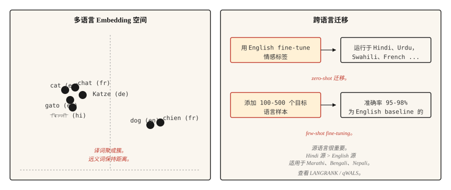

# 多语言 NLP

> 一个模型，100+ 种语言，其中大多数语言没有任何训练数据。跨语言迁移是 2020 年代的实用奇迹。

**Type:** Learn
**Languages:** Python
**先修要求：** Phase 5 · 04 (GloVe, FastText, Subword), Phase 5 · 11 (Machine Translation)
**Time:** ~45 分钟

## 问题

英语有数十亿个带标签样本。乌尔都语有数千个。迈蒂利语几乎没有。任何面向全球用户的实用 NLP 系统，都必须能处理那些没有特定任务训练数据的长尾语言。

多语言模型通过在多种语言上同时训练一个模型来解决这个问题。共享表示让模型能够把从高资源语言中学到的能力迁移到低资源语言。用英语情感分析对模型进行 fine-tune，它就能开箱即用地对乌尔都语给出相当不错的情感预测。这就是 zero-shot 跨语言迁移，它重塑了 NLP 面向全球交付的方式。

本课会说明相关权衡、经典模型，以及一个经常让刚开始做多语言工作的团队踩坑的决策：为迁移选择源语言。

## 概念



**共享词表。** 多语言模型使用在所有目标语言文本上训练的 SentencePiece 或 WordPiece tokenizer。词表是共享的：同一个 subword 单元在相关语言中表示相同的词素。英语和意大利语中的 `anti-` 会得到同一个 token。

**共享表示。** 在多种语言上用 masked language modeling 预训练的 Transformer，会学到不同语言中语义相似的句子会产生相似的 hidden states。mBERT、XLM-R 和 NLLB 都表现出这一点。英语中 "cat" 的 Embeddings 会聚集在法语 "chat" 和西班牙语 "gato" 附近，完整句子的 Embeddings 也是如此。

**Zero-shot 迁移。** 在一种语言（通常是英语）的带标签数据上 fine-tune 模型。推理时，在模型支持的任何其他语言上运行它。不需要目标语言标签。对于类型学上相近的语言，结果很强；对于距离较远的语言，结果较弱。

**Few-shot fine-tuning。** 在目标语言中添加 100-500 个带标签样本。分类任务的准确率会跃升到英语 baseline 的 95-98%。这是多语言 NLP 中性价比最高的单一杠杆。

## 模型

| Model | Year | Coverage | Notes |
|-------|------|----------|-------|
| mBERT | 2018 | 104 languages | 在 Wikipedia 上训练。第一个实用的多语言 LM。低资源语言表现较弱。 |
| XLM-R | 2019 | 100 languages | 在 CommonCrawl 上训练（比 Wikipedia 大得多）。确立了跨语言 baseline。Base 270M，Large 550M。 |
| XLM-V | 2023 | 100 languages | 具有 1M-token 词表的 XLM-R（相比 250k）。低资源语言表现更好。 |
| mT5 | 2020 | 101 languages | 用于多语言生成的 T5 架构。 |
| NLLB-200 | 2022 | 200 languages | Meta 的翻译模型；包含 55 种低资源语言。 |
| BLOOM | 2022 | 46 languages + 13 programming | 以多语言方式训练的开放 176B LLM。 |
| Aya-23 | 2024 | 23 languages | Cohere 的多语言 LLM。在阿拉伯语、印地语、斯瓦希里语上表现强。 |

按用例选择。分类任务可以把 XLM-R-base 作为稳妥默认值。生成任务需要根据翻译还是开放生成，在 mT5 或 NLLB 之间选择。LLM 风格工作可以搭配 Aya-23 或 Claude，并使用明确的多语言 prompting。

## 源语言决策（2026 研究）

多数团队默认使用英语作为 fine-tuning 源语言。近期研究（2026）表明，这往往是错的。

语言相似性比原始语料规模更能预测迁移质量。对于斯拉夫语目标语言，德语或俄语往往优于英语。对于印度语族目标语言，印地语往往优于英语。**qWALS** 相似度指标（2026，基于 World Atlas of Language Structures features）对这一点进行了量化。**LANGRANK**（Lin et al., ACL 2019）是另一个更早的方法，它结合语言相似性、语料规模和谱系亲缘关系，对候选源语言进行排序。

实用规则：如果你的目标语言有一个类型学上接近的高资源亲缘语言，先尝试在那个语言上 fine-tune，然后再与英语 fine-tune 对比。

```figure
n5-crosslingual-bridge
```

## 构建

### 步骤 1： zero-shot 跨语言分类

```python
from transformers import AutoTokenizer, AutoModelForSequenceClassification
import torch

tok = AutoTokenizer.from_pretrained("joeddav/xlm-roberta-large-xnli")
model = AutoModelForSequenceClassification.from_pretrained("joeddav/xlm-roberta-large-xnli")


def classify(text, candidate_labels, hypothesis_template="This text is about {}."):
    scores = {}
    for label in candidate_labels:
        hypothesis = hypothesis_template.format(label)
        inputs = tok(text, hypothesis, return_tensors="pt", truncation=True)
        with torch.no_grad():
            logits = model(**inputs).logits[0]
        entail_score = torch.softmax(logits, dim=-1)[2].item()
        scores[label] = entail_score
    return dict(sorted(scores.items(), key=lambda x: -x[1]))


print(classify("I love this product!", ["positive", "negative", "neutral"]))
print(classify("मुझे यह उत्पाद पसंद है!", ["positive", "negative", "neutral"]))
print(classify("J'adore ce produit !", ["positive", "negative", "neutral"]))
```

一个模型，三种语言，同一个 API。XLM-R 在 NLI 数据上训练，通过 entailment trick 能很好地迁移到分类任务。

### 步骤 2： 多语言 Embedding space

```python
from sentence_transformers import SentenceTransformer
import numpy as np

model = SentenceTransformer("sentence-transformers/paraphrase-multilingual-MiniLM-L12-v2")

pairs = [
    ("The cat is sleeping.", "Le chat dort."),
    ("The cat is sleeping.", "El gato está durmiendo."),
    ("The cat is sleeping.", "Die Katze schläft."),
    ("The cat is sleeping.", "The dog is barking."),
]

for eng, other in pairs:
    emb_eng = model.encode([eng], normalize_embeddings=True)[0]
    emb_other = model.encode([other], normalize_embeddings=True)[0]
    sim = float(np.dot(emb_eng, emb_other))
    print(f"  {eng!r} <-> {other!r}: cos={sim:.3f}")
```

译文会落在 Embedding space 中相近的位置。另一句不同的英语句子会落得更远。这就是跨语言检索、clustering 和相似度能够工作的原因。

### 步骤 3： few-shot fine-tuning 策略

```python
from transformers import TrainingArguments, Trainer
from datasets import Dataset


def few_shot_finetune(base_model, base_tokenizer, examples):
    ds = Dataset.from_list(examples)

    def tokenize_fn(ex):
        out = base_tokenizer(ex["text"], truncation=True, max_length=128)
        out["labels"] = ex["label"]
        return out

    ds = ds.map(tokenize_fn)
    args = TrainingArguments(
        output_dir="out",
        per_device_train_batch_size=8,
        num_train_epochs=5,
        learning_rate=2e-5,
        save_strategy="no",
    )
    trainer = Trainer(model=base_model, args=args, train_dataset=ds)
    trainer.train()
    return base_model
```

对于 100-500 个目标语言样本，`num_train_epochs=5` 和 `learning_rate=2e-5` 是稳妥默认值。更高的学习率会导致多语言对齐崩塌，最终得到一个只会英语的模型。

## 真正有效的评估

- **在 held-out 集上按语言统计准确率。** 不要聚合。聚合指标会掩盖长尾问题。
- **与单语言 baseline 对比。** 对于数据足够的语言，从头训练的单语言模型有时会优于多语言模型。要测试。
- **Entity-level 测试。** 目标语言中的命名实体。多语言模型对远离拉丁文字的书写系统通常 tokenization 较弱。
- **跨语言一致性。** 两种语言表达相同含义时，应产生相同预测。衡量其中差距。

## 使用

2026 技术栈：

| Task | Recommended |
|-----|-------------|
| Classification, 100 languages | XLM-R-base (~270M) fine-tuned |
| Zero-shot text classification | `joeddav/xlm-roberta-large-xnli` |
| Multilingual sentence embeddings | `sentence-transformers/paraphrase-multilingual-MiniLM-L12-v2` |
| Translation, 200 languages | `facebook/nllb-200-distilled-600M`（见 lesson 11） |
| Generative multilingual | Claude, GPT-4, Aya-23, mT5-XXL |
| Low-resource language NLP | XLM-V 或在相关高资源语言上做 domain-specific fine-tune |

如果性能重要，一定要为目标语言 fine-tuning 预留预算。Zero-shot 是起点，不是最终答案。

### Tokenization 成本（低资源语言会出什么问题）

多语言模型在所有语言之间共享一个 tokenizer。这个词表是在由英语、法语、西班牙语、中文、德语主导的语料上训练的。对于主导集合之外的任何语言，三类成本会悄然叠加：

- **Fertility 成本。** 低资源语言文本会被 tokenize 成比英语多得多的 token。一个印地语句子可能需要等价英语句子 3-5x 的 token。这个 3-5x 会吞掉你的上下文窗口、训练效率和延迟预算。
- **变体恢复成本。** 每个拼写错误、附加符号变体、Unicode 规范化不匹配或大小写变化，都会在 Embedding space 中变成一个冷启动的无关序列。模型无法学到母语者觉得显而易见的正字法对应关系。
- **容量外溢成本。** 成本 1 和 2 会消耗上下文位置、层深度和 Embedding 维度。留给实际推理的容量，系统性地小于同一个模型给高资源语言的容量。

实际症状是：你的模型在印地语上训练正常，Loss 曲线看起来正确，eval perplexity 看起来合理，生产输出却微妙地错误。形态结构在句子中段崩塌。罕见屈折形式始终无法恢复。**Tokenizer 坏了，靠扩大数据规模救不回来。**

缓解方式：选择一个对目标语言覆盖良好的 tokenizer（XLM-V 的 1M-token 词表就是直接修复）；训练前在 held-out 目标文本上验证 tokenization fertility；对真正长尾的书写系统使用 byte-level fallback（SentencePiece `byte_fallback=True`，GPT-2 风格 byte-level BPE），确保永远不会出现 OOV。

## 交付

保存为 `outputs/skill-multilingual-picker.md`：

```markdown
---
name: multilingual-picker
description: 为多语言 NLP 任务选择源语言、目标模型和评估计划。
version: 1.0.0
phase: 5
lesson: 18
tags: [nlp, multilingual, cross-lingual]
---

给定需求（目标语言、任务类型、每种语言可用的带标签数据），输出：

1. Fine-tuning 的源语言。默认英语；如果目标语言有类型学上接近的高资源语言，检查 LANGRANK 或 qWALS。
2. Base model。XLM-R（classification）、mT5（generation）、NLLB（translation）、Aya-23（generative LLM）。
3. Few-shot 预算。如果可用，从 100-500 个目标语言样本开始。只有在标注不可行时才使用 zero-shot。
4. 评估计划。按语言统计准确率（不是聚合）、跨语言一致性、非拉丁文字上的 entity-level F1。

拒绝交付没有按语言评估的多语言模型，因为聚合指标会掩盖长尾失败。将 tokenization 覆盖率低的书写系统（阿姆哈拉语、提格里尼亚语、许多非洲语言）标记为需要带 byte-fallback 的模型（带 byte_fallback=True 的 SentencePiece，或像 GPT-2 一样的 byte-level tokenizer）。
```

## 练习

1. **Easy.** 在英语、法语、印地语和阿拉伯语中，每种语言各取 10 个句子，运行 zero-shot classification pipeline。报告每种语言的准确率。你应该会看到法语很强，印地语不错，阿拉伯语波动较大。
2. **Medium.** 使用 `paraphrase-multilingual-MiniLM-L12-v2` 在一个小型混合语言语料上构建跨语言检索器。用英语查询，检索任意语言的文档。衡量 recall@5。
3. **Hard.** 在印地语分类任务上比较英语源和印地语源 fine-tuning。两种方案都使用 500 个目标语言样本进行 few-shot fine-tuning。报告哪个源语言产生了更好的印地语准确率，以及高出多少。这是 LANGRANK 论点的微缩版。

## 关键术语

| Term | What people say | What it actually means |
|------|-----------------|-----------------------|
| Multilingual model | 一个模型，多种语言 | 跨语言共享词表和参数。 |
| Cross-lingual transfer | 在一种语言上训练，在另一种语言上运行 | 在源语言上 fine-tune，在没有目标语言标签的情况下在目标语言上评估。 |
| Zero-shot | 没有目标语言标签 | 不在目标语言上 fine-tune 的迁移。 |
| Few-shot | 少量目标标签 | 用于 fine-tuning 的 100-500 个目标语言样本。 |
| mBERT | 第一个多语言 LM | 在 Wikipedia 上预训练的 104 语言 BERT。 |
| XLM-R | 标准跨语言 baseline | 在 CommonCrawl 上预训练的 100 语言 RoBERTa。 |
| NLLB | Meta 的 200 语言 MT | No Language Left Behind。包含 55 种低资源语言。 |

## 延伸阅读

- [Conneau et al. (2019). Unsupervised Cross-lingual Representation Learning at Scale](https://arxiv.org/abs/1911.02116) — XLM-R 论文。
- [Pires, Schlinger, Garrette (2019). How Multilingual is Multilingual BERT?](https://arxiv.org/abs/1906.01502) — 开启跨语言迁移研究线的分析论文。
- [Costa-jussà et al. (2022). No Language Left Behind](https://arxiv.org/abs/2207.04672) — NLLB-200 论文。
- [Üstün et al. (2024). Aya Model: An Instruction Finetuned Open-Access Multilingual Language Model](https://arxiv.org/abs/2402.07827) — Aya，Cohere 的多语言 LLM。
- [Language Similarity Predicts Cross-Lingual Transfer Learning Performance (2026)](https://www.mdpi.com/2504-4990/8/3/65) — qWALS / LANGRANK 源语言论文。
