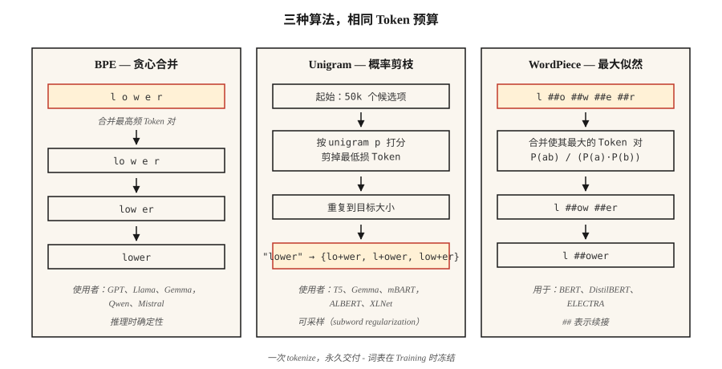

# Subword Tokenization — BPE, WordPiece, Unigram, SentencePiece

> Word Tokenizer 会在未见过的词上卡住。Character Tokenizer 会让序列长度暴涨。Subword Tokenizer 在两者之间取得平衡。每个现代 LLM 都随附一种。

**类型：** 学习
**语言：** Python
**先修：** Phase 5 · 01（Text Processing），Phase 5 · 04（GloVe / FastText / Subword）
**时间：** 约 60 分钟

## 问题

你的 vocabulary 有 50,000 个词。用户输入 "untokenizable"。你的 Tokenizer 返回 `[UNK]`。模型现在对这个词没有任何信号。更糟的是：你的 corpus 中第 90 百分位的文档有 40 个 rare words，这意味着每篇文档会丢掉 40 bits 信息。

Subword Tokenization 解决了这个问题。常见词保持为单个 Token。罕见词会分解成有意义的片段：`untokenizable` → `un`, `token`, `izable`。训练数据可以覆盖一切，因为任何字符串最终都是一个 bytes 序列。

2026 年的每个 frontier LLM 都使用三种算法之一（BPE、Unigram、WordPiece），并由三种库之一封装（tiktoken、SentencePiece、HF Tokenizers）。如果不选择其中一种，你无法发布一个语言模型。

## 概念



**BPE (Byte-Pair Encoding)。** 从 character-level vocabulary 开始。统计每个相邻 pair。把最频繁的 pair 合并成一个新 Token。重复直到达到目标 vocabulary size。主流算法：GPT-2/3/4、Llama、Gemma、Qwen2、Mistral。

**Byte-level BPE。** 同样的算法，但基于原始 bytes（256 个基础 Token），而不是 Unicode 字符。保证零 `[UNK]` Token，即任何 bytes 序列都可编码。GPT-2 使用 50,257 个 Token（256 bytes + 50,000 merges + 1 special）。

**Unigram。** 从一个巨大的 vocabulary 开始。为每个 Token 分配 unigram probability。迭代剪除那些移除后最少增加 corpus log-likelihood 的 Token。推理时是概率性的：可以对 Tokenization 采样（通过 subword regularization 做数据增强时很有用）。T5、mBART、ALBERT、XLNet、Gemma 使用它。

**WordPiece。** 合并那些最大化训练 corpus likelihood 的 pair，而不是基于原始频率。BERT、DistilBERT、ELECTRA 使用它。

**SentencePiece vs tiktoken。** SentencePiece 是直接在原始 Unicode 文本上训练 vocabulary（BPE 或 Unigram）的库，并把空白编码为 `▁`。tiktoken 是 OpenAI 面向预构建 vocabulary 的快速 encoder；它不训练。

经验法则：

- **训练新的 vocabulary：** SentencePiece（多语言，无需 pre-tokenization）或 HF Tokenizers。
- **面向 GPT vocabulary 的快速推理：** tiktoken（cl100k_base、o200k_base）。
- **两者都要：** HF Tokenizers，一个库完成训练 + serving。

## 构建它

### 步骤 1： 从零实现 BPE

见 `code/main.py`。循环如下：

```python
def train_bpe(corpus, num_merges):
    vocab = {tuple(word) + ("</w>",): count for word, count in corpus.items()}
    merges = []
    for _ in range(num_merges):
        pairs = Counter()
        for symbols, freq in vocab.items():
            for a, b in zip(symbols, symbols[1:]):
                pairs[(a, b)] += freq
        if not pairs:
            break
        best = pairs.most_common(1)[0][0]
        merges.append(best)
        vocab = apply_merge(vocab, best)
    return merges
```

这个算法编码了三个事实。`</w>` 标记词尾，因此 "low"（后缀）和 "lower"（前缀）会保持区分。频率加权会让高频 pair 更早胜出。merge list 是有顺序的，推理会按训练顺序应用 merges。

### 步骤 2： 用学到的 merges 进行 encode

```python
def encode_bpe(word, merges):
    symbols = list(word) + ["</w>"]
    for a, b in merges:
        i = 0
        while i < len(symbols) - 1:
            if symbols[i] == a and symbols[i + 1] == b:
                symbols = symbols[:i] + [a + b] + symbols[i + 2:]
            else:
                i += 1
    return symbols
```

朴素实现是 O(n·|merges|)。生产实现（tiktoken、HF Tokenizers）使用 merge-rank lookup 和 priority queues，运行时间接近线性。

### 步骤 3： 实践中的 SentencePiece

```python
import sentencepiece as spm

spm.SentencePieceTrainer.train(
    input="corpus.txt",
    model_prefix="my_tokenizer",
    vocab_size=8000,
    model_type="bpe",          # or "unigram"
    character_coverage=0.9995, # lower for CJK (e.g. 0.9995 for English, 0.995 for Japanese)
    normalization_rule_name="nmt_nfkc",
)

sp = spm.SentencePieceProcessor(model_file="my_tokenizer.model")
print(sp.encode("untokenizable", out_type=str))
# ['▁un', 'token', 'izable']
```

注意：不需要 pre-tokenization，空格编码为 `▁`，`character_coverage` 控制罕见字符被保留还是映射到 `<unk>` 的激进程度。

### 步骤 4： 用于 OpenAI-compatible vocab 的 tiktoken

```python
import tiktoken
enc = tiktoken.get_encoding("o200k_base")
print(enc.encode("untokenizable"))        # [127340, 101028]
print(len(enc.encode("Hello, world!")))   # 4
```

仅编码。速度快（Rust backend）。在 bytes 计数、成本估算、context-window 预算方面，与 GPT-4/5 Tokenization 精确匹配。

## 2026 年仍会发布上线的坑

- **Tokenizer drift。** 在 vocab A 上训练，却用 vocab B 部署。Token IDs 不同；模型输出会变成垃圾。在 CI 中检查 `tokenizer.json` hash。
- **Whitespace ambiguity。** BPE 中 "hello" 和 " hello" 会产生不同 Token。始终显式指定 `add_special_tokens` 和 `add_prefix_space`。
- **Multilingual undertraining。** English-heavy corpora 生成的 vocabulary 会把非 Latin script 切成多 5-10 倍的 Token。同样的 prompt 在 GPT-3.5 上用于 Japanese/Arabic 时成本高 5-10 倍。o200k_base 部分修复了这一点。
- **Emoji splits。** 单个 emoji 可能占 5 个 Token。在做 context 预算时检查 checkpoint 的 emoji 处理。

## 使用它

2026 年的技术栈：

| 情况 | 选择 |
|-----------|------|
| 从零训练 monolingual model | HF Tokenizers (BPE) |
| 训练 multilingual model | SentencePiece (Unigram, `character_coverage=0.9995`) |
| Serving 一个 OpenAI-compatible API | tiktoken (`o200k_base` for GPT-4+) |
| Domain-specific vocab（code、math、protein） | 在 domain corpus 上训练 custom BPE，并与 base vocab 合并 |
| Edge inference，小模型 | Unigram（较小的 vocabulary 效果更好） |

Vocabulary size 是一个 scaling 决策，不是常数。粗略启发式：<1B params 用 32k，1-10B 用 50-100k，多语言/frontier 用 200k+。

## 发布它

保存为 `outputs/skill-bpe-vs-wordpiece.md`：

```markdown
---
name: tokenizer-picker
description: Pick tokenizer algorithm, vocab size, library for a given corpus and deployment target.
version: 1.0.0
phase: 5
lesson: 19
tags: [nlp, tokenization]
---

Given a corpus (size, languages, domain) and deployment target (training from scratch / fine-tuning / API-compatible inference), output:

1. Algorithm. BPE, Unigram, or WordPiece. One-sentence reason.
2. Library. SentencePiece, HF Tokenizers, or tiktoken. Reason.
3. Vocab size. Rounded to nearest 1k. Reason tied to model size and language coverage.
4. Coverage settings. `character_coverage`, `byte_fallback`, special-token list.
5. Validation plan. Average tokens-per-word on held-out set, OOV rate, compression ratio, round-trip decode equality.

Refuse to train a character-coverage <0.995 tokenizer on corpora with rare-script content. Refuse to ship a vocab without a frozen `tokenizer.json` hash check in CI. Flag any monolingual tokenizer under 16k vocab as likely under-spec.
```

## 练习

1. **简单。** 在 `code/main.py` 的小 corpus 上训练一个 500-merge BPE。Encode 三个 held-out words。有多少正好产生 1 个 Token，又有多少产生 >1 个 Token？
2. **中等。** 在 100 个 English Wikipedia sentences 上比较 `cl100k_base`、`o200k_base` 和一个你用 vocab=32k 训练的 SentencePiece BPE 的 Token 数。报告每种方法的 compression ratio。
3. **困难。** 用 BPE、Unigram 和 WordPiece 在同一个 corpus 上训练。把它们分别用于一个小型 sentiment classifier，并测量 downstream accuracy。这个选择会让 F1 变化超过 1 个点吗？

## 关键术语

| Term | 人们怎么说 | 它实际是什么意思 |
|------|-----------------|-----------------------|
| BPE | Byte-Pair Encoding | 贪心合并最频繁的 character pairs，直到达到目标 vocab size。 |
| Byte-level BPE | 永远没有 unknown tokens | 基于原始 256 bytes 的 BPE；GPT-2 / Llama 使用它。 |
| Unigram | 概率式 Tokenizer | 使用 log-likelihood 从大型候选集中剪枝；T5、Gemma 使用它。 |
| SentencePiece | 处理 whitespace 的那个 | 在原始文本上训练 BPE/Unigram 的库；空格编码为 `▁`。 |
| tiktoken | 速度快的那个 | OpenAI 的 Rust-backed BPE encoder，用于预构建 vocab。不训练。 |
| Merge list | 那些魔法数字 | 有序的 `(a, b) → ab` merges 列表；推理时按顺序应用。 |
| Character coverage | 多罕见才算太罕见？ | Tokenizer 必须覆盖的训练 corpus 中字符比例；典型值约为 0.9995。 |

## 延伸阅读

- [Sennrich, Haddow, Birch (2015). Neural Machine Translation of Rare Words with Subword Units](https://arxiv.org/abs/1508.07909) — BPE 论文。
- [Kudo (2018). Subword Regularization with Unigram Language Model](https://arxiv.org/abs/1804.10959) — Unigram 论文。
- [Kudo, Richardson (2018). SentencePiece: A simple and language independent subword tokenizer](https://arxiv.org/abs/1808.06226) — 这个库。
- [Hugging Face — Summary of the tokenizers](https://huggingface.co/docs/transformers/tokenizer_summary) — 简明参考。
- [OpenAI tiktoken repo](https://github.com/openai/tiktoken) — cookbook + encoding list。
