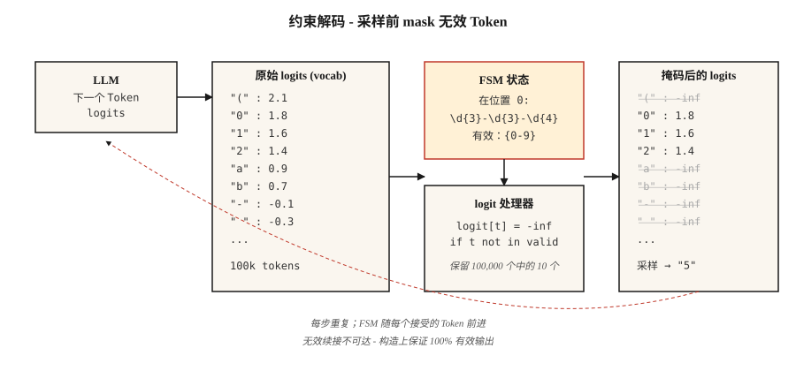

# Structured Outputs 与 Constrained Decoding

> 向 LLM 请求 JSON。大多数时候会得到 JSON。在生产环境中，“大多数”就是问题所在。Constrained decoding 会在采样前编辑 logits，把“大多数”变成“总是”。

**Type:** Build
**Languages:** Python
**Prerequisites:** Phase 5 · 17 (Chatbots), Phase 5 · 19 (Subword Tokenization)
**Time:** ~60 minutes

## 问题

一个 classifier 向 LLM 提示：“Return one of {positive, negative, neutral}.” 模型返回：“The sentiment is positive — this review is overwhelmingly favorable because the customer explicitly states that they ...”。你的 parser 崩溃了。你的 classifier 的 F1 是 0.0。

自由形式生成不是契约。它只是建议。生产系统需要契约。

2026 年有三层方案。

1. **Prompting。** 好好请求。“Return only the JSON object.” 在 frontier models 上约 80% 有效，在更小的模型上更低。
2. **原生 structured output APIs。** OpenAI `response_format`、Anthropic tool use、Gemini JSON mode。对支持的 schema 很可靠。绑定 vendor。
3. **Constrained decoding。** 在每个生成步骤修改 logits，让模型*无法*输出无效 tokens。按构造保证 100% 有效。适用于任何本地模型。

本课会为三者建立直觉，并说明什么时候该用哪一种。

## 概念



**Constrained decoding 如何工作。** 在每个生成步骤，LLM 会在完整 vocabulary（约 100k tokens）上生成一个 logit vector。一个 *logit processor* 位于模型和 sampler 之间。它会根据目标 grammar 中的当前位置（JSON Schema、regex、context-free grammar）计算哪些 tokens 有效，并把所有无效 tokens 的 logits 设为 negative infinity。对剩余 logits 做 softmax 后，概率质量只会落在有效的后续内容上。

2026 年的实现：

- **Outlines。** 将 JSON Schema 或 regex 编译为 finite-state machine。每个 token 都能 O(1) 查询 valid-next-token。基于 FSM，所以 recursive schemas 需要 flattening。
- **XGrammar / llguidance。** Context-free grammar engines。处理 recursive JSON Schema。解码开销接近零。OpenAI 在其 2025 structured output 实现中提到了 llguidance。
- **vLLM guided decoding。** 通过 Outlines、XGrammar 或 lm-format-enforcer 后端内置 `guided_json`、`guided_regex`、`guided_choice`、`guided_grammar`。
- **Instructor。** 基于 Pydantic 的任意 LLM wrapper。验证失败时重试。跨 provider，但不会修改 logits，依赖 retries + structured-output-aware prompts。

### 反直觉的结果

Constrained decoding 通常比 unconstrained generation *更快*。有两个原因。第一，它缩小了 next-token 搜索空间。第二，聪明的实现会对强制 tokens 完全跳过 token generation（像 `{"name": "` 这样的 scaffolding，每个 byte 都已确定）。

### 代价高昂的陷阱

字段顺序很重要。把 `answer` 放在 `reasoning` 前面，模型会在思考之前就承诺一个答案。JSON 是有效的。答案是错的。没有 validation 能捕获它。

```json
// BAD
{"answer": "yes", "reasoning": "because ..."}

// GOOD
{"reasoning": "... therefore ...", "answer": "yes"}
```

Schema 字段顺序是逻辑，不是格式。

## 构建

### 步骤 1：从零开始做 regex-constrained generation

查看 `code/main.py`，其中有一个独立的 FSM 实现。30 行里的核心思想：

```python
def mask_logits(logits, valid_token_ids):
    mask = [float("-inf")] * len(logits)
    for tid in valid_token_ids:
        mask[tid] = logits[tid]
    return mask


def generate_constrained(model, tokenizer, prompt, fsm):
    ids = tokenizer.encode(prompt)
    state = fsm.initial_state
    while not fsm.is_accept(state):
        logits = model.next_token_logits(ids)
        valid = fsm.valid_tokens(state, tokenizer)
        logits = mask_logits(logits, valid)
        tok = sample(logits)
        ids.append(tok)
        state = fsm.transition(state, tok)
    return tokenizer.decode(ids)
```

FSM 会跟踪目前为止我们已经满足了 grammar 的哪些部分。`valid_tokens(state, tokenizer)` 会计算哪些 vocabulary tokens 可以推进 FSM，同时不离开任何 accepting path。

### 步骤 2：用 Outlines 处理 JSON Schema

```python
from pydantic import BaseModel
from typing import Literal
import outlines


class Review(BaseModel):
    sentiment: Literal["positive", "negative", "neutral"]
    confidence: float
    evidence_span: str


model = outlines.models.transformers("meta-llama/Llama-3.2-3B-Instruct")
generator = outlines.generate.json(model, Review)

result = generator("Classify: 'The wait staff was attentive and the food arrived hot.'")
print(result)
# Review(sentiment='positive', confidence=0.93, evidence_span='attentive ... hot')
```

零 validation errors。永远如此。FSM 让无效输出不可达。

### 步骤 3：用 Instructor 做 provider-agnostic Pydantic

```python
import instructor
from anthropic import Anthropic
from pydantic import BaseModel, Field


class Invoice(BaseModel):
    vendor: str
    total_usd: float = Field(ge=0)
    line_items: list[str]


client = instructor.from_anthropic(Anthropic())
invoice = client.messages.create(
    model="claude-opus-4-7",
    max_tokens=1024,
    response_model=Invoice,
    messages=[{"role": "user", "content": "Extract from: 'Acme Corp $420. Widget, Gizmo.'"}],
)
```

机制不同。Instructor 不接触 logits。它把 schema 格式化进 prompt，解析输出，并在 validation failure 时重试（默认 3 次）。适用于任何 provider。重试会增加 latency 和 cost。跨 provider 可移植性是它的卖点。

### 步骤 4：原生 vendor APIs

```python
from openai import OpenAI

client = OpenAI()
response = client.responses.create(
    model="gpt-5",
    input=[{"role": "user", "content": "Classify: 'The food was cold.'"}],
    text={"format": {"type": "json_schema", "name": "sentiment",
          "schema": {"type": "object", "required": ["sentiment"],
                     "properties": {"sentiment": {"type": "string",
                                                  "enum": ["positive", "negative", "neutral"]}}}}},
)
print(response.output_parsed)
```

Server-side constrained decoding。对支持的 schemas，可靠性与 Outlines 相当。不需要管理本地模型。会把你锁定在该 vendor 上。

## 陷阱

- **Recursive schemas。** Outlines 会把 recursion flatten 到固定深度。树结构输出（nested comments、AST）需要 XGrammar 或 llguidance（基于 CFG）。
- **巨大 enums。** 10,000 个选项的 enum 编译很慢，或者会超时。改用 retriever：先预测 top-k candidates，再约束到这些候选上。
- **Grammar 过于严格。** 强制 `date: "YYYY-MM-DD"` regex 时，模型无法为缺失日期输出 `"unknown"`。模型会通过编造一个日期来补偿。允许 `null` 或 sentinel。
- **过早承诺。** 见上面的字段顺序陷阱。始终把 reasoning 放在前面。
- **没有 schema 的 vendor JSON mode。** 纯 JSON mode 只保证有效 JSON，不保证对*你的用例*有效。始终提供完整 schema。

## 使用

2026 年的 stack：

| Situation | Pick |
|-----------|------|
| OpenAI/Anthropic/Google model, simple schema | Native vendor structured output |
| Any provider, Pydantic workflow, can tolerate retries | Instructor |
| Local model, need 100% validity, flat schema | Outlines (FSM) |
| Local model, recursive schema | XGrammar or llguidance |
| Self-hosted inference server | vLLM guided decoding |
| Batch processing with retries acceptable | Instructor + cheapest model |

## 交付

保存为 `outputs/skill-structured-output-picker.md`：

```markdown
---
name: structured-output-picker
description: 选择 structured output 方法、schema 设计和 validation plan。
version: 1.0.0
phase: 5
lesson: 20
tags: [nlp, llm, structured-output]
---

给定一个 use case（provider、latency budget、schema complexity、failure tolerance），输出：

1. Mechanism。Native vendor structured output、Instructor retries、Outlines FSM 或 XGrammar CFG。用一句话说明原因。
2. Schema design。字段顺序（reasoning first, answer last）、用于 "unknown" 的 nullable fields、enum vs regex、required fields。
3. Failure strategy。Max retries、fallback model、优雅的 `null` handling、out-of-distribution refusal。
4. Validation plan。Schema compliance rate（目标 100%）、semantic validity（LLM-judge）、field-coverage rate、latency p50/p99。

拒绝任何把 `answer` 或 `decision` 放在 reasoning fields 之前的设计。拒绝使用没有 schema 的 bare JSON mode。标记使用仅支持 FSM 的库处理 recursive schemas 的风险。
```

## 练习

1. **Easy。** 在不使用 constrained decoding 的情况下，prompt 一个小型 open-weights model（例如 Llama-3.2-3B）生成 `Review(sentiment, confidence, evidence_span)`。在 100 条 reviews 上测量能解析为有效 JSON 的比例。
2. **Medium。** 用 Outlines JSON mode 在同一 corpus 上实验。比较 compliance rate、latency 和 semantic accuracy。
3. **Hard。** 从零实现一个用于电话号码（`\d{3}-\d{3}-\d{4}`）的 regex-constrained decoder。在 1000 个 samples 上验证 0 个无效输出。

## 关键术语

| Term | 人们怎么说 | 实际含义 |
|------|------------|----------|
| Constrained decoding | 强制有效输出 | 在每个生成步骤 mask invalid-token logits。 |
| Logit processor | 执行约束的东西 | 函数：`(logits, state) -> masked_logits`。 |
| FSM | Finite-state machine | 编译后的 grammar 表示；O(1) valid-next-token 查询。 |
| CFG | Context-free grammar | 能处理 recursion 的 grammar；比 FSM 更慢但表达力更强。 |
| Schema field order | 它重要吗？ | 重要，first field 会形成承诺；始终把 reasoning 放在 answer 之前。 |
| Guided decoding | vLLM 对它的称呼 | 同一概念，集成进 inference server。 |
| JSON mode | OpenAI 的早期版本 | 保证 JSON syntax；不保证 schema match。 |

## 延伸阅读

- [Willard, Louf (2023). Efficient Guided Generation for LLMs](https://arxiv.org/abs/2307.09702) — Outlines 论文。
- [XGrammar paper (2024)](https://arxiv.org/abs/2411.15100) — 快速的基于 CFG 的 constrained decoding。
- [vLLM — Structured Outputs](https://docs.vllm.ai/en/latest/features/structured_outputs.html) — 推理服务器集成。
- [OpenAI — Structured Outputs guide](https://platform.openai.com/docs/guides/structured-outputs) — API reference + gotchas。
- [Instructor library](https://python.useinstructor.com/) — 跨 providers 的 Pydantic + retries。
- [JSONSchemaBench (2025)](https://arxiv.org/abs/2501.10868) — 对 6 个 constrained decoding frameworks 进行 benchmarking。
