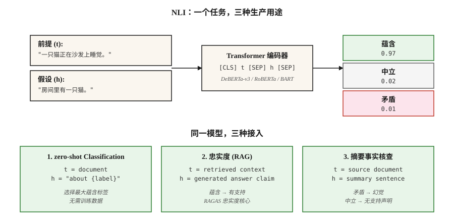

# 自然语言推理 — 文本蕴含

> "t entails h" 的意思是，人在阅读 t 后会得出 h 为真的结论。NLI 是预测 entailment / contradiction / neutral 的任务。表面上枯燥，但在生产中承担关键作用。

**类型：** 学习
**语言：** Python
**先修：** Phase 5 · 05 (Sentiment Analysis), Phase 5 · 13 (Question Answering)
**时间：** ~60 分钟

## 问题

你构建了一个 summarizer。它生成了一份 summary。你怎么知道这份 summary 没有包含 hallucination？

你构建了一个 chatbot。它回答了 "yes." 你怎么知道这个 answer 得到了检索到的 passage 支持？

你需要按主题分类 10,000 篇 news articles。你没有 training labels。能复用一个 model 吗？

这三个问题都可以归约为 Natural Language Inference。NLI 问的是：给定一个 premise `t` 和一个 hypothesis `h`，`h` 是由 `t` entailed、contradicted，还是 neutral（无关）？

- **Hallucination check:** `t` = source document，`h` = summary claim。不是 entailment = hallucination。
- **Grounded QA:** `t` = retrieved passage，`h` = generated answer。不是 entailment = fabrication。
- **Zero-shot classification:** `t` = document，`h` = verbalized label ("This is about sports")。Entailment = predicted label。

一个任务，三种生产用途。这就是为什么每个 RAG evaluation framework 都会在底层附带一个 NLI model。

## 概念



**三个 labels。**

- **Entailment.** `t` → `h`。"The cat is on the mat" entails "There is a cat."
- **Contradiction.** `t` → ¬`h`。"The cat is on the mat" contradicts "There is no cat."
- **Neutral.** 双向都无法推断。"The cat is on the mat" 对 "The cat is hungry." 是 neutral。

**不是逻辑 entailment。** NLI 是 *natural* language inference，也就是典型人类读者会推断出的内容，而不是严格逻辑。"John walked his dog" 在 NLI 中 entails "John has a dog"，但严格的一阶逻辑只有在你把“拥有关系”公理化后才会承认这一点。

**Datasets。**

- **SNLI** (2015)。570k 人工标注 pairs，以 image captions 作为 premises。领域较窄。
- **MultiNLI** (2017)。跨 10 个 genres 的 433k pairs。2026 年的标准 training corpus。
- **ANLI** (2019)。Adversarial NLI。人类专门编写用来击穿现有 models 的 examples。更难。
- **DocNLI, ConTRoL** (2020–21)。Document-length premises。测试 multi-hop 和 long-range inference。

**架构。** 一个 Transformer encoder（BERT, RoBERTa, DeBERTa）读取 `[CLS] premise [SEP] hypothesis [SEP]`。`[CLS]` representation 输入到 3-way softmax。在 MNLI 上训练，在 held-out benchmarks 上评估，在 in-distribution pairs 上获得 90%+ accuracy。

**通过 NLI 做 zero-shot。** 给定一个 document 和 candidate labels，把每个 label 转成一个 hypothesis（"This text is about sports"）。计算每个的 entailment probability。选择最大值。这就是 Hugging Face 的 `zero-shot-classification` pipeline 背后的机制。

## 构建它

### 步骤 1： 运行一个 pretrained NLI model

```python
from transformers import pipeline

nli = pipeline("text-classification",
               model="facebook/bart-large-mnli",
               top_k=None)  # return all labels; replaces deprecated return_all_scores=True

premise = "The cat is sleeping on the couch."
hypothesis = "There is a cat in the room."

result = nli({"text": premise, "text_pair": hypothesis})[0]
print(result)
# [{'label': 'entailment', 'score': 0.97},
#  {'label': 'neutral', 'score': 0.02},
#  {'label': 'contradiction', 'score': 0.01}]
```

对于生产级 NLI，`facebook/bart-large-mnli` 和 `microsoft/deberta-v3-large-mnli` 是开源默认选择。DeBERTa-v3 位居排行榜前列。

### 步骤 2：zero-shot Classification

```python
zs = pipeline("zero-shot-classification", model="facebook/bart-large-mnli")

text = "The stock market rallied after the central bank cut interest rates."
labels = ["finance", "sports", "politics", "technology"]

result = zs(text, candidate_labels=labels)
print(result)
# {'labels': ['finance', 'politics', 'technology', 'sports'],
#  'scores': [0.92, 0.05, 0.02, 0.01]}
```

默认 template 是 "This example is about {label}."。可用 `hypothesis_template` 自定义。不需要 training data。不需要 fine-tuning。开箱即用。

### 步骤 3： RAG 的 faithfulness check

```python
def is_faithful(answer, context, threshold=0.5):
    result = nli({"text": context, "text_pair": answer})[0]
    entail = next(s for s in result if s["label"] == "entailment")
    return entail["score"] > threshold
```

这是 RAGAS faithfulness 的核心。把 generated answer 拆分成 atomic claims。将每个 claim 与 retrieved context 比对。报告被 entail 的比例。

### 步骤 4： 手写 NLI classifier（概念版）

查看 `code/main.py` 中仅用 stdlib 的 toy：premise 和 hypothesis 通过 lexical overlap + negation detection 进行比较。它无法与 Transformer models 竞争，但展示了任务的形状：输入两段文本，输出 3-way label，loss = `{entail, contradict, neutral}` 上的 cross-entropy。

## 陷阱

- **Hypothesis-only shortcuts.** Models 只看 hypothesis 就能在 SNLI 上以约 60% 的准确率预测 label，因为 "not"、"nobody"、"never" 与 contradiction 相关。这是检测 label leakage 的强 baseline。
- **Lexical overlap heuristic.** subsequence heuristic（“每个 subsequence 都被 entailed”）能通过 SNLI，但会在 HANS/ANLI 上失败。使用 adversarial benchmarks。
- **Document-length degradation.** Single-sentence NLI models 在 document-length premises 上会下降 20+ F1。长上下文应使用 DocNLI-trained models。
- **Zero-shot template sensitivity.** "This example is about {label}"、"{label}"、"The topic is {label}" 之间可能导致 accuracy 波动 10+ points。需要调优 template。
- **Domain mismatch.** MNLI 在通用英语上训练。法律、医疗和科学文本需要领域专用 NLI models（例如 SciNLI, MedNLI）。

## 使用它

2026 stack：

| Use case | Model |
|---------|-------|
| 通用 NLI | `microsoft/deberta-v3-large-mnli` |
| 快速 / edge | `cross-encoder/nli-deberta-v3-base` |
| Zero-shot classification（轻量） | `facebook/bart-large-mnli` |
| Document-level NLI | `MoritzLaurer/DeBERTa-v3-large-mnli-fever-anli-ling-wanli` |
| Multilingual | `MoritzLaurer/multilingual-MiniLMv2-L6-mnli-xnli` |
| RAG 中的 hallucination detection | RAGAS / DeepEval 内部的 NLI layer |

2026 年的 meta-pattern：NLI 是文本理解的万能胶。只要你需要判断 “A 是否支持 B？” 或 “A 是否 contradict B？”——在发起另一个 LLM call 之前，先考虑 NLI。

## 交付它

保存为 `outputs/skill-nli-picker.md`：

```markdown
---
name: nli-picker
description: Pick an NLI model, label template, and evaluation setup for a classification / faithfulness / zero-shot task.
version: 1.0.0
phase: 5
lesson: 21
tags: [nlp, nli, zero-shot]
---

Given a use case (faithfulness check, zero-shot classification, document-level inference), output:

1. Model. Named NLI checkpoint. Reason tied to domain, length, language.
2. Template (if zero-shot). Verbalization pattern. Example.
3. Threshold. Entailment cutoff for the decision rule. Reason based on calibration.
4. Evaluation. Accuracy on held-out labeled set, hypothesis-only baseline, adversarial subset.

Refuse to ship zero-shot classification without a 100-example labeled sanity check. Refuse to use a sentence-level NLI model on document-length premises. Flag any claim that NLI solves hallucination — it reduces it; it does not eliminate it.
```

## 练习

1. **Easy.** 在 20 个手写的（premise, hypothesis, label）triples 上运行 `facebook/bart-large-mnli`，覆盖所有三类。测量 accuracy。加入 adversarial "subsequence heuristic" traps（"I did not eat the cake" vs "I ate the cake"），看看它是否会失效。
2. **Medium.** 在 100 条 AG News headlines 上比较 zero-shot template `"This text is about {label}"`、`"The topic is {label}"` 和 `"{label}"`。报告 accuracy swing。
3. **Hard.** 构建一个 RAG faithfulness checker：atomic-claim decomposition + 每个 claim 做 NLI。在 50 个带 gold context 的 RAG-generated answers 上评估。测量相对于人工 labels 的 false-positive 和 false-negative rates。

## 关键术语
| Term | What people say | What it actually means |
|------|-----------------|-----------------------|
| NLI | Natural Language Inference | premise-hypothesis 关系的 3-way classification。 |
| RTE | Recognizing Textual Entailment | NLI 的旧名称；同一任务。 |
| Entailment | "t implies h" | 给定 t，典型读者会得出 h 为真的结论。 |
| Contradiction | "t rules out h" | 给定 t，典型读者会得出 h 为假的结论。 |
| Neutral | "undecided" | 从 t 到 h 双向都无法推断。 |
| Zero-shot classification | NLI as classifier | 把 labels verbalize 成 hypotheses，选择最大 entailment。 |
| Faithfulness | 答案是否有支持？ | 在（retrieved context, generated answer）上做 NLI。 |

## 延伸阅读
- [Bowman et al. (2015). A large annotated corpus for learning natural language inference](https://arxiv.org/abs/1508.05326) — SNLI。
- [Williams, Nangia, Bowman (2017). A Broad-Coverage Challenge Corpus for Sentence Understanding through Inference](https://arxiv.org/abs/1704.05426) — MultiNLI。
- [Nie et al. (2019). Adversarial NLI](https://arxiv.org/abs/1910.14599) — ANLI benchmark。
- [Yin, Hay, Roth (2019). Benchmarking Zero-shot Text Classification](https://arxiv.org/abs/1909.00161) — NLI-as-classifier。
- [He et al. (2021). DeBERTa: Decoding-enhanced BERT with Disentangled Attention](https://arxiv.org/abs/2006.03654) — 2026 年的 NLI 主力。
