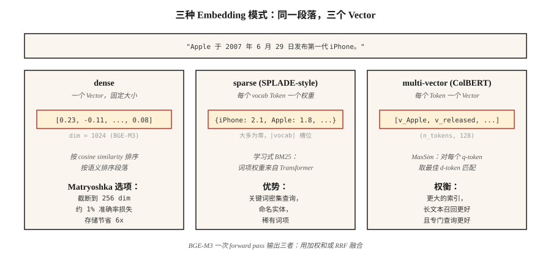

# Embedding Models — 2026 深度解析

> Word2Vec 为每个词提供一个 Vector。现代 Embedding Models 为每个段落提供一个 Vector，支持跨语言，并提供 sparse、dense 和 multi-vector 视图，尺寸可适配你的 index。选错了，你的 RAG 就会检索到错误内容。

**Type:** Learn
**Languages:** Python
**Prerequisites:** Phase 5 · 03 (Word2Vec), Phase 5 · 14 (Information Retrieval)
**Time:** ~60 minutes

## 问题

你的 RAG system 有 40% 的时候检索到了错误段落。罪魁祸首很少是 vector database 或 prompt。通常是 embedding model。

在 2026 年选择 embedding，意味着要在五个维度上取舍：

1. **Dense vs sparse vs multi-vector。** 每个段落一个 Vector，或每个 Token 一个 Vector，或一个 sparse weighted bag of words。
2. **语言覆盖。** 单语 English models 在纯 English 任务上仍然胜出。Multilingual models 在 corpus 混合时胜出。
3. **Context length。** 512 Tokens vs 8,192 vs 32,768，而真实有效容量通常只有标称最大值的 60-70%。
4. **Dimension budget。** 3,072 个 full precision floats = 每个 Vector 12 KB。到 100M Vectors 时，存储费用是 $1,300/month。Matryoshka truncation 可将其减少 4×。
5. **Open vs hosted。** Open-weight 意味着你控制 stack 和 data。Hosted 意味着你用控制权换取 always-latest。

本课会明确这些取舍，让你基于证据选择，而不是基于上个季度流行什么。

## 概念



**Dense embeddings。** 每个段落一个 Vector（通常 384-3,072 dimensions）。Cosine similarity 按语义接近度对段落排序。OpenAI `text-embedding-3-large`、BGE-M3 dense mode、Voyage-3。默认选择。

**Sparse embeddings。** SPLADE-style。一个 Transformer 为每个 vocab token 预测权重，然后将其中大部分置零。结果是大小为 |vocab| 的 sparse vector。捕获 lexical matching（类似 BM25），但使用 learned term weights。对 keyword-heavy queries 很强。

**Multi-vector (late interaction)。** ColBERTv2、Jina-ColBERT。每个 Token 一个 Vector。使用 MaxSim 打分：对每个 query token，找到最相似的 document token，并累加分数。存储和打分更昂贵，但在 long queries 和 domain-specific corpora 上胜出。

**BGE-M3：三者合一。** 单个 model 同时输出 dense、sparse 和 multi-vector representations。每一种都可以独立查询；分数通过 weighted sum 融合。当你希望从一个 checkpoint 获得灵活性时，这是 2026 年的默认选择。

**Matryoshka Representation Learning。** 训练方式使得 Vector 的前 N 个 dimensions 本身就是有用的 standalone embedding。将 1,536-dim Vector 截断到 256 dim，只用约 1% accuracy 换取 6× storage savings。OpenAI text-3、Cohere v4、Voyage-4、Jina v5、Gemini Embedding 2、Nomic v1.5+ 支持。

### MTEB leaderboard 只讲了部分故事

Massive Text Embedding Benchmark 在发布时（2022）覆盖 8 类任务中的 56 个任务，在 MTEB v2 中扩展到 100+ 任务。2026 年初，Gemini Embedding 2 在 retrieval 上排名第一（67.71 MTEB-R）。Cohere embed-v4 领先 general（65.2 MTEB）。BGE-M3 领先 open-weight multilingual（63.0）。Leaderboard 是必要的，但不充分，始终要在你的 domain 上 benchmark。

### 三层模式

| Use case | Pattern |
|----------|---------|
| 快速 first-pass | Dense bi-encoder (BGE-M3, text-3-small) |
| Recall boost | Sparse (SPLADE, BGE-M3 sparse) + RRF fuse |
| top-50 上的 Precision | Multi-vector (ColBERTv2) 或 cross-encoder reranker |

大多数 production stacks 会同时使用三者。

## 构建它

### 步骤 1： baseline — 使用 Sentence-BERT 的 dense embeddings

```python
from sentence_transformers import SentenceTransformer
import numpy as np

encoder = SentenceTransformer("BAAI/bge-small-en-v1.5")
corpus = [
    "The first iPhone launched in 2007.",
    "Apple released the iPod in 2001.",
    "Android is an operating system from Google.",
]
emb = encoder.encode(corpus, normalize_embeddings=True)

query = "When was the iPhone released?"
q_emb = encoder.encode([query], normalize_embeddings=True)[0]
scores = emb @ q_emb
print(sorted(enumerate(scores), key=lambda x: -x[1]))
```

`normalize_embeddings=True` 让 dot product 等于 cosine similarity。始终设置它。

### 步骤 2: Matryoshka truncation

```python
def truncate(vectors, dim):
    out = vectors[:, :dim]
    return out / np.linalg.norm(out, axis=1, keepdims=True)

emb_256 = truncate(emb, 256)
emb_128 = truncate(emb, 128)
```

截断后重新 normalize。Nomic v1.5、OpenAI text-3 和 Voyage-4 都经过训练，因此前几个层级基本无损。Non-Matryoshka models（原始 Sentence-BERT）在被截断时会急剧退化。

### 步骤 3: BGE-M3 多功能性

```python
from FlagEmbedding import BGEM3FlagModel

model = BGEM3FlagModel("BAAI/bge-m3", use_fp16=True)

output = model.encode(
    corpus,
    return_dense=True,
    return_sparse=True,
    return_colbert_vecs=True,
)
# output["dense_vecs"]:    (n_docs, 1024)
# output["lexical_weights"]: list of dict {token_id: weight}
# output["colbert_vecs"]:  list of (n_tokens, 1024) arrays
```

三个 indexes，一次 inference call。Score fusion：

```python
dense_score = ... # cosine over dense_vecs
sparse_score = model.compute_lexical_matching_score(q_lex, d_lex)
colbert_score = model.colbert_score(q_col, d_col)
final = 0.4 * dense_score + 0.2 * sparse_score + 0.4 * colbert_score
```

在你的 domain 上调 weights。

### 步骤 4： 在 custom task 上做 MTEB eval

```python
from mteb import MTEB

tasks = ["ArguAna", "SciFact", "NFCorpus"]
evaluation = MTEB(tasks=tasks)
results = evaluation.run(encoder, output_folder="./mteb-results")
```

在一个具有*代表性*的子集上运行候选 models。不要只相信 leaderboard rank，你的 domain 很重要。

### 步骤 5： 从零手写 cosine

见 `code/main.py`。Averaged Hashing Trick embeddings（仅 stdlib）。无法与 transformer embeddings 竞争，但展示了形状：tokenize → vector → normalize → dot product。

## 常见陷阱

- **query 和 doc 使用同一个 model。** 有些 models（Voyage、Jina-ColBERT）使用 asymmetric encoding，query 和 document 会经过不同路径。始终检查 model card。
- **缺少 prefix。** `bge-*` models 需要在 queries 前加上 `"Represent this sentence for searching relevant passages: "`。忘记的话 recall 会差 3-5 个点。
- **过度裁剪 Matryoshka。** 1,536 → 256 通常安全。1,536 → 64 不安全。请在你的 eval set 上验证。
- **Context truncation。** 大多数 models 会静默截断超过最大长度的输入。Long docs 需要 chunking（见 lesson 23）。
- **忽略 latency tail。** MTEB scores 隐藏了 p99 latency。一个 600M model 可能比 335M model 高 2 分，但每次 query 成本高 3×。

## 使用它

2026 stack：

| Situation | Pick |
|-----------|------|
| 仅 English、快速、API | `text-embedding-3-large` 或 `voyage-3-large` |
| Open-weight、English | `BAAI/bge-large-en-v1.5` |
| Open-weight、multilingual | `BAAI/bge-m3` 或 `Qwen3-Embedding-8B` |
| Long context (32k+) | Voyage-3-large, Cohere embed-v4, Qwen3-Embedding-8B |
| CPU-only deployment | Nomic Embed v2 (137M params, MoE) |
| Storage-constrained | Matryoshka-truncated + int8 quantization |
| Keyword-heavy queries | 添加 SPLADE sparse，并与 dense 做 RRF-fuse |

2026 模式：从 BGE-M3 或 text-3-large 开始，用 MTEB 在你的 domain 上评估；如果某个 domain-specific model 领先超过 3 分，再切换。

## 发布它

保存为 `outputs/skill-embedding-picker.md`：

```markdown
---
name: embedding-picker
description: 为给定 corpus 和 deployment 选择 embedding model、dimension 和 retrieval mode。
version: 1.0.0
phase: 5
lesson: 22
tags: [nlp, embeddings, retrieval]
---

给定一个 corpus（size、languages、domain、avg length）、deployment target（cloud / edge / on-prem）、latency budget 和 storage budget，输出：

1. Model。命名的 checkpoint 或 API。一句话说明理由。
2. Dimension。Full / Matryoshka-truncated / int8-quantized。给出与 storage budget 相关的理由。
3. Mode。Dense / sparse / multi-vector / hybrid。说明理由。
4. 如果 model card 要求，给出 query prefix / template。
5. Evaluation plan。与 domain 相关的 MTEB tasks + 使用 nDCG@10 的 held-out domain eval。

拒绝在没有 domain validation 的情况下建议将 Matryoshka 截断到 <64 dims。拒绝为 10k passages 以下的 corpora 推荐 ColBERTv2（overhead 不合理）。标记被路由到 512-token windows models 的 long-document corpora（>8k tokens）。
```

## 练习

1. **Easy。** 使用 `bge-small-en-v1.5` 以 full dim (384) 编码 100 个句子，然后以 Matryoshka 128 编码。在 10 个 queries 上测量 MRR drop。
2. **Medium。** 在来自你 domain 的 500 个 passages 上比较 BGE-M3 dense、sparse 和 colbert。哪个在 recall@10 上胜出？RRF fusion 是否超过最佳单一 mode？
3. **Hard。** 在你的 top-2 domain tasks 上对三个候选 models 运行 MTEB。报告 MTEB score、100-query batch 上的 p99 latency，以及 $/1M queries。选择 Pareto-optimal 的那个。

## 关键术语
| Term | What people say | What it actually means |
|------|-----------------|-----------------------|
| Dense embedding | 这个 Vector | 每段文本一个 fixed-size Vector。用 Cosine similarity 排序。 |
| Sparse embedding | Learned BM25 | 每个 vocab token 一个权重；大多为零；end-to-end 训练。 |
| Multi-vector | ColBERT-style | 每个 Token 一个 Vector；MaxSim scoring；更大的 index，更好的 recall。 |
| Matryoshka | Russian doll trick | 前 N dims 本身就是有效的更小 embedding。 |
| MTEB | 这个 benchmark | Massive Text Embedding Benchmark，发布时 56 个任务，v2 中 100+。 |
| BEIR | 这个 retrieval benchmark | 18 个 zero-shot retrieval tasks；常被引用来衡量 cross-domain robustness。 |
| Asymmetric encoding | Query ≠ doc path | Model 对 queries 和 documents 使用不同 projections。 |

## 进一步阅读

- [Reimers, Gurevych (2019). Sentence-BERT](https://arxiv.org/abs/1908.10084) — bi-encoder 论文。
- [Muennighoff et al. (2022). MTEB: Massive Text Embedding Benchmark](https://arxiv.org/abs/2210.07316) — leaderboard 论文。
- [Chen et al. (2024). BGE-M3: Multi-lingual, Multi-functionality, Multi-granularity](https://arxiv.org/abs/2402.03216) — 统一三种 mode 的 model。
- [Kusupati et al. (2022). Matryoshka Representation Learning](https://arxiv.org/abs/2205.13147) — dimension-ladder 训练目标。
- [Santhanam et al. (2022). ColBERTv2: Effective and Efficient Retrieval via Lightweight Late Interaction](https://arxiv.org/abs/2112.01488) — production 中的 late interaction。
- [MTEB leaderboard on Hugging Face](https://huggingface.co/spaces/mteb/leaderboard) — 实时排名。
