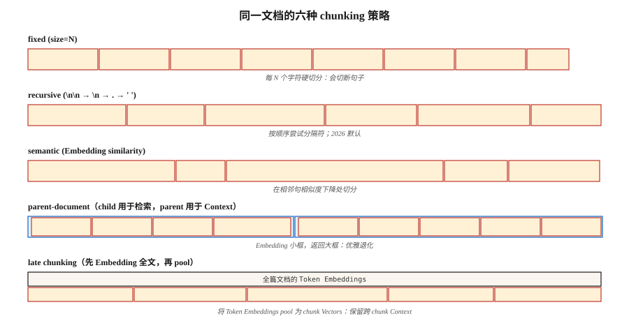

# RAG 的 Chunking 策略

> Chunking 配置对检索质量的影响与 Embedding model 的选择一样大（Vectara NAACL 2025）。如果 chunking 做错了，再多 reranking 也救不了。

**类型：** Build
**语言：** Python
**先修要求：** Phase 5 · 14（Information Retrieval），Phase 5 · 22（Embedding Models）
**时间：** 约 60 分钟

## 问题

你把一份 50 页的合同放进 RAG 系统。用户问：“终止条款是什么？”retriever 返回了封面页。为什么？因为 model 是在 512-Token chunks 上训练的，而终止条款位于第 20 页，跨越了分页，并且没有把它和 query 关联起来的局部关键词。

解决方案不是“买一个更好的 Embedding model”。解决方案是 chunking。多大？要不要 overlap？在哪里 split？是否带周围上下文？

2026 年 2 月的 benchmark 显示了令人意外的结果：

- Vectara 的 2026 研究：recursive 512-Token chunking 击败了 semantic chunking，准确率 69% → 54%。
- SPLADE + Mistral-8B 在 Natural Questions 上：overlap 没有带来任何可测量收益。
- Context cliff：response 质量在约 2,500 个 context tokens 附近急剧下降。

“显而易见”的答案（semantic chunking、20% overlap、1000 tokens）通常是错的。本课会为六种策略建立直觉，并告诉你什么时候该用哪一种。

## 概念



**Fixed chunking。** 每 N 个字符或 tokens 切分一次。最简单的 baseline。会在句子中间断开。压缩性好，一致性差。

**Recursive。** LangChain 的 `RecursiveCharacterTextSplitter`。先尝试按 `\n\n` split，再按 `\n`，再按 `.`，再按空格。能够干净地 fallback。2026 年的默认选择。

**Semantic。** Embed 每个句子。计算相邻句子之间的 cosine similarity。在 similarity 低于 threshold 的地方 split。保留主题一致性。更慢；有时会产生很小的 40-Token 片段，伤害检索。

**Sentence。** 按句子边界 split。每个 chunk 一个句子，或 N 个句子的窗口。以一小部分成本，在约 5k tokens 以内接近 semantic chunking。

**Parent-document。** 存储小的 child chunks 用于检索，同时存储更大的 parent chunk 用于上下文。通过 child 检索；返回 parent。优雅降级：即使 child chunks 不佳，仍会返回合理的 parents。

**Late chunking（2024）。** 先在 Token level embed 整个文档，然后把 Token embeddings pool 成 chunk embeddings。保留跨 chunk 的上下文。适用于 long-context embedders（BGE-M3、Jina v3）。计算成本更高。

**Contextual retrieval（Anthropic，2024）。** 给每个 chunk 前置一段由 LLM 生成的摘要，说明它在文档中的位置（“This chunk is section 3.2 of the termination clauses...”）。在 Anthropic 自己的 benchmark 中带来 35-50% 的检索提升。索引成本高。

### 胜过所有默认值的规则

让 chunk size 匹配 query type：

| Query type | Chunk size |
|------------|-----------|
| Factoid（“CEO 的名字是什么？”） | 256-512 tokens |
| Analytical / multi-hop | 512-1024 tokens |
| Whole-section comprehension | 1024-2048 tokens |

NVIDIA 的 2026 benchmark。chunk 应足够大，能包含答案和局部上下文；也应足够小，让 retriever 的 top-K 聚焦在答案上，而不是上下文噪声上。

```figure
n5-chunk-cuts
```

## 构建它

### 步骤 1： fixed 和 recursive chunking

```python
def chunk_fixed(text, size=512, overlap=0):
    step = size - overlap
    return [text[i:i + size] for i in range(0, len(text), step)]


def chunk_recursive(text, size=512, seps=("\n\n", "\n", ". ", " ")):
    if len(text) <= size:
        return [text]
    for sep in seps:
        if sep not in text:
            continue
        parts = text.split(sep)
        chunks = []
        buf = ""
        for p in parts:
            if len(p) > size:
                if buf:
                    chunks.append(buf)
                    buf = ""
                chunks.extend(chunk_recursive(p, size=size, seps=seps[1:] or (" ",)))
                continue
            candidate = buf + sep + p if buf else p
            if len(candidate) <= size:
                buf = candidate
            else:
                if buf:
                    chunks.append(buf)
                buf = p
        if buf:
            chunks.append(buf)
        return [c for c in chunks if c.strip()]
    return chunk_fixed(text, size)
```

### 步骤 2： semantic chunking

```python
def chunk_semantic(text, encoder, threshold=0.6, min_chars=200, max_chars=2048):
    sentences = split_sentences(text)
    if not sentences:
        return []
    embs = encoder.encode(sentences, normalize_embeddings=True)
    chunks = [[sentences[0]]]
    for i in range(1, len(sentences)):
        sim = float(embs[i] @ embs[i - 1])
        current_len = sum(len(s) for s in chunks[-1])
        if sim < threshold and current_len >= min_chars:
            chunks.append([sentences[i]])
        else:
            chunks[-1].append(sentences[i])

    result = []
    for group in chunks:
        text_group = " ".join(group)
        if len(text_group) > max_chars:
            result.extend(chunk_recursive(text_group, size=max_chars))
        else:
            result.append(text_group)
    return result
```

在你的领域上调优 `threshold`。太高 → 片段化。太低 → 一个巨大的 chunk。

### 步骤 3： parent-document

```python
def chunk_parent_child(text, parent_size=2048, child_size=256):
    parents = chunk_recursive(text, size=parent_size)
    mapping = []
    for p_idx, parent in enumerate(parents):
        children = chunk_recursive(parent, size=child_size)
        for child in children:
            mapping.append({"child": child, "parent_idx": p_idx, "parent": parent})
    return mapping


def retrieve_parent(child_query, mapping, encoder, top_k=3):
    child_embs = encoder.encode([m["child"] for m in mapping], normalize_embeddings=True)
    q_emb = encoder.encode([child_query], normalize_embeddings=True)[0]
    scores = child_embs @ q_emb
    top = np.argsort(-scores)[:top_k]
    seen, parents = set(), []
    for i in top:
        if mapping[i]["parent_idx"] not in seen:
            parents.append(mapping[i]["parent"])
            seen.add(mapping[i]["parent_idx"])
    return parents
```

关键洞察：对 parents 去重。多个 children 可能映射到同一个 parent；全部返回会浪费上下文。

### 步骤 4: contextual retrieval（Anthropic pattern）

```python
def contextualize_chunks(document, chunks, llm):
    context_prompts = [
        f"""<document>{document}</document>
Here is the chunk to situate: <chunk>{c}</chunk>
Write 50-100 words placing this chunk in the document's context."""
        for c in chunks
    ]
    contexts = llm.batch(context_prompts)
    return [f"{ctx}\n\n{c}" for ctx, c in zip(contexts, chunks)]
```

索引 contextualized chunks。查询时，检索会受益于额外的周围信号。

### 步骤 5： evaluate

```python
def recall_at_k(queries, corpus_chunks, encoder, k=5):
    chunk_embs = encoder.encode(corpus_chunks, normalize_embeddings=True)
    hits = 0
    for q_text, gold_idxs in queries:
        q_emb = encoder.encode([q_text], normalize_embeddings=True)[0]
        top = np.argsort(-(chunk_embs @ q_emb))[:k]
        if any(i in gold_idxs for i in top):
            hits += 1
    return hits / len(queries)
```

始终 benchmark。你的 corpus 的“最佳”策略可能和任何 blog post 都不一致。

## 陷阱

- **只在 factoid queries 上评估 chunking。** Multi-hop queries 会揭示非常不同的优胜者。使用按 query type 分层的 eval set。
- **没有最小尺寸的 semantic chunking。** 会产生 40-Token 片段，伤害检索。始终强制执行 `min_tokens`。
- **把 overlap 当作 cargo cult。** 2026 年研究发现 overlap 通常带来零收益，却会让索引成本翻倍。测量，不要假设。
- **没有 min/max 约束。** 5 tokens 或 5000 tokens 的 chunks 都会破坏检索。进行 clamp。
- **跨 doc chunking。** 永远不要让一个 chunk 跨越两个文档。始终按 doc chunking，然后再 merge。

## 使用它

2026 年的 stack：

| Situation | Strategy |
|-----------|----------|
| First build, unknown corpus | Recursive, 512 tokens, no overlap |
| Factoid QA | Recursive, 256-512 tokens |
| Analytical / multi-hop | Recursive, 512-1024 tokens + parent-document |
| Heavy cross-reference（contracts, papers） | Late chunking or contextual retrieval |
| Conversational / dialog corpus | Turn-level chunks + speaker metadata |
| Short utterances（tweets, reviews） | One document = one chunk |

从 recursive 512 开始。在 50-query eval set 上测量 recall@5。然后再调优。

## 交付它

保存为 `outputs/skill-chunker.md`：

```markdown
---
name: chunker
description: Pick a chunking strategy, size, and overlap for a given corpus and query distribution.
version: 1.0.0
phase: 5
lesson: 23
tags: [nlp, rag, chunking]
---

Given a corpus (document types, avg length, domain) and query distribution (factoid / analytical / multi-hop), output:

1. Strategy. Recursive / sentence / semantic / parent-document / late / contextual. Reason.
2. Chunk size. Token count. Reason tied to query type.
3. Overlap. Default 0; justify if >0.
4. Min/max enforcement. `min_tokens`, `max_tokens` guards.
5. Evaluation plan. Recall@5 on 50-query stratified eval set (factoid, analytical, multi-hop).

Refuse any chunking strategy without min/max chunk size enforcement. Refuse overlap above 20% without an ablation showing it helps. Flag semantic chunking recommendations without a min-token floor.
```

## 练习

1. **Easy。** 用 fixed(512, 0)、recursive(512, 0) 和 recursive(512, 100) 对一份 20 页文档进行 chunk。比较 chunk 数量和边界质量。
2. **Medium。** 基于 5 个文档构建一个 30-query eval set。测量 recursive、semantic 和 parent-document 的 recall@5。哪个获胜？它和 blog posts 的结论一致吗？
3. **Hard。** 实现 contextual retrieval。测量相对 baseline recursive 的 MRR 提升。报告索引成本（LLM calls）与准确率收益。

## 关键术语

| Term | What people say | What it actually means |
|------|-----------------|-----------------------|
| Chunk | 文档的一块 | 被 Embedding、索引和检索的子文档单元。 |
| Overlap | 安全余量 | 相邻 chunks 之间共享的 N 个 tokens；在 2026 benchmarks 中通常没用。 |
| Semantic chunking | 智能 chunking | 在相邻句子的 Embedding similarity 下降处 split。 |
| Parent-document | 两级检索 | 检索小的 children，返回更大的 parents。 |
| Late chunking | Embedding 后再 chunk | 在 Token level embed 完整 doc，再 pool 成 chunk vectors。 |
| Contextual retrieval | Anthropic 的技巧 | 在索引前，把 LLM 生成的摘要前置到每个 chunk。 |
| Context cliff | 2500-Token 墙 | RAG 中在约 2.5k context tokens 附近观察到的质量下降（2026 年 1 月）。 |

## 延伸阅读

- [Yepes et al. / LangChain — Recursive Character Splitting docs](https://python.langchain.com/docs/how_to/recursive_text_splitter/) — 生产环境中的默认选择。
- [Vectara (2024, NAACL 2025). Chunking configurations analysis](https://arxiv.org/abs/2410.13070) — chunking 与 Embedding 选择同样重要。
- [Jina AI — Late Chunking in Long-Context Embedding Models (2024)](https://jina.ai/news/late-chunking-in-long-context-embedding-models/) — late chunking 论文。
- [Anthropic — Contextual Retrieval](https://www.anthropic.com/news/contextual-retrieval) — 使用 LLM 生成的上下文前缀带来 35-50% 的检索提升。
- [NVIDIA 2026 chunk-size benchmark — Premai summary](https://blog.premai.io/rag-chunking-strategies-the-2026-benchmark-guide/) — 按 query type 选择 chunk size。
