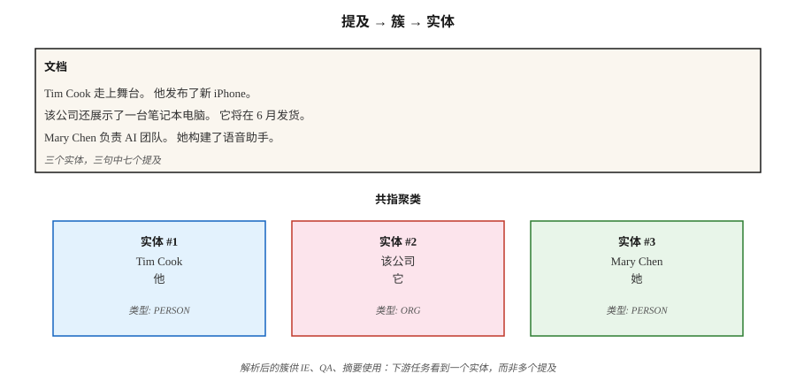

# Coreference Resolution

> “她打电话给他。他没有接。医生在吃午饭。” 三个 reference，指向两个人，而且没有人被点名。Coreference Resolution 会弄清楚谁是谁。

**Type:** Learn
**Languages:** Python
**Prerequisites:** Phase 5 · 06 (NER), Phase 5 · 07 (POS & Parsing)
**Time:** ~60 分钟

## 问题
从一篇 300 词文章中抽取 Apple Inc. 的每一个 mention。文章写 “Apple” 时很简单。写成 “the company”、“they”、“Cupertino's technology giant” 或 “Jobs's firm” 时就很难。如果不把这些 mention 解析到同一个 entity，你的 NER pipeline 会漏掉 60-80% 的 mention。

Coreference Resolution 会把所有指向同一个真实世界 entity 的表达链接到一个 cluster 中。它是表层 NLP（NER、parsing）与下游语义任务（IE、QA、summarization、KG）之间的黏合剂。

为什么它在 2026 年重要：

- Summarization：“The CEO announced...” vs “Tim Cook announced...” — summary 应该说出 CEO 的名字。
- Question answering：“Who did she call?” 需要解析 “she”。
- Information extraction：一个 knowledge graph 里同时有 “PER1 founded Apple” 和 “Jobs founded Apple” 作为不同条目，这是错的。
- Multi-document IE：合并多篇关于同一事件文章中的 mention，就是 cross-document coreference。

## 概念


**The task.** 输入：一个 document。输出：mention（span）的 clustering，其中每个 cluster 指向一个 entity。

**Mention types.**

- **Named entity.** “Tim Cook”
- **Nominal.** “the CEO”、“the company”
- **Pronominal.** “he”、“she”、“they”、“it”
- **Appositive.** “Tim Cook, Apple's CEO,”

**Architectures.**

1. **Rule-based (Hobbs, 1978).** 基于 syntactic tree 的 pronoun resolution，使用 grammar rules。很好的 baseline。在 pronoun 上意外地难以超越。
2. **Mention-pair classifier.** 对每一对 mention（m_i, m_j），预测它们是否 corefer。通过 transitive closure 聚类。2016 年前的标准做法。
3. **Mention-ranking.** 对每个 mention，排序候选 antecedent（包括 “no antecedent”）。选择最高分。
4. **Span-based end-to-end (Lee et al., 2017).** Transformer encoder。枚举所有长度上限内的候选 span。预测 mention score。为每个 span 预测 antecedent-probability。贪心聚类。现代默认方案。
5. **Generative (2024+).** Prompt 一个 LLM：“List every pronoun in this text and its antecedent.” 在简单案例上效果不错，但在长文档和少见 referent 上会吃力。

**The evaluation metrics.** 有五个标准指标（MUC、B³、CEAF、BLANC、LEA），因为没有单一指标能完整捕捉 clustering 质量。报告前三个的平均值作为 CoNLL F1。2026 年 CoNLL-2012 上的 state-of-the-art：约 83 F1。

**Known hard cases.**

- definite description 指向数页之前引入的 entity。
- Bridging anaphora（“the wheels” → 之前提到的一辆 car）。
- 中文、日文等语言中的 zero anaphora。
- Cataphora（pronoun 出现在 referent 之前）：“When **she** walked in, Mary smiled.”

## 构建它
### 步骤 1： pretrained neural coreference (AllenNLP / spaCy-experimental)

```python
import spacy
nlp = spacy.load("en_coreference_web_trf")   # experimental model
doc = nlp("Apple announced new products. The company said they would ship soon.")
for cluster in doc._.coref_clusters:
    print(cluster, "->", [m.text for m in cluster])
```

在更长的 document 上，你会得到类似结果：
- Cluster 1: [Apple, The company, they]
- Cluster 2: [new products]

### 步骤 2: rule-based pronoun resolver (teaching)

查看 `code/main.py` 中仅使用 stdlib 的实现：

1. 抽取 mention：named entities（大写 span）、pronouns（dict lookup）、definite descriptions（“the X”）。
2. 对每个 pronoun，查看前 K 个 mention，并按以下因素打分：
   - gender/number agreement（heuristic）
   - recency（越近越优）
   - syntactic role（优先 subject）
3. 链接最高分 antecedent。

这无法与 neural models 竞争。但它展示了搜索空间，以及 end-to-end model 必须做出的决策。

### 步骤 3: 使用 LLMs 进行共指消解

```python
prompt = f"""Text: {text}

List every pronoun and noun phrase that refers to a person or company.
Cluster them by what they refer to. Output JSON:
[{{"entity": "Apple", "mentions": ["Apple", "the company", "it"]}}, ...]
"""
```

需要留意两种 failure mode。第一，LLMs 会过度合并（把指向两个不同人的 “him” 和 “her” 合并）。第二，LLMs 会在长文档中悄悄漏掉 mention。始终用 span-offset checks 验证。

### 步骤 4： evaluation

标准 conll-2012 script 会计算 MUC、B³、CEAF-φ4，并报告平均值。对于内部 eval，先在带标注的 test set 上做 span-level precision 和 recall，再加入 mention-linking F1。

## 陷阱
- **Singleton explosion.** 有些系统会把每个 mention 都报告成自己的 cluster。B³ 比较宽容。MUC 会惩罚这种情况。始终检查全部三个指标。
- **Pronouns in long context.** 超过 2,000 tokens 的 document 上性能会下降约 15 F1。谨慎 chunk。
- **Gender assumptions.** 硬编码 gender rules 会在 non-binary referents、organizations、animals 上失效。使用 learned models 或 neutral scoring。
- **LLM drift on long docs.** 单次 API 调用无法可靠地对 50+ 段落中的 mention 聚类。使用 sliding-window + merge。

## 使用它
2026 年的 stack：

| Situation | Pick |
|-----------|------|
| English, single document | `en_coreference_web_trf` (spaCy-experimental) 或 AllenNLP neural coref |
| Multilingual | 在 OntoNotes 或 Multilingual CoNLL 上训练的 SpanBERT / XLM-R |
| Cross-document event coref | 专门的 end-to-end models（2025–26 SOTA） |
| Quick LLM baseline | 带 structured-output coref prompt 的 GPT-4o / Claude |
| Production dialog systems | Rule-based fallback + neural primary + critical slots 的 manual review |

2026 年能上线的 integration pattern：先运行 NER，再运行 coref，把 coref clusters 合并进 NER entities。下游任务看到的是每个 cluster 一个 entity，而不是每个 mention 一个 entity。

## 交付它
保存为 `outputs/skill-coref-picker.md`：

```markdown
---
name: coref-picker
description: Pick a coreference approach, evaluation plan, and integration strategy.
version: 1.0.0
phase: 5
lesson: 24
tags: [nlp, coref, information-extraction]
---

Given a use case (single-doc / multi-doc, domain, language), output:

1. Approach. Rule-based / neural span-based / LLM-prompted / hybrid. One-sentence reason.
2. Model. Named checkpoint if neural.
3. Integration. Order of operations: tokenize → NER → coref → downstream task.
4. Evaluation. CoNLL F1 (MUC + B³ + CEAF-φ4 average) on held-out set + manual cluster review on 20 documents.

Refuse LLM-only coref for documents over 2,000 tokens without sliding-window merge. Refuse any pipeline that runs coref without a mention-level precision-recall report. Flag gender-heuristic systems deployed in demographically diverse text.
```

## 练习
1. **Easy.** 在 `code/main.py` 中对 5 个手写段落运行 rule-based resolver。用 ground truth 衡量 mention-link accuracy。
2. **Medium.** 在一篇新闻文章上使用 pretrained neural coref model。将 clusters 与你自己的 manual annotation 对比。它在哪里失败了？
3. **Hard.** 构建一个 coref-enhanced NER pipeline：先 NER，再通过 coref clusters 合并。衡量 100 篇文章上相对于 NER-only 的 entity-coverage improvement。

## 关键术语
| Term | What people say | What it actually means |
|------|-----------------|-----------------------|
| Mention | 一个 reference | 一段指向某个 entity 的文本（name、pronoun、noun phrase）。 |
| Antecedent | “it” 指向什么 | 后续 mention 与之 corefer 的更早 mention。 |
| Cluster | entity 的 mentions | 全部指向同一个真实世界 entity 的 mention 集合。 |
| Anaphora | 后向 reference | 后续 mention 指向更早内容（“he” → “John”）。 |
| Cataphora | 前向 reference | 更早 mention 指向后续内容（“When he arrived, John...”）。 |
| Bridging | 隐式 reference | “I bought a car. The wheels were bad.”（那辆 car 的 wheels。） |
| CoNLL F1 | leaderboard 上的数字 | MUC、B³、CEAF-φ4 F1 scores 的平均值。 |

## 延伸阅读
- [Jurafsky & Martin, SLP3 Ch. 26 — Coreference Resolution and Entity Linking](https://web.stanford.edu/~jurafsky/slp3/26.pdf) — 经典教材章节。
- [Lee et al. (2017). End-to-end Neural Coreference Resolution](https://arxiv.org/abs/1707.07045) — 基于 span 的端到端。
- [Joshi et al. (2020). SpanBERT](https://arxiv.org/abs/1907.10529) — 改进 coref 的 pretraining。
- [Pradhan et al. (2012). CoNLL-2012 Shared Task](https://aclanthology.org/W12-4501/) — benchmark。
- [Hobbs (1978). Resolving Pronoun References](https://www.sciencedirect.com/science/article/pii/0024384178900064) — rule-based 经典方法。
