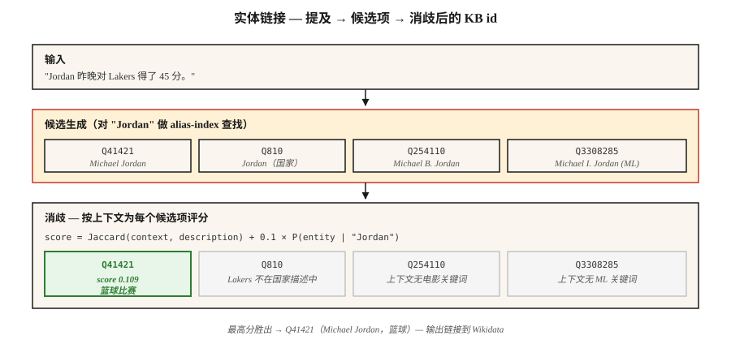

# 实体链接与消歧

> NER 找到了 "Paris"。Entity linking 要决定：Paris, France？Paris Hilton？Paris, Texas？Paris（Trojan prince）？如果没有 linking，你的 Knowledge Graph 仍然是 ambiguous 的。

**Type:** Build
**Languages:** Python
**Prerequisites:** Phase 5 · 06 (NER), Phase 5 · 24 (Coreference Resolution)
**Time:** ~60 分钟

## 问题

句子写着："Jordan beat the press." 你的 NER 把 "Jordan" 标成 PERSON。很好。但它是*哪个* Jordan？

- Michael Jordan（篮球）？
- Michael B. Jordan（演员）？
- Michael I. Jordan（Berkeley ML 教授 — 是的，这种混淆在 ML papers 里真的存在）？
- Jordan（国家）？
- Jordan（Hebrew first name）？

Entity linking (EL) 会把每个 mention 解析到 Knowledge base 中的唯一条目：Wikidata、Wikipedia、DBpedia，或你的 domain KB。两个子任务：

1. **Candidate generation。** 给定 "Jordan"，哪些 KB entries 是可能的？
2. **Disambiguation。** 给定上下文，哪个 candidate 才是正确的？

两个步骤都可以学习。两个步骤都有 benchmark。组合后的 pipeline 已经稳定了十年 — 变化的是 disambiguator 的质量。

## 概念



**Candidate generation。** 给定 mention surface form（"Jordan"），在 alias index 中查找 candidates。Wikipedia alias dictionaries 覆盖大多数 named entities："JFK" → John F. Kennedy、Jacqueline Kennedy、JFK airport、JFK（movie）。典型 index 会为每个 mention 返回 10-30 个 candidates。

**Disambiguation：三种方法。**

1. **Prior + context (Milne & Witten, 2008)。** `P(entity | mention) × context-similarity(entity, text)`。效果好、速度快、不需要训练。
2. **Embedding-based (ESS / REL / Blink)。** Encode mention + context。Encode 每个 candidate 的 description。选择 cosine 最大的。2020-2024 年的默认方法。
3. **Generative (GENRE, 2021; LLM-based, 2023+)。** 逐 Token decode entity 的 canonical name。受限于一个 valid entity names 的 trie，因此输出保证是有效 KB id。

**End-to-end vs pipeline。** 现代 models（ELQ、BLINK、ExtEnD、GENRE）在一次 pass 中运行 NER + candidate generation + disambiguation。Pipeline systems 在生产中仍占主导，因为你可以替换 components。

### 两个指标

- **Mention recall (candidate gen)。** gold mentions 中，正确 KB entry 出现在 candidate list 里的比例。这是整个 pipeline 的下限。
- **Disambiguation accuracy / F1。** 给定正确 candidates，top-1 有多常是正确的。

始终同时报告两者。一个在 80% candidate recall 上有 99% disambiguation 的系统，本质上是 80% pipeline。

## 构建它

### 步骤 1：从 Wikipedia redirects 构建 alias index

```python
alias_to_entities = {
    "jordan": ["Q41421 (Michael Jordan)", "Q810 (Jordan, country)", "Q254110 (Michael B. Jordan)"],
    "paris":  ["Q90 (Paris, France)", "Q663094 (Paris, Texas)", "Q55411 (Paris Hilton)"],
    "apple":  ["Q312 (Apple Inc.)", "Q89 (apple, fruit)"],
}
```

Wikipedia alias data：约 18M 个 (alias, entity) pairs。从 Wikidata dumps 下载。存为 inverted index。

### 步骤 2：基于 context 的 disambiguation

```python
def disambiguate(mention, context, alias_index, entity_desc):
    candidates = alias_index.get(mention.lower(), [])
    if not candidates:
        return None, 0.0
    context_words = set(tokenize(context))
    best, best_score = None, -1
    for entity_id in candidates:
        desc_words = set(tokenize(entity_desc[entity_id]))
        union = len(context_words | desc_words)
        score = len(context_words & desc_words) / union if union else 0.0
        if score > best_score:
            best, best_score = entity_id, score
    return best, best_score
```

Jaccard overlap 是一个 toy。用 embeddings 上的 cosine similarity 替换它（transformer 版本见 `code/main.py` step-2）。

### 步骤 3：embedding-based（BLINK-style）

```python
from sentence_transformers import SentenceTransformer
encoder = SentenceTransformer("sentence-transformers/all-MiniLM-L6-v2")

def embed_mention(text, mention_span):
    start, end = mention_span
    marked = f"{text[:start]} [MENTION] {text[start:end]} [/MENTION] {text[end:]}"
    return encoder.encode([marked], normalize_embeddings=True)[0]

def embed_entity(entity_id, description):
    return encoder.encode([f"{entity_id}: {description}"], normalize_embeddings=True)[0]
```

在 index time，对每个 KB entity embedding 一次。在 query time，对 mention + context embedding 一次，对 candidate pool 做 dot-product，选择最大值。

### 步骤 4：generative entity linking（概念）

GENRE 会逐字符 decode entity 的 Wikipedia title。Constrained decoding（见 lesson 20）确保只能输出 valid titles。它与 KB-backed trie 紧密集成。现代后继是 REL-GEN，以及带 structured output 的 LLM-prompted EL。

```python
prompt = f"""Text: {text}
Mention: {mention}
List the best Wikipedia title for this mention.
Respond with JSON: {{"title": "..."}}"""
```

结合 whitelist（Outlines `choice`），这是 2026 年最容易上线的 EL pipeline。

### 步骤 5：在 AIDA-CoNLL 上评估

AIDA-CoNLL 是标准 EL benchmark：1,393 篇 Reuters articles、34k mentions、Wikipedia entities。报告 in-KB accuracy（`P@1`）和 out-of-KB NIL-detection rate。

## 陷阱

- **NIL handling。** 有些 mentions 不在 KB 中（新兴 entities、冷门人物）。Systems 必须预测 NIL，而不是猜错 entity。单独衡量。
- **Mention boundary errors。** 上游 NER 漏掉 partial spans（"Bank of America" 只标成 "Bank"）。EL recall 会下降。
- **Popularity bias。** 训练出的 systems 会过度预测 frequent entities。ML paper 中的 "Michael I. Jordan" 往往会 link 到篮球 Jordan。
- **Cross-lingual EL。** 把中文文本中的 mentions 映射到 English Wikipedia entities。需要 multilingual encoder 或 translation step。
- **KB staleness。** 新公司、新事件、新人物不在去年的 Wikipedia dump 里。Production pipelines 需要 refresh loop。

## 使用它

2026 年的 stack：

| Situation | Pick |
|-----------|------|
| 通用 English + Wikipedia | BLINK or REL |
| Cross-lingual, KB = Wikipedia | mGENRE |
| LLM-friendly, 少量 mentions/day | Prompt Claude/GPT-4 with candidate list + constrained JSON |
| Domain-specific KB（medical, legal） | Custom BERT with KB-aware retrieval + fine-tune on domain AIDA-style set |
| 极低 latency | Exact-match prior only (Milne-Witten baseline) |
| Research SOTA | GENRE / ExtEnD / generative LLM-EL |

2026 年可上线的 production pattern：NER → coref → 对每个 mention 做 EL → 将 clusters 折叠成每个 cluster 一个 canonical entity。输出：document 中每个 entity 一个 KB id，而不是每个 mention 一个。

## 交付它
保存为 `outputs/skill-entity-linker.md`：

```markdown
---
name: entity-linker
description: Design an entity linking pipeline — KB, candidate generator, disambiguator, evaluation.
version: 1.0.0
phase: 5
lesson: 25
tags: [nlp, entity-linking, knowledge-graph]
---

Given a use case (domain KB, language, volume, latency budget), output:

1. Knowledge base. Wikidata / Wikipedia / custom KB. Version date. Refresh cadence.
2. Candidate generator. Alias-index, embedding, or hybrid. Target mention recall @ K.
3. Disambiguator. Prior + context, embedding-based, generative, or LLM-prompted.
4. NIL strategy. Threshold on top score, classifier, or explicit NIL candidate.
5. Evaluation. Mention recall @ 30, top-1 accuracy, NIL-detection F1 on held-out set.

Refuse any EL pipeline without a mention-recall baseline (you cannot evaluate a disambiguator without knowing candidate gen surfaced the right entity). Refuse any pipeline using LLM-prompted EL without constrained output to valid KB ids. Flag systems where popularity bias affects minority entities (e.g. name-clashes) without domain fine-tuning.
```

## 练习

1. **Easy。** 在 `code/main.py` 中，基于 10 个 ambiguous mentions（Paris、Jordan、Apple）实现 prior+context disambiguator。手动标注正确 entity。测量 accuracy。
2. **Medium。** 用 sentence transformer encode 50 个 ambiguous mentions。Embed 每个 candidate 的 description。比较 embedding-based disambiguation 和 Jaccard context overlap。
3. **Hard。** 构建一个 1k-entity domain KB（例如你公司里的 employees + products）。实现端到端 NER + EL。在 100 条 held-out sentences 上测量 precision 和 recall。

## 关键术语
| Term | What people say | What it actually means |
|------|-----------------|-----------------------|
| Entity linking (EL) | Link 到 Wikipedia | 将 mention 映射到唯一 KB entry。 |
| Candidate generation | 它可能是谁？ | 为 mention 返回一个 plausible KB entries 的 shortlist。 |
| Disambiguation | 选对的那个 | 使用 context 为 candidates 打分，选择 winner。 |
| Alias index | Lookup table | 从 surface form → candidate entities 的映射。 |
| NIL | 不在 KB 中 | 明确预测没有匹配的 KB entry。 |
| KB | Knowledge base | Wikidata、Wikipedia、DBpedia，或你的 domain KB。 |
| AIDA-CoNLL | Benchmark | 带 gold entity links 的 1,393 篇 Reuters articles。 |

## 延伸阅读
- [Milne, Witten (2008). Learning to Link with Wikipedia](https://www.cs.waikato.ac.nz/~ihw/papers/08-DM-IHW-LearningToLinkWithWikipedia.pdf) — foundational prior+context 方法。
- [Wu et al. (2020). Zero-shot Entity Linking with Dense Entity Retrieval (BLINK)](https://arxiv.org/abs/1911.03814) — 基于 Embedding 的主力方法。
- [De Cao et al. (2021). Autoregressive Entity Retrieval (GENRE)](https://arxiv.org/abs/2010.00904) — 带 constrained decoding 的 generative EL。
- [Hoffart et al. (2011). Robust Disambiguation of Named Entities in Text (AIDA)](https://www.aclweb.org/anthology/D11-1072.pdf) — benchmark 论文。
- [REL: An Entity Linker Standing on the Shoulders of Giants (2020)](https://arxiv.org/abs/2006.01969) — 开源 production stack。
