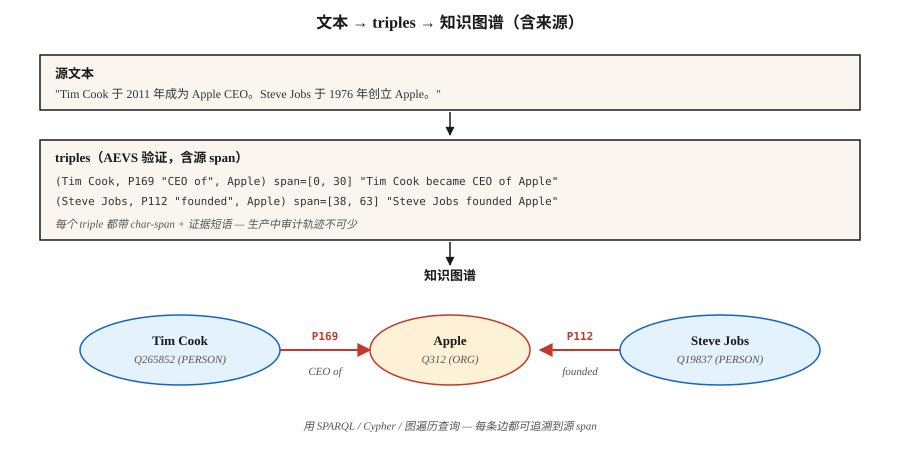

# Relation Extraction 与 Knowledge Graph 构建

> NER 找到了实体。Entity linking 锚定了它们。Relation extraction 找到它们之间的边。Knowledge Graph 是节点、边和其 provenance 的总和。

**Type:** Build
**Languages:** Python
**Prerequisites:** Phase 5 · 06 (NER), Phase 5 · 25 (Entity Linking)
**Time:** ~60 分钟

## 问题

分析师读到："Tim Cook became CEO of Apple in 2011." 四个事实：

- `(Tim Cook, role, CEO)`
- `(Tim Cook, employer, Apple)`
- `(Tim Cook, start_date, 2011)`
- `(Apple, type, Organization)`

Relation Extraction (RE) 将自由文本转成结构化 triples `(subject, relation, object)`。跨语料聚合后，你就有了 Knowledge Graph。再聚合并查询，你就有了可用于 RAG、分析或合规审计的推理基底。

2026 年的问题：LLMs 会非常积极地抽取 relations。过于积极。它们会 hallucinate 源文本并不支持的 triples。没有 provenance，你无法分辨真实 triples 和貌似合理的虚构内容。2026 年的答案是 AEVS 风格的 anchor-and-verify pipelines。

## 概念



**Triple 形式。** `(subject_entity, relation_type, object_entity)`。Relations 来自封闭 ontology（Wikidata properties、FIBO、UMLS）或开放集合（OpenIE 风格，任何内容都可以）。

**三种抽取方法。**

1. **Rule / pattern-based。** Hearst patterns："X such as Y" → `(Y, isA, X)`。再加手写 regex。脆弱、精确、可解释。
2. **Supervised classifier。** 给定一个句子中的两个 entity mentions，从固定集合中预测 relation。训练于 TACRED、ACE、KBP。2015-2022 年的标准方法。
3. **Generative LLM。** Prompt model 输出 triples。开箱即用。需要 provenance，否则会 hallucinate 看似合理的垃圾内容。

**AEVS (Anchor-Extraction-Verification-Supplement, 2026)。** 当前的 hallucination 缓解框架：

- **Anchor。** 用精确位置识别每个 entity span 和 relation-phrase span。
- **Extract。** 生成链接到 anchor spans 的 triples。
- **Verify。** 将每个 triple 元素匹配回源文本；拒绝任何不受支持的内容。
- **Supplement。** coverage pass 确保没有 anchored span 被遗漏。

Hallucinations 会大幅下降。需要更多计算，但可审计。

**open-vs-closed 取舍。**

- **Closed ontology。** 固定 property list（例如 Wikidata 的 11,000+ properties）。可预测。可查询。难以凭空编造。
- **Open IE。** 任何动词短语都可以成为 relation。高 recall。低 precision。查询起来混乱。

生产级 KGs 通常混合使用：用 Open IE 做发现，然后在合并进主 graph 之前将 relations canonicalize 到 closed ontology。

```figure
relation-triples
```

## 构建

### 步骤 1: 基于 pattern 的抽取

```python
PATTERNS = [
    (r"(?P<s>[A-Z]\w+) (?:is|was) (?:a|an|the) (?P<o>[A-Z]?\w+)", "isA"),
    (r"(?P<s>[A-Z]\w+) (?:is|was) born in (?P<o>\w+)", "bornIn"),
    (r"(?P<s>[A-Z]\w+) works? (?:at|for) (?P<o>[A-Z]\w+)", "worksAt"),
    (r"(?P<s>[A-Z]\w+) founded (?P<o>[A-Z]\w+)", "founded"),
]
```

查看 `code/main.py` 中完整的 toy extractor。Hearst patterns 仍然会出现在 domain-specific pipelines 中，因为它们可调试。

### 步骤 2: 有监督关系 Classification

```python
from transformers import AutoTokenizer, AutoModelForSequenceClassification

tok = AutoTokenizer.from_pretrained("Babelscape/rebel-large")
model = AutoModelForSequenceClassification.from_pretrained("Babelscape/rebel-large")

text = "Tim Cook was born in Alabama. He later became CEO of Apple."
encoded = tok(text, return_tensors="pt", truncation=True)
output = model.generate(**encoded, max_length=200)
triples = tok.batch_decode(output, skip_special_tokens=False)
```

REBEL 是一个 seq2seq relation extractor：输入 text，输出 triples，并且已经使用 Wikidata property ids。它在 distant-supervision data 上 fine-tuned。标准 open-weights baseline。

### 步骤 3： 带 anchoring 的 LLM-prompted extraction

```python
prompt = f"""Extract (subject, relation, object) triples from the text.
For each triple, include the exact character span in the source text.

Text: {text}

Output JSON:
[{{"subject": {{"text": "...", "span": [start, end]}},
   "relation": "...",
   "object": {{"text": "...", "span": [start, end]}}}}, ...]

Only include triples fully supported by the text. No inference beyond what is stated.
"""
```

将每个返回的 span 与 source 核对。拒绝任何 `text[start:end] != triple_entity` 的结果。这是最小形式的 AEVS "verify" step。

### 步骤 4： canonicalize 到 closed ontology

```python
RELATION_MAP = {
    "is the CEO of": "P169",       # "chief executive officer"
    "was born in":   "P19",         # "place of birth"
    "founded":        "P112",       # "founded by" (inverted subject/object)
    "works at":       "P108",       # "employer"
}


def canonicalize(relation):
    rel_low = relation.lower().strip()
    if rel_low in RELATION_MAP:
        return RELATION_MAP[rel_low]
    return None   # drop unmapped open relations or route to manual review
```

Canonicalization 往往占工程工作的 60-80%。要为它预留预算。

### 步骤 5： 构建一个小 graph 并查询

```python
triples = extract(text)
graph = {}
for s, r, o in triples:
    graph.setdefault(s, []).append((r, o))


def neighbors(node, relation=None):
    return [(r, o) for r, o in graph.get(node, []) if relation is None or r == relation]


print(neighbors("Tim Cook", relation="P108"))    # -> [(P108, Apple)]
```

这是每个 RAG-over-KG system 的原子单元。用 RDF triple stores（Blazegraph、Virtuoso）、property graphs（Neo4j）或 vector-augmented graph stores 扩展它。

## 常见陷阱

- **RE 前先做 coreference。** "He founded Apple" — RE 需要知道 "he" 是谁。先运行 coref（lesson 24）。
- **Entity canonicalization。** "Apple Inc" 和 "Apple" 必须解析到同一个 node。先做 entity linking（lesson 25）。
- **Hallucinated triples。** LLMs 会输出文本不支持的 triples。强制 span verification。
- **Relation canonicalization drift。** Open IE relations 不一致（"was born in," "came from," "is a native of"）。折叠到 canonical ids，否则 graph 无法查询。
- **Temporal errors。** "Tim Cook is CEO of Apple" — 现在为真，2005 年为假。许多 relations 有时间边界。使用 qualifiers（Wikidata 中的 `P580` start time、`P582` end time）。
- **Domain mismatch。** REBEL 在 Wikipedia 上训练。法律、医学和科学文本通常需要 domain-fine-tuned RE models。

## 使用

2026 年的 stack：

| Situation | Pick |
|-----------|------|
| 快速生产、通用 domain | REBEL 或 LlamaPred，并进行 Wikidata canonicalization |
| Domain-specific（biomed、legal） | SciREX-style domain fine-tune + custom ontology |
| LLM-prompted、已审计输出 | AEVS pipeline：anchor → extract → verify → supplement |
| 高容量 news IE | Pattern-based + supervised hybrid |
| 从零构建 KG | Open IE + manual canonicalization pass |
| Temporal KG | 使用 qualifiers 抽取（start/end time、point in time） |

集成模式：NER → coref → entity linking → relation extraction → ontology mapping → graph load。每一阶段都是潜在的质量门。

## 交付

保存为 `outputs/skill-re-designer.md`：

```markdown
---
name: re-designer
description: Design a relation extraction pipeline with provenance and canonicalization.
version: 1.0.0
phase: 5
lesson: 26
tags: [nlp, relation-extraction, knowledge-graph]
---

Given a corpus (domain, language, volume) and downstream use (KG-RAG, analytics, compliance), output:

1. Extractor. Pattern-based / supervised / LLM / AEVS hybrid. Reason tied to precision vs recall target.
2. Ontology. Closed property list (Wikidata / domain) or open IE with canonicalization pass.
3. Provenance. Every triple carries source char-span + doc id. Non-negotiable for audit.
4. Merge strategy. Canonical entity id + relation id + temporal qualifiers; dedup policy.
5. Evaluation. Precision / recall on 200 hand-labelled triples + hallucination-rate on LLM-extracted sample.

Refuse any LLM-based RE pipeline without span verification (source provenance). Refuse open-IE output flowing into a production graph without canonicalization. Flag pipelines with no temporal qualifier on time-bounded relations (employer, spouse, position).
```

## 练习

1. **Easy。** 在 5 条 news-article sentences 上运行 `code/main.py` 中的 pattern extractor。手工检查 precision。
2. **Medium。** 在相同句子上使用 REBEL（或小型 LLM）。比较 triples。哪个 extractor 有更高 precision？更高 recall？
3. **Hard。** 构建 AEVS pipeline：用 LLM extract + 对照 source verify spans。在 50 条 Wikipedia-style sentences 上测量 verify step 前后的 hallucination rate。

## 关键术语

| Term | 人们的说法 | 实际含义 |
|------|------------|----------|
| Triple | Subject-relation-object | `(s, r, o)` tuple，是 KG 的原子单元。 |
| Open IE | Extract anything | 开放词汇 relation phrases；高 recall，低 precision。 |
| Closed ontology | Fixed schema | 有边界的 relation types 集合（Wikidata、UMLS、FIBO）。 |
| Canonicalization | Normalize everything | 将表层名称 / relations 映射到 canonical ids。 |
| AEVS | Grounded extraction | Anchor-Extraction-Verification-Supplement pipeline (2026)。 |
| Provenance | Source-of-truth link | 每个 triple 都携带指向其 source 的 doc id + char-span。 |
| Distant supervision | Cheap labels | 将 text 与现有 KG 对齐，以创建 training data。 |

## 延伸阅读

- [Mintz et al. (2009). Distant supervision for relation extraction without labeled data](https://www.aclweb.org/anthology/P09-1113.pdf) — distant-supervision 论文。
- [Huguet Cabot, Navigli (2021). REBEL: Relation Extraction By End-to-end Language generation](https://aclanthology.org/2021.findings-emnlp.204.pdf) — seq2seq RE 主力方案。
- [Wadden et al. (2019). Entity, Relation, and Event Extraction with Contextualized Span Representations (DyGIE++)](https://arxiv.org/abs/1909.03546) — 联合 IE。
- [AEVS — Anchor-Extraction-Verification-Supplement framework](https://www.mdpi.com/2073-431X/15/3/178) — 2026 hallucination-mitigation 设计。
- [Wikidata SPARQL tutorial](https://www.wikidata.org/wiki/Wikidata:SPARQL_tutorial) — canonical graph queries。
