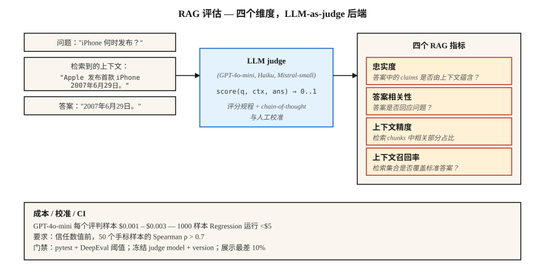

# LLM Evaluation — RAGAS, DeepEval, G-Eval

> Exact-match 和 F1 会漏掉语义等价。人工评审无法规模化。LLM-as-judge 是生产环境的答案 — 前提是有足够的校准，让你能信任这个数字。

**类型：** 构建
**语言：** Python
**前置要求：** Phase 5 · 13 (Question Answering), Phase 5 · 14 (Information Retrieval)
**时间：** ~75 分钟

## 问题

你的 RAG 系统回答："June 29th, 2007."
gold reference 是："June 29, 2007."
Exact Match 得分 0。F1 得分约 75%。人工会给 100%。

现在乘以 10,000 个测试用例。再乘以 retriever、chunking、prompt 或 model 的每一次变更。你需要一个 evaluator：它理解含义，能低成本规模化运行，不会在 regression 上撒谎，并能暴露正确的 failure modes。

2026 年有三个 framework 主导这个问题。

- **RAGAS.** Retrieval-Augmented Generation ASsessment。四个 RAG metrics（faithfulness、answer-relevance、context-precision、context-recall），带有 NLI + LLM-judge backend。研究支撑，轻量。
- **DeepEval.** 面向 LLMs 的 Pytest。G-Eval、task-completion、hallucination、bias metrics。CI/CD-native。
- **G-Eval.** 一种方法（也是 DeepEval metric）：带 chain-of-thought、自定义 criteria、0-1 score 的 LLM-as-judge。

三者都依赖 LLM-as-judge。本课会建立你对该方法以及围绕它的 trust layer 的直觉。

## 概念



**LLM-as-judge.** 用一个 LLM 根据 rubric 给输出打分，替代静态 metric。给定 `(query, context, answer)`，prompt 一个 judge LLM："Score 0-1 on faithfulness." 返回 score。

为什么它有效：LLMs 能以极低成本近似人工判断。GPT-4o-mini 以每个 scored case 约 ~$0.003 的成本，让 1000-sample regression eval run 成本低于 $5。

为什么它会静默失败：

1. **Judge bias.** Judges 偏好更长的答案、来自自己 model family 的答案、以及匹配 prompt style 的答案。
2. **JSON parsing failures.** 错误 JSON → NaN score → 被静默排除在 aggregate 之外。RAGAS 用户很熟悉这种痛点。用 try/except + 显式 failure mode 做 gate。
3. **Drift over model versions.** 升级 judge 会改变每个 metric。冻结 judge model + version。

**RAG 四件套。**

| Metric | 问题 | Backend |
|--------|----------|---------|
| Faithfulness | 答案中的每个 claim 是否来自 retrieved context？ | 基于 NLI 的 entailment |
| Answer relevance | 答案是否回应了问题？ | 从答案生成 hypothetical questions；与真实问题比较 |
| Context precision | 在 retrieved chunks 中，有多少比例相关？ | LLM-judge |
| Context recall | retrieval 是否返回了所需的一切？ | LLM-judge 对照 gold answer |

**G-Eval.** 定义一个自定义 criterion："Did the answer cite the correct source?" framework 会自动扩展为 chain-of-thought evaluation steps，然后给出 0-1 score。适合 RAGAS 未覆盖的 domain-specific quality dimensions。

**Calibration.** 在没有与 human labels 的相关性验证前，永远不要信任原始 judge score。运行 100 个手工标注示例。绘制 judge vs human。计算 Spearman rho。如果 rho < 0.7，你的 judge rubric 需要改进。

```figure
n5-judge-gauge
```

## 构建它

### 步骤 1： 使用 NLI 做 faithfulness（RAGAS-style）

```python
from typing import Callable
from transformers import pipeline

nli = pipeline("text-classification",
               model="MoritzLaurer/DeBERTa-v3-large-mnli-fever-anli-ling-wanli",
               top_k=None)

# `llm` 是任意 callable：prompt str -> generated str。
# 示例：llm = lambda p: client.messages.create(model="claude-haiku-4-5", ...).content[0].text
LLM = Callable[[str], str]


def atomic_claims(answer: str, llm: LLM) -> list[str]:
    prompt = f"""把这个答案拆成简单的事实 claims（每行一个）：
{answer}
"""
    return llm(prompt).splitlines()


def faithfulness(answer: str, context: str, llm: LLM) -> float:
    claims = atomic_claims(answer, llm)
    if not claims:
        return 0.0
    supported = 0
    for claim in claims:
        result = nli({"text": context, "text_pair": claim})[0]
        entail = next((s for s in result if s["label"] == "entailment"), None)
        if entail and entail["score"] > 0.5:
            supported += 1
    return supported / len(claims)
```

将答案拆解为 atomic claims。用 NLI 检查每个 claim 是否被 retrieved context 支持。Faithfulness = 被支持的比例。

### 步骤 2： answer relevance

```python
import numpy as np
from sentence_transformers import SentenceTransformer

# encoder：任意实现 .encode(texts, normalize_embeddings=True) -> ndarray 的 model
# 例如：encoder = SentenceTransformer("BAAI/bge-small-en-v1.5")

def answer_relevance(question: str, answer: str, encoder, llm: LLM, n: int = 3) -> float:
    prompt = f"写出 {n} 个这个答案可以回答的问题：\n{answer}"
    generated = [line for line in llm(prompt).splitlines() if line.strip()][:n]
    if not generated:
        return 0.0
    q_emb = np.asarray(encoder.encode([question], normalize_embeddings=True)[0])
    g_embs = np.asarray(encoder.encode(generated, normalize_embeddings=True))
    sims = [float(q_emb @ g_emb) for g_emb in g_embs]
    return sum(sims) / len(sims)
```

如果答案暗示的问题与实际提问不同，relevance 就会下降。

### 步骤 3: G-Eval 自定义 metric

```python
from deepeval.metrics import GEval
from deepeval.test_case import LLMTestCaseParams, LLMTestCase

metric = GEval(
    name="Correctness",
    criteria="答案应当事实准确，并匹配 expected output。",
    evaluation_steps=[
        "阅读 expected output。",
        "阅读 actual output。",
        "列出 actual output 中的事实 claims。",
        "对每个 claim，标记它是否被 expected output 支持。",
        "返回 score = 被支持的比例。",
    ],
    evaluation_params=[LLMTestCaseParams.INPUT, LLMTestCaseParams.ACTUAL_OUTPUT, LLMTestCaseParams.EXPECTED_OUTPUT],
)

test = LLMTestCase(input="When was the first iPhone released?",
                   actual_output="June 29th, 2007.",
                   expected_output="June 29, 2007.")
metric.measure(test)
print(metric.score, metric.reason)
```

evaluation steps 就是 rubric。显式步骤比隐式的 "score 0-1" prompts 更稳定。

### 步骤 4： CI gate

```python
import deepeval
from deepeval.metrics import FaithfulnessMetric, ContextualRelevancyMetric


def test_rag_system():
    cases = load_regression_cases()
    faith = FaithfulnessMetric(threshold=0.85)
    rel = ContextualRelevancyMetric(threshold=0.7)
    for case in cases:
        faith.measure(case)
        assert faith.score >= 0.85, f"faithfulness regression on {case.id}"
        rel.measure(case)
        assert rel.score >= 0.7, f"relevancy regression on {case.id}"
```

作为 pytest file 发布。每个 PR 都运行。出现 regressions 时阻止 merge。

### 步骤 5： 从零开始的 toy eval

见 `code/main.py`。仅使用 stdlib 的 faithfulness（answer claims 与 context 的 overlap）和 relevance（answer tokens 与 question tokens 的 overlap）近似实现。不是生产方案。展示形状。

## 陷阱

- **No calibration.** 与 human labels 相关性只有 0.3 的 judge 就是噪声。上线前要求 calibration run。
- **Self-evaluation.** 使用同一个 LLM 生成和判断，会把 scores 抬高 10-20%。judge 使用不同 model family。
- **Positional bias in pairwise judging.** Judges 偏好第一个展示的选项。始终随机化顺序并两种顺序都跑。
- **Raw aggregate hides failures.** Mean score 0.85 往往会隐藏 5% 的 catastrophic failures。始终检查 bottom quantile。
- **Golden dataset rot.** 未版本化的 eval sets 如果随时间 drift，会破坏纵向比较。每次变更都给 dataset 打 tag。
- **LLM cost.** 在规模化场景下，judge calls 主导成本。使用能满足 calibration threshold 的最便宜 model。GPT-4o-mini、Claude Haiku、Mistral-small。

## 使用它

2026 stack：

| Use case | Framework |
|---------|-----------|
| RAG quality monitoring | RAGAS（4 metrics） |
| CI/CD regression gates | DeepEval + pytest |
| Custom domain criteria | DeepEval 内的 G-Eval |
| Online live-traffic monitoring | reference-free mode 的 RAGAS |
| Human-in-the-loop spot checks | LangSmith 或 Phoenix，带 annotation UI |
| Red-teaming / safety eval | Promptfoo + DeepEval |

典型 stack：RAGAS 做 monitoring，DeepEval 做 CI，G-Eval 做新维度。三者都跑；它们的分歧很有用。

## 发布它

保存为 `outputs/skill-eval-architect.md`：

```markdown
---
name: eval-architect
description: 设计一个带 calibrated judge 和 CI gates 的 LLM evaluation plan。
version: 1.0.0
phase: 5
lesson: 27
tags: [nlp, evaluation, rag]
---

给定一个 use case（RAG / agent / generative task），输出：

1. Metrics。Faithfulness / relevance / context-precision / context-recall + 任何带 criteria 的自定义 G-Eval metrics。
2. Judge model。命名 model + version，并说明 cost vs accuracy 的理由。
3. Calibration。手工标注集大小，目标 Spearman rho vs human > 0.7。
4. Dataset versioning。Tag 策略、change log、stratification。
5. CI gate。每个 metric 的 thresholds、regression-window logic、bottom-quantile alert。

拒绝依赖未在 ≥50 个人工标注示例上测试过的 judge。拒绝 self-evaluation（同一 model 生成 + 判断）。拒绝没有 bottom-10% surfacing 的 aggregate-only reporting。标记任何 judge upgrade 未经过 parallel baseline eval 就落地的 pipeline。
```

## 练习

1. **Easy.** 在 10 个带已知 hallucinations 的 RAG examples 上使用 RAGAS。验证 faithfulness metric 能抓到每一个。
2. **Medium.** 手工将 50 个 QA answers 按 correctness 标注为 0-1。用 G-Eval 打分。测量 judge 与 human 之间的 Spearman rho。
3. **Hard.** 用 DeepEval 构建 pytest CI gate。故意让 retriever regress。验证 gate 会失败。通过对最低 10% 做 threshold check 添加 bottom-quantile alerting。

## 关键术语

| Term | 人们通常说 | 实际含义 |
|------|-----------------|-----------------------|
| LLM-as-judge | 用 LLM 打分 | Prompt 一个 judge model，根据 rubric 给 outputs 打 0-1 分。 |
| RAGAS | RAG metric library | 开源 eval framework，包含 4 个 reference-free RAG metrics。 |
| Faithfulness | 答案是否有依据？ | answer claims 中被 retrieved context entail 的比例。 |
| Context precision | retrieved chunks 是否相关？ | top-K chunks 中真正有用的比例。 |
| Context recall | retrieval 是否找全了？ | gold-answer claims 中被 retrieved chunks 支持的比例。 |
| G-Eval | 自定义 LLM judge | Rubric + chain-of-thought eval steps + 0-1 score。 |
| Calibration | 信任但要验证 | judge score 与 human score 之间的 Spearman correlation。 |

## 延伸阅读

- [Es et al. (2023). RAGAS: Automated Evaluation of Retrieval Augmented Generation](https://arxiv.org/abs/2309.15217) — RAGAS 论文。
- [Liu et al. (2023). G-Eval: NLG Evaluation using GPT-4 with Better Human Alignment](https://arxiv.org/abs/2303.16634) — G-Eval 论文。
- [DeepEval docs](https://deepeval.com/docs/metrics-introduction) — 开放生产 stack。
- [Zheng et al. (2023). Judging LLM-as-a-Judge with MT-Bench and Chatbot Arena](https://arxiv.org/abs/2306.05685) — biases、calibration、limits。
- [MLflow GenAI Scorer](https://mlflow.org/blog/third-party-scorers) — 集成 RAGAS、DeepEval、Phoenix 的统一 framework。
