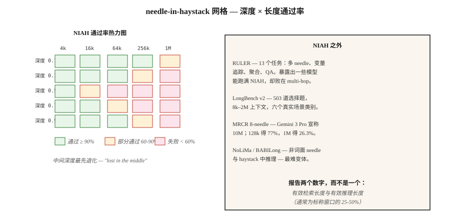

# Long-Context Evaluation — NIAH, RULER, LongBench, MRCR

> Gemini 3 Pro 宣称拥有 10M tokens 的 context。在 1M tokens 下，8-needle MRCR 降到 26.3%。宣称 ≠ 可用。Long-context evaluation 会告诉你正在上线的 model 的实际容量。

**类型：** 学习
**语言：** Python
**先修要求：** Phase 5 · 13（Question Answering）、Phase 5 · 23（Chunking Strategies）
**时间：** 约 60 分钟

## 问题

你有一份 200 页的合同。model 声称有 1M-token context。你把合同贴进去并提问：“终止条款是什么？”model 回答了，但它是根据封面页回答的，因为终止条款位于 120k tokens 深处，超过了 model 实际会关注的位置。

这就是 2026 年的 context-capacity gap。规格表写着 1M 或 10M。现实情况是其中 60-70% 可用，而且“可用”取决于任务。

- **Retrieval（haystack 中的 single needle）：** 在 frontier models 上，直到宣称的最大值都接近完美。
- **Multi-hop / aggregation：** 大多数 models 在超过约 128k 后会急剧下降。
- **对分散 facts 的 reasoning：** 最先失败的任务。

Long-context evaluation 衡量这些维度。本课会说明这些 benchmarks、它们实际衡量什么，以及如何为你的领域构建自定义 needle test。

## 概念



**Needle-in-a-Haystack（NIAH，2023）。** 将一个 fact（“the magic word is pineapple”）放在长 context 中可控深度的位置。让 model 找回它。扫描 depth × length。它是最初的 long-context benchmark。frontier models 现在已经在这个任务上饱和；它是必要但不充分的 baseline。

**RULER（Nvidia，2024）。** 覆盖 4 个类别的 13 种任务类型：retrieval（single / multi-key / multi-value）、multi-hop tracing（variable tracking）、aggregation（common word frequency）、QA。context length 可配置（4k 到 128k+）。它会揭示那些在 NIAH 上饱和但在 multi-hop 上失败的 models。在 2024 年发布版本中，17 个声称 32k+ context 的 models 中，只有一半能在 32k 保持质量。

**LongBench v2（2024）。** 503 道 multiple-choice questions，8k-2M word contexts，六个任务类别：single-doc QA、multi-doc QA、long in-context learning、long dialogue、code repo、long structured data。它是用于真实世界 long-context 行为的生产级 benchmark。

**MRCR（Multi-Round Coreference Resolution）。** 大规模 multi-turn coreference。包含 8-needle、24-needle、100-needle 变体。暴露 model 在 Attention 退化前能同时处理多少 facts。

**NoLiMa。** “Non-lexical needle”。needle 与 query 没有字面重叠；retrieval 需要一步语义 reasoning。比 NIAH 更难。

**HELMET。** 拼接许多 documents，并从任意一个中提问。测试 selective attention。

**BABILong。** 将 bAbI reasoning chains Embedding无关 haystacks。测试 reasoning-in-a-haystack，而不只是 retrieval。

### 实际应该报告什么

- **Advertised context window。** 规格表上的数字。
- **Effective retrieval length。** NIAH 在某个阈值下通过（例如 90%）。
- **Effective reasoning length。** Multi-hop 或 aggregation 在该阈值下通过。
- **Degradation curve。** Accuracy vs context length，按任务类型分别绘制。

你的规格表需要两个数字：retrieval-effective 和 reasoning-effective。通常 reasoning-effective 是宣称 window 的 25-50%。

## 构建它

### Step 1：为你的领域构建自定义 NIAH

见 `code/main.py`。骨架如下：

```python
def build_haystack(filler_text, needle, depth_ratio, total_tokens):
    if not (0.0 <= depth_ratio <= 1.0):
        raise ValueError(f"depth_ratio must be in [0, 1], got {depth_ratio}")
    if total_tokens <= 0:
        raise ValueError(f"total_tokens must be positive, got {total_tokens}")

    filler_tokens = tokenize(filler_text)
    needle_tokens = tokenize(needle)
    if not filler_tokens:
        raise ValueError("filler_text produced no tokens")

    # Repeat filler until long enough to fill the haystack body.
    body_len = max(total_tokens - len(needle_tokens), 0)
    while len(filler_tokens) < body_len:
        filler_tokens = filler_tokens + filler_tokens
    filler_tokens = filler_tokens[:body_len]

    insert_at = min(int(body_len * depth_ratio), body_len)
    haystack = filler_tokens[:insert_at] + needle_tokens + filler_tokens[insert_at:]
    return " ".join(haystack)


def score_niah(model, haystack, question, expected):
    answer = model.complete(f"Context: {haystack}\nQ: {question}\nA:", max_tokens=50)
    return 1 if expected.lower() in answer.lower() else 0
```

扫描 `depth_ratio` ∈ {0, 0.25, 0.5, 0.75, 1.0} × `total_tokens` ∈ {1k, 4k, 16k, 64k}。绘制 heatmap。这就是目标 model 的 NIAH card。

### Step 2：multi-needle 变体

```python
def build_multi_needle(filler, needles, total_tokens):
    depths = [0.1, 0.4, 0.7]
    chunks = [filler[:int(total_tokens * 0.1)]]
    for depth, needle in zip(depths, needles):
        chunks.append(needle)
        next_chunk = filler[int(total_tokens * depth): int(total_tokens * (depth + 0.3))]
        chunks.append(next_chunk)
    return " ".join(chunks)
```

像“这三个 magic words 是什么？”这样的问题需要找回全部三个。Single-needle 成功并不能预测 multi-needle 成功。

### Step 3：multi-hop variable tracing（RULER-style）

```python
haystack = """X1 = 42. ... (filler) ... X2 = X1 + 10. ... (filler) ... X3 = X2 * 2."""
question = "What is X3?"
```

答案需要串联三次赋值。frontier models 在 128k 时，这里的 accuracy 经常会降到 50-70%。

### Step 4：在你的 stack 上运行 LongBench v2

```python
from datasets import load_dataset
longbench = load_dataset("THUDM/LongBench-v2")

def eval_model_on_longbench(model, subset="single-doc-qa"):
    tasks = [x for x in longbench["test"] if x["task"] == subset]
    correct = 0
    for x in tasks:
        answer = model.complete(x["context"] + "\n\nQ: " + x["question"], max_tokens=20)
        if normalize(answer) == normalize(x["answer"]):
            correct += 1
    return correct / len(tasks)
```

按类别报告 accuracy。Aggregate scores 会隐藏很大的任务级差异。

## 陷阱

- **仅 NIAH evaluation。** 在 1M tokens 下通过 NIAH，并不能说明 multi-hop 表现。始终运行 RULER 或自定义 multi-hop test。
- **Uniform depth sampling。** 很多实现只测试 depth=0.5。测试 depth=0、0.25、0.5、0.75、1.0，“lost in the middle”效应是真实存在的。
- **与 filler 的 lexical overlap。** 如果 needle 与 filler 共享 keywords，retrieval 会变得很简单。使用 NoLiMa 风格的非重叠 needles。
- **忽略 latency。** 1M-token prompts 的 prefill 需要 30-120 秒。在 accuracy 之外同时测量 time-to-first-token。
- **Vendor-self-reported numbers。** OpenAI、Google、Anthropic 都会发布自己的分数。始终在你的 use case 上独立重跑。

## 使用它

2026 年的 stack：

| 场景 | Benchmark |
|-----------|-----------|
| 快速 sanity check | 3 个 depths × 3 个 lengths 的自定义 NIAH |
| 生产级 model selection | 目标 length 下的 RULER（13 tasks） |
| 真实世界 QA quality | LongBench v2 single-doc-QA subset |
| Multi-hop reasoning | BABILong 或自定义 variable-tracing |
| Conversational / dialogue | 目标 length 下的 MRCR 8-needle |
| Model upgrade regression | 固定的内部 NIAH + RULER harness，在每个新 model 上运行 |

生产环境经验法则：在目标长度上完成 NIAH + 1 个 reasoning task 之前，永远不要信任 context window。

## 交付它

保存为 `outputs/skill-long-context-eval.md`：

```markdown
---
name: long-context-eval
description: Design a long-context evaluation battery for a given model and use case.
version: 1.0.0
phase: 5
lesson: 28
tags: [nlp, long-context, evaluation]
---

Given a target model, target context length, and use case, output:

1. Tests. NIAH depth × length grid; RULER multi-hop; custom domain task.
2. Sampling. Depths 0, 0.25, 0.5, 0.75, 1.0 at each length.
3. Metrics. Retrieval pass rate; reasoning pass rate; time-to-first-token; cost-per-query.
4. Cutoff. Effective retrieval length (90% pass) and effective reasoning length (70% pass). Report both.
5. Regression. Fixed harness, rerun on every model upgrade, surface deltas.

Refuse to trust a context window from the model card alone. Refuse NIAH-only evaluation for any multi-hop workload. Refuse vendor self-reported long-context scores as independent evidence.
```

## 练习

1. **Easy。** 构建一个 3 个 depths（0.25、0.5、0.75）× 3 个 lengths（1k、4k、16k）的 NIAH。在任意 model 上运行。将 pass rate 绘制成 3×3 heatmap。
2. **Medium。** 添加一个 3-needle 变体。测量每个 length 下是否能找回全部 3 个。与相同 length 的 single-needle pass rate 对比。
3. **Hard。** 构造一个 variable-tracing task（X1 → X2 → X3，3 hops），Embedding 64k filler 中。测量 3 个 frontier models 的 accuracy。报告每个 model 的 effective reasoning length。

## 关键术语

| 术语 | 人们的说法 | 实际含义 |
|------|-----------------|-----------------------|
| NIAH | Needle in haystack | 在 filler 中植入一个 fact，让 model 找回它。 |
| RULER | 加强版 NIAH | 覆盖 retrieval / multi-hop / aggregation / QA 的 13 种任务类型。 |
| Effective context | 真实容量 | accuracy 仍高于阈值的长度。 |
| Lost in the middle | Depth bias | Models 对长输入中间部分的内容关注不足。 |
| Multi-needle | 一次多个 facts | 多个植入项；测试 Attention 的同时处理能力，而不只是 retrieval。 |
| MRCR | Multi-round coref | 8、24 或 100-needle coreference；暴露 Attention 饱和。 |
| NoLiMa | Non-lexical needle | Needle 和 query 没有字面 tokens 重叠；需要 reasoning。 |

## 延伸阅读

- [Kamradt (2023). Needle in a Haystack analysis](https://github.com/gkamradt/LLMTest_NeedleInAHaystack) — 原始 NIAH repo。
- [Hsieh et al. (2024). RULER: What's the Real Context Size of Your Long-Context LMs?](https://arxiv.org/abs/2404.06654) — multi-task benchmark。
- [Bai et al. (2024). LongBench v2](https://arxiv.org/abs/2412.15204) — 真实世界 long-context eval。
- [Modarressi et al. (2024). NoLiMa: Non-lexical needles](https://arxiv.org/abs/2404.06666) — 更难的 needles。
- [Kuratov et al. (2024). BABILong](https://arxiv.org/abs/2406.10149) — reasoning-in-haystack。
- [Liu et al. (2024). Lost in the Middle: How Language Models Use Long Contexts](https://arxiv.org/abs/2307.03172) — depth-bias 论文。
