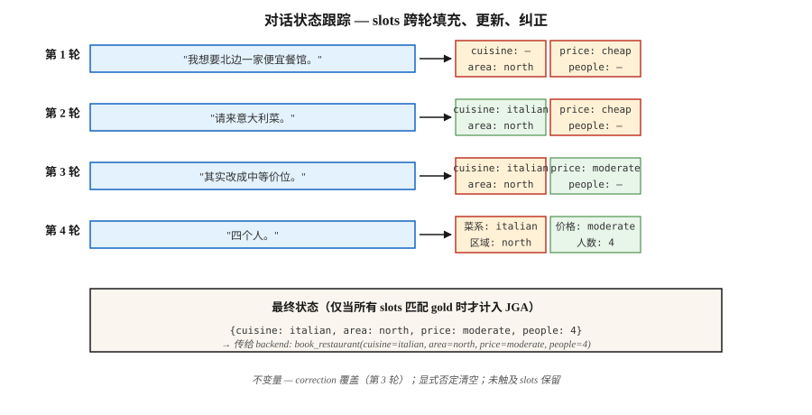

# Dialogue State Tracking

> “我想要一家北边的便宜餐厅……其实改成中等价位……再加上 Italian。” 三轮对话，三次状态更新。DST 会让 slot-value dict 保持同步，这样预订才能正确执行。

**类型：** Build
**语言：** Python
**先修要求：** Phase 5 · 17 (Chatbots), Phase 5 · 20 (Structured Outputs)
**时间：** 约 75 分钟

## 问题

在面向任务的对话系统中，用户目标会被编码为一组 slot-value 对：`{cuisine: italian, area: north, price: moderate}`。用户的每一轮发言都可能新增、修改或移除一个 slot。系统必须读取整段对话，并正确输出当前状态。

只要一个 slot 出错，系统就可能订错餐厅、安排错航班，或扣错卡。DST 是用户所说内容与 backend 实际执行内容之间的关键枢纽。

为什么即使到了 2026 年，有了 LLMs，它仍然重要：

- 对合规敏感的领域（银行、医疗、航空预订）需要确定性的 slot values，而不是自由形式生成。
- Tool-use agents 在调用 APIs 之前仍然需要 slot resolution。
- 多轮纠正比看起来更难：“actually no, make it Thursday.”

现代 pipeline：经典 DST 概念 + LLM extractors + structured-output guardrails。

## 概念



**任务结构。** 一个 schema 定义 domains（restaurant, hotel, taxi）以及它们的 slots（cuisine, area, price, people）。每个 slot 可以为空，可以填入封闭集合中的一个值（price: {cheap, moderate, expensive}），也可以是自由形式值（name: "The Copper Kettle"）。

**两种 DST 形式。**

- **Classification。** 对每个 (slot, candidate_value) 对预测 yes/no。适用于 closed-vocab slots。是 2020 年前的标准做法。
- **Generation。** 给定对话，将 slot values 生成为自由文本。适用于 open-vocab slots。是现代默认方式。

**Metric。** Joint Goal Accuracy (JGA) —— *每一个* slot 都正确的 turn 所占比例。全对才算对。MultiWOZ 2.4 leaderboard 在 2026 年最高约 83%。

**Architectures。**

1. **Rule-based (slot regex + keyword)。** 对窄领域是强 baseline。可调试。
2. **TripPy / BERT-DST。** 使用 BERT encoding 的 copy-based generation。LLM 之前的标准。
3. **LDST (LLaMA + LoRA)。** 使用 domain-slot prompting 的 instruction-tuned LLM。在 MultiWOZ 2.4 上达到 ChatGPT 级质量。
4. **Ontology-free (2024–26)。** 跳过 schema；直接生成 slot names 和 values。可处理开放 domains。
5. **Prompt + structured output (2024–26)。** 使用 Pydantic schema + constrained decoding 的 LLM。5 行代码，可用于生产。

### 经典失败模式

- **跨轮 Co-reference。** “Let's stay with the first option.” 需要解析是哪一个 option。
- **Overwrite vs append。** 用户说 “add Italian.” 你是替换 cuisine 还是追加？
- **Implicit confirmations。** “OK cool” —— 这是否表示接受了系统提供的预订？
- **Correction。** “Actually make it 7 pm.” 必须更新时间，同时不清空其他 slots。
- **对上一条系统话语的 Coreference。** “Yes, that one.” 哪个 “that”？

## 构建它

### 步骤 1: 基于 rule 的 slot extractor

见 `code/main.py`。Regex + synonym dictionaries 可以覆盖窄领域中 70% 的标准话语：

```python
CUISINE_SYNONYMS = {
    "italian": ["italian", "pasta", "pizza", "italy"],
    "chinese": ["chinese", "chow mein", "noodles"],
}


def extract_cuisine(utterance):
    for canonical, synonyms in CUISINE_SYNONYMS.items():
        if any(syn in utterance.lower() for syn in synonyms):
            return canonical
    return None
```

在标准词表之外很脆弱。适合确定性的 slot confirmations。

### 步骤 2： state update loop

```python
def update_state(state, utterance):
    new_state = dict(state)
    for slot, extractor in SLOT_EXTRACTORS.items():
        value = extractor(utterance)
        if value is not None:
            new_state[slot] = value
    for slot in NEGATION_CLEARS:
        if is_negated(utterance, slot):
            new_state[slot] = None
    return new_state
```

三个不变量：

- 永远不要重置用户没有触碰的 slot。
- 显式否定（“never mind the cuisine”）必须清空。
- 用户纠正（“actually...”）必须覆盖，而不是追加。

### 步骤 3: 使用结构化输出的 LLM 驱动 DST

```python
from pydantic import BaseModel
from typing import Literal, Optional
import instructor

class RestaurantState(BaseModel):
    cuisine: Optional[Literal["italian", "chinese", "indian", "thai", "any"]] = None
    area: Optional[Literal["north", "south", "east", "west", "center"]] = None
    price: Optional[Literal["cheap", "moderate", "expensive"]] = None
    people: Optional[int] = None
    day: Optional[str] = None


def llm_dst(history, llm):
    prompt = f"""You track the slot values of a restaurant booking across turns.
Dialogue so far:
{render(history)}

Update the state based on the latest user turn. Output only the JSON state."""
    return llm(prompt, response_model=RestaurantState)
```

Instructor + Pydantic 保证得到有效的 state object。没有 regex，没有 schema mismatches，没有 hallucinated slots。

### 步骤 4： JGA evaluation

```python
def joint_goal_accuracy(predicted_states, gold_states):
    correct = sum(1 for p, g in zip(predicted_states, gold_states) if p == g)
    return correct / len(predicted_states)
```

校准：系统在多少比例的 turns 上能把所有 slots 全部做对？对于 MultiWOZ 2.4，2026 年顶级系统为 80-83%。你的 in-domain system 在自己的窄词表上应该超过这个水平，否则 LLM baseline 会胜过你。

### 步骤 5：处理修正

```python
CORRECTION_CUES = {"actually", "no wait", "on second thought", "change that to"}


def is_correction(utterance):
    return any(cue in utterance.lower() for cue in CORRECTION_CUES)
```

检测到 correction 时，覆盖最后更新的 slot，而不是追加。没有 LLM 帮助很难做对。现代模式：始终让 LLM 根据 history 重新生成整个 state，而不是增量更新 —— 这会自然处理 corrections。

## 陷阱

- **Full-history regeneration cost。** 让 LLM 每一轮都重新生成 state，总 Token 成本是 O(n²)。限制 history 或总结较早 turns。
- **Schema drift。** 事后添加新 slots 会破坏旧训练数据。为 schema 做版本管理。
- **Case sensitivity。** “Italian” vs “italian” vs “ITALIAN” —— 到处都要 normalize。
- **Implicit inheritance。** 如果用户之前指定过 “for 4 people”，新的不同时间请求不应该清空 people。始终传入完整 history。
- **Free-form vs closed-set。** 名称、时间和地址需要 free-form slots；cuisines 和 areas 是 closed。schema 中要混合两者。

## 使用它

2026 年 stack：

| Situation | Approach |
|-----------|----------|
| 窄领域（一个或两个 intents） | Rule-based + regex |
| 宽领域，有 labeled data | LDST（在 MultiWOZ-style data 上使用 LLaMA + LoRA） |
| 宽领域，无 labels，prod-ready | LLM + Instructor + Pydantic schema |
| Spoken / voice | ASR + normalizer + LLM-DST |
| Multi-domain booking flow | 带 per-domain Pydantic models 的 Schema-guided LLM |
| 合规敏感 | Rule-based primary，带确认流程的 LLM fallback |

## 交付它

保存为 `outputs/skill-dst-designer.md`：

```markdown
---
name: dst-designer
description: 设计一个 dialogue state tracker —— schema、extractor、update policy、evaluation。
version: 1.0.0
phase: 5
lesson: 29
tags: [nlp, dialogue, task-oriented]
---

给定一个用例（domain、languages、vocab openness、compliance needs），输出：

1. Schema。Domain list、每个 domain 的 slots、每个 slot 的 open vs closed vocabulary。
2. Extractor。Rule-based / seq2seq / LLM-with-Pydantic。说明理由。
3. Update policy。Regenerate-whole-state / incremental；correction handling；negation handling。
4. Evaluation。在 held-out dialogue set 上的 Joint Goal Accuracy、slot-level precision/recall、最困难 slot 上的 confusion。
5. Confirmation flow。何时明确要求用户确认（destructive actions、low-confidence extractions）。

对于合规敏感 slots，如果没有 rule-based secondary check，拒绝 LLM-only DST。拒绝任何无法在用户 correction 时回滚 slot 的 DST。标记没有 version tags 的 schemas。
```

## 练习

1. **Easy。** 在 `code/main.py` 中为 3 个 slots（cuisine, area, price）构建 rule-based state tracker。在 10 个手写 dialogues 上测试。测量 JGA。
2. **Medium。** 在同一 dataset 上使用 Instructor + Pydantic + 一个小型 LLM。比较 JGA。检查最困难的 turns。
3. **Hard。** 同时实现两者并做 route：rule-based primary，当 rule-based 发出的 slots 少于 2 个且 confidence 较低时使用 LLM fallback。测量组合后的 JGA 和每轮 inference cost。

## 关键术语

| Term | What people say | What it actually means |
|------|-----------------|-----------------------|
| DST | Dialogue state tracking | 在对话 turns 之间维护 slot-value dict。 |
| Slot | 用户意图单元 | Backend 需要的具名参数（cuisine, date）。 |
| Domain | 任务领域 | Restaurant, hotel, taxi —— slots 的集合。 |
| JGA | Joint Goal Accuracy | 每个 slot 都正确的 turns 所占比例。全对才算对。 |
| MultiWOZ | Benchmark | Multi-domain WOZ dataset；标准 DST evaluation。 |
| Ontology-free DST | 无 schema | 直接生成 slot names 和 values，没有固定列表。 |
| Correction | “Actually...” | 覆盖之前已填 slot 的 turn。 |

## 延伸阅读

- [Budzianowski et al. (2018). MultiWOZ — A Large-Scale Multi-Domain Wizard-of-Oz](https://arxiv.org/abs/1810.00278) —— 经典 benchmark。
- [Feng et al. (2023). Towards LLM-driven Dialogue State Tracking (LDST)](https://arxiv.org/abs/2310.14970) —— 面向 DST 的 LLaMA + LoRA instruction tuning。
- [Heck et al. (2020). TripPy — A Triple Copy Strategy for Value Independent Neural Dialog State Tracking](https://arxiv.org/abs/2005.02877) —— copy-based DST 主力方法。
- [King, Flanigan (2024). Unsupervised End-to-End Task-Oriented Dialogue with LLMs](https://arxiv.org/abs/2404.10753) —— 基于 EM 的 unsupervised TOD。
- [MultiWOZ leaderboard](https://github.com/budzianowski/multiwoz) —— 经典 DST results。
