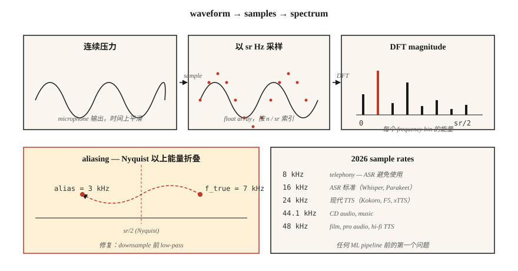

# 音频基础 — 波形、采样、Fourier Transform

> Waveforms 是 raw signal。Spectrograms 是表示形式。Mel features 是适合 ML 的形式。每个现代 ASR 和 TTS pipeline 都会走过这层阶梯，而第一阶就是理解 sampling 和 Fourier。

**类型：** 学习
**语言：** Python
**前置要求：** Phase 1 · 06 (Vectors & Matrices), Phase 1 · 14 (概率分布)
**时间：** ~45 分钟

## 问题

麦克风会产生一个 pressure-vs-time signal。你的 Neural Network 消耗 tensors。它们之间有一整套约定，一旦违反，就会产生无声的 bug：model 训练看起来正常但 WER 翻倍，或 TTS 发布后带有嘶声，或 voice cloning system 记住的是麦克风而不是说话人。

speech systems 中的每个 bug 都可以追溯到三个问题之一：

1. 数据是以什么 sample rate 录制的，model 期望什么？
2. signal 是否 aliased？
3. 你是在 raw samples 上操作，还是在 frequency representation 上操作？

把这些搞对，Phase 6 的其余部分就可处理。搞错的话，即使 Whisper-Large-v4 也会产生垃圾结果。

## 概念



**Waveform。** `[-1.0, 1.0]` 中的一维 float array。按 sample number 索引。要转换为秒，除以 sample rate：`t = n / sr`。一个 16 kHz、10 秒的 clip 是一个包含 160,000 个 float 的 array。

**Sampling rate (sr)。** 每秒多少个 samples。2026 年常见 rate：

| Rate | Use |
|------|-----|
| 8 kHz | Telephony、legacy VOIP。Nyquist 在 4 kHz，会损失辅音。ASR 中应避免。 |
| 16 kHz | ASR 标准。Whisper、Parakeet、SeamlessM4T v2 都使用 16 kHz。 |
| 22.05 kHz | 较旧 models 的 TTS vocoder training。 |
| 24 kHz | 现代 TTS（Kokoro、F5-TTS、xTTS v2）。 |
| 44.1 kHz | CD audio、music。 |
| 48 kHz | Film、pro audio、high-fidelity TTS（VALL-E 2、NaturalSpeech 3）。 |

**Nyquist-Shannon。** `sr` 的 sample rate 可以明确表示最高到 `sr/2` 的 frequencies。`sr/2` 边界是 *Nyquist frequency*。高于 Nyquist 的能量会被 *aliased*，也就是折叠到更低的 frequencies 中，并污染 signal。downsampling 前始终要 low-pass filter。

**Bit depth。** 16-bit PCM（signed int16，range ±32,767）是通用交换格式。音乐用 24-bit，内部 DSP 用 32-bit float。像 `soundfile` 这样的库会读取 int16，但暴露 `[-1, 1]` 中的 float32 arrays。

**Fourier Transform。** 任意有限 signal 都是不同 frequencies 的 sinusoids 之和。Discrete Fourier Transform (DFT) 对 `N` 个 samples 计算 `N` 个 complex coefficients，也就是每个 frequency bin 一个。`bin k` 映射到 frequency `k · sr / N` Hz。Magnitude 是该 frequency 上的 amplitude，angle 是 phase。

**FFT。** Fast Fourier Transform：当 `N` 是 2 的幂时，用于 DFT 的 `O(N log N)` algorithm。每个 audio library 底层都使用 FFT。16 kHz 下 1024-sample FFT 会给出 512 个可用 frequency bins，覆盖 0–8 kHz，resolution 为 15.6 Hz。

**Framing + window。** 我们不会对整个 clip 做 FFT。我们把它切成重叠的 *frames*（通常 25 ms，hop 10 ms），将每个 frame 乘以 window function（Hann、Hamming）来消除边缘不连续，然后对每个 frame 做 FFT。这就是 Short-Time Fourier Transform (STFT)。Lesson 02 会从这里继续。

## 构建它

### 步骤 1：读取 clip 并绘制 waveform

`code/main.py` 只使用 stdlib `wave` module，以保持 demo 无依赖。生产环境中你会使用 `soundfile` 或 `torchaudio.load`（两者都返回 `(waveform, sr)` tuples）：

```python
import soundfile as sf
waveform, sr = sf.read("clip.wav", dtype="float32")  # shape (T,), sr=int
```

### 步骤 2：从第一性原理合成 sine wave

```python
import math

def sine(freq_hz, sr, seconds, amp=0.5):
    n = int(sr * seconds)
    return [amp * math.sin(2 * math.pi * freq_hz * i / sr) for i in range(n)]
```

16 kHz 下持续 1 秒的 440 Hz sine（concert A）是 16,000 个 floats。使用 16-bit PCM encoding，通过 `wave.open(..., "wb")` 写入。

### 步骤 3：手写计算 DFT

```python
def dft(x):
    N = len(x)
    out = []
    for k in range(N):
        re = sum(x[n] * math.cos(-2 * math.pi * k * n / N) for n in range(N))
        im = sum(x[n] * math.sin(-2 * math.pi * k * n / N) for n in range(N))
        out.append((re, im))
    return out
```

`O(N²)` —— 对 `N=256` 用来确认正确性没问题，但对真实 audio 没用。真实代码会调用 `numpy.fft.rfft` 或 `torch.fft.rfft`。

### 步骤 4：找到 dominant frequency

Magnitude peak index `k_star` 映射到 frequency `k_star * sr / N`。在 440 Hz sine 上运行时，应返回位于 bin `440 * N / sr` 的 peak。

### 步骤 5：演示 aliasing

以 10 kHz 采样 7 kHz sine（Nyquist = 5 kHz）。7 kHz tone 高于 Nyquist，会折叠到 `10 − 7 = 3 kHz`。FFT peak 会出现在 3 kHz。这是经典 aliasing demo，也是每个 DAC/ADC 都配有 brick-wall low-pass filter 的原因。

## 使用它

2026 年你实际会交付的 stack：

| Task | Library | Why |
|------|---------|-----|
| 读/写 WAV/FLAC/OGG | `soundfile`（libsndfile wrapper） | 最快、稳定、返回 float32。 |
| Resample | `torchaudio.transforms.Resample` 或 `librosa.resample` | 内置正确的 anti-aliasing。 |
| STFT / Mel | `torchaudio` 或 `librosa` | GPU-friendly；PyTorch ecosystem。 |
| Real-time streaming | `sounddevice` 或 `pyaudio` | Cross-platform PortAudio bindings。 |
| Inspect a file | `ffprobe` 或 `soxi` | CLI、快速、报告 sr/channels/codec。 |

决策规则：**先匹配 sample rate，再匹配其他任何东西**。Whisper 期望 16 kHz mono float32。传给它 44.1 kHz stereo，你会得到看起来像 model bug 的垃圾结果。

## 交付它

保存为 `outputs/skill-audio-loader.md`。这个 skill 帮你检查 audio input 是否匹配下游 model 的期望，并在不匹配时正确 resample。

## 练习

1. **简单。** 在 16 kHz 下合成 1 秒的 220 Hz + 440 Hz + 880 Hz 混合音。运行 DFT。确认在预期 bins 处有三个 peaks。
2. **中等。** 录制一段 48 kHz、3 秒的你自己的 WAV 语音。使用 `torchaudio.transforms.Resample`（带 anti-aliasing）downsample 到 16 kHz，然后使用 naive decimation（每三个 sample 取一个）downsample 到 16 kHz。对两者做 FFT。aliasing 出现在哪里？
3. **困难。** 只使用 `math` 和 Step 3 的 DFT，从零构建 STFT。Frame size 400，hop 160，Hann window。用 `matplotlib.pyplot.imshow` 绘制 magnitudes。这就是 Lesson 02 的 spectrogram。

## 关键术语

| Term | What people say | What it actually means |
|------|-----------------|-----------------------|
| Sample rate | 每秒多少个 samples | ADC 测量 signal 的 frequency，单位为 Hz。 |
| Nyquist | 你可以表示的最大 frequency | `sr/2`；高于它的能量会 alias 回低频。 |
| Bit depth | 每个 sample 的 resolution | `int16` = 65,536 levels；`float32` = `[-1, 1]` 中的 24-bit precision。 |
| DFT | sequences 的 Fourier Transform | `N` samples → `N` 个 complex frequency coefficients。 |
| FFT | 快速 DFT | `O(N log N)` algorithm，要求 `N` = 2 的幂。 |
| Bin | Frequency column | `k · sr / N` Hz；resolution = `sr / N`。 |
| STFT | Spectrogram 的底层机制 | 随时间进行 framed + windowed FFT。 |
| Aliasing | 奇怪的 frequency 幽影 | 高于 Nyquist 的能量镜像到更低 bins。 |

## 延伸阅读

- [Shannon (1949). Communication in the Presence of Noise](https://people.math.harvard.edu/~ctm/home/text/others/shannon/entropy/entropy.pdf) — sampling theorem 背后的论文。
- [Smith — The Scientist and Engineer's Guide to Digital Signal Processing](https://www.dspguide.com/ch8.htm) — 免费、经典的 DSP 教科书。
- [librosa docs — audio primer](https://librosa.org/doc/latest/tutorial.html) — 带代码的实用 walkthrough。
- [Heinrich Kuttruff — Room Acoustics (6th ed.)](https://www.routledge.com/Room-Acoustics/Kuttruff/p/book/9781482260434) — 用于理解为什么真实世界 audio 不是干净 sinusoid 的参考资料。
- [Steve Eddins — FFT Interpretation notebook](https://blogs.mathworks.com/steve/2020/03/30/fft-spectrum-and-spectral-densities/) — 用 10 分钟理清 frequency bin 直觉。
