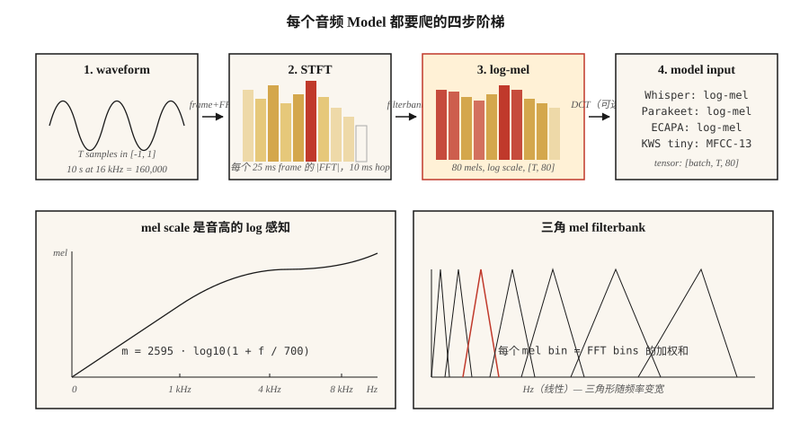

# Spectrograms, Mel Scale 与音频特征

> Neural Network 不太适合直接消费 raw waveform。它们消费 spectrogram。它们消费 mel spectrogram 的效果更好。2026 年的每个 ASR、TTS 和 audio classifier，成败都取决于这个单一的 preprocessing 选择。

**Type:** Build
**Languages:** Python
**Prerequisites:** Phase 6 · 01 (Audio Fundamentals)
**Time:** ~45 分钟

## 问题

取一个 10 秒、16 kHz 的 clip。这是 160,000 个 float，全部位于 `[-1, 1]`，并且几乎与 label "dog barking" 或 "the word cat" 完全不相关。raw waveform 包含信息，但形式上 model 很难轻松提取。两个相同的 phoneme 即使只相隔 100 ms，raw sample 也会完全不同。

spectrogram 解决了这个问题。它会压缩人类感知会忽略的时间细节（微秒级抖动），并保留感知会关注的结构（哪些 frequency 有能量，以及这些能量在约 10–25 ms 的 time window 中如何变化）。

Mel spectrogram 进一步推进。人类以对数方式感知 pitch：100 Hz vs 200 Hz 听起来与 1000 Hz vs 2000 Hz 是“相同距离”。mel scale 会扭曲 frequency axis 来匹配这一点。mel-scaled spectrogram 是 2010 到 2026 年 speech ML 中最重要的单一 feature。

## 概念



**STFT (Short-Time Fourier Transform).** 将 waveform 切成重叠 frame（典型设置：25 ms window，10 ms hop = 16 kHz 下 400 samples / 160 samples）。将每个 frame 乘以一个 window function（Hann 是默认选择；Hamming 的取舍略有不同）。对每个 frame 做 FFT。把 magnitude spectra 堆叠成形状为 `(n_frames, n_freq_bins)` 的 Matrix。这就是你的 spectrogram。

**Log-magnitude.** raw magnitude 跨越 5-6 个数量级。使用 `log(|X| + 1e-6)` 或 `20 * log10(|X|)` 来压缩 dynamic range。每个 production pipeline 都使用 log-magnitude，而不是 raw magnitude。

**Mel scale.** Hz 中的 frequency `f` 通过 `m = 2595 * log10(1 + f / 700)` 映射到 mel `m`。该映射在 1 kHz 以下大致是线性的，在 1 kHz 以上大致是对数的。覆盖 0–8 kHz 的 80 个 mel bins 是标准 ASR input。

**Mel filterbank.** 一组在 mel scale 上等间距排列的 triangular filters。每个 filter 是相邻 FFT bins 的 weighted sum。将 STFT magnitude 乘以 filterbank Matrix，即可通过一次 matmul 得到 mel spectrogram。

**Log-mel spectrogram.** `log(mel_spec + 1e-10)`。Whisper 的 input。Parakeet 的 input。SeamlessM4T 的 input。2026 年通用的 audio frontend。

**MFCCs.** 取 log-mel spectrogram，应用 DCT（type II），保留前 13 个 coefficient。它会去相关 feature 并进一步压缩。在大约 2015 年之前一直是主导 feature，之后基于 raw log-mels 的 CNNs/Transformers 赶了上来。它仍用于 speaker recognition（x-vectors, ECAPA）。

**Resolution trade.** 更大的 FFT = 更好的 frequency resolution，但更差的 time resolution。25 ms / 10 ms 是 audio-ML 默认值；音乐使用 50 ms / 12.5 ms；transient detection（drum hits, plosives）使用 5 ms / 2 ms。


```figure
spectrogram-window
```

## 构建它

### 步骤 1: 对波形分帧

```python
def frame(signal, frame_len, hop):
    n = 1 + (len(signal) - frame_len) // hop
    return [signal[i * hop : i * hop + frame_len] for i in range(n)]
```

一个 10 秒、16 kHz 的 clip，在 `frame_len=400, hop=160` 时会产生 998 个 frame。

### 步骤 2： Hann window

```python
import math

def hann(N):
    return [0.5 * (1 - math.cos(2 * math.pi * n / (N - 1))) for n in range(N)]
```

在 FFT 之前逐元素相乘。它会移除由非零端点截断造成的 spectral leakage。

### 步骤 3： STFT magnitude

```python
def stft_magnitude(signal, frame_len=400, hop=160):
    win = hann(frame_len)
    frames = frame(signal, frame_len, hop)
    return [magnitudes(dft([w * s for w, s in zip(win, f)])) for f in frames]
```

Production 使用 `torch.stft` 或 `librosa.stft`（FFT-backed、vectorized）。这里的 loop 用于教学；它会在 `code/main.py` 中的短 clip 上运行。

### 步骤 4： mel filterbank

```python
def hz_to_mel(f):
    return 2595.0 * math.log10(1.0 + f / 700.0)

def mel_to_hz(m):
    return 700.0 * (10 ** (m / 2595.0) - 1)

def mel_filterbank(n_mels, n_fft, sr, fmin=0, fmax=None):
    fmax = fmax or sr / 2
    mels = [hz_to_mel(fmin) + (hz_to_mel(fmax) - hz_to_mel(fmin)) * i / (n_mels + 1)
            for i in range(n_mels + 2)]
    hzs = [mel_to_hz(m) for m in mels]
    bins = [int(h * n_fft / sr) for h in hzs]
    fb = [[0.0] * (n_fft // 2 + 1) for _ in range(n_mels)]
    for m in range(n_mels):
        for k in range(bins[m], bins[m + 1]):
            fb[m][k] = (k - bins[m]) / max(1, bins[m + 1] - bins[m])
        for k in range(bins[m + 1], bins[m + 2]):
            fb[m][k] = (bins[m + 2] - k) / max(1, bins[m + 2] - bins[m + 1])
    return fb
```

在 `n_fft=400` 时，覆盖 0–8 kHz 的 80 个 mels 会得到一个 `(80, 201)` Matrix。将 `(n_frames, 201)` 的 STFT magnitude 乘以它的 transpose，即可得到 `(n_frames, 80)` 的 mel spectrogram。

### 步骤 5： log-mel

```python
def log_mel(mel_spec, eps=1e-10):
    return [[math.log(max(v, eps)) for v in frame] for frame in mel_spec]
```

常见替代方案：`librosa.power_to_db`（reference-normalized dB）、`10 * log10(power + eps)`。Whisper 使用更复杂的 clip + normalize 例程（参见 Whisper 的 `log_mel_spectrogram`）。

### 步骤 6： MFCCs

```python
def dct_ii(x, n_coeffs):
    N = len(x)
    return [
        sum(x[n] * math.cos(math.pi * k * (2 * n + 1) / (2 * N)) for n in range(N))
        for k in range(n_coeffs)
    ]
```

对每个 log-mel frame 应用 DCT，保留前 13 个 coefficient。这就是你的 MFCC Matrix。第一个 coefficient 通常会被丢弃（它编码 overall energy）。

## 使用它

2026 年 stack：

| Task | Features |
|------|----------|
| ASR (Whisper, Parakeet, SeamlessM4T) | 80 log-mels, 10 ms hop, 25 ms window |
| TTS acoustic model (VITS, F5-TTS, Kokoro) | 80 mels, 5–12 ms hop，用于精细 temporal control |
| Audio classification (AST, PANNs, BEATs) | 128 log-mels, 10 ms hop |
| Speaker embedding (ECAPA-TDNN, WavLM) | 80 log-mels 或 raw-waveform SSL |
| Music (MusicGen, Stable Audio 2) | EnCodec discrete tokens（不是 mels） |
| Keyword spotting | 40 MFCCs，用于 tiny devices |

经验法则：**如果你不是在处理 music，就从 80 log-mels 开始。** 任何偏离都需要承担举证责任。

## 2026 年仍然会进入 production 的陷阱

- **Mel count mismatch.** 使用 80 mels 训练，使用 128 mels inference。静默失败。在两端都记录 feature shape。
- **Sample-rate mismatch upstream.** 在 22.05 kHz 计算出的 mels 与 16 kHz 不同。在 featurization *之前* 修复 SR。
- **dB vs log.** Whisper 期望 log-mel，而不是 dB-mel。一些 HF pipelines 会 autodetect；你的 custom code 不会。
- **Normalization drift.** 训练时使用 per-utterance normalization，inference 时使用 global normalization。这是会让 WER 翻倍的 production bug。
- **Leakage from padding.** 对 clip 末尾进行 zero-padding 会在 trailing frames 中产生 flat spectrum。使用 symmetric padding 或 replicate。

## 交付它

保存为 `outputs/skill-feature-extractor.md`。该 skill 会为给定 model target 选择 feature type、mel count、frame/hop 和 normalization。

## 练习

1. **Easy.** 运行 `code/main.py`。它会合成一个 chirp（frequency 从 200 → 4000 Hz 扫过），并打印每个 frame 的 argmax mel bin。绘图（可选）并确认它与 sweep 匹配。
2. **Medium.** 使用 `{40, 80, 128}` 中的 `n_mels` 和 `{200, 400, 800}` 中的 `frame_len` 重新运行。测量 time axis 上 sharp-peak bandwidth。哪种组合最好地解析了 chirp？
3. **Hard.** 实现 `power_to_db`，并比较 AudioMNIST 上 tiny CNN classifier 使用以下输入时的 ASR accuracy：(a) raw log-mel，(b) 带 `ref=max` 的 dB-mel，(c) MFCC-13 + delta + delta-delta。报告 top-1 accuracy。

## 关键术语
| Term | What people say | What it actually means |
|------|-----------------|-----------------------|
| Frame | 一个 slice | 输入给一次 FFT 的 25 ms waveform chunk。 |
| Hop | Stride | 相邻 frames 之间的 samples；10 ms 是 ASR 默认值。 |
| Window | Hann/Hamming 那类东西 | 逐点 multiplier，将 frame 边缘渐变到零。 |
| STFT | Spectrogram generator | Framed + windowed FFT；产生 time × frequency Matrix。 |
| Mel | Warped frequency | 对数感知 scale；`m = 2595·log10(1 + f/700)`。 |
| Filterbank | 那个 Matrix | 将 STFT 投影到 mel bins 的 triangular filters。 |
| Log-mel | Whisper 的 input | `log(mel_spec + eps)`；在 2026 年已标准化。 |
| MFCC | Old-school feature | log-mel 的 DCT；13 个 coeffs，去相关。 |

## 延伸阅读
- [Davis, Mermelstein (1980). Comparison of parametric representations for monosyllabic word recognition](https://ieeexplore.ieee.org/document/1163420) — MFCC 论文。
- [Stevens, Volkmann, Newman (1937). A Scale for the Measurement of the Psychological Magnitude Pitch](https://pubs.aip.org/asa/jasa/article-abstract/8/3/185/735757/) — 原始 mel scale。
- [OpenAI — Whisper source, log_mel_spectrogram](https://github.com/openai/whisper/blob/main/whisper/audio.py) — 阅读 reference implementation。
- [librosa feature extraction docs](https://librosa.org/doc/main/feature.html) — `mfcc`、`melspectrogram` 和 hop/window 的 reference。
- [NVIDIA NeMo — audio preprocessing](https://docs.nvidia.com/deeplearning/nemo/user-guide/docs/en/main/asr/asr_all.html#featurizers) — 用于 Parakeet + Canary models 的 production-scale pipeline。
