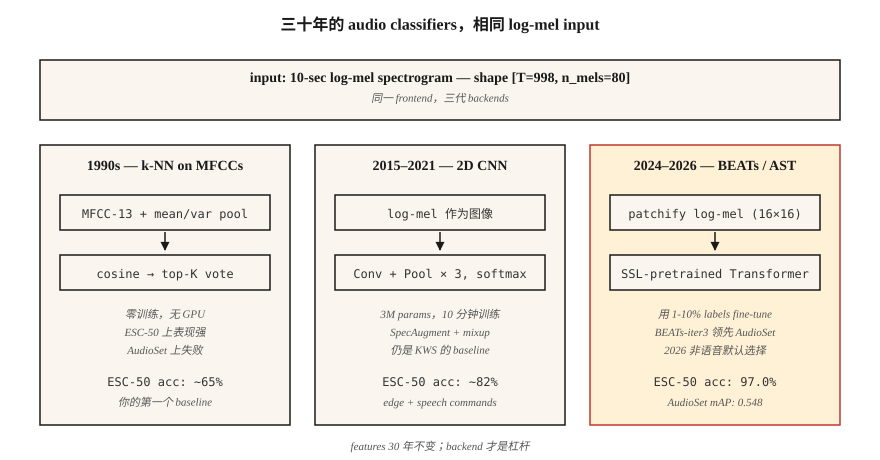

# Audio Classification — 从 MFCC 上的 k-NN 到 AST 和 BEATs

> 从“狗叫 vs 警笛”到“这是哪种语言”，都属于音频 Classification。特征是 mels。架构每十年都会变化。评估仍然是 AUC、F1 和按类 recall。

**类型：** 构建
**语言：** Python
**先修要求：** Phase 6 · 02 (Spectrograms & Mel), Phase 3 · 06 (CNNs), Phase 5 · 08 (CNNs & RNNs for Text)
**时间：** ~75 分钟

## 问题

你拿到一个 10 秒音频片段。你想知道：“它是什么？”城市声音（警笛、电钻、狗）、语音命令（yes/no/stop）、语言 ID（en/es/ar）、说话人情绪（angry/neutral），或环境声音（indoor/outdoor, babble）。所有这些都是*音频 Classification*，而在 2026 年，基线架构已经成熟：log-mel → CNN 或 Transformer → softmax。

核心难点不是网络，而是数据。音频数据集存在严重的类别不平衡、强 domain shift（干净 vs 嘈杂）和标签噪声（是谁决定“urban babble”和“restaurant noise”的区别？）。80% 的问题在于整理、augmentation 和评估，而不是把 CNN 换成 Transformer。

## 概念



**MFCC 上的 k-NN（1990 年代基线）。** 按片段展平 MFCC，计算它与带标签样本库的 cosine similarity，返回 top K 的 majority vote。在干净的小数据集（Speech Commands、ESC-50）上出乎意料地强。不需要 GPU 即可运行。

**log-mels 上的 2D CNN（2015-2019）。** 把 `(T, n_mels)` log-mel 当作图像处理。应用 ResNet-18 或 VGG-style。对时间轴做 global mean pool。对类别做 softmax。在大多数 2026 年 kaggle 竞赛中，这仍然是基线。

**Audio Spectrogram Transformer, AST（2021-2024）。** 将 log-mel patchify（例如 16×16 patches），添加 position embeddings，并送入 ViT。对于 supervised learning，它是 AudioSet 上的 SOTA（mAP 0.485）。

**BEATs 和 WavLM-base（2024-2026）。** 在数百万小时音频上做 self-supervised pretraining。用你原本所需 supervised data 的 1-10% 在任务上 fine-tune。到 2026 年，这是非语音音频的默认起点。BEATs-iter3 在使用 1/4 compute 的情况下，在 AudioSet 上比 AST 高 1-2 mAP。

**Whisper-encoder 作为冻结 backbone（2024）。** 取 Whisper 的 encoder，去掉 decoder，接一个 linear classifier。在 language ID 和简单 event classification 上接近 SOTA，并且不需要 audio augmentation。这是“免费午餐”基线。

### 类别不平衡才是真正挑战

ESC-50：50 类，每类 40 个片段 — 平衡、简单。UrbanSound8K：10 类，10:1 不平衡。AudioSet：632 类，存在 100,000:1 long tail。有效技术包括：

- 训练时 balanced sampling（评估时不要）。
- Mixup：将两个片段（及其标签）线性插值作为 augmentation。
- SpecAugment：随机遮盖时间和频率 band。简单，但关键。

### 评估

- Multiclass exclusive（Speech Commands）：top-1 accuracy、top-5 accuracy。
- 多类多标签（AudioSet、UrbanSound-style）：mean average precision (mAP)。
- 严重不平衡：per-class recall + macro F1。

你应该知道的 2026 数字：

| Benchmark | Baseline | SOTA 2026 | Source |
|-----------|----------|-----------|--------|
| ESC-50 | 82% (AST) | 97.0% (BEATs-iter3) | BEATs paper (2024) |
| AudioSet mAP | 0.485 (AST) | 0.548 (BEATs-iter3) | HEAR leaderboard 2026 |
| Speech Commands v2 | 98% (CNN) | 99.0% (Audio-MAE) | HEAR v2 results |

## 构建它

### 步骤 1：featurize

```python
def featurize_mfcc(signal, sr, n_mfcc=13, n_mels=40, frame_len=400, hop=160):
    mag = stft_magnitude(signal, frame_len, hop)
    fb = mel_filterbank(n_mels, frame_len, sr)
    mels = apply_filterbank(mag, fb)
    log = log_transform(mels)
    return [dct_ii(frame, n_mfcc) for frame in log]
```

### 步骤 2：固定长度 summary

```python
def summarize(mfcc_frames):
    n = len(mfcc_frames[0])
    mean = [sum(f[i] for f in mfcc_frames) / len(mfcc_frames) for i in range(n)]
    var = [
        sum((f[i] - mean[i]) ** 2 for f in mfcc_frames) / len(mfcc_frames) for i in range(n)
    ]
    return mean + var
```

简单但很强：跨时间的 mean + variance 会为 13-coef MFCC 得到一个 26-dim 固定 Embedding。瞬间运行完成。直到 2017 年，它在 ESC-50 上仍能击败 SOTA NN 基线。

### 步骤 3：k-NN

```python
def cosine(a, b):
    dot = sum(x * y for x, y in zip(a, b))
    na = math.sqrt(sum(x * x for x in a)) or 1e-12
    nb = math.sqrt(sum(x * x for x in b)) or 1e-12
    return dot / (na * nb)

def knn_classify(q, bank, labels, k=5):
    sims = sorted(range(len(bank)), key=lambda i: -cosine(q, bank[i]))[:k]
    votes = Counter(labels[i] for i in sims)
    return votes.most_common(1)[0][0]
```

### 步骤 4：升级到 log-mels 上的 CNN

在 PyTorch 中：

```python
import torch.nn as nn

class AudioCNN(nn.Module):
    def __init__(self, n_mels=80, n_classes=50):
        super().__init__()
        self.body = nn.Sequential(
            nn.Conv2d(1, 32, 3, padding=1), nn.ReLU(), nn.MaxPool2d(2),
            nn.Conv2d(32, 64, 3, padding=1), nn.ReLU(), nn.MaxPool2d(2),
            nn.Conv2d(64, 128, 3, padding=1), nn.ReLU(),
            nn.AdaptiveAvgPool2d(1),
        )
        self.head = nn.Linear(128, n_classes)

    def forward(self, x):  # x: (B, 1, T, n_mels)
        return self.head(self.body(x).flatten(1))
```

3M 参数。在单张 RTX 4090 上用约 10 分钟训练 ESC-50。accuracy 80%+。

### 步骤 5：2026 默认方案 — fine-tune BEATs

```python
from transformers import ASTFeatureExtractor, ASTForAudioClassification

ext = ASTFeatureExtractor.from_pretrained("MIT/ast-finetuned-audioset-10-10-0.4593")
model = ASTForAudioClassification.from_pretrained(
    "MIT/ast-finetuned-audioset-10-10-0.4593",
    num_labels=50,
    ignore_mismatched_sizes=True,
)

inputs = ext(audio, sampling_rate=16000, return_tensors="pt")
logits = model(**inputs).logits
```

对于 BEATs，通过 `beats` 库使用 `microsoft/BEATs-base`；transformers API 的形状相同。

## 使用它

2026 stack：

| Situation | Start with |
|-----------|-----------|
| Tiny dataset (<1000 clips) | MFCC means 上的 k-NN（你的基线）+ audio augmentation |
| Medium dataset (1K–100K) | BEATs 或 AST fine-tune |
| Large dataset (>100K) | 从头训练或 fine-tune Whisper-encoder |
| Real-time, edge | 40-MFCC CNN，quantized to int8（KWS-style） |
| Multi-label (AudioSet) | BEATs-iter3，配合 BCE loss + mixup + SpecAugment |
| Language ID | MMS-LID, SpeechBrain VoxLingua107 baseline |

决策规则：**从冻结 backbone 开始，而不是新模型**。Fine-tuning 一个 BEATs head 可以在数小时内达到 95% SOTA，而不是数周。

## 交付它

保存为 `outputs/skill-classifier-designer.md`。为给定 audio classification 任务选择 architecture、augmentations、class-balance strategy 和 eval metric。

## 练习

1. **Easy.** 运行 `code/main.py`。它会在一个 4-class synthetic dataset（不同音高的 pure tones）上训练 k-NN MFCC 基线。报告 confusion matrix。
2. **Medium.** 用 [mean, var, skew, kurtosis] 替换 `summarize`。在同一个 synthetic dataset 上，4-moment pooling 是否胜过 mean+var？
3. **Hard.** 使用 `torchaudio`，在 ESC-50 fold 1 上训练一个 2D CNN。报告 5-fold cross-validation accuracy。添加 SpecAugment（time mask = 20, freq mask = 10）并报告 delta。

## 关键术语

| Term | 人们的说法 | 实际含义 |
|------|------------|----------|
| AudioSet | 音频领域的 ImageNet | Google 的 2M-clip、632-class weakly-labeled YouTube dataset。 |
| ESC-50 | 小型 Classification benchmark | 50 类 × 40 个环境声音片段。 |
| AST | Audio Spectrogram Transformer | log-mel patches 上的 ViT；2021 SOTA。 |
| BEATs | Self-supervised audio | Microsoft 模型，iter3 截至 2026 年领先 AudioSet。 |
| Mixup | 成对 augmentation | `x = λ·x1 + (1-λ)·x2; y = λ·y1 + (1-λ)·y2`。 |
| SpecAugment | 基于 mask 的 augmentation | 将 spectrogram 的随机时间和频率 band 置零。 |
| mAP | 主要 multi-label metric | 跨类别和阈值的 mean average precision。 |

## 延伸阅读

- [Gong, Chung, Glass (2021). AST: Audio Spectrogram Transformer](https://arxiv.org/abs/2104.01778) — 2021–2024 年的代表性架构。
- [Chen et al. (2022, rev. 2024). BEATs: Audio Pre-Training with Acoustic Tokenizers](https://arxiv.org/abs/2212.09058) — 2024+ 默认方案。
- [Park et al. (2019). SpecAugment](https://arxiv.org/abs/1904.08779) — 主流 audio augmentation。
- [Piczak (2015). ESC-50 dataset](https://github.com/karolpiczak/ESC-50) — 延续至今的 50-class benchmark。
- [Gemmeke et al. (2017). AudioSet](https://research.google.com/audioset/) — 632-class YouTube taxonomy；仍然是黄金标准。
