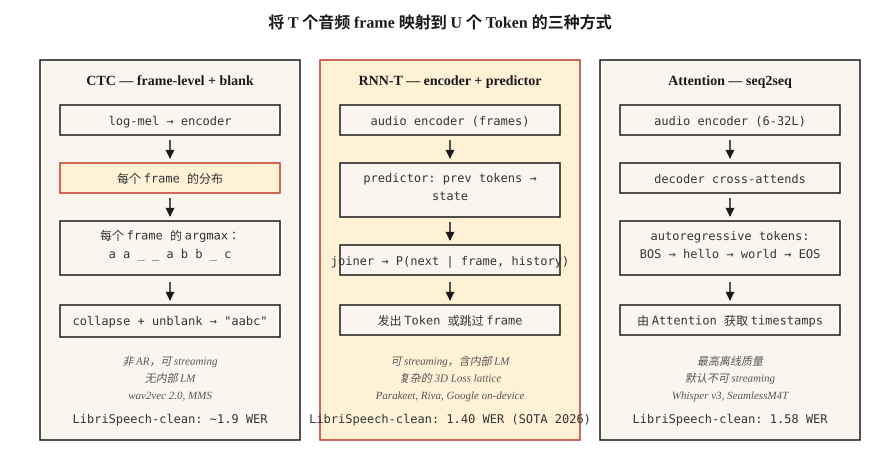

# Speech Recognition (ASR) — CTC, RNN-T, Attention

> 语音识别是在每个时间步进行音频分类，再由一个懂英语和静音的序列模型把它们粘合起来。CTC、RNN-T 和 Attention 是实现它的三种方式。选一种，并理解为什么。

**Type:** 构建
**Languages:** Python
**Prerequisites:** Phase 6 · 02 (Spectrograms & Mel), Phase 5 · 08 (用于文本的 CNNs & RNNs), Phase 5 · 10 (Attention)
**Time:** ~45 分钟

## 问题

你有一个 10 秒、16 kHz 的音频片段。你想得到一个字符串："turn on the kitchen lights"。挑战在于结构：音频帧并不会与字符一一对齐。单词 "okay" 可能持续 200 ms，也可能持续 1200 ms。静音会给话语加上停顿。有些音素比其他音素更长。输出 Token 的数量无法预先知道。

三种形式化方法可以解决这个问题：

1. **CTC (Connectionist Temporal Classification)。** 输出每帧的 Token 概率，包括一个特殊的 *blank*。在解码时折叠重复项和 blank。非自回归，速度快。wav2vec 2.0、MMS 使用它。
2. **RNN-T (Recurrent Neural Network Transducer)。** Joint network 在给定 encoder 帧和先前 Token 的情况下预测下一个 Token。可流式处理。Google 的端侧 ASR、NVIDIA Parakeet 使用它。
3. **Attention encoder-decoder。** Encoder 将音频压缩为 hidden states，decoder 通过 cross-attends 自回归生成 Token。Whisper、SeamlessM4T 使用它。

到 2026 年，LibriSpeech test-clean 上的 SOTA WER 为 1.4% (Parakeet-TDT-1.1B, NVIDIA) 和 1.58% (Whisper-Large-v3-turbo)。差异很小；部署差异很大。

## 概念



**CTC 直觉。** 让 encoder 输出 `T` 个帧级分布，覆盖 `V+1` 个 Token（V 个字符 + blank）。对于长度为 `U < T` 的目标字符串 `y`，任何折叠后得到 `y` 的帧对齐都算数。CTC loss 会对所有这样的对齐求和。Inference：逐帧 argmax，折叠重复项，移除 blank。

优点：非自回归、可流式处理、零前瞻。缺点：*conditional independence assumption*，即每帧预测彼此独立，因此没有内部 language model。可通过 beam search 或 shallow fusion 接入外部 LM 来修正。

**RNN-T 直觉。** 添加一个 *predictor* network 来 Embedding Token 历史，并添加一个 *joiner*，将 predictor state 与 encoder 帧组合成一个覆盖 `V+1` 的联合分布（这里的 `+1` 是 null / no-emit）。显式建模 CTC 忽略的条件依赖。它可流式处理，因为每一步只依赖过去的帧和过去的 Token。

优点：可流式处理 + 内部 LM。缺点：训练更复杂且更耗内存（3D loss lattice）；RNN-T loss kernels 本身就是一个完整的库类别。

**Attention encoder-decoder。** Encoder（6-32 层 transformer）处理 log-mel 帧。Decoder（6-32 层 transformer）cross-attends 到 encoder 输出，并自回归生成 Token。没有对齐约束，Attention 可以查看音频中的任意位置。除非限制 Attention（chunked Whisper-Streaming, 2024），否则不可流式处理。

优点：离线 ASR 质量最高，易于用标准 seq2seq 工具训练。缺点：自回归延迟与输出长度成正比；没有工程改造就无法流式处理。

### WER：一个数字

**Word Error Rate** = `(S + D + I) / N`，其中 S=替换，D=删除，I=插入，N=参考文本词数。它对应词级 Levenshtein edit distance。越低越好。WER 高于 20% 通常不可用；低于 5% 对朗读语音而言达到人类水平。2026 年标准 benchmark 数字：

| Model | LibriSpeech test-clean | LibriSpeech test-other | Size |
|-------|------------------------|------------------------|------|
| Parakeet-TDT-1.1B | 1.40% | 2.78% | 1.1B params |
| Whisper-Large-v3-turbo | 1.58% | 3.03% | 809M |
| Canary-1B Flash | 1.48% | 2.87% | 1B |
| Seamless M4T v2 | 1.7% | 3.5% | 2.3B |

这些全部基于 encoder-decoder 或 RNN-T。纯 CTC 系统（wav2vec 2.0）在 test-clean 上大约为 1.8-2.1%。

```figure
ctc-collapse
```

## 构建它

### 步骤 1：greedy CTC decode

```python
def ctc_greedy(frame_logits, blank=0, vocab=None):
    # frame_logits: list of per-frame probability vectors
    preds = [max(range(len(p)), key=lambda i: p[i]) for p in frame_logits]
    out = []
    prev = -1
    for p in preds:
        if p != prev and p != blank:
            out.append(p)
        prev = p
    return "".join(vocab[i] for i in out) if vocab else out
```

两条规则：折叠连续重复项，丢弃 blank。示例：`a a _ _ a b b _ c` → `a a b c`。

### 步骤 2：beam-search CTC

```python
def ctc_beam(frame_logits, beam=8, blank=0):
    import math
    beams = [([], 0.0)]  # (tokens, log_prob)
    for p in frame_logits:
        log_p = [math.log(max(pi, 1e-10)) for pi in p]
        candidates = []
        for seq, lp in beams:
            for t, lpt in enumerate(log_p):
                new = seq[:] if t == blank else (seq + [t] if not seq or seq[-1] != t else seq)
                candidates.append((new, lp + lpt))
        candidates.sort(key=lambda x: -x[1])
        beams = candidates[:beam]
    return beams[0][0]
```

生产环境使用带 LM fusion 的 prefix tree beam search；这是概念骨架。

### 步骤 3：WER

```python
def wer(ref, hyp):
    r, h = ref.split(), hyp.split()
    dp = [[0] * (len(h) + 1) for _ in range(len(r) + 1)]
    for i in range(len(r) + 1):
        dp[i][0] = i
    for j in range(len(h) + 1):
        dp[0][j] = j
    for i in range(1, len(r) + 1):
        for j in range(1, len(h) + 1):
            cost = 0 if r[i - 1] == h[j - 1] else 1
            dp[i][j] = min(
                dp[i - 1][j] + 1,
                dp[i][j - 1] + 1,
                dp[i - 1][j - 1] + cost,
            )
    return dp[len(r)][len(h)] / max(1, len(r))
```

### 步骤 4：对 Whisper 执行 inference

```python
import whisper
model = whisper.load_model("large-v3-turbo")
result = model.transcribe("clip.wav")
print(result["text"])
```

这是 2026 年最强通用 ASR 的一行写法。在 24 GB GPU 上以约 20× realtime 运行。

### 步骤 5：使用 Parakeet 或 wav2vec 2.0 进行 streaming

```python
from transformers import pipeline
asr = pipeline("automatic-speech-recognition", model="nvidia/parakeet-tdt-1.1b")
for chunk in streaming_audio():
    print(asr(chunk, return_timestamps=True))
```

Streaming ASR 需要 chunked encoder attention 和 carryover state；使用支持它的库（用于 Parakeet 的 NeMo，或带 `chunk_length_s` 的 `transformers` pipeline）。

## 使用它

2026 年的栈：

| Situation | Pick |
|-----------|------|
| 英语、离线、最高质量 | Whisper-large-v3-turbo |
| 多语言、鲁棒 | SeamlessM4T v2 |
| Streaming、低延迟 | Parakeet-TDT-1.1B 或 Riva |
| Edge、移动端、<500 ms 延迟 | Whisper-Tiny quantized 或 Moonshine (2024) |
| Long-form | 带 VAD-based chunking 的 Whisper (WhisperX) |
| 特定领域（医疗、法律） | Fine-tune wav2vec 2.0 + domain LM fusion |

## 2026 年仍然会发到生产的坑

- **没有 VAD。** 在静音上运行 Whisper 会产生幻觉（"Thanks for watching!"）。始终用 VAD 做门控。
- **字符 vs 词 vs subword WER。** 在 normalization（小写、去标点）*之后*报告词级 WER。
- **Language ID drift。** Whisper 的自动 LID 会把噪声片段错误路由到日语或威尔士语；当你确定语言时，强制 `language="en"`。
- **长片段不做 chunking。** Whisper 有 30 秒窗口。对任何更长内容使用 `chunk_length_s=30, stride=5`。

## 交付它

保存为 `outputs/skill-asr-picker.md`。为给定部署目标选择 model、decoding strategy、chunking 和 LM fusion。

## 练习

1. **Easy。** 运行 `code/main.py`。它会对手工构造的 CTC 输出做 greedy decode，并计算相对于参考文本的 WER。
2. **Medium。** 正确实现 Step 2 中的 prefix-tree beam search（考虑 blank merge rule）。在 10 个样例的合成数据集上与 greedy 比较。
3. **Hard。** 在 [LibriSpeech test-clean](https://www.openslr.org/12) 上使用 `whisper-large-v3-turbo`。计算前 100 条 utterance 的 WER。与已发布数字比较。

## 关键术语

| Term | What people say | What it actually means |
|------|-----------------|-----------------------|
| CTC | blank-token loss | 对所有 frame-to-token 对齐做 marginal；非 AR。 |
| RNN-T | streaming loss | CTC + next-token predictor；处理词序。 |
| Attention enc-dec | Whisper-style | Encoder + cross-attending decoder；最佳离线质量。 |
| WER | 你报告的数字 | 词级 `(S+D+I)/N`。 |
| Blank | 空白 | CTC 中表示“此帧无发射”的特殊 Token。 |
| LM fusion | 外部 language model | 在 beam search 期间加入加权 LM log-probs。 |
| VAD | 静音门控 | Voice activity detector；裁剪非语音。 |

## 延伸阅读

- [Graves et al. (2006). Connectionist Temporal Classification](https://www.cs.toronto.edu/~graves/icml_2006.pdf) — CTC 论文。
- [Graves (2012). Sequence Transduction with RNNs](https://arxiv.org/abs/1211.3711) — RNN-T 论文。
- [Radford et al. / OpenAI (2022). Whisper: Robust Speech Recognition via Large-Scale Weak Supervision](https://arxiv.org/abs/2212.04356) — 2022 年 canonical 论文；v3-turbo 扩展发布于 2024 年。
- [NVIDIA NeMo — Parakeet-TDT card](https://huggingface.co/nvidia/parakeet-tdt-1.1b) — 2026 Open ASR Leaderboard 榜首。
- [Hugging Face — Open ASR Leaderboard](https://huggingface.co/spaces/hf-audio/open_asr_leaderboard) — 覆盖 25+ models 的实时 benchmark。
