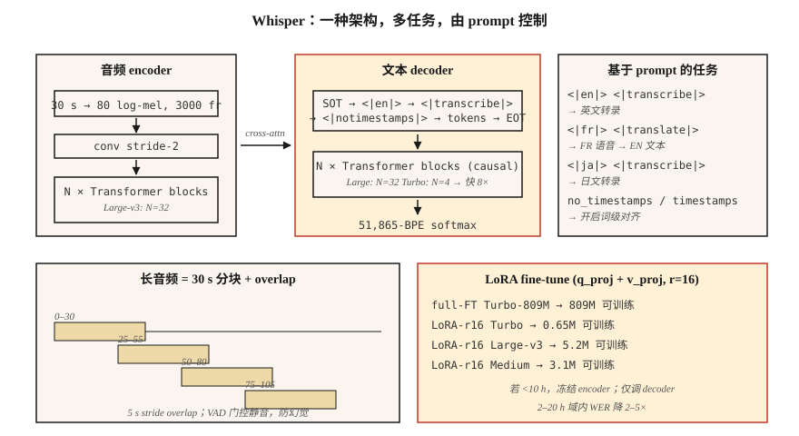

# Whisper — Architecture & Fine-Tuning

> Whisper 是一个 30-second-window transformer encoder-decoder，训练于 680k 小时的 multilingual weakly-supervised audio-text pairs。一个 architecture，多种 tasks，跨 99 种语言都 robust。2026 年的参考 ASR。

**Type:** Build
**Languages:** Python
**Prerequisites:** Phase 6 · 04 (ASR), Phase 5 · 10 (Attention), Phase 7 · 05 (Full Transformer)
**Time:** ~75 分钟

## The Problem

Whisper 由 OpenAI 于 2022 年 9 月发布，是第一个以 commodity 形态交付的 ASR model：粘贴 audio，得到 text，支持 99 种语言，对噪声 robust，可在 laptop 上运行。到 2024 年，OpenAI 已经发布了 Large-v3 和 Turbo variants；到 2026 年，Whisper 是从 podcast transcription 到 voice assistants 再到 YouTube subtitles 的默认 baseline。

但 Whisper 不是一个可以永远当黑箱使用的 pipeline。Domain shift 会杀死它：technical jargon、speaker accents、proper nouns、short clips、silence。你需要知道：

1. 它内部到底是什么。
2. 如何正确给它 chunked、streaming 或 long-form audio。
3. 什么时候 fine-tune，以及如何 fine-tune。

## The Concept



**Architecture。** 标准 transformer encoder-decoder。

- Input：30-second log-mel spectrogram，80 mels，10 ms hop → 3000 frames。更短 clips 会 zero-padded，更长 clips 会 chunked。
- Encoder：conv-downsample (stride 2) + `N` transformer blocks。对 Large-v3：32 layers，1280-dim，20 heads。
- Decoder：带 causal self-attn + 对 encoder output 做 cross-attn 的 `N` transformer blocks。大小与 encoder 相同。
- Output：覆盖 51,865-token vocab 的 BPE tokens。

Large-v3 有 1.55B params。Turbo 使用 4-layer decoder（从 32 层减少），以 <1% WER 损失换来 8× latency 降低。

**Prompt format。** Whisper 是一个由 decoder prompt 中的 special tokens 控制的 multitask model：

```text
<|startoftranscript|><|en|><|transcribe|><|notimestamps|> Hello world.<|endoftext|>
```

- `<|en|>` — language tag；强制 translation-vs-transcription 行为。
- `<|transcribe|>` 或 `<|translate|>` — 从任意语言 input 翻译为 English output，或逐字转写。
- `<|notimestamps|>` — 跳过 word-level timestamps（更快）。

Prompt 让一个模型能够完成很多 tasks。把 `<|en|>` 改成 `<|fr|>`，它就会转写 French。

**30-second window。** 一切都固定在 30 秒。更长 clips 需要 chunking；更短 clips 会 padding。Windows 不是原生 streaming 的，这就是 WhisperX、Whisper-Streaming 和 faster-whisper 存在的原因。

**Log-mel normalization。** `(log_mel - mean) / std`，其中 stats 来自 Whisper 自己的训练 corpus。你*必须*使用 Whisper 的 preprocessing（`whisper.audio.log_mel_spectrogram`），而不是 `librosa.feature.melspectrogram`。

### Variants in 2026

| Variant | Params | Latency (A100) | WER (LibriSpeech-clean) |
|---------|--------|----------------|------------------------|
| Tiny | 39M | 1× realtime | 5.4% |
| Base | 74M | 1× | 4.1% |
| Small | 244M | 1× | 3.0% |
| Medium | 769M | 1× | 2.7% |
| Large-v3 | 1.55B | 2× | 1.8% |
| Large-v3-turbo | 809M | 8× | 1.58% |
| Whisper-Streaming (2024) | 1.55B | streaming | 2.0% |

### Fine-tuning

2026 年的 canonical workflow：

1. 收集 10–100 小时目标领域 audio，并配有 aligned transcripts。
2. 使用 `transformers.Seq2SeqTrainer`，带 `generate_with_loss` callback。
3. Parameter-efficient：在 attention layers 的 `q_proj`、`k_proj`、`v_proj` 上使用 LoRA，可将 GPU memory 降低 4×，WER 代价 <0.3。
4. 如果你只有 <10 小时，freeze encoder。只调 decoder。
5. 使用 Whisper 自己的 Tokenizer 和 prompt format；绝不要替换 tokenizers。

社区结果：在 20 小时 medical dictation 上 fine-tune Medium，会把 medical vocabulary 上的 WER 从 12% 降到 4.5%。在 4 小时 Icelandic 上 fine-tune Turbo，会把 WER 从 18% 降到 6%。

```figure
sp-asr-attention
```

## Build It

### Step 1: 直接运行 Whisper

```python
import whisper
model = whisper.load_model("large-v3-turbo")
result = model.transcribe(
    "clip.wav",
    language="en",
    task="transcribe",
    temperature=0.0,
    condition_on_previous_text=False,  # prevents runaway repetition
)
print(result["text"])
for seg in result["segments"]:
    print(f"[{seg['start']:.2f}–{seg['end']:.2f}] {seg['text']}")
```

你应该始终覆盖的关键 defaults：`temperature=0.0`（sampling 默认是 0.0 → 0.2 → 0.4 … fallback chain）、`condition_on_previous_text=False`（防止 cascading hallucination problem），以及 `no_speech_threshold=0.6`（silence detection）。

### Step 2: chunked long-form

```python
# whisperx is the 2026 reference for long-form with word-level timestamps
import whisperx
model = whisperx.load_model("large-v3-turbo", device="cuda", compute_type="float16")
segments = model.transcribe("1hour.mp3", batch_size=16, chunk_size=30)
```

WhisperX 添加了 (1) Silero VAD gating，(2) 通过 wav2vec 2.0 做 word-level alignment，(3) 通过 `pyannote.audio` 做 diarization。它是 2026 年生产 transcription 的 workhorse。

### Step 3: 使用 LoRA fine-tune

```python
from transformers import WhisperForConditionalGeneration, WhisperProcessor
from peft import LoraConfig, get_peft_model

model = WhisperForConditionalGeneration.from_pretrained("openai/whisper-large-v3-turbo")
lora = LoraConfig(
    r=16, lora_alpha=32, target_modules=["q_proj", "v_proj"],
    lora_dropout=0.1, bias="none", task_type="SEQ_2_SEQ_LM",
)
model = get_peft_model(model, lora)
# model.print_trainable_parameters()  -> ~3M trainable / 809M total
```

然后使用标准 Trainer loop。每 1000 steps checkpoint 一次。在 held-out 上用 WER evaluate。

### Step 4: 检查每一层学到了什么

```python
# Grab cross-attention weights during decode to see what the decoder attends to.
with torch.inference_mode():
    out = model.generate(
        input_features=features,
        return_dict_in_generate=True,
        output_attentions=True,
    )
# out.cross_attentions: layer × head × step × src_len
```

用 heatmap 可视化，你会看到 decoder steps 扫过 encoder frames 时形成 diagonal alignment。这条 diagonal 就是 Whisper 对 word timestamps 的理解。

## Use It

2026 stack：

| Situation | Pick |
|-----------|------|
| 通用 English，offline | 通过 `whisperx` 使用 Large-v3-turbo |
| Mobile / edge | Whisper-Tiny quantized (int8) 或 Moonshine |
| Multilingual long-form | Large-v3 via `whisperx` + diarization |
| Low-resource language | 用 LoRA fine-tune Medium 或 Turbo |
| Streaming（2 s latency） | Whisper-Streaming 或 Parakeet-TDT |
| Word-level timestamps | WhisperX（通过 wav2vec 2.0 forced alignment） |

`faster-whisper`（CTranslate2 backend）是 2026 年最快的 CPU+GPU inference runtime，比 vanilla 快 4×，输出相同。

## Pitfalls that still ship in 2026

- **Hallucinated text on silence。** Whisper 基于 captions 训练，包含 "Thanks for watching!"、"Subscribe!"、song lyrics。调用前始终做 VAD-gate。
- **`condition_on_previous_text` cascade。** 一个 hallucination 会污染后续 windows。除非你需要跨 chunks 的 fluency，否则设为 `False`。
- **Short-clip padding。** 一个 2 秒 clip padding 到 30 秒后，可能在尾部静音中 hallucinate。使用 `pad=False` 或 VAD-gate。
- **Wrong mel stats。** 使用 librosa 的 mels 而不是 Whisper 的 mels，会产生近乎随机的输出。使用 `whisper.audio.log_mel_spectrogram`。

## Ship It

保存为 `outputs/skill-whisper-tuner.md`。为给定 domain 设计一个 Whisper fine-tune 或 inference pipeline。

## Exercises

1. **Easy.** 运行 `code/main.py`。它会 tokenize 一个 Whisper-style prompt，计算 decoded shape budgets，并打印 10 分钟 clip 的 chunk schedule。
2. **Medium.** 安装 `faster-whisper`，转写一个 10 分钟 podcast，并与 human transcript 比较 WER。尝试 `language="auto"` 与强制 `language="en"`。
3. **Hard.** 使用 HF `datasets`，选择一种 Whisper 表现吃力的语言（例如 Urdu），在 2 小时数据上用 LoRA fine-tune Medium 2 epochs，并报告 WER delta。

## Key Terms

| Term | What people say | What it actually means |
|------|-----------------|-----------------------|
| 30-sec window | Whisper 的限制 | 硬性 input cap；对更长 audio 做 chunk。 |
| SOT | Start-of-transcript | `<\|startoftranscript\|>` 启动 decoder prompt。 |
| Timestamps token | Temporal alignment | 每个 0.02 s offset 都是 51k vocab 中的 special token。 |
| Turbo | 快速 variant | 4-decoder layers，快 8×，<1% WER regression。 |
| WhisperX | long-form wrapper | VAD + Whisper + wav2vec alignment + diarization。 |
| LoRA fine-tune | Efficient tuning | 向 attention 添加 low-rank adapters；训练约 0.3% 的 params。 |
| Hallucination | 静音 failure | Whisper 从 noise/silence 中产生流畅 English。 |

## Further Reading

- [Radford et al. (2022). Whisper paper](https://arxiv.org/abs/2212.04356) — 原始 architecture 和 training recipe。
- [OpenAI (2024). Whisper Large-v3-turbo release](https://github.com/openai/whisper/discussions/2363) — 4-layer decoder，8× speedup。
- [Bain et al. (2023). WhisperX](https://arxiv.org/abs/2303.00747) — long-form、word-aligned、diarized。
- [Systran — faster-whisper repo](https://github.com/SYSTRAN/faster-whisper) — CTranslate2-backed，快 4×。
- [HuggingFace — Whisper fine-tune tutorial](https://huggingface.co/blog/fine-tune-whisper) — canonical LoRA / full-FT walkthrough。
