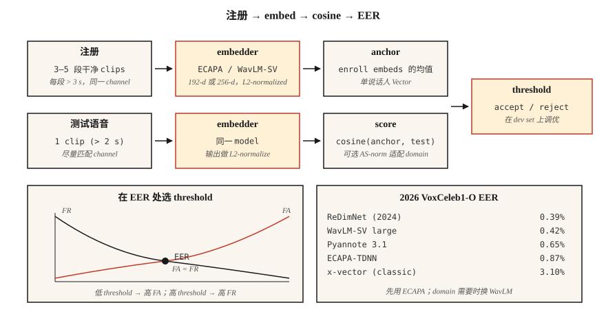

# 说话人识别与验证

> ASR 问的是“他们说了什么？”Speaker recognition 问的是“是谁说的？”数学形式看起来一样，即 Embedding 加 Cosine，但每一个生产决策都取决于单个 EER 数字。

**类型：** Build
**语言：** Python
**先修要求：** Phase 6 · 02 (Spectrograms & Mel), Phase 5 · 22 (Embedding Models)
**时间：** ~45 分钟

## 问题

用户说出一句 passphrase。你想知道：这是不是他们声称的那个人（*verification*, 1:1），或者是不是你 enrollment bank 中的第一个人（*identification*, 1:N）？或者都不是，这是不是一个未知说话人（*open-set*）？

2018 年以前：GMM-UBM + i-vectors。EER 尚可，但对 channel shift（phone vs laptop）和情绪很脆弱。2018–2022：x-vectors（用 angular margin 训练的 TDNN backbone）。2022+：ECAPA-TDNN 和 WavLM-large Embedding。到 2026 年，这个领域由三个模型和一个指标主导。

这个指标是 **EER**，即 Equal Error Rate。设置你的决策阈值，使 False Accept Rate = False Reject Rate。交叉点就是 EER。每篇论文、每个 leaderboard、每次采购评审都会使用它。

## 概念



**Pipeline。** Enrollment：录制目标说话人 5–30 秒音频；计算固定维度 Embedding（ECAPA-TDNN 为 192-d，WavLM-large 为 256-d）。Verification：获取测试 utterance 的 Embedding；计算 Cosine similarity；与阈值比较。

**ECAPA-TDNN（2020，2026 仍占主导）。** Emphasized Channel Attention, Propagation and Aggregation - Time-Delay Neural Network。1D conv blocks，带 squeeze-excitation、multi-head attention pooling，后接一个 linear layer 得到 192-d。使用 Additive Angular Margin loss（AAM-softmax）在 VoxCeleb 1+2（2,700 个说话人，1.1M 条 utterance）上训练。

**WavLM-SV（2022+）。** 使用 AAM loss fine-tune 预训练 WavLM-large SSL backbone。质量更高但更慢，300+ MB vs 15 MB。

**x-vector（baseline）。** TDNN + statistics pooling。经典方案；在 CPU / edge 上仍然有用。

**AAM-softmax。** 在 angular space 中加入 margin `m` 的标准 softmax：对正确类别使用 `cos(θ + m)`。强制类别间 angular separation。典型设置为 `m=0.2`，scale `s=30`。

### Scoring

- **Cosine** 用于比较 enrollment 和 test Embedding。基于阈值做决策。
- **PLDA (Probabilistic LDA)。** 将 Embedding 投影到 latent space，在其中 same-speaker vs different-speaker 有 closed-form likelihood ratio。叠加在 Cosine 之上，可降低 10–20% EER。2020 年前是标准做法；现在只在 closed-set 设置中使用。
- **Score normalization。** `S-norm` 或 `AS-norm`：用一组 imposter cohort 的均值和 std 对每个 score 进行归一化。对 cross-domain eval 很关键。

### 你应该知道的数字（2026）

| Model | VoxCeleb1-O EER | Params | Throughput (A100) |
|-------|-----------------|--------|-------------------|
| x-vector (classic) | 3.10% | 5 M | 400× RT |
| ECAPA-TDNN | 0.87% | 15 M | 200× RT |
| WavLM-SV large | 0.42% | 316 M | 20× RT |
| Pyannote 3.1 segmentation + embedding | 0.65% | 6 M | 100× RT |
| ReDimNet (2024) | 0.39% | 24 M | 100× RT |

### Diarization

在多说话人音频片段中判断“谁在什么时候说话”。Pipeline：VAD → segment → 对每个 segment 做 Embedding → cluster（agglomerative 或 spectral）→ 平滑边界。现代 stack：`pyannote.audio` 3.1，它把 speaker segmentation + embedding + clustering 封装在一次调用后面。2026 年 AMI 上的 SOTA DER 约为 15%（低于 2022 年的 23%）。

```figure
sp-eer-crossover
```

## 构建它
### 步骤 1：从 MFCC statistics 构造玩具 Embedding

```python
def embed_mfcc_stats(signal, sr):
    frames = featurize_mfcc(signal, sr, n_mfcc=13)
    mean = [sum(f[i] for f in frames) / len(frames) for i in range(13)]
    std = [
        math.sqrt(sum((f[i] - mean[i]) ** 2 for f in frames) / len(frames))
        for i in range(13)
    ]
    return mean + std  # 26-d
```

离 SOTA 很远，仅用于教学。`code/main.py` 将其作为 synthetic speaker data 上的 proof-of-concept。

### 步骤 2：Cosine similarity + threshold

```python
def cosine(a, b):
    dot = sum(x * y for x, y in zip(a, b))
    na = math.sqrt(sum(x * x for x in a))
    nb = math.sqrt(sum(x * x for x in b))
    return dot / (na * nb) if na and nb else 0.0

def verify(enroll, test, threshold=0.75):
    return cosine(enroll, test) >= threshold
```

### 步骤 3：从 similarity pairs 计算 EER

```python
def eer(same_scores, diff_scores):
    thresholds = sorted(set(same_scores + diff_scores))
    best = (1.0, 1.0, 0.0)  # (fa, fr, threshold)
    for t in thresholds:
        fr = sum(1 for s in same_scores if s < t) / len(same_scores)
        fa = sum(1 for s in diff_scores if s >= t) / len(diff_scores)
        if abs(fa - fr) < abs(best[0] - best[1]):
            best = (fa, fr, t)
    return (best[0] + best[1]) / 2, best[2]
```

返回 (eer, threshold_at_eer)。两个都要报告。

### 步骤 4：使用 SpeechBrain 做生产实现

```python
from speechbrain.pretrained import EncoderClassifier

clf = EncoderClassifier.from_hparams(source="speechbrain/spkrec-ecapa-voxceleb")

# enroll: average the embeddings of 3-5 clean samples
enroll = torch.stack([clf.encode_batch(load(x)) for x in enrollment_clips]).mean(0)
# verify
score = clf.similarity(enroll, clf.encode_batch(load("test.wav"))).item()
verdict = score > 0.25   # ECAPA typical threshold; tune on your data
```

### 步骤 5：使用 pyannote 做 diarize

```python
from pyannote.audio import Pipeline

pipe = Pipeline.from_pretrained("pyannote/speaker-diarization-3.1")
diarization = pipe("meeting.wav", num_speakers=None)
for turn, _, speaker in diarization.itertracks(yield_label=True):
    print(f"{turn.start:.1f}–{turn.end:.1f}  {speaker}")
```

## 使用它
2026 年的 stack：

| Situation | Pick |
|-----------|------|
| Closed-set 1:1 verification, edge | ECAPA-TDNN + cosine threshold |
| Open-set verification, cloud | WavLM-SV + AS-norm |
| Diarization (meetings, podcasts) | `pyannote/speaker-diarization-3.1` |
| Anti-spoofing (replay / deepfake detection) | AASIST or RawNet2 |
| Tiny embedded (KWS + enrollment) | Titanet-Small (NeMo) |

## 陷阱
- **Channel mismatch。** 在 VoxCeleb（web video）上训练的模型 ≠ phone-call audio。始终在目标 channel 上评估。
- **短 utterance。** 测试音频低于 3 秒时，EER 会急剧变差。
- **带噪声的 enrollment。** 一个 noisy enrollment 会污染 anchor。使用 ≥3 个干净样本并取平均。
- **跨条件固定阈值。** 始终在来自目标 domain 的 held-out dev set 上调阈值。
- **对未归一化 Embedding 使用 Cosine。** 先做 L2-normalize；否则 magnitude 会主导结果。

## 交付它
保存为 `outputs/skill-speaker-verifier.md`。选择模型、enrollment protocol、threshold-tuning plan 和 fraud safeguards。

## 练习
1. **Easy。** 运行 `code/main.py`。构建 synthetic “speakers”（不同 tone profiles），执行 enroll，并在 100-pair trial list 上计算 EER。
2. **Medium。** 在 30 条 VoxCeleb1 utterance（5 个 speakers × 每人 6 条）上使用 SpeechBrain ECAPA。比较 Cosine vs PLDA 的 EER。
3. **Hard。** 使用 `pyannote.audio` 构建完整 enroll → diarize → verify pipeline。在 AMI dev set 上评估 DER。

## 关键术语
| Term | What people say | What it actually means |
|------|-----------------|-----------------------|
| EER | 标题指标 | False Accept = False Reject 时的阈值。 |
| Verification | 1:1 | “这是 Alice 吗？” |
| Identification | 1:N | “是谁在说话？” |
| Open-set | 可能未知 | Test set 可以包含未 enrollment 的说话人。 |
| Enrollment | 注册 | 计算说话人的 reference Embedding。 |
| AAM-softmax | Loss | 带 additive angular margin 的 softmax；强制 cluster separation。 |
| PLDA | 经典 scoring | Probabilistic LDA；在 Embedding 之上做 likelihood-ratio scoring。 |
| DER | Diarization metric | Diarization Error Rate，即 miss + false alarm + confusion。 |

## 延伸阅读
- [Snyder et al. (2018). X-Vectors: Robust DNN Embeddings for Speaker Recognition](https://www.danielpovey.com/files/2018_icassp_xvectors.pdf) — 经典 deep-embedding 论文。
- [Desplanques et al. (2020). ECAPA-TDNN](https://arxiv.org/abs/2005.07143) — 2020–2026 年的主导架构。
- [Chen et al. (2022). WavLM: Large-Scale Self-Supervised Pre-Training for Full Stack Speech Processing](https://arxiv.org/abs/2110.13900) — 用于 SV 和 diarization 的 SSL backbone。
- [Bredin et al. (2023). pyannote.audio 3.1](https://github.com/pyannote/pyannote-audio) — 生产级 diarization + Embedding stack。
- [VoxCeleb leaderboard (updated 2026)](https://www.robots.ox.ac.uk/~vgg/data/voxceleb/) — 当前各模型的 EER 排名。
