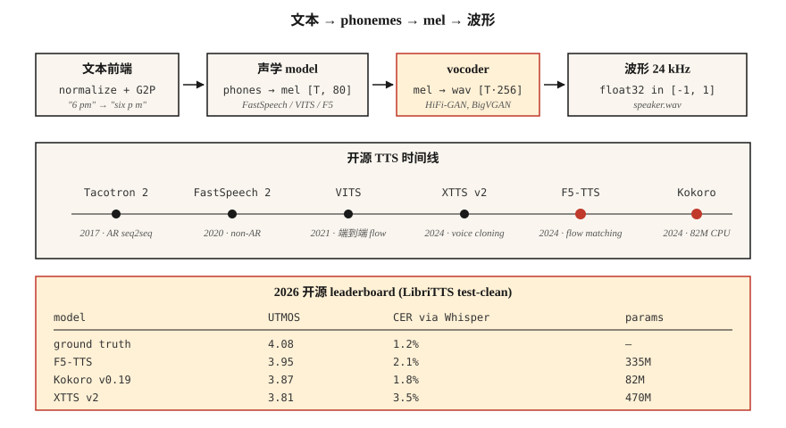

# Text-to-Speech (TTS) — 从 Tacotron 到 F5 和 Kokoro

> ASR 将语音反转为文本；TTS 将文本反转为语音。2026 年的技术栈分为三部分：text → Token，Token → mel，mel → waveform。每一部分都有一个适合在笔记本电脑上运行的默认模型。

**Type:** Build
**Languages:** Python
**先修要求:** Phase 6 · 02 (Spectrograms & Mel), Phase 5 · 09 (Seq2Seq), Phase 7 · 05 (Full Transformer)
**Time:** ~75 minutes

## 问题

你有一个字符串："Please remind me to water the plants at 6 pm." 你需要一个 3 秒的音频片段，听起来自然，有正确的 prosody（停顿、重音），用正确的元音发出 "plants"，并且能在 CPU 上 300 ms 内运行，以支持实时语音助手。你还需要切换声音、处理 code-switched input（"remind me at 6 pm, daijoubu?"），并且在姓名发音上不出丑。

现代 TTS pipeline 看起来像这样：

1. **Text frontend。** 规范化文本（日期、数字、电子邮件），转换为 Phoneme 或 subword Token，预测 prosody 特征。
2. **声学模型。** Text → mel spectrogram。Tacotron 2 (2017), FastSpeech 2 (2020), VITS (2021), F5-TTS (2024), Kokoro (2024)。
3. **Vocoder。** Mel → waveform。WaveNet (2016), WaveRNN, HiFi-GAN (2020), BigVGAN (2022), 以及 2024+ 的 neural codec vocoders。

到 2026 年，随着端到端 Diffusion 和 flow-matching models 的出现，acoustic + vocoder 的分割变得模糊。但三部分的心智模型在调试时仍然成立。

## 概念



**Tacotron 2 (2017)。** Seq2seq：char-embedding → BiLSTM encoder → location-sensitive attention → autoregressive LSTM decoder 输出 mel frames。慢（AR），长文本上不稳定。仍被作为 baseline 引用。

**FastSpeech 2 (2020)。** Non-autoregressive。Duration predictor 输出每个 Phoneme 获得多少 mel frames。1-pass，比 Tacotron 快 10×。损失一些自然度（monotonic alignment），但到处都在用。

**VITS (2021)。** 通过 variational inference 将 encoder + flow-based duration + HiFi-GAN vocoder 端到端联合训练。质量高，单模型。2022–2024 年主导开源 TTS。变体：YourTTS（multi-speaker zero-shot）、XTTS v2（2024，Coqui）。

**F5-TTS (2024)。** 基于 flow matching 的 Diffusion Transformer。自然 prosody，使用 5 秒参考音频进行 zero-shot voice cloning。2026 年开源 TTS 排行榜顶尖。335M params。

**Kokoro (2024)。** 小型（82M）、可在 CPU 上运行、实时使用场景下一流的 English TTS。封闭词表、仅 English、apache-2.0。

**OpenAI TTS-1-HD, ElevenLabs v2.5, Google Chirp-3。** 商业 state of the art。ElevenLabs v2.5 的 emotion tags（"[whispered]", "[laughing]"）和 character voices 在 2026 年主导 audiobook production。

### Vocoder 演进

| Era | Vocoder | Latency | Quality |
|-----|---------|---------|---------|
| 2016 | WaveNet | 仅 offline | 发布时的 SOTA |
| 2018 | WaveRNN | ~realtime | good |
| 2020 | HiFi-GAN | 100× realtime | 接近人类 |
| 2022 | BigVGAN | 50× realtime | 可泛化到不同 speakers/langs |
| 2024 | SNAC, DAC (neural codecs) | 与 AR models 集成 | 离散 Token，比特效率高 |

到 2026 年，大多数 "TTS" models 都是从文本到 waveform 的端到端模型；mel spectrogram 是一种内部表示。

### 评估

- **MOS (Mean Opinion Score)。** 1–5 分制，crowd-sourced。仍然是 gold standard；非常慢。
- **CMOS (Comparative MOS)。** A-vs-B 偏好。每条 annotation 的 confidence intervals 更紧。
- **UTMOS, DNSMOS。** 无参考 neural MOS predictors。用于排行榜。
- **CER (Character Error Rate) via ASR。** 将 TTS output 通过 Whisper，计算与 input text 的 CER。作为 intelligibility 的 proxy。
- **SECS (Speaker Embedding Cosine Similarity)。** Voice-cloning 质量。

LibriTTS test-clean 上的 2026 数字：

| Model | UTMOS | CER (via Whisper) | Size |
|-------|-------|-------------------|------|
| Ground truth | 4.08 | 1.2% | — |
| F5-TTS | 3.95 | 2.1% | 335M |
| XTTS v2 | 3.81 | 3.5% | 470M |
| VITS | 3.62 | 3.1% | 25M |
| Kokoro v0.19 | 3.87 | 1.8% | 82M |
| Parler-TTS Large | 3.76 | 2.8% | 2.3B |

## 构建它

### 步骤 1： phonemize input

```python
from phonemizer import phonemize
ph = phonemize("Hello world", language="en-us", backend="espeak")
# 'həloʊ wɜːld'
```

Phoneme 是通用桥梁。避免把 raw text 输入给 VITS-level quality 以下的任何东西。

### 步骤 2：运行 Kokoro（2026 CPU 默认）

```python
from kokoro import KPipeline
tts = KPipeline(lang_code="a")  # "a" = American English
audio, sr = tts("Please remind me to water the plants at 6 pm.", voice="af_bella")
# audio: float32 tensor, sr=24000
```

离线运行，单文件，82M params。

### 步骤 3: 使用 voice cloning 运行 F5-TTS

```python
from f5_tts.api import F5TTS
tts = F5TTS()
wav = tts.infer(
    ref_file="my_voice_5s.wav",
    ref_text="The quick brown fox jumps over the lazy dog.",
    gen_text="Please remind me to water the plants.",
)
```

传入一个 5 秒参考片段及其 transcript；F5 会 clone prosody 和 timbre。

### 步骤 4：从零实现 HiFi-GAN vocoder

太大，无法放进 tutorial script，但形状如下：

```python
class HiFiGAN(nn.Module):
    def __init__(self, mel_channels=80, upsample_rates=[8, 8, 2, 2]):
        super().__init__()
        # 4 upsample blocks, total 256x to go from mel-rate to audio-rate
        ...
    def forward(self, mel):
        return self.blocks(mel)  # -> waveform
```

训练：adversarial（discriminator on short windows）+ mel-spectrogram reconstruction Loss + feature-matching Loss。已经商品化——使用 `hifi-gan` repo 或 nvidia-NeMo 的 pretrained checkpoints。

### 步骤 5： the full pipeline (pseudocode)

```python
text = "Please remind me at 6 pm."
phones = phonemize(text)
mel = acoustic_model(phones, speaker=alice)      # [T, 80]
wav = vocoder(mel)                                # [T * 256]
soundfile.write("out.wav", wav, 24000)
```

## 使用它

2026 年技术栈：

| Situation | Pick |
|-----------|------|
| 实时 English voice assistant | Kokoro (CPU) 或 XTTS v2 (GPU) |
| 从 5 s reference 进行 voice cloning | F5-TTS |
| 商业 character voices | ElevenLabs v2.5 |
| Audiobook narration | ElevenLabs v2.5 或 XTTS v2 + fine-tune |
| Low-resource language | 在 5–20 h target-lang data 上训练 VITS |
| Expressive / emotion tags | ElevenLabs v2.5 或 StyleTTS 2 fine-tune |

截至 2026 年的开源领先者：**F5-TTS 代表质量，Kokoro 代表效率**。除非你是历史学家，否则不要选择 Tacotron。

## 陷阱

- **没有 text normalizer。** "Dr. Smith" 读作 "Doctor" 还是 "Drive"？"2026" 读作 "twenty twenty six" 还是 "two zero two six"？在 phonemizer 之前规范化。
- **OOV proper nouns。** "Ghumare" → "ghyu-mair"？为 unknown tokens 配备 fallback grapheme-to-phoneme model。
- **Clipping。** Vocoder output 很少 clipping，但 inference 时 mel scaling mismatch 可能超出 ±1.0。始终使用 `np.clip(wav, -1, 1)`。
- **Sample-rate mismatch。** Kokoro 输出 24 kHz；你的 downstream pipeline 期望 16 kHz → resample，否则会出现 aliasing。

## 交付它

保存为 `outputs/skill-tts-designer.md`。为给定的 voice、latency 和 language target 设计一个 TTS pipeline。

## 练习

1. **Easy。** 运行 `code/main.py`。从 toy vocab 构建 Phoneme dictionary，估计每个 Phoneme 的 duration，并打印一个假的 "mel" schedule。
2. **Medium。** 安装 Kokoro，分别使用 voice `af_bella` 和 `am_adam` 合成同一句话。比较 audio durations 和主观质量。
3. **Hard。** 录制一段你自己的 5 秒参考片段。使用 F5-TTS clone 它。报告 reference 和 cloned output 之间的 SECS。

## 关键术语

| Term | What people say | What it actually means |
|------|-----------------|-----------------------|
| Phoneme | 声音单位 | 抽象声音类别；English 中有 39 个（ARPABet）。 |
| Duration predictor | 每个 Phoneme 持续多久 | Non-AR model output；每个 Phoneme 的整数 frames。 |
| Vocoder | Mel → waveform | 将 mel-spec 映射到 raw samples 的 Neural net。 |
| HiFi-GAN | 标准 vocoder | 基于 GAN；主导 2020–2024。 |
| MOS | 主观质量 | 来自 human raters 的 1–5 mean opinion score。 |
| SECS | Voice-clone metric | target 和 output speaker Embedding 之间的 cosine similarity。 |
| F5-TTS | 2024 开源 SOTA | Flow-matching Diffusion；zero-shot cloning。 |
| Kokoro | CPU English leader | 82M-param model，Apache 2.0。 |

## 延伸阅读

- [Shen et al. (2017). Tacotron 2](https://arxiv.org/abs/1712.05884) — seq2seq baseline。
- [Kim, Kong, Son (2021). VITS](https://arxiv.org/abs/2106.06103) — 端到端 flow-based。
- [Chen et al. (2024). F5-TTS](https://arxiv.org/abs/2410.06885) — 当前开源 SOTA。
- [Kong, Kim, Bae (2020). HiFi-GAN](https://arxiv.org/abs/2010.05646) — 2026 年仍在发布使用的 vocoder。
- [Kokoro-82M on HuggingFace](https://huggingface.co/hexgrad/Kokoro-82M) — 2024 CPU-friendly English TTS。
