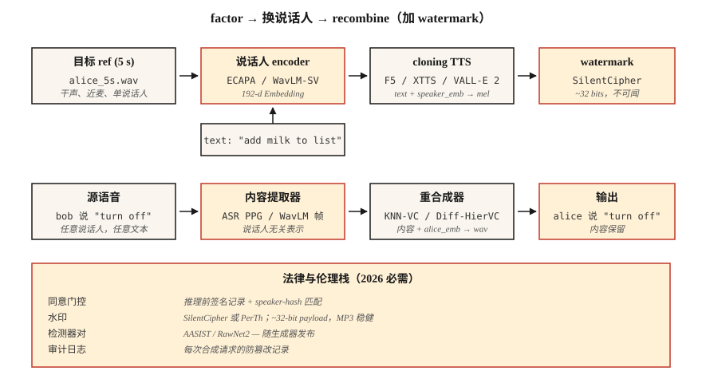

# Voice Cloning & Voice Conversion

> Voice cloning 会用别人的声音读出你的文本。Voice conversion 会在保留你所说内容的同时，把你的声音改写成别人的声音。两者都依赖同一个分解：把 speaker identity 与 content 分离。

**Type:** Build
**Languages:** Python
**Prerequisites:** Phase 6 · 06 (Speaker Recognition), Phase 6 · 07 (TTS)
**Time:** ~75 分钟

## The Problem

在 2026 年，一段 5 秒的 audio clip 已经足以用消费级 GPU 生成任何人声音的高质量 clone。ElevenLabs、F5-TTS、OpenVoice v2、VoiceBox 都已经提供 zero-shot 或 few-shot cloning。这项技术既是福音（accessibility TTS、配音、辅助语音），也是武器（诈骗电话、政治 deepfake、IP 盗窃）。

两个紧密相关的任务：

- **Voice cloning（TTS 侧）：** text + 5 秒 reference voice → 该声音的 audio。
- **Voice conversion（speech 侧）：** source audio（A 说 X）+ B 的 reference voice → B 说 X 的 audio。

两者都会把 waveform 分解成（content、speaker、prosody），再把一个来源的 content 与另一个来源的 speaker 重新组合。

你在 2026 年发布时必须满足的关键约束：**watermarking 与 consent gates 在 EU（AI Act，2026 年 8 月可执行）和 California（AB 2905，2025 年生效）已是法律要求**。你的 pipeline 必须输出 inaudible watermark，并拒绝未经 consent 的 clone。

## The Concept



**Zero-shot cloning。** 将 5 秒 clip 传给一个在数千名 speakers 上训练过的模型。speaker encoder 将 clip 映射为 speaker embedding；TTS decoder 以该 embedding 和 text 作为条件。

使用者：F5-TTS（2024）、YourTTS（2022）、XTTS v2（2024）、OpenVoice v2（2024）。

**Few-shot fine-tuning。** 录制目标声音的 5-30 分钟音频。对 base model 进行一小时 LoRA fine-tune。质量会从“还行”跃升到“难以区分”。Coqui 和 ElevenLabs 都支持这种模式；社区也将它用于 F5-TTS。

**Voice conversion（VC）。** 两类方法：

- **Recognition-synthesis。** 运行类似 ASR 的模型来提取 content representation（例如 soft phoneme posteriors、PPGs），然后用 target speaker embedding 重新合成。对 language 和 accent 更稳健。KNN-VC（2023）、Diff-HierVC（2023）使用这种方法。
- **Disentanglement。** 训练一个 autoencoder，在 bottleneck 的 latent space 中分离 content、speaker 和 prosody。推理时替换 speaker embedding。质量较低但更快。AutoVC（2019）、VITS-VC 变体使用这种方法。

**基于 Neural codec 的 cloning（2024+）。** VALL-E、VALL-E 2、NaturalSpeech 3、VoiceBox —— 将 audio 视为来自 SoundStream / EnCodec 的离散 tokens，在 codec tokens 上训练大型 autoregressive 或 flow-matching 模型。短 prompt 上的质量可与 ElevenLabs 相比。

### 伦理部分，不是附加项

**Watermarking。** PerTh（Perth）和 SilentCipher（2024）会在 audio 中不可感知地嵌入约 16-32 bit ID。它能经受 re-encoding、streaming 和常见编辑。已具备生产可用的 open source 实现。

**Consent gates。** 必须将每个 cloned output 与可验证的 consent record 配对。“我，Rohit，于 2026-04-22，授权将此 voice 用于 X purpose。”存储在 tamper-evident log 中。

**Detection。** AASIST、RawNet2 和 Wav2Vec2-AASIST 都提供 detector。ASVspoof 2025 challenge 发布的结果显示，state-of-the-art detectors 针对 ElevenLabs、VALL-E 2 和 Bark 输出的 EER 为 0.8–2.3%。

### Numbers（2026）

| Model | Zero-shot? | SECS (target sim) | WER (intel.) | Params |
|-------|-----------|--------------------|--------------|--------|
| F5-TTS | Yes | 0.72 | 2.1% | 335M |
| XTTS v2 | Yes | 0.65 | 3.5% | 470M |
| OpenVoice v2 | Yes | 0.70 | 2.8% | 220M |
| VALL-E 2 | Yes | 0.77 | 2.4% | 370M |
| VoiceBox | Yes | 0.78 | 2.1% | 330M |

SECS > 0.70 对大多数听众而言通常已经与目标声音难以区分。

## Build It

### Step 1: 用 recognition-synthesis 分解（`main.py` 中的 code-only demo）

```python
def clone_pipeline(ref_audio, text, target_embedder, tts_model):
    speaker_emb = target_embedder.encode(ref_audio)
    mel = tts_model(text, speaker=speaker_emb)
    return vocoder(mel)
```

概念上很简单；实现的主要复杂度在 `tts_model` 和 speaker encoder 中。

### Step 2: 用 F5-TTS 做 zero-shot clone

```python
from f5_tts.api import F5TTS
tts = F5TTS()
wav = tts.infer(
    ref_file="rohit_5s.wav",
    ref_text="The quick brown fox jumps over the lazy dog.",
    gen_text="Please add milk and bread to my list.",
)
```

Reference transcript 必须与 audio 完全匹配；不匹配会破坏 alignment。

### Step 3: 用 KNN-VC 做 voice conversion

```python
import torch
from knnvc import KNNVC  # 2023 model, https://github.com/bshall/knn-vc
vc = KNNVC.load("wavlm-base-plus")
out_wav = vc.convert(source="my_voice.wav", target_pool=["alice_1.wav", "alice_2.wav"])
```

KNN-VC 运行 WavLM，为 source 与 target pool 提取 per-frame embeddings，然后将每个 source frame 替换为 pool 中的 nearest neighbor。非参数方法，使用一分钟 target speech 即可工作。

### Step 4: 嵌入 watermark

```python
from silentcipher import SilentCipher
sc = SilentCipher(model="2024-06-01")
payload = b"consent_id:abc123;ts:1745353200"
watermarked = sc.embed(wav, sr=24000, message=payload)
detected = sc.detect(watermarked, sr=24000)   # returns payload bytes
```

约 32 bits payload，在 MP3 re-encode 和轻微 noise 后仍可检测。

### Step 5: consent gate

```python
def cloned_inference(text, ref_audio, consent_record):
    assert verify_signature(consent_record), "Signed consent required"
    assert consent_record["speaker_id"] == hash_speaker(ref_audio)
    wav = tts.infer(ref_file=ref_audio, gen_text=text)
    wav = watermark(wav, payload=consent_record["id"])
    return wav
```

## Use It

2026 年的 stack：

| Situation | Pick |
|-----------|------|
| 5 秒 zero-shot clone，open-source | F5-TTS 或 OpenVoice v2 |
| 商业生产 cloning | ElevenLabs Instant Voice Clone v2.5 |
| Voice conversion（rewriting） | KNN-VC 或 Diff-HierVC |
| Many-speaker fine-tune | StyleTTS 2 + speaker adapter |
| Cross-lingual cloning | XTTS v2 或 VALL-E X |
| Deepfake detection | Wav2Vec2-AASIST |

## Pitfalls

- **Reference transcript 未对齐。** F5-TTS 和类似模型要求 reference text 与 reference audio 完全匹配，包括标点。
- **Reference 有混响。** Echo 会毁掉 clone。用近距离麦克风录制干声。
- **情绪不匹配。** “cheerful”的 training reference 会让所有内容都变成 cheerful clone。让 reference emotion 匹配目标用途。
- **Language leakage。** Clone English speaker 后让模型说 French，通常仍会带着 accent；使用 cross-lingual models（XTTS、VALL-E X）。
- **没有 watermark。** 从 2026 年 8 月起，在 EU 无法合法发布。

## Ship It

保存为 `outputs/skill-voice-cloner.md`。设计一个带有 consent gate + watermark + quality target 的 cloning 或 conversion pipeline。

## Exercises

1. **Easy。** 运行 `code/main.py`。通过计算两个“speakers”在 swap 前后的 cosine，演示 speaker-embedding swap。
2. **Medium。** 使用 OpenVoice v2 clone 你自己的 voice。测量 reference 与 clone 之间的 SECS。通过 Whisper 测量 CER。
3. **Hard。** 对 20 个 clones 应用 SilentCipher watermark，将它们通过 128 kbps MP3 encode+decode，再检测 payload。报告 bit-accuracy。

## Key Terms

| Term | What people say | What it actually means |
|------|-----------------|-----------------------|
| Zero-shot clone | 5 秒就够了 | Pretrained model + speaker embedding；不需要训练。 |
| PPG | Phonetic posteriorgram | 用作 language-agnostic content rep 的 per-frame ASR posteriors。 |
| KNN-VC | Nearest-neighbor conversion | 将每个 source frame 替换为 nearest target-pool frame。 |
| Neural codec TTS | VALL-E style | EnCodec/SoundStream tokens 上的 AR model。 |
| Watermark | Inaudible signature | 嵌入 audio 中的 bits，可经受 re-encode。 |
| SECS | Cloning fidelity | target 与 clone 的 speaker embeddings 之间的 cosine。 |
| AASIST | Deepfake detector | Anti-spoof model；检测 synthesized speech。 |

## Further Reading

- [Chen et al. (2024). F5-TTS](https://arxiv.org/abs/2410.06885) — open-source SOTA zero-shot cloning。
- [Baevski et al. / Microsoft (2023). VALL-E](https://arxiv.org/abs/2301.02111) 和 [VALL-E 2 (2024)](https://arxiv.org/abs/2406.05370) — neural-codec TTS。
- [Qian et al. (2019). AutoVC](https://arxiv.org/abs/1905.05879) — 基于 disentanglement 的 voice conversion。
- [Baas, Waubert de Puiseau, Kamper (2023). KNN-VC](https://arxiv.org/abs/2305.18975) — 基于 retrieval 的 VC。
- [SilentCipher (2024) — Audio Watermarking](https://github.com/sony/silentcipher) — 生产可用的 32-bit audio watermark。
- [ASVspoof 2025 results](https://www.asvspoof.org/) — detector 与 synthesizer 的军备竞赛，2026 年更新。
