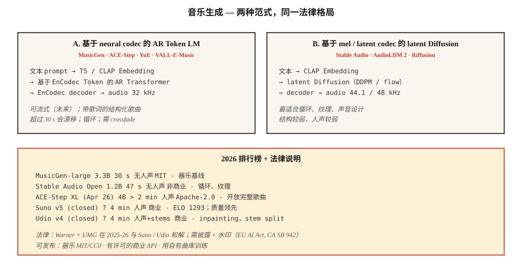

# 音乐生成 — MusicGen, Stable Audio, Suno，以及许可格局的剧变

> 2026 年的音乐生成：Suno v5 和 Udio v4 主导商业市场；MusicGen, Stable Audio Open 和 ACE-Step 引领开源方向。技术问题基本已经解决。法律问题（Warner Music $500M 和解、UMG 和解）在 2025-2026 年重塑了整个领域。

**Type:** Build
**Languages:** Python
**Prerequisites:** Phase 6 · 02 (Spectrograms), Phase 4 · 10 (Diffusion Models)
**Time:** ~75 minutes

## 问题

文本 → 一段 30 秒到 4 分钟的音乐片段，包含歌词、人声和结构。三个子问题：

1. **器乐生成。** 像 "lo-fi hip-hop drums with warm keys" 这样的文本 → 音频。MusicGen, Stable Audio, AudioLDM。
2. **歌曲生成（带人声 + 歌词）。** "Country song about rainy Texas nights" → 完整歌曲。Suno, Udio, YuE, ACE-Step。
3. **条件式 / 可控。** 扩展已有片段、重新生成 bridge、切换 genre、stem-separate，或 inpaint。Udio 的 inpainting + stem separation 是 2026 年要对标的功能。

## 概念



### 基于 neural-codec Token 的 Token LM

Meta 的 **MusicGen**（2023，MIT）以及许多衍生模型：以文本 / 旋律 Embedding 为条件，自回归预测 EnCodec Token（32 kHz，4 个 codebooks），再用 EnCodec 解码。300M - 3.3B 参数。强基线；超过 30 秒后表现吃力。

**ACE-Step**（开源，4B XL 于 2026 年 4 月发布）将这一方向扩展到以歌词为条件的完整歌曲生成。它是开源社区最接近 Suno 的方案。

### 基于 mel 或 latent 的 Diffusion

**Stable Audio (2023)** 和 **Stable Audio Open (2024)**：在压缩音频上做 latent Diffusion。擅长 loop、sound design、ambient texture。不太适合结构化完整歌曲。

**AudioLDM / AudioLDM2**：通过 T2I-style latent Diffusion 做 text-to-audio，泛化到音乐、音效、语音。

### Hybrid（生产级）— Suno, Udio, Lyria

闭源权重。很可能是 AR codec LM + 基于 Diffusion 的 vocoder，并配有专门的 voice / drum / melody heads。Suno v5（2026）是 ELO 1293 的质量领先者。Udio v4 增加了 inpainting + stem separation（bass, drums, vocals 可分开下载）。

### 评估

- **FAD (Fréchet Audio Distance)。** 使用 VGGish 或 PANNs features，衡量生成音频分布与真实音频分布之间的 Embedding 层级距离。越低越好。MusicGen small：MusicCaps 上 4.5 FAD；SOTA ~3.0。
- **音乐性（主观）。** 人类偏好。Suno v5 ELO 1293 领先。
- **文本-音频对齐。** prompt 与输出之间的 CLAP score。
- **音乐性瑕疵。** 节拍错位的转场、人声短语漂移、30 秒后结构丢失。

## 2026 模型地图

| Model | Params | Length | Vocals | License |
|-------|--------|--------|--------|---------|
| MusicGen-large | 3.3B | 30 s | no | MIT |
| Stable Audio Open | 1.2B | 47 s | no | Stability non-commercial |
| ACE-Step XL (Apr 2026) | 4B | &gt; 2 min | yes | Apache-2.0 |
| YuE | 7B | &gt; 2 min | yes, multilingual | Apache-2.0 |
| Suno v5 (closed) | ? | 4 min | yes, ELO 1293 | commercial |
| Udio v4 (closed) | ? | 4 min | yes + stems | commercial |
| Google Lyria 3 (closed) | ? | real-time | yes | commercial |
| MiniMax Music 2.5 | ? | 4 min | yes | commercial API |

## 法律格局（2025-2026）

- **Warner Music vs Suno 和解。** $500M。WMG 现在对 Suno 上的 AI-likeness、音乐权利和用户生成曲目拥有监督权。Udio 上也有类似的 UMG 和解。
- **EU AI Act** + **California SB 942**：AI 生成音乐必须披露。
- MIT 许可下的 **Riffusion / MusicGen** 没有合规包袱，但也没有商业级人声。

可安全交付的模式：

1. 只生成器乐（MusicGen, Stable Audio Open, MIT/CC0 输出）。
2. 使用商业 API（Suno, Udio, ElevenLabs Music），并带有按次生成的许可。
3. 在自有或已授权曲库上训练（大多数企业最终会走到这里）。
4. 为生成内容添加水印 + metadata。

## 构建它

### 步骤 1： 使用 MusicGen 生成

```python
from audiocraft.models import MusicGen
import torchaudio

model = MusicGen.get_pretrained("facebook/musicgen-small")
model.set_generation_params(duration=10)
wav = model.generate(["upbeat synthwave with driving drums, 128 BPM"])
torchaudio.save("out.wav", wav[0].cpu(), 32000)
```

三种尺寸：`small`（300M，快速）、`medium`（1.5B）、`large`（3.3B）。Small 足够验证“这个想法是否成立”。

### 步骤 2： 旋律条件控制

```python
melody, sr = torchaudio.load("humming.wav")
wav = model.generate_with_chroma(
    ["jazz piano cover"],
    melody.squeeze(),
    sr,
)
```

MusicGen-melody 接收 chromagram，在替换 timbre 的同时保留 tune。适合“把这段旋律变成 string quartet”。

### 步骤 3： FAD 评估

```python
from frechet_audio_distance import FrechetAudioDistance
fad = FrechetAudioDistance()

fad.get_fad_score("generated_folder/", "reference_folder/")
```

计算 VGGish-Embedding 距离。适合 genre 层级的回归测试；不能替代人类听众。

### 步骤 4： 加入 LLM-music workflow

结合 Lessons 7-8 中的思路：

```python
prompt = "Write a 30-second jazz loop. Describe the drums, bass, and piano voicing."
description = llm.complete(prompt)
music = musicgen.generate([description], duration=30)
```

## 使用它

| Goal | Stack |
|------|-------|
| 器乐 sound design | Stable Audio Open |
| 游戏 / adaptive music | Google Lyria RealTime (closed) |
| 带人声的完整歌曲（商业） | Suno v5 or Udio v4 with explicit license |
| 带人声的完整歌曲（开源） | ACE-Step XL or YuE |
| 短广告 jingle | MusicGen melody-conditioned on a hummed reference |
| 音乐视频背景 | MusicGen + Stable Video Diffusion |

## 2026 年仍会进生产的陷阱

- **版权洗白 prompt。** "Song in the style of Taylor Swift" — 商业 Suno/Udio 现在会过滤这些，开源模型不会。添加你自己的过滤列表。
- **30 秒后的重复 / 漂移。** AR 模型会循环。对多次生成做 crossfade，或使用 ACE-Step 获得结构一致性。
- **Tempo 漂移。** 模型会偏离 BPM。在 prompt 中使用 BPM tags，并用 librosa 的 `beat_track` 做后处理过滤。
- **人声清晰度。** Suno 很出色；开源模型在人声单词上常常很糊。如果歌词重要，使用商业 API 或 fine-tune。
- **Mono 输出。** 开源模型生成 mono 或假 stereo。用合适的 stereo reconstruction 升级（ezst, Cartesia 的 stereo Diffusion）。

## 交付它

保存为 `outputs/skill-music-designer.md`。为一次 music-gen deployment 选择模型、许可策略、长度 / 结构计划和披露 metadata。

## 练习

1. **Easy.** 运行 `code/main.py`。它会用 ASCII 符号生成一个“generative”和弦进行 + 鼓 pattern，也就是一幅 music-gen cartoon。如果愿意，可以用任意 MIDI renderer 播放。
2. **Medium.** 安装 `audiocraft`，使用 MusicGen-small 针对 4 个 genre prompt 生成 10 秒片段，并根据参考 genre set 测量 FAD。
3. **Hard.** 使用 ACE-Step（或 MusicGen-melody），用不同 timbre prompts 为同一段 tune 生成三个变体。计算与 prompt 的 CLAP similarity 来验证对齐。

## 关键术语

| Term | 人们常说 | 实际含义 |
|------|----------|----------|
| FAD | Audio FID | 真实音频与生成音频的 Embedding 分布之间的 Fréchet distance。 |
| Chromagram | 作为 pitches 的旋律 | 每帧 12 维 Vector；作为 melody conditioning 的输入。 |
| Stems | 乐器 tracks | 分离出的 bass / drums / vocals / melody，格式为 WAV。 |
| Inpainting | 重新生成某一段 | Mask 一个时间窗口；模型只重新生成那一段。 |
| CLAP | Text-audio CLIP | 对比式 audio-text Embedding；评估 text-audio alignment。 |
| EnCodec | Music codec | MusicGen 使用的 Meta neural codec；32 kHz，4 个 codebooks。 |

## 延伸阅读

- [Copet et al. (2023). MusicGen](https://arxiv.org/abs/2306.05284) — 开源自回归 benchmark。
- [Evans et al. (2024). Stable Audio Open](https://arxiv.org/abs/2407.14358) — sound-design 默认选择。
- [ACE-Step](https://github.com/ace-step/ACE-Step) — 开源 4B 完整歌曲生成器，2026 年 4 月。
- [Suno v5 platform docs](https://suno.com) — 商业质量领先者。
- [AudioLDM2](https://arxiv.org/abs/2308.05734) — 用于音乐 + 音效的 latent Diffusion。
- [WMG-Suno settlement coverage](https://www.musicbusinessworldwide.com/suno-warner-music-settlement/) — 2025 年 11 月先例。
