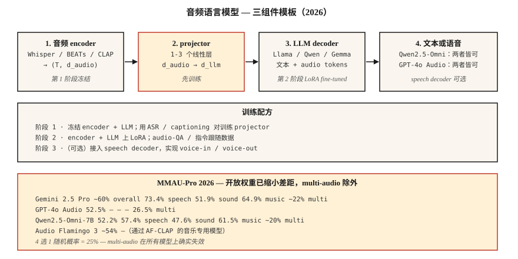

# Audio-Language Models — Qwen2.5-Omni, Audio Flamingo, GPT-4o Audio

> 2026 年的 audio-language models 可以对语音 + 环境声音 + 音乐进行推理。Qwen2.5-Omni-7B 在 MMAU-Pro 上达到 GPT-4o Audio 水平。Audio Flamingo Next 在 LongAudioBench 上超过 Gemini 2.5 Pro。开源与闭源之间的差距基本已经消失——除了 multi-audio 任务，在这类任务上所有模型都接近随机水平。

**Type:** Learn
**Languages:** Python
**Prerequisites:** Phase 6 · 04 (ASR), Phase 12 · 03 (Vision-Language Models), Phase 7 · 10 (Audio Transformers)
**Time:** ~45 分钟

## 问题

你有 5 秒音频：狗叫，有人大喊 "stop!"，然后是沉默。有用的问题会跨越多个维度：

- **转写。** "说了什么？"——这是 ASR 的领域。
- **语义推理。** "这个人有危险吗？"——需要联合理解狗叫 + 呼喊 + 沉默。
- **音乐推理。** "哪些乐器在演奏旋律？"
- **长音频检索。** "这段 90 分钟讲座里，讲师在哪里解释了 Gradient Descent？"

一个能用同一个 prompt 回答所有这些问题的模型就是 **audio-language model** (LALM / ALM)。它不同于纯 ASR：LALMs 输出自由形式的自然语言答案，而不只是 transcript。

## 概念



### 三组件模板

每个 2026 年的 LALM 都有相同骨架：

1. **Audio encoder.** Whisper encoder · BEATs · CLAP · WavLM · 或每个模型自定义的 encoder。
2. **Projector.** Linear 或 MLP，把 audio-encoder features 桥接到 LLM 的 Token Embedding 空间。
3. **LLM.** 基于 Llama / Qwen / Gemma 的 decoder。接收交错的文本 + audio tokens；生成文本。

训练：

- **Stage 1.** 冻结 encoder + LLM；只在 ASR / captioning 数据上训练 projector。
- **Stage 2.** 在 instruction-following 音频任务上进行 full / LoRA fine-tune（QA、reasoning、music understanding）。
- **Stage 3（可选）。** Voice-in / voice-out 会添加 speech decoder。Qwen2.5-Omni 和 AF3-Chat 会这样做。

### 2026 模型地图

| Model | Backbone | Audio encoder | Output modality | Access |
|-------|----------|---------------|-----------------|--------|
| Qwen2.5-Omni-7B | Qwen2.5-7B | Custom + Whisper | text + speech | Apache-2.0 |
| Qwen3-Omni | Qwen3 | Custom | text + speech | Apache-2.0 |
| Audio Flamingo 3 | Qwen2 | AF-CLAP | text | NVIDIA non-commercial |
| Audio Flamingo Next | Qwen2 | AF-CLAP v2 | text | NVIDIA non-commercial |
| SALMONN | Vicuna | Whisper + BEATs | text | Apache-2.0 |
| LTU / LTU-AS | Llama | CAV-MAE | text | Apache-2.0 |
| GAMA | Llama | AST + Q-Former | text | Apache-2.0 |
| Gemini 2.5 Flash/Pro (closed) | Gemini | proprietary | text + speech | API |
| GPT-4o Audio (closed) | GPT-4o | proprietary | text + speech | API |

### Benchmark 现实检查（2026）

**MMAU-Pro.** 1800 个 QA 对，覆盖 speech / sound / music / mixed。包含 multi-audio 子集。

| Model | Overall | Speech | Sound | Music | Multi-audio |
|-------|---------|--------|-------|-------|-------------|
| Gemini 2.5 Pro | ~60% | 73.4% | 51.9% | 64.9% | ~22% |
| Gemini 2.5 Flash | ~57% | 73.4% | 50.5% | 64.9% | 21.2% |
| GPT-4o Audio | 52.5% | — | — | — | 26.5% |
| Qwen2.5-Omni-7B | 52.2% | 57.4% | 47.6% | 61.5% | ~20% |
| Audio Flamingo 3 | ~54% | — | — | — | — |
| Audio Flamingo Next | LongAudioBench 上的 SOTA | — | — | — | — |

**multi-audio 列对所有模型都很致命。** 4 选 1 多选题的随机概率 = 25%；大多数模型就在这个水平附近。LALMs 仍然很难比较两个片段。

### LALMs 在 2026 年适合用在哪里

- **呼叫中心录音的合规审计。** "坐席是否提到了必需的披露说明？"
- **无障碍。** 向聋人用户描述声音事件（不只是转写）。
- **内容审核。** 检测暴力语言 + 威胁语气 + 背景上下文。
- **播客 / 会议章节划分。** 语义摘要，而不只是 speaker turns。
- **音乐目录分析。** "找出所有带有 B-section 转调的曲目。"

### 它们还不适合用在哪里

- 细粒度乐理（低于和弦层级）。
- 对长对话进行带说话人归属的推理（超过 10 分钟后退化）。
- Multi-audio 比较（22-26% 只比随机略高）。
- 实时流式推理（大多数是离线 batch inference）。

```figure
v4-alm-tokens
```

## 构建它

### 步骤 1： 查询 Qwen2.5-Omni

```python
from transformers import AutoModelForCausalLM, AutoProcessor

processor = AutoProcessor.from_pretrained("Qwen/Qwen2.5-Omni-7B")
model = AutoModelForCausalLM.from_pretrained("Qwen/Qwen2.5-Omni-7B", torch_dtype="auto")

audio, sr = load_wav("clip.wav", sr=16000)
messages = [{
    "role": "user",
    "content": [
        {"type": "audio", "audio": audio},
        {"type": "text", "text": "What sounds do you hear, and what's happening?"},
    ],
}]
inputs = processor.apply_chat_template(messages, tokenize=True, return_tensors="pt")
output = model.generate(**inputs, max_new_tokens=200)
print(processor.decode(output[0], skip_special_tokens=True))
```

### 步骤 2： projector 模式

```python
import torch.nn as nn

class AudioProjector(nn.Module):
    def __init__(self, audio_dim=1280, llm_dim=4096):
        super().__init__()
        self.down = nn.Linear(audio_dim, llm_dim)
        self.act = nn.GELU()
        self.up = nn.Linear(llm_dim, llm_dim)

    def forward(self, audio_features):
        return self.up(self.act(self.down(audio_features)))
```

就是这样。projector 通常是 1-3 个 linear layers。在 ASR 对（audio → transcript）上训练它，就是 Stage-1 pretext task。

### 步骤 3： Benchmark MMAU / LongAudioBench

```python
from datasets import load_dataset
mmau = load_dataset("MMAU/MMAU-Pro")

correct = 0
for item in mmau["test"]:
    answer = call_model(item["audio"], item["question"], item["choices"])
    if answer == item["correct_choice"]:
        correct += 1
print(f"Accuracy: {correct / len(mmau['test']):.3f}")
```

分别报告每个类别（speech / sound / music / multi-audio）。聚合数字会掩盖模型在哪里失败。

## 使用它

| Task | 2026 pick |
|------|-----------|
| 自由形式 audio QA（open） | Qwen2.5-Omni-7B |
| 长音频上最好的 open 模型 | Audio Flamingo Next |
| 最好的 closed 模型 | Gemini 2.5 Pro |
| Voice-in / voice-out agent | Qwen2.5-Omni 或 GPT-4o Audio |
| 音乐推理 | Audio Flamingo 3 或 2（music-specialized AF-CLAP） |
| 呼叫中心审计 | Gemini 2.5 Pro via API，结合基于你的 policy docs 的 RAG |

## 陷阱

- **过度信任 multi-audio。** 如果你的任务需要 "哪个 clip 有 X"，接近随机水平的性能是真实存在的。
- **长音频退化。** 超过 10 分钟后，大多数模型的 speaker attribution 会崩。先 diarize（Lesson 6），再总结。
- **沉默上的幻觉。** 使用 Whisper encoder 的 LALMs 会继承同类 Whisper-style 问题。使用 VAD-gate。
- **Benchmark cherry-picking。** Vendor blog posts 会突出最佳类别。自己运行 MMAU-Pro multi-audio 子集。

## 交付它

保存为 `outputs/skill-alm-picker.md`。为给定的音频理解任务选择 LALM + benchmark subset + output-modality（text vs speech）。

## 练习

1. **简单。** 运行 `code/main.py`，查看一个 toy projector pattern + 假 LALM 对 (audio-embedding, text-tokens) → output tokens 的路由。
2. **中等。** 在 100 个 MMAU-Pro speech items 上给 Qwen2.5-Omni-7B 打分。与 paper 报告的数字比较。
3. **困难。** 构建一个最小 audio-captioning baseline：BEATs encoder + 2-layer projector + frozen Llama-3.2-1B。只在 AudioCaps 上 fine-tune projector。与 Clotho-AQA 上的 SALMONN 比较。

## 关键术语

| Term | What people say | What it actually means |
|------|-----------------|-----------------------|
| LALM | Audio ChatGPT | Audio encoder + projector + LLM decoder. |
| Projector | Adapter | 将音频特征映射到 LLM Embedding 空间的小型 MLP。 |
| MMAU | 这个 benchmark | 覆盖 speech、sound、music 的 10k audio-QA 对。 |
| MMAU-Pro | 更难的 MMAU | 1800 个 multi-audio / reasoning-heavy 问题。 |
| LongAudioBench | 长形式 eval | 带语义查询的多分钟片段。 |
| Voice-in / voice-out | Speech-native | 模型接收语音并输出语音，不绕经文本。 |

## 延伸阅读

- [Chu et al. (2024). Qwen2-Audio](https://arxiv.org/abs/2407.10759) — 参考架构。
- [Alibaba (2025). Qwen2.5-Omni](https://huggingface.co/Qwen/Qwen2.5-Omni-7B) — speech-in-speech-out。
- [NVIDIA (2025). Audio Flamingo 3](https://arxiv.org/abs/2507.08128) — open long-audio 领先者。
- [NVIDIA (2026). Audio Flamingo Next](https://arxiv.org/abs/2604.10905) — LongAudioBench SOTA。
- [Tang et al. (2023). SALMONN](https://arxiv.org/abs/2310.13289) — dual-encoder 先驱。
- [MMAU-Pro leaderboard](https://mmaubenchmark.github.io/) — 2026 实时排名。
