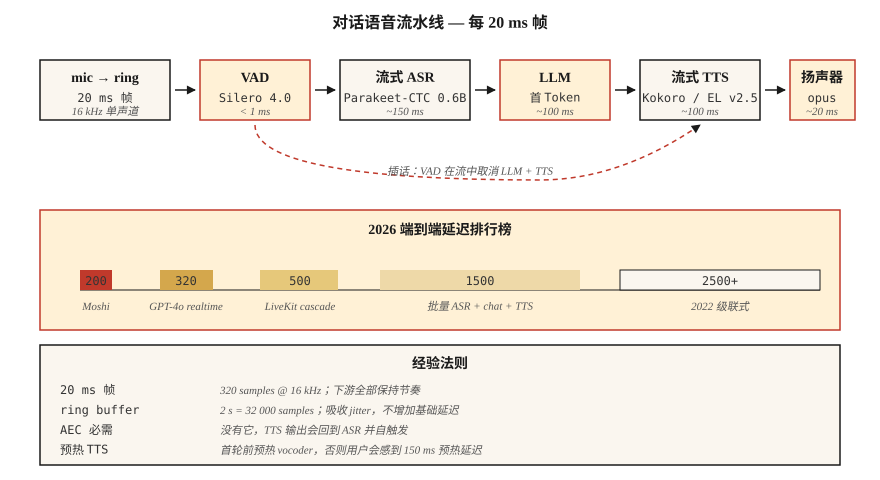

# Real-Time Audio Processing

> Batch pipelines 处理一个文件。Real-time pipelines 要在下一个 20 milliseconds 到来之前处理当前这 20 milliseconds。每个 conversational AI、broadcast studio 和 telephony bot 都由这个 latency budget 决定成败。

**Type:** Build
**Languages:** Python
**Prerequisites:** Phase 6 · 02 (Spectrograms), Phase 6 · 04 (ASR), Phase 6 · 07 (TTS)
**Time:** ~75 minutes

## The Problem

你想要一个感觉鲜活的 voice assistant。人类 conversational turn-taking latency 约为 ~230 ms（silence-to-response）。高于 500 ms 会感觉机械；高于 1500 ms 会感觉坏掉。2026 年完整 **hear → understand → respond → speak** 循环的预算是：

| Stage | Budget |
|-------|--------|
| Mic → buffer | 20 ms |
| VAD | 10 ms |
| ASR (streaming) | 150 ms |
| LLM (first token) | 100 ms |
| TTS (first chunk) | 100 ms |
| Render → speaker | 20 ms |
| **Total** | **~400 ms** |

Moshi (Kyutai, 2024) 达到 200 ms full-duplex。GPT-4o-realtime (2024) 约为 ~320 ms。2022 年发布的 cascaded pipelines 是 2500 ms。这 10× 改进来自三种技术：(1) 全链路 streaming，(2) 使用 partial results 的 asynchronous pipelining，(3) interruptible generation。

## The Concept



**Frame / chunk / window。** Real-time audio 以固定大小的块流动。常见选择：20 ms（16 kHz 下 320 samples）。下游的一切都必须跟上这个节奏。

**Ring buffer。** 固定大小的 circular buffer。Producer thread 写入新 frames，consumer thread 读取。避免在 hot path 中分配内存。大小 ≈ maximum-latency × sample-rate；2 秒的 16 kHz ring = 32,000 samples。

**VAD (Voice Activity Detection)。** 当没人说话时，关闭下游工作。Silero VAD 4.0 (2024) 在 CPU 上每 30 ms frame 运行时间 <1 ms。`webrtcvad` 是较老的替代方案。

**Streaming ASR。** 随着 audio 到达而输出 partial transcripts 的模型。Parakeet-CTC-0.6B 在 streaming mode (NeMo, 2024) 下，以 320 ms latency 达到 2–5% WER。Whisper-Streaming (Macháček et al., 2023) 将 Whisper 切成 chunks，在 ~2 s latency 下实现 near-streaming。

**Interruption。** 当 assistant 正在说话时用户开口，你必须 (a) 检测 barge-in，(b) 停止 TTS，(c) 丢弃剩余的 LLM output。所有这些要在 100 ms 内完成，否则用户会感知到 assistant 听不见。

**WebRTC Opus transport。** 20 ms frames，48 kHz，自适应 bitrate 8–128 kbps。它是 browser 和 mobile 的标准。LiveKit、Daily.co、Pion 是 2026 年构建 voice apps 的技术栈。

**Jitter buffer。** Network packets 可能乱序或延迟到达。Jitter buffer 会重排并平滑；太小 → 可听见的间隙，太大 → latency。典型值为 60–80 ms。

### Common gotchas

- **Thread contention。** Python 的 GIL + heavy models 可能让 audio thread 饥饿。使用 C-callback audio library（sounddevice、PortAudio），并让 Python 远离 hot path。
- **Sample-rate conversion latency。** 在 pipeline 内重采样会增加 5–20 ms。要么 upfront 重采样，要么使用 zero-latency resampler（PolyPhase、`soxr_hq`）。
- **TTS priming。** 即便像 Kokoro 这样的快速 TTS，第一次请求也有 100–200 ms warm-up。缓存 model，并在第一次真实 turn 前用 dummy run 预热。
- **Echo cancellation。** 没有 AEC，TTS output 会重新进入 mic，并触发 ASR 识别 bot 自己的声音。WebRTC AEC3 是 open-source default。

## Build It

### Step 1: ring buffer

```python
import collections

class RingBuffer:
    def __init__(self, capacity):
        self.buf = collections.deque(maxlen=capacity)
    def write(self, frame):
        self.buf.extend(frame)
    def read(self, n):
        return [self.buf.popleft() for _ in range(min(n, len(self.buf)))]
    def level(self):
        return len(self.buf)
```

Capacity 决定最大 buffering latency。16 kHz 下 32,000 samples = 2 s。

### Step 2: VAD gate

```python
def simple_energy_vad(frame, threshold=0.01):
    return sum(x * x for x in frame) / len(frame) > threshold ** 2
```

生产环境中替换为 Silero VAD：

```python
import torch
vad, _ = torch.hub.load("snakers4/silero-vad", "silero_vad")
is_speech = vad(torch.tensor(frame), 16000).item() > 0.5
```

### Step 3: streaming ASR

```python
# Parakeet-CTC-0.6B streaming via NeMo
from nemo.collections.asr.models import EncDecCTCModelBPE
asr = EncDecCTCModelBPE.from_pretrained("nvidia/parakeet-ctc-0.6b")
# chunk_ms=320 ms, look_ahead_ms=80 ms
for chunk in audio_stream():
    partial_text = asr.transcribe_streaming(chunk)
    print(partial_text, end="\r")
```

### Step 4: interruption handler

```python
class Dialog:
    def __init__(self):
        self.tts_task = None

    def on_user_speech(self, frame):
        if self.tts_task and not self.tts_task.done():
            self.tts_task.cancel()   # barge-in
        # then feed to streaming ASR

    def on_final_user_utterance(self, text):
        self.tts_task = asyncio.create_task(self.reply(text))

    async def reply(self, text):
        async for tts_chunk in llm_then_tts(text):
            speaker.write(tts_chunk)
```

这依赖 async I/O 和可取消的 TTS streaming。WebRTC 中在 audio track 上调用 peerconnection.stop() 是规范做法。

## Use It

2026 技术栈：

| Layer | Pick |
|-------|------|
| Transport | LiveKit (WebRTC) or Pion (Go) |
| VAD | Silero VAD 4.0 |
| Streaming ASR | Parakeet-CTC-0.6B or Whisper-Streaming |
| LLM first-token | Groq, Cerebras, vLLM-streaming |
| Streaming TTS | Kokoro or ElevenLabs Turbo v2.5 |
| Echo cancel | WebRTC AEC3 |
| End-to-end native | OpenAI Realtime API or Moshi |

## Pitfalls

- **Buffering 500 ms to be safe。** buffer *就是* 你的 latency floor。缩小它。
- **Not pinning threads。** Audio callback 在优先级低于 UI 的 thread 上 = 负载下出现 glitches。
- **TTS chunks too small。** 小于 200 ms 的 chunks 会让 vocoder artifacts 可听见。320 ms chunks 是 sweet spot。
- **No jitter buffer。** 真实网络有 jitter；没有平滑就会出现 pops。
- **Single-shot error handling。** Audio pipelines 必须 crash-proof。一个 exception 就会杀死 session。

## Ship It

保存为 `outputs/skill-realtime-designer.md`。设计一个 real-time audio pipeline，并为每个 stage 给出具体 latency budgets。

## Exercises

1. **Easy。** 运行 `code/main.py`。它模拟 ring buffer + energy VAD；为一个假的 10 秒 stream 打印 stage latencies。
2. **Medium。** 使用 `sounddevice`，构建一个 passthrough loop，以 20 ms frames 处理你的 mic，并在每个 frame 打印 VAD state。
3. **Hard。** 使用 `aiortc` 构建一个 full duplex echo test：browser → WebRTC → Python → WebRTC → browser。用 1 kHz pulse 测量 glass-to-glass latency。

## Key Terms

| Term | What people say | What it actually means |
|------|-----------------|-----------------------|
| Ring buffer | circular queue | 用于 audio frames 的固定大小、lock-free（或 SPSC-locked）FIFO。 |
| VAD | Silence gate | 标记 speech 与 non-speech 的 model 或 heuristic。 |
| Streaming ASR | Real-time STT | 随着 audio 到达输出 partial text；bounded lookahead。 |
| Jitter buffer | Network smoother | 对乱序 packets 进行 queue reordering；典型值 60–80 ms。 |
| AEC | Echo cancellation | 减去 speaker-to-mic feedback path。 |
| Barge-in | User interrupt | 系统在 TTS 中途检测到用户说话；必须取消 playback。 |
| Full duplex | Simultaneous both ways | 用户和 bot 可以同时说话；Moshi 是 full duplex。 |

## Further Reading

- [Macháček et al. (2023). Whisper-Streaming](https://arxiv.org/abs/2307.14743) — chunked near-streaming Whisper。
- [Kyutai (2024). Moshi](https://kyutai.org/Moshi.pdf) — full-duplex 200 ms latency。
- [LiveKit Agents framework (2024)](https://docs.livekit.io/agents/) — production audio agent orchestration。
- [Silero VAD repo](https://github.com/snakers4/silero-vad) — sub-1 ms VAD，Apache 2.0。
- [WebRTC AEC3 paper](https://webrtc.googlesource.com/src/+/main/modules/audio_processing/aec3/) — open source 下的 echo cancellation。
