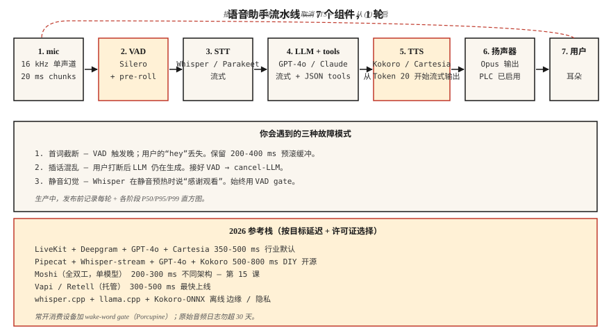

# 构建语音助手 Pipeline — Phase 6 Capstone

> 把 lessons 01-11 的所有内容串起来。构建一个会听、会推理、会回应的语音助手。在 2026 年，这已经是一个成熟的工程问题，而不是研究问题，但集成细节决定它能否真正上线。

**Type:** 构建
**Languages:** Python
**先修要求:** Phase 6 · 04, 05, 06, 07, 11; Phase 11 · 09 (Function Calling); Phase 14 · 01 (Agent Loop)
**Time:** ~120 分钟

## 问题

构建一个端到端助手：

1. 捕获麦克风输入（16 kHz mono）。
2. 检测用户语音的开始/结束。
3. 进行 streaming 转写。
4. 将 transcript 传给一个可以调用 tools（timer、weather、calendar）的 LLM。
5. 将 LLM text streaming 到 TTS。
6. 将 audio 播放给用户。
7. 如果用户在回复中途打断，则停止。

Latency 目标：在 laptop CPU 上，从用户说完话开始，800 ms 内输出第一个 TTS audio byte。Quality 目标：不漏词、不在静音时幻觉出字幕、不发生 voice cloning 泄漏、不让 prompt injection 成功。

## 概念



### 七个组件

1. **Audio capture。** Mic → 16 kHz mono → 20 ms chunks。通常在 Python 中使用 `sounddevice`，生产环境中使用原生 AudioUnit/ALSA/WASAPI。
2. **VAD（Lesson 11）。** Silero VAD @ threshold 0.5，min speech 250 ms，silence hang-over 500 ms。发出 "start" 和 "end" 信号。
3. **流式 STT（Lesson 4-5）。** Whisper-streaming、Parakeet-TDT 或 Deepgram Nova-3（API）。Partial + final transcripts。
4. **带 tool calling 的 LLM。** GPT-4o / Claude 3.5 / Gemini 2.5 Flash。Tools 使用 JSON schema。Stream tokens。
5. **Streaming TTS（Lesson 7）。** Kokoro-82M（最快的 open 模型）或 Cartesia Sonic（商业）。在 20 个 LLM tokens 后启动 TTS。
6. **Playback。** Speaker out；低带宽网络使用 opus-encode。
7. **Interruption handler。** 如果 VAD 在 TTS playback 期间触发，停止 playback，取消 LLM，重启 STT。

### 你会遇到的三个 failure modes

1. **First-word clip。** VAD 启动晚了一拍。用户的 "hey" 丢失。起始 threshold 用 0.3，而不是 0.5。
2. **Mid-response interrupt confusion。** 用户打断后 LLM 仍继续生成；助手和用户抢话。连接 VAD → cancel-LLM。
3. **Silence hallucination。** Whisper 在静音 warm-up frames 上输出 "Thanks for watching"。始终使用 VAD-gate。

### 2026 生产参考 stacks

| Stack | Latency | License | Notes |
|-------|---------|---------|-------|
| LiveKit + Deepgram + GPT-4o + Cartesia | 350-500 ms | commercial API | 2026 行业默认方案 |
| Pipecat + Whisper-streaming + GPT-4o + Kokoro | 500-800 ms | mostly open | 对 DIY 友好 |
| Moshi (full-duplex) | 200-300 ms | CC-BY 4.0 | Single-model；不同架构，lesson 15 |
| Vapi / Retell (managed) | 300-500 ms | commercial | 最快上线；定制能力有限 |
| Whisper.cpp + llama.cpp + Kokoro-ONNX | offline | open | 隐私 / edge |

```figure
v4-voice-latency
```

## 构建

### 步骤 1： 带 chunking 的 mic capture（pseudocode）

```python
import sounddevice as sd

def mic_stream(chunk_ms=20, sr=16000):
    q = queue.Queue()
    def cb(indata, frames, time, status):
        q.put(indata.copy().flatten())
    with sd.InputStream(channels=1, samplerate=sr, blocksize=int(sr * chunk_ms/1000), callback=cb):
        while True:
            yield q.get()
```

### 步骤 2：VAD 门控的轮次捕获

```python
def capture_turn(stream, vad, pre_roll_ms=300, silence_ms=500):
    buf, pre, triggered = [], collections.deque(maxlen=pre_roll_ms // 20), False
    silent = 0
    for chunk in stream:
        pre.append(chunk)
        if vad(chunk):
            if not triggered:
                buf = list(pre)
                triggered = True
            buf.append(chunk)
            silent = 0
        elif triggered:
            silent += 20
            buf.append(chunk)
            if silent >= silence_ms:
                return b"".join(buf)
```

### 步骤 3： streaming STT → LLM → TTS

```python
async def turn(audio_bytes):
    transcript = await stt.transcribe(audio_bytes)
    async for token in llm.stream(transcript):
        async for audio in tts.stream(token):
            await speaker.play(audio)
```

### 步骤 4： LLM loop 内的 tool calling

```python
tools = [
    {"name": "get_weather", "parameters": {"location": "string"}},
    {"name": "set_timer", "parameters": {"seconds": "int"}},
]

async for chunk in llm.stream(user_text, tools=tools):
    if chunk.type == "tool_call":
        result = dispatch(chunk.name, chunk.args)
        continue_streaming(result)
    if chunk.type == "text":
        await tts.stream(chunk.text)
```

### 步骤 5: interruption handling

```python
tts_task = asyncio.create_task(tts_loop())
while True:
    chunk = await mic.get()
    if vad(chunk):
        tts_task.cancel()
        await speaker.stop()
        await new_turn()
        break
```

## 使用

查看 `code/main.py`，其中有一个可运行的 simulation，用 stub models 串起全部七个组件，因此即使没有硬件，你也能看到 pipeline 形态。真实实现中，将 stubs 替换为：

- `silero-vad` (`pip install silero-vad`)
- `deepgram-sdk` 或 `openai-whisper`
- `openai` (`gpt-4o`) 或 `anthropic`
- `kokoro` 或 `cartesia`
- 用于 I/O 的 `sounddevice`

## 常见陷阱

- **永久记录 PII。** 在大多数司法辖区，完整 turn audio 都属于 PII。保留 30 天，静态加密。
- **没有 barge-in。** 用户会打断。你的助手必须停止说话。
- **阻塞的 TTS。** 同步 TTS 会阻塞 event loop。使用 async 或单独线程。
- **没有 tool-call 错误处理。** Tools 会失败。LLM 必须收到 error + retry once，然后优雅降级。
- **过度激进的 hallucination filters。** 过滤过度时，助手会反复说 "I can't help with that."；过滤不足时，它什么都敢说。用 held-out set 校准。
- **没有 wake-word 选项。** Always-listening 是隐私风险。添加 wake-word gate（Porcupine 或 openWakeWord）。

## 交付

保存为 `outputs/skill-voice-assistant-architect.md`。给定 budget + scale + language + compliance constraints，产出完整 stack spec。

## 练习

1. **Easy。** 运行 `code/main.py`。它用 stub modules 模拟一个完整的端到端 turn，并打印各阶段 latency。
2. **Medium。** 用预录制的 `.wav` 上的真实 Whisper model 替换 STT stub。测量 WER 和 end-to-end latency。
3. **Hard。** 添加 tool calling：实现 `get_weather`（任意 API）和 `set_timer`。让 LLM 通过 tools 路由，并验证当用户说 "set a 5 minute timer" 时，正确函数会触发，且语音回复会确认。

## 关键术语
| Term | What people say | What it actually means |
|------|-----------------|-----------------------|
| Turn | 用户 + 助手的一次往返 | 一个由 VAD 界定的用户语音 + 一个 LLM-TTS 回复。 |
| Barge-in | 打断 | 用户在助手说话时开口；助手停止。 |
| Wake word | "Hey assistant" | 短关键词检测器；Porcupine、Snowboy、openWakeWord。 |
| End-pointing | Turn 结束 | VAD + min-silence 决策，用于判断用户已经说完。 |
| Pre-roll | 语音前缓冲 | 保留 VAD 触发前 200-400 ms 的 audio，以避免 first-word clip。 |
| Tool call | 函数调用 | LLM 发出 JSON；runtime dispatch；result 回填到 loop 中。 |

## 延伸阅读

- [LiveKit — 语音 agent quickstart](https://docs.livekit.io/agents/) — 生产级参考。
- [Pipecat — 语音 agent examples](https://github.com/pipecat-ai/pipecat) — 对 DIY 友好的 framework。
- [OpenAI Realtime API](https://platform.openai.com/docs/guides/realtime) — managed voice-native 路径。
- [Kyutai Moshi](https://github.com/kyutai-labs/moshi) — full-duplex 参考（Lesson 15）。
- [Porcupine wake-word](https://picovoice.ai/products/porcupine/) — wake-word gating。
- [Anthropic — tool use guide](https://docs.anthropic.com/en/docs/build-with-claude/tool-use) — LLM function calling。
