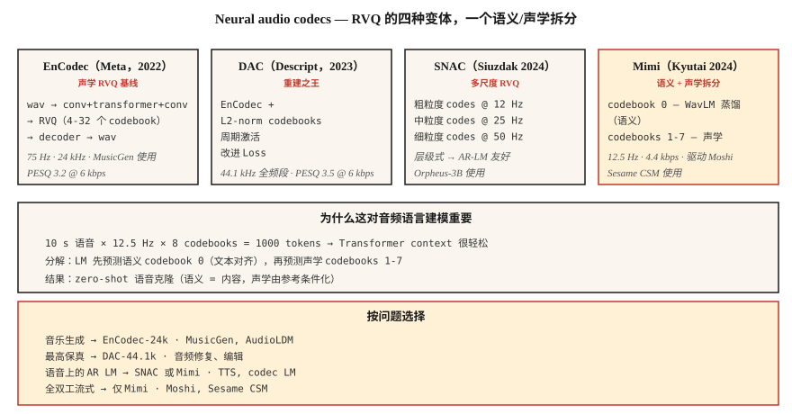

# Neural Audio Codecs — EnCodec, SNAC, Mimi, DAC 和 Semantic-Acoustic Split

> 2026 年的音频生成几乎全都是 Token。EnCodec、SNAC、Mimi 和 DAC 会把连续波形转换为 Transformer 可以预测的离散序列。semantic-vs-acoustic Token 拆分，即第一个 codebook 作为 semantic，其余作为 acoustic，是自 Transformer 以来音频领域最重要的架构转变。

**Type:** Learn
**Languages:** Python
**Prerequisites:** Phase 6 · 02 (Spectrograms), Phase 10 · 11 (Quantization), Phase 5 · 19 (Subword Tokenization)
**Time:** ~60 minutes

## 问题

语言模型处理离散 Token。音频是连续的。如果你想为语音 / 音乐构建 LLM 风格的模型，比如 MusicGen、Moshi、Sesame CSM、VibeVoice、Orpheus，你首先需要一个 **neural audio codec**：一个经过学习的 encoder，把音频离散化为小词表 Token，并配套一个 decoder 来重建波形。

已经出现了两个家族：

1. **Reconstruction-first codecs** — EnCodec、DAC。优化感知音频质量。Token 是 “acoustic” 的，它们捕获包括说话人身份、音色、背景噪声在内的一切。
2. **Semantic-first codecs** — Mimi (Kyutai)、SpeechTokenizer。强制第一个 codebook 编码语言 / 音素内容，通常通过从 WavLM distill 得到。后续 codebook 是 acoustic 细节。

2024-2026 年的洞察是：**当你尝试从文本生成时，纯 reconstruction codec 会给你模糊的语音。** 覆盖 codec Token 的 LLM 必须在同一个 codebook 中同时学习语言结构和 acoustic 结构，这无法良好扩展。把它们分离出来，即 semantic codebook 0、acoustic codebooks 1-N，正是 Moshi 和 Sesame CSM 能工作的原因。

## 概念



### 核心技巧：Residual Vector Quantization (RVQ)

与其使用一个巨大的 codebook（要获得好质量可能需要数百万个 code），现代音频 codec 都使用 **RVQ**：一串小 codebook 级联。第一个 codebook 量化 encoder 输出；第二个量化 residual；依此类推。每个 codebook 有 1024 个 code。8 个 codebook = 1024^8 = 10^24 的有效词表。

在 inference 时，decoder 会对每一帧中所有选中的 code 求和来重建。

### 2026 年最重要的四个 codec

**EnCodec (Meta, 2022)。** 基线。基于波形的 encoder-decoder，RVQ bottleneck。24 kHz，最多可用 32 个 codebook，默认 4 个 codebook @ 1.5 kbps。使用 `1D conv + transformer + 1D conv` 架构。MusicGen 使用它。

**DAC (Descript, 2023)。** 使用 L2-normalized codebook、周期性激活函数和改进 Loss 的 RVQ。在所有开放 codec 中 reconstruction fidelity 最高，有时使用 12 个 codebook 时与原始语音几乎无法区分。44.1 kHz 全频带。

**SNAC (Hubert Siuzdak, 2024)。** Multi-scale RVQ，粗粒度 codebook 的 frame rate 低于细粒度 codebook。实际上以层级方式建模音频：约 12 Hz 的粗略 “sketch” 加上 50 Hz 的细节。Orpheus-3B 使用它，因为这种层级结构很好地映射到基于 LM 的生成。

**Mimi (Kyutai, 2024)。** 2026 年的关键突破。12.5 Hz frame rate（极低），8 个 codebook @ 4.4 kbps。Codebook 0 是 **从 WavLM distill 得到的**，训练目标是预测 WavLM 的语音内容特征。Codebooks 1-7 是 acoustic residual。这个拆分支撑了 Moshi（Lesson 15）和 Sesame CSM。

### Frame rate 对语言建模很重要

更低的 frame rate = 更短的序列 = 更快的 LM。

| Codec | Frame rate | 1 s = N frames | 适合 |
|-------|-----------|----------------|---------|
| EnCodec-24k | 75 Hz | 75 | 音乐、通用音频 |
| DAC-44.1k | 86 Hz | 86 | 高保真音乐 |
| SNAC-24k (coarse) | ~12 Hz | 12 | AR-LM 高效生成 |
| Mimi | 12.5 Hz | 12.5 | 流式语音 |

在 12.5 Hz 下，10 秒话语只有 125 个 codec frame，Transformer 可以轻松预测它们。

### 语义 Token vs 声学 Token

```
frame_t → [semantic_token_t, acoustic_token_0_t, acoustic_token_1_t, ..., acoustic_token_6_t]
```

- **Semantic token（Mimi 中的 codebook 0）。** 编码说了什么，即音素、词、内容。通过辅助预测 Loss 从 WavLM distill 得到。
- **Acoustic tokens（codebooks 1-7）。** 编码音色、说话人身份、韵律、背景噪声、精细细节。

AR LM 先预测 semantic token（以文本为条件），再预测 acoustic tokens（以 semantic + speaker reference 为条件）。这种 factorization 是现代 TTS 能够 zero-shot 克隆声音的原因：semantic model 处理内容；acoustic model 处理音色。

### 2026 reconstruction quality（bits per sec，bitrate 越低越好）

| Codec | Bitrate | PESQ | ViSQOL |
|-------|---------|------|--------|
| Opus-20kbps | 20 kbps | 4.0 | 4.3 |
| EnCodec-6kbps | 6 kbps | 3.2 | 3.8 |
| DAC-6kbps | 6 kbps | 3.5 | 4.0 |
| SNAC-3kbps | 3 kbps | 3.3 | 3.8 |
| Mimi-4.4kbps | 4.4 kbps | 3.1 | 3.7 |

像 Opus 这样的传统 codec 在每 bit 的感知质量上仍然胜出。Neural codecs 胜在 **离散 Token**（Opus 不产生这种 Token）和 **generative-model quality**（LM 能如何使用这些 Token）。

## 构建它

### 步骤 1：用 EnCodec encode

```python
from encodec import EncodecModel
import torch

model = EncodecModel.encodec_model_24khz()
model.set_target_bandwidth(6.0)  # kbps

wav = torch.randn(1, 1, 24000)
with torch.no_grad():
    encoded = model.encode(wav)
codes, scale = encoded[0]
# codes: (1, n_codebooks, n_frames), dtype=int64
```

6 kbps 时 `n_codebooks=8`。每个 code 是 0-1023（10-bit）。

### 步骤 2：decode 并测量 reconstruction

```python
with torch.no_grad():
    wav_recon = model.decode([(codes, scale)])

from torchaudio.functional import compute_deltas
import torch.nn.functional as F

mse = F.mse_loss(wav_recon[:, :, :wav.shape[-1]], wav).item()
```

### 步骤 3：semantic-acoustic split（Mimi 风格）

```python
from moshi.models import loaders
mimi = loaders.get_mimi()

with torch.no_grad():
    codes = mimi.encode(wav)  # shape (1, 8, frames@12.5Hz)

semantic = codes[:, 0]
acoustic = codes[:, 1:]
```

Semantic codebook 0 与 WavLM 对齐。你可以训练一个 text-to-semantic Transformer，词表比直接到音频小得多。然后，一个单独的 acoustic-to-waveform decoder 以 speaker reference 为条件。

### 步骤 4：为什么 codec Token 上的 AR LM 可行

对于 Mimi 的 12.5 Hz × 8 个 codebook，一个 10 s 语音片段：

```
N_tokens = 10 * 12.5 * 8 = 1000 tokens
```

1000 个 Token 对 Transformer 来说是很小的上下文。一个 256M 参数的 Transformer 可以在现代 GPU 上以毫秒级生成 10 秒语音。

## 使用它

问题 → codec 映射：

| Task | Codec |
|------|-------|
| 通用音乐生成 | EnCodec-24k |
| 最高保真 reconstruction | DAC-44.1k |
| 覆盖语音的 AR LM (TTS) | SNAC or Mimi |
| 流式全双工语音 | Mimi (12.5 Hz) |
| 带文本的音效库 | EnCodec + T5 condition |
| 细粒度音频编辑 | DAC + inpainting |

经验法则：**如果你在构建 generative model，从 Mimi 或 SNAC 开始。如果你在构建压缩 pipeline，使用 Opus。**

## 常见坑

- **Codebook 太多。** 添加 codebook 会线性提高 fidelity，但也会线性增加 LM 序列长度。停在 8-12 个。
- **Frame-rate mismatch。** 在 12.5 Hz Mimi 上训练 LM，然后在 50 Hz EnCodec 上 fine-tune，会悄悄失败。
- **假设所有 codebook 都等价。** 在 Mimi 中，codebook 0 承载内容；丢失它会摧毁可懂度。丢失 codebook 7 几乎察觉不到。
- **把 reconstruction quality 当作唯一指标。** 如果 semantic 结构很差，一个 codec 即使 reconstruction 很好，也可能对基于 LM 的生成毫无用处。

## 交付它

保存为 `outputs/skill-codec-picker.md`。为给定的生成或压缩任务选择一个 codec。

## 练习

1. **Easy。** 运行 `code/main.py`。它实现了一个 toy scalar + residual quantizer，并测量随着添加 codebook reconstruction error 如何变化。
2. **Medium。** 安装 `encodec`，在保留的语音片段上比较 1、4、8、32 个 codebook。绘制 PESQ 或 MSE vs bitrate。
3. **Hard。** 加载 Mimi。Encode 一个片段。把 codebook 0 替换为随机整数；decode。然后以类似方式替换 codebook 7。比较这两种破坏，codebook 0 corruption 应该摧毁可懂度；codebook 7 corruption 应该几乎不改变任何东西。

## 关键术语

| Term | 人们怎么说 | 它实际意味着什么 |
|------|-----------------|-----------------------|
| RVQ | Residual quantization | 小 codebook 级联；每个 codebook 量化前一个 residual。 |
| Frame rate | Codec speed | 每秒有多少个 Token-frame。更低 = 更快的 LM。 |
| Semantic codebook | Codebook 0 (Mimi) | 从 SSL 特征 distill 得到的 codebook；编码内容。 |
| Acoustic codebooks | 其他所有 codebook | 音色、韵律、噪声、精细细节。 |
| PESQ / ViSQOL | Perceptual quality | 与 MOS 相关的客观指标。 |
| EnCodec | Meta codec | RVQ 基线；MusicGen 使用它。 |
| Mimi | Kyutai codec | 12.5 Hz frame rate；semantic-acoustic split；支撑 Moshi。 |

## 延伸阅读

- [Défossez et al. (2023). EnCodec](https://arxiv.org/abs/2210.13438) — RVQ 基线。
- [Kumar et al. (2023). Descript Audio Codec (DAC)](https://arxiv.org/abs/2306.06546) — 最高保真的开放 codec。
- [Siuzdak (2024). SNAC](https://arxiv.org/abs/2410.14411) — multi-scale RVQ。
- [Kyutai (2024). Mimi codec](https://kyutai.org/codec-explainer) — semantic-acoustic split，WavLM distillation。
- [Borsos et al. (2023). AudioLM](https://arxiv.org/abs/2209.03143) — 两阶段 semantic/acoustic 范式。
- [Zeghidour et al. (2021). SoundStream](https://arxiv.org/abs/2107.03312) — 最早的可流式 RVQ codec。
