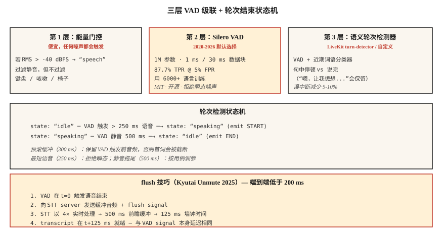

# Voice Activity Detection 与 Turn-Taking — Silero、Cobra 和 Flush Trick

> 每个 voice agent 的成败都取决于两个判断：用户现在是否在说话，以及他们是否说完了？VAD 回答第一个问题。Turn-detection（VAD + silence-hangover + semantic endpoint model）回答第二个问题。任一判断出错，你的 assistant 要么打断用户，要么一直说个不停。

**Type:** Build
**Languages:** Python
**Prerequisites:** Phase 6 · 11（Real-Time Audio），Phase 6 · 12（Voice Assistant）
**Time:** ~45 分钟

## 问题

voice agent 在每个 20 ms chunk 上做出的三个不同判断：

1. **这一帧是 speech 吗？** — VAD。二元判断，逐帧进行。
2. **用户是否开始了新的 utterance？** — onset detection。
3. **用户是否说完了？** — end-pointing（turn-end）。

朴素答案（energy threshold）在任何噪声下都会失败：交通声、键盘声、人群嘈杂声。2026 年的答案是：Silero VAD（开放、Deep Learning 训练）+ turn-detection model（semantic endpointing）+ 基于 VAD 校准的 silence hangover。

## 概念



### 三层 VAD 级联

**Tier 1: energy gate。** 最便宜。以 -40 dBFS 对 RMS 设阈值。能过滤明显的静音，但任何超过阈值的噪声都会触发。

**Tier 2: Silero VAD**（2020-2026，MIT）。1M parameters。在 6000+ languages 上训练。在单个 CPU thread 上，每 30 ms chunk 约 1 ms 运行完成。5% FPR 下 TPR 为 87.7%。开放源码的默认选择。

**Tier 3: semantic turn detector。** LiveKit 的 turn-detection model（2024-2026）或你自己的小型 classifier。区分“句中停顿”和“说完了”。使用语言上下文（intonation + recent words），而不只是 silence。

### 关键参数及其默认值

- **Threshold。** Silero 输出 probability；在 &gt; 0.5（默认）或 &gt; 0.3（敏感）时分类为 speech。阈值越低，首词被截断越少，但 false positives 越多。
- **Minimum speech duration。** 拒绝短于 250 ms 的 speech，通常那是咳嗽或椅子噪声。
- **Silence hangover（end-pointing）。** VAD 回到 0 之后，等待 500-800 ms 再宣布 end-of-turn。太短 → 打断用户。太长 → 感觉迟钝。
- **Pre-roll buffer。** 在 VAD 触发前保留 300-500 ms 的 audio。防止 “hey” 被截断。

### Flush trick（Kyutai 2025）

Streaming STT models 有 look-ahead delay（Kyutai STT-1B 为 500 ms，STT-2.6B 为 2.5 s）。通常你会在 end-of-speech 后等待那么久才能拿到 transcript。Flush trick：当 VAD 触发 end-of-speech 时，**向 STT 发送 flush signal**，强制立即输出。STT 以约 4× realtime 处理，所以 500 ms buffer 约 125 ms 就能完成。

端到端：125 ms VAD + flush STT = 对话式 latency。

### 2026 VAD 对比

| VAD | TPR @ 5% FPR | Latency | License |
|-----|--------------|---------|---------|
| WebRTC VAD（Google，2013） | 50.0% | 30 ms | BSD |
| Silero VAD（2020-2026） | 87.7% | ~1 ms | MIT |
| Cobra VAD（Picovoice） | 98.9% | ~1 ms | commercial |
| pyannote segmentation | 95% | ~10 ms | MIT-ish |

Silero 是正确的默认选择。Cobra 是合规性 / 准确率升级。Energy-only VAD 在 2026 年的生产环境中没有位置。

```figure
sp-vad-cascade
```

## 构建它

### 步骤 1： energy gate

```python
def energy_vad(chunk, threshold_dbfs=-40.0):
    rms = (sum(x * x for x in chunk) / len(chunk)) ** 0.5
    dbfs = 20.0 * math.log10(max(rms, 1e-10))
    return dbfs > threshold_dbfs
```

### 步骤 2： Python 中的 Silero VAD

```python
from silero_vad import load_silero_vad, get_speech_timestamps

vad = load_silero_vad()
audio = torch.tensor(waveform_16k, dtype=torch.float32)
segments = get_speech_timestamps(
    audio, vad, sampling_rate=16000,
    threshold=0.5,
    min_speech_duration_ms=250,
    min_silence_duration_ms=500,
    speech_pad_ms=300,
)
for s in segments:
    print(f"{s['start']/16000:.2f}s - {s['end']/16000:.2f}s")
```

### 步骤 3: turn-end state machine

```python
class TurnDetector:
    def __init__(self, silence_hangover_ms=500, min_speech_ms=250):
        self.state = "idle"
        self.speech_ms = 0
        self.silence_ms = 0
        self.silence_hangover_ms = silence_hangover_ms
        self.min_speech_ms = min_speech_ms

    def update(self, is_speech, chunk_ms=20):
        if is_speech:
            self.speech_ms += chunk_ms
            self.silence_ms = 0
            if self.state == "idle" and self.speech_ms >= self.min_speech_ms:
                self.state = "speaking"
                return "START"
        else:
            self.silence_ms += chunk_ms
            if self.state == "speaking" and self.silence_ms >= self.silence_hangover_ms:
                self.state = "idle"
                self.speech_ms = 0
                return "END"
        return None
```

### 步骤 4: flush trick 骨架

```python
def flush_on_end(stt_client, audio_buffer):
    stt_client.send_audio(audio_buffer)
    stt_client.send_flush()
    return stt_client.recv_transcript(timeout_ms=150)
```

STT（Kyutai、Deepgram、AssemblyAI）必须支持 flush，这个方法才有效。Whisper streaming 不支持，因为它基于 block，并且总是等待 chunks。

## 使用它

| Situation | VAD choice |
|-----------|-----------|
| 开放、快速、通用 | Silero VAD |
| 商业 call center | Cobra VAD |
| On-device（phone） | Silero VAD ONNX |
| Research / diarization | pyannote segmentation |
| 零依赖 fallback | WebRTC VAD（legacy） |
| 需要 turn-ending 质量 | Silero + LiveKit turn-detector 分层 |

经验法则：除非你真的别无选择，否则永远不要发布 energy-only VAD。

## 陷阱

- **Fixed threshold。** 安静环境中可用，嘈杂环境中失败。要么在 device 上校准，要么切换到 Silero。
- **Silence hangover 太短。** Agent 会在句中打断用户。500-800 ms 是对话语音的最佳区间。
- **Hangover 太长。** 感觉迟钝。用目标用户做 A/B test。
- **没有 pre-roll buffer。** 用户 audio 的前 200-300 ms 会丢失。始终保留 rolling pre-roll。
- **忽略 semantic endpointing。** “Hmm, let me think...” 包含长停顿。用户讨厌思路中途被打断。使用 LiveKit 的 turn-detector 或类似方案。

## 发布它

保存为 `outputs/skill-vad-tuner.md`。为一个 workload 选择 VAD model、threshold、hangover、pre-roll 和 turn-detection strategy。

## 练习

1. **Easy。** 运行 `code/main.py`。它模拟 speech + silence + speech + coughs 序列，并测试三层 VAD。
2. **Medium。** 安装 `silero-vad`，处理一段 5 分钟录音，调优 threshold，以同时最小化首词截断和误触发。报告 precision/recall。
3. **Hard。** 构建一个 mini turn-detector：Silero VAD + 基于最近 10 个 words 的 embeddings 的 3 层 MLP（使用 sentence-transformers）。在手工标注的 turn-end dataset 上训练。以 10% F1 击败 Silero-only。

## 关键术语

| Term | 人们怎么说 | 实际含义 |
|------|-----------------|-----------------------|
| VAD | Voice detector | 逐帧二元判断：这是 speech 吗？ |
| Turn detection | End-pointing | VAD + silence-hangover + semantic endpoint。 |
| Silence hangover | Wait-after-speech | 宣布 turn end 前等待的时间；500-800 ms。 |
| Pre-roll | Pre-speech buffer | 在 VAD 触发前保留 300-500 ms audio。 |
| Flush trick | Kyutai hack | VAD → flush-STT → 125 ms，而不是 500 ms delay。 |
| Semantic endpoint | “他们是真的想停下吗？” | 查看 words 的 ML classifier，而不只是看 silence。 |
| TPR @ FPR 5% | ROC point | 标准 VAD benchmark；Silero 为 87.7%，WebRTC 为 50%。 |

## 延伸阅读

- [Silero VAD](https://github.com/snakers4/silero-vad) — 开放 VAD 的参考实现。
- [Picovoice Cobra VAD](https://picovoice.ai/products/cobra/) — 商业准确率领导者。
- [Kyutai — Unmute + flush trick](https://kyutai.org/stt) — 低于 200 ms 的工程技巧。
- [LiveKit — turn detection](https://docs.livekit.io/agents/logic/turns/) — 生产环境中的 semantic endpointing。
- [WebRTC VAD](https://webrtc.googlesource.com/src/) — legacy baseline。
- [pyannote segmentation](https://github.com/pyannote/pyannote-audio) — diarization 级 segmentation。
