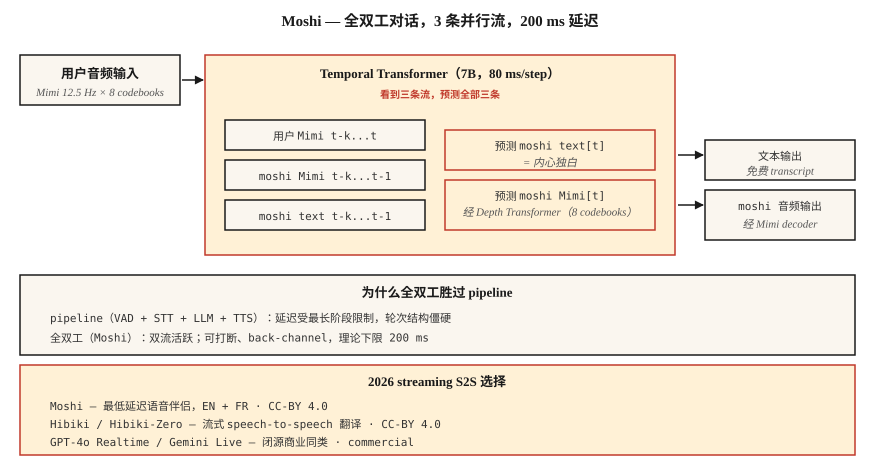

# Streaming Speech-to-Speech — Moshi、Hibiki 与 Full-Duplex Dialogue

> 2024-2026 年重新定义了语音 AI。Moshi 发布了一个单一模型，可以以 200 ms 延迟同时听和说。Hibiki 逐块完成 speech-to-speech 翻译。两者都放弃了 ASR → LLM → TTS pipeline，转向基于 Mimi codec Token 的统一 full-duplex 架构。这就是新的参考设计。

**Type:** Learn
**Languages:** Python
**Prerequisites:** Phase 6 · 13 (Neural Audio Codecs), Phase 6 · 11 (Real-Time Audio), Phase 7 · 05 (Full Transformer)
**Time:** ~75 分钟

## 问题

每个基于 Lesson 11 + 12 构建的语音 agent 都有一个基本的延迟下限，大约在 300-500 ms：VAD 触发，STT 处理，LLM 推理，TTS 生成。每个阶段都有自己的最低延迟。你可以调优和并行化，但 pipeline 的形态会限制上限。

Moshi（Kyutai，2024-2026）提出了一个不同的问题：如果根本没有 pipeline 会怎样？如果一个模型直接接收音频并输出音频，连续进行，而文本只是一个中间的“inner monologue”，不是必需阶段，会怎样？

答案是 **full-duplex speech-to-speech**。理论延迟 160 ms（80 ms Mimi frame + 80 ms acoustic delay）。在单张 L4 GPU 上的实际延迟为 200 ms。这是顶级 pipeline 语音 agent 能达到延迟的一半。

## 核心概念



### Moshi architecture

**输入。** 两条 Mimi codec stream，均为 12.5 Hz × 8 codebooks：

- Stream 1：用户音频（Mimi-encoded，持续到达）
- Stream 2：Moshi 自己的音频（由 Moshi 生成）

**Transformer。** 一个 7B-parameter Temporal Transformer 同时处理两条 stream 和一条文本 “inner monologue” stream。在每个 80 ms 步长中，它会：

1. 消耗最新的用户 Mimi Token（8 个 codebook）。
2. 消耗最近的 Moshi Mimi Token（8 个 codebook，按生成结果）。
3. 生成下一个 Moshi 文本 Token（inner monologue）。
4. 生成下一个 Moshi Mimi Token（通过一个小型 Depth Transformer 生成 8 个 codebook）。

三条 stream：用户音频、Moshi 音频、Moshi 文本并行运行。Moshi 可以在说话时听到用户；可以在用户打断时打断自己；可以进行 back-channel（“mhm”）而不打断自己的主要话语。

**Depth Transformer。** 在一个 frame 内，8 个 codebook 不是并行预测的，它们存在 codebook 间依赖。一个小型 2-layer “depth transformer” 会在 80 ms 内按顺序预测它们。这是 AR codec LM 的标准分解方式（VALL-E、VibeVoice 也使用）。

### 为什么 inner-monologue text 有帮助

如果没有显式文本，模型就必须在 acoustic stream 中隐式建模语言。Moshi 的洞察是：强制它在音频旁边一起输出文本 Token。文本 stream 本质上是 Moshi 正在说的话的转录。这会提升语义连贯性，让替换 language model head 更容易，并且免费给你转录结果。

### Hibiki：streaming speech-to-speech translation

相同架构，使用翻译对训练。源语言音频输入，目标语言音频连续输出。Hibiki-Zero（2026 年 2 月）消除了对词级对齐训练数据的需求，使用句子级数据 + GRPO reinforcement learning 来优化延迟。

初始支持四个语言对；可以用约 1000 小时数据适配到新语言。

### 更广泛的 Kyutai stack（2026）

- **Moshi** — full-duplex dialogue（法语优先，英语支持良好）
- **Hibiki / Hibiki-Zero** — simultaneous speech translation
- **Kyutai STT** — streaming ASR（500 ms 或 2.5 s look-ahead）
- **Kyutai Pocket TTS** — 100M-param TTS 可在 CPU 上运行（2026 年 1 月）
- **Unmute** — 在公共服务器上组合这些能力的完整 pipeline

L40S GPU 上的吞吐量：64 个并发 session，3× real-time。

### Sesame CSM — 近亲

Sesame CSM（2025）使用了类似思路，一个带 Mimi codec head 的 Llama-3 backbone。但 CSM 是单向的（接收 context + text，生成 speech），而不是 full-duplex。它是市场上最好的“voice presence” TTS；但与 Moshi 的 full-duplex 能力并不完全相同。

### 2026 performance numbers

| Model | Latency | Use case | License |
|-------|---------|----------|---------|
| Moshi | 200 ms (L4) | full-duplex English / French dialogue | CC-BY 4.0 |
| Hibiki | 12.5 Hz framerate | French ↔ English streaming translation | CC-BY 4.0 |
| Hibiki-Zero | same | 5 language-pairs, no aligned data | CC-BY 4.0 |
| Sesame CSM-1B | 200 ms TTFA | context-conditioned TTS | Apache-2.0 |
| GPT-4o Realtime | ~300 ms | closed, OpenAI API | commercial |
| Gemini 2.5 Live | ~350 ms | closed, Google API | commercial |

```figure
sp-fullduplex
```

## 构建它

### 步骤 1：interface

Moshi 暴露一个 WebSocket server，接收 80 ms 的 Mimi-encoded audio chunk，并返回 80 ms 的 Mimi-encoded audio chunk。双向。持续进行。

```python
import asyncio
import websockets
from moshi.client_utils import encode_audio_mimi, decode_audio_mimi

async def moshi_chat():
    async with websockets.connect("ws://localhost:8998/api/chat") as ws:
        mic_task = asyncio.create_task(stream_mic_to(ws))
        spk_task = asyncio.create_task(stream_from_to_speaker(ws))
        await asyncio.gather(mic_task, spk_task)
```

### 步骤 2：full-duplex loop

```python
async def stream_mic_to(ws):
    async for chunk_80ms in mic_stream_at_12_5_hz():
        mimi_tokens = encode_audio_mimi(chunk_80ms)
        await ws.send(serialize(mimi_tokens))

async def stream_from_to_speaker(ws):
    async for msg in ws:
        mimi_tokens, text_token = deserialize(msg)
        audio = decode_audio_mimi(mimi_tokens)
        await play(audio)
```

两个方向同时运行。Python asyncio 或 Rust futures 是标准传输方式。

### 步骤 3：training objective（概念）

对于每个 80 ms frame `t`：

- Input：`user_mimi[0..t]`、`moshi_mimi[0..t-1]`、`moshi_text[0..t-1]`
- Predict：`moshi_text[t]`，然后是 `moshi_mimi[t, codebook_0..7]`

文本先于音频预测（inner monologue）；音频在 depth transformer 内按 codebook 顺序预测。

### 步骤 4：Moshi 赢在哪里，输在哪里

Moshi 赢在：

- 在便宜硬件上实现低于 250 ms 的端到端延迟。
- 自然的 back-channel 和打断。
- 不需要 pipeline glue code。

Moshi 不擅长：

- Tool calling（没有为此训练；你需要单独的 LLM path）。
- 长推理（Moshi 是一个 8B 左右的 dialogue model，不是 Claude/GPT-4）。
- 小众主题上的事实准确性。
- 大多数生产级企业用例（2026 年仍使用 pipeline）。

## 使用它

| Situation | Pick |
|-----------|------|
| 最低延迟语音 companion | Moshi |
| 实时翻译通话 | Hibiki |
| 语音 demo / research | Moshi, CSM |
| 带 tools 的企业 agent | Pipeline (Lesson 12), not Moshi |
| context 中的 custom-voice TTS | Sesame CSM |
| Speech-to-speech，任意语言 | GPT-4o Realtime or Gemini 2.5 Live (commercial) |

## 陷阱

- **有限的 tool calling。** Moshi 是 dialogue model，不是 agent framework。需要 tools 时和 pipeline 组合。
- **特定声音 conditioning。** Moshi 使用单一训练 persona；voice cloning 是另一次单独训练。
- **语言覆盖。** 法语 + 英语非常好；其他语言有限。Hibiki-Zero 有帮助，但你仍然需要训练数据。
- **资源成本。** 一个完整 Moshi session 会占住一个 GPU slot；不是便宜的 shared-tenant 部署模式。

## 交付它

保存为 `outputs/skill-duplex-pipeline.md`。为一个 voice-agent workload 选择 pipeline 或 full-duplex 架构，并给出理由。

## 练习

1. **Easy。** 运行 `code/main.py`。它会以符号方式模拟 two-stream + inner-monologue 架构。
2. **Medium。** 从 HuggingFace 拉取 Moshi，运行 server，测试一次对话。测量从用户说话结束到 Moshi 开始响应的 wall-clock latency。
3. **Hard。** 拿你的 Lesson 12 pipeline agent，在 20 条匹配测试 utterance 上与 Moshi 比较 P50 latency。写出 pipeline 仍然在架构上取胜的情况。

## 关键术语

| Term | 人们常说的意思 | 实际含义 |
|------|-----------------|-----------------------|
| Full-duplex | 同时听和说 | 同一个模型上同时活跃两条 audio stream。 |
| Inner monologue | 模型的文本 stream | Moshi 在输出音频的同时发出文本 Token。 |
| Depth transformer | codebook 间预测器 | 在一个 80 ms frame 内预测 8 个 codebook 的小型 Transformer。 |
| Mimi | Kyutai 的 codec | 12.5 Hz × 8 codebooks；semantic+acoustic；驱动 Moshi。 |
| Streaming S2S | 实时 audio → audio | 逐块翻译/对话，没有 pipeline stage。 |
| Back-channeling | “Mhm” 反应 | Moshi 可以发出小的确认反馈，而不打断自己的 turn。 |

## 延伸阅读

- [Défossez et al. (2024). Moshi — speech-text foundation model](https://arxiv.org/html/2410.00037v2) — 论文。
- [Kyutai Labs (2026). Hibiki-Zero](https://arxiv.org/abs/2602.12345) — 无需对齐数据的 streaming translation。
- [Sesame (2025). Crossing the uncanny valley of voice](https://www.sesame.com/research/crossing_the_uncanny_valley_of_voice) — CSM spec。
- [Kyutai — Moshi repo](https://github.com/kyutai-labs/moshi) — 安装 + server。
- [OpenAI — Realtime API](https://platform.openai.com/docs/guides/realtime) — 封闭商业同类。
- [Kyutai — Delayed Streams Modeling](https://github.com/kyutai-labs/delayed-streams-modeling) — 底层 STT/TTS framework。
