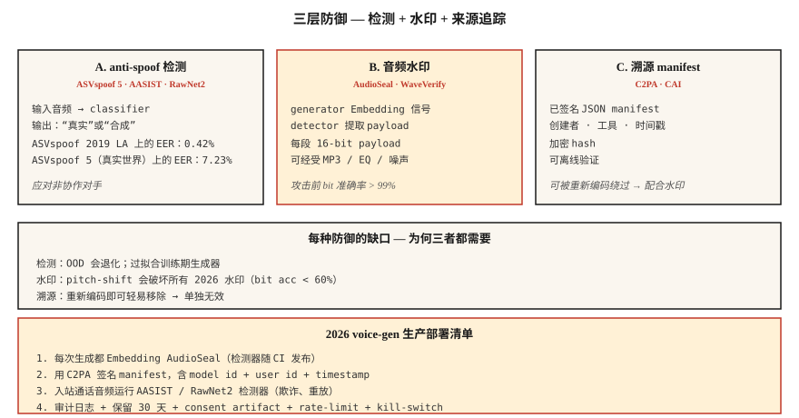

# 语音反欺骗与音频水印 — ASVspoof 5, AudioSeal, WaveVerify

> Voice cloning 的上线速度快过了防御手段。2026 年的生产级语音系统需要两样东西：一个将真实语音与伪造语音分类的检测器（AASIST, RawNet2），以及一个能经受压缩和编辑的 watermark（AudioSeal）。两者都要上线，否则就不要上线 voice cloning。

**Type:** Build
**Languages:** Python
**先修要求：** Phase 6 · 06 (Speaker Recognition), Phase 6 · 08 (Voice Cloning)
**Time:** ~75 minutes

## 问题

三类相关防御：

1. **Anti-spoofing / deepfake detection.** 给定一段音频，它是合成的还是真实的？ASVspoof benchmarks（ASVspoof 2019 → 2021 → 5）是黄金标准。
2. **Audio watermarking.** 在生成音频中Embedding不可感知的信号，检测器之后可以提取它。AudioSeal（Meta）和 WavMark 是开放选项。
3. **Authenticated provenance.** 对音频文件和 metadata 进行加密签名。C2PA / Content Authenticity Initiative。

Detection 处理不配合的对抗者。Watermarking 处理合规性，AI 生成的音频应当能被识别为这类音频。2026 年两者都必需。

## 概念



### ASVspoof 5 — 2024-2025 benchmark

相比之前版本，最大的变化：

- **Crowdsourced data**（不是录音棚干净数据）— 现实条件。
- **~2000 speakers**（之前约 ~100）。
- **32 个 attack algorithms.** TTS + voice conversion + adversarial perturbation。
- **Two tracks.** Countermeasure (CM) 独立检测；面向生物识别系统的 Spoofing-robust ASV (SASV)。

ASVspoof 5 上的 state-of-the-art：~7.23% EER。较旧的 ASVspoof 2019 LA：0.42% EER。真实世界部署：预计野外片段上 EER 为 5-10%。

### AASIST 和 RawNet2 — 检测模型家族

**AASIST**（2021，持续更新到 2026）。在 spectral features 上使用 graph-attention。当前是 ASVspoof 5 countermeasure 任务的 SOTA。

**RawNet2.** 基于 raw waveform 的 convolutional front-end + TDNN backbone。更简单的 baseline；经过 fine-tuning 后仍有竞争力。

**NeXt-TDNN + SSL features.** 2025 变体：ECAPA-style + WavLM features + focal loss。在 ASVspoof 2019 LA 上达到 0.42% EER。

### AudioSeal — 2024 年默认 watermark

Meta 的 **AudioSeal**（2024 年 1 月，v0.2 2024 年 12 月）。关键设计：

- **Localized.** 以 16 kHz 采样分辨率（1/16000 s）逐帧检测 watermark。
- **Generator + detector jointly trained.** Generator 学会Embedding不可听信号；detector 学会在 augmentations 后找到它。
- **Robust.** 能经受 MP3 / AAC 压缩、EQ、speed-shift ±10%、noise mix +10 dB SNR。
- **Fast.** Detector 以 485× realtime 运行；比 WavMark 快 1000×。
- **Capacity.** 16-bit payload（可编码 model ID、generation timestamp、user ID）可Embedding每个 utterance。

### WavMark

AudioSeal 之前的开放 baseline。Invertible neural network，32 bits/sec。问题：

- synchronization brute-force 很慢。
- 可被 Gaussian noise 或 MP3 压缩移除。
- 不适合实时。

### WaveVerify（2025 年 7 月）

解决 AudioSeal 的弱点，尤其是 temporal manipulations（reversal, speed）。使用基于 FiLM 的 generator + Mixture-of-Experts detector。在标准攻击上与 AudioSeal 竞争；能处理 temporal edits。

### 对抗者利用的缺口

来自 AudioMarkBench："under pitch shift, all watermarks show Bit Recovery Accuracy below 0.6, indicating near-complete removal." **Pitch-shift 是通用攻击。** 2026 年没有任何 watermark 能完全抵抗激进的 pitch modification。这就是为什么你需要 detection（AASIST）与 watermarking 并行。

### C2PA / Content Authenticity Initiative

不是 ML 技术，而是一种 manifest 格式。音频文件携带关于创建工具、作者、日期的加密签名 metadata。Audobox / Seamless 使用它。适合 provenance；但如果恶意行为者重新编码并剥离 metadata，它就无能为力。

## 构建它

### 步骤 1： 一个简单的 spectral-feature detector（toy）

```python
def spectral_rolloff(spec, percentile=0.85):
    cum = 0
    total = sum(spec)
    if total == 0:
        return 0
    threshold = total * percentile
    for k, v in enumerate(spec):
        cum += v
        if cum >= threshold:
            return k
    return len(spec) - 1

def is_suspicious(audio):
    spec = magnitude_spectrum(audio)
    rolloff = spectral_rolloff(spec)
    return rolloff / len(spec) > 0.92
```

Synthetic speech 通常有异常平坦的高频能量。生产检测器使用 AASIST，而不是这个。但直觉成立。

### 步骤 2： AudioSeal embed + detect

```python
from audioseal import AudioSeal
import torch

generator = AudioSeal.load_generator("audioseal_wm_16bits")
detector = AudioSeal.load_detector("audioseal_detector_16bits")

audio = load_wav("generated.wav", sr=16000)[None, None, :]
payload = torch.tensor([[1, 0, 1, 1, 0, 1, 0, 0, 1, 1, 0, 1, 0, 1, 1, 0]])
watermark = generator.get_watermark(audio, sample_rate=16000, message=payload)
watermarked = audio + watermark

result, decoded_payload = detector.detect_watermark(watermarked, sample_rate=16000)
# result: float in [0, 1] — probability of watermark presence
# decoded_payload: 16 bits; match against embedded payload
```

### 步骤 3： evaluation — EER

```python
def eer(real_scores, fake_scores):
    thresholds = sorted(set(real_scores + fake_scores))
    best = (1.0, 0.0)
    for t in thresholds:
        far = sum(1 for s in fake_scores if s >= t) / len(fake_scores)
        frr = sum(1 for s in real_scores if s < t) / len(real_scores)
        if abs(far - frr) < best[0]:
            best = (abs(far - frr), (far + frr) / 2)
    return best[1]
```

### 步骤 4： 生产集成

```python
def safe_tts(text, voice, clone_reference=None):
    if clone_reference is not None:
        verify_consent(user_id, clone_reference)
    audio = tts_model.synthesize(text, voice)
    audio_with_wm = audioseal_embed(audio, payload=build_payload(user_id, model_id))
    manifest = c2pa_sign(audio_with_wm, user_id, timestamp=now())
    return audio_with_wm, manifest
```

每次生成都包含：(1) watermark，(2) signed manifest，(3) 符合 retention-policy 的 audit log。

## 使用它

| Use case | Defense |
|----------|---------|
| 上线 TTS / voice cloning | 每个输出都Embedding AudioSeal（不可协商） |
| Biometric voice unlock | AASIST + ECAPA ensemble；liveness challenge |
| Call-center fraud detection | 对 20% 的来电样本运行 AASIST |
| Podcast authenticity | 上传时进行 C2PA signing，若为 AI-generated 则使用 AudioSeal |
| Research / training detectors | ASVspoof 5 train/dev/eval sets |

## 陷阱

- **Watermark 从未被 detector 运行检测。** 毫无意义。把 detector 放进你的 CI。
- **Detection 没有 calibration。** 在 ASVspoof LA 上训练的 AASIST 会 overfit；真实世界准确率下降。针对你的 domain 做 calibration。
- **Pitch-shift gap.** 激进的 pitch shift 会移除大多数 watermarks。准备 detection fallback。
- **Metadata strip-and-rehost.** C2PA 很容易通过重新编码绕过。始终把 cryptographic + perceptual（watermark）防御一起加入。
- **把 liveness 当成 detection。** 要求用户说一个随机短语。它能阻止 replay attacks，但不能阻止 real-time cloning。

## 交付它

保存为 `outputs/skill-spoof-defender.md`。为 voice-gen 部署选择 detection model、watermark、provenance manifest 和 operational playbook。

## 练习

1. **Easy.** 运行 `code/main.py`。在 synthetic audio 上使用 toy detector + toy watermark embed/detect。
2. **Medium.** 安装 `audioseal`，在 TTS 输出中Embedding 16-bit payload，再重新解码。用噪声破坏音频并测量 Bit Recovery Accuracy。
3. **Hard.** 在 ASVspoof 2019 LA 上 fine-tune 一个 RawNet2 或 AASIST。测量 EER。在一组 held-out 的 F5-TTS 生成片段上测试，观察 OOD detection 如何退化。

## 关键术语

| Term | 人们怎么说 | 它实际是什么意思 |
|------|-----------------|-----------------------|
| ASVspoof | benchmark | 两年一次的 challenge；2024 = ASVspoof 5。 |
| CM (countermeasure) | Detector | Classifier：真实语音 vs synthetic / converted。 |
| SASV | Speaker verif + CM | 集成的 biometric + spoof detection。 |
| AudioSeal | Meta watermark | Localized，16-bit payload，比 WavMark 快 485×。 |
| Bit Recovery Accuracy | Watermark survival | 攻击后恢复的 payload bits 比例。 |
| C2PA | Provenance manifest | 关于创建 / 作者身份的加密 metadata。 |
| AASIST | Detector family | 基于 graph-attention 的 anti-spoofing SOTA。 |

## 延伸阅读

- [Todisco et al. (2024). ASVspoof 5](https://dl.acm.org/doi/10.1016/j.csl.2025.101825) — 当前 benchmark。
- [Defossez et al. (2024). AudioSeal](https://arxiv.org/abs/2401.17264) — 默认 watermark。
- [Chen et al. (2025). WaveVerify](https://arxiv.org/abs/2507.21150) — 面向 temporal attacks 的 MoE detector。
- [Jung et al. (2022). AASIST](https://arxiv.org/abs/2110.01200) — SOTA detection backbone。
- [AudioMarkBench (2024)](https://proceedings.neurips.cc/paper_files/paper/2024/file/5d9b7775296a641a1913ab6b4425d5e8-Paper-Datasets_and_Benchmarks_Track.pdf) — robustness evaluation。
- [C2PA specification](https://c2pa.org/specifications/specifications/) — provenance manifest 格式。
