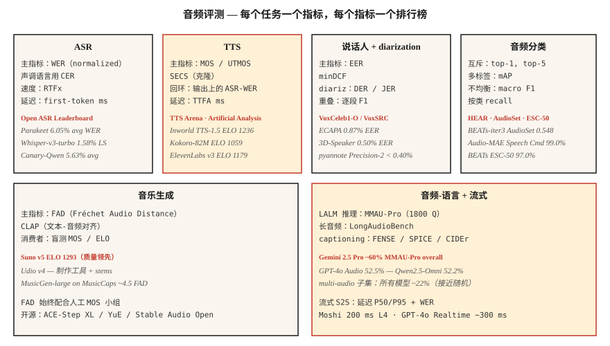

# Audio Evaluation — WER、MOS、UTMOS、MMAU、FAD 和开放排行榜

> 无法衡量的东西，就无法发布。本课为每一种音频任务命名 2026 年的指标：ASR（WER、CER、RTFx）、TTS（MOS、UTMOS、SECS、WER-on-ASR-round-trip）、audio-language（MMAU、LongAudioBench）、音乐（FAD、CLAP）以及说话人（EER）。还包括用于对比的排行榜。

**Type:** Learn
**Languages:** Python
**Prerequisites:** Phase 6 · 04, 06, 07, 09, 10; Phase 2 · 09 (Model Evaluation)
**Time:** ~60 minutes

## 问题

每个音频任务都有多个指标，每个指标衡量不同维度。使用错误指标，会让你发布一个在 dashboard 上看起来很棒、但在生产环境中表现很差的 model。2026 年的标准清单如下：

| Task | Primary | Secondary |
|------|---------|-----------|
| ASR | WER | CER · RTFx · first-token latency |
| TTS | MOS / UTMOS | SECS · WER-on-ASR-round-trip · CER · TTFA |
| Voice cloning | SECS (ECAPA cosine) | MOS · CER |
| Speaker verification | EER | minDCF · FAR / FRR at operating point |
| Diarization | DER | JER · speaker confusion |
| Audio classification | top-1 · mAP | macro F1 · per-class recall |
| Music generation | FAD | CLAP · listening panel MOS |
| Audio language model | MMAU-Pro | LongAudioBench · AudioCaps FENSE |
| Streaming S2S | latency P50/P95 | WER · MOS |

## 概念



### ASR 指标

**WER (Word Error Rate)。** `(S + D + I) / N`。评分前先转小写、去除标点、规范化数字。使用 `jiwer` 或 OpenAI 的 `whisper_normalizer`。&lt; 5% = 朗读语音达到人类水平。

**CER (Character Error Rate)。** 相同公式，字符级别。用于声调语言（Mandarin、Cantonese），因为这些语言的词边界可能有歧义。

**RTFx (inverse real-time factor)。** 每个 wall-clock 秒处理的音频秒数。越高越好。Parakeet-TDT 达到 3380×。Whisper-large-v3 约为 ~30×。

**First-token latency。** 从音频输入到第一个 transcript Token 的 wall-clock 时间。对 streaming 至关重要。Deepgram Nova-3：~150 ms。

### TTS 指标

**MOS (Mean Opinion Score)。** 1-5 的人工评分。黄金标准，但速度慢。每个样本收集 20+ 听众，每个 model 100+ 样本。

**UTMOS (2022-2026)。** 训练得到的 MOS 预测器。在标准 benchmark 上与人工 MOS 的相关性约为 ~0.9。F5-TTS：UTMOS 3.95；ground truth：4.08。

**SECS (Speaker Encoder Cosine Similarity)。** 用于 voice cloning。参考音频与克隆输出之间的 ECAPA Embedding cosine。&gt; 0.75 = 可识别的克隆声音。

**WER-on-ASR-round-trip。** 在 TTS 输出上运行 Whisper，并相对于输入文本计算 WER。用于捕捉可懂度回退。2026 SOTA：&lt; 2% CER。

**TTFA (time-to-first-audio)。** 端到端延迟。Kokoro-82M：~100 ms；F5-TTS：~1 s。

### Voice-cloning 专用指标

**SECS + MOS + CER** 作为三元组。SECS 高但 MOS 低的克隆，说明音色正确但不自然；反过来则说明声音自然但说话人不对。

### Speaker verification

**EER (Equal Error Rate)。** False Accept Rate 等于 False Reject Rate 的阈值。ECAPA 在 VoxCeleb1-O 上：0.87%。

**minDCF (min Detection Cost)。** 在选定 operating point（通常 FAR=0.01）上的加权成本。比 EER 更贴近生产环境。

### Diarization

**DER (Diarization Error Rate)。** `(FA + Miss + Confusion) / total_speaker_time`。漏检语音 + 误报语音 + 说话人混淆，每项都是一个占比。AMI meetings：DER ~10-20% 是现实水平。pyannote 3.1 + Precision-2 commercial：在录制良好的音频上 &lt;10% DER。

**JER (Jaccard Error Rate)。** DER 的替代指标，对短片段偏差更稳健。

### Audio classification

Multi-label：所有类别上的 **mAP (mean Average Precision)**。AudioSet：BEATs-iter3 为 0.548 mAP。

互斥 Multi-class：**top-1、top-5 accuracy**。Speech Commands v2：99.0% top-1（Audio-MAE）。

类别不均衡：**macro F1** + **per-class recall**。报告 per-class，汇总 accuracy 会掩盖哪些类别失败。

### Music generation

**FAD (Fréchet Audio Distance)。** 真实音频与生成音频的 VGGish-Embedding 分布之间的距离。MusicGen-small 在 MusicCaps 上：4.5。MusicLM：4.0。越低越好。

**CLAP Score。** 使用 CLAP Embedding 的文本-音频对齐分数。&gt; 0.3 = 合理对齐。

**Listening panel MOS。** 对消费级音乐来说仍是最终判据。Suno v5 在 TTS Arena 上的 ELO 为 1293（来自成对人工偏好）。

### Audio-language benchmark

**MMAU (Massive Multi-Audio Understanding)。** 10k 个音频 QA 对。

**MMAU-Pro。** 1800 个困难条目，四类：speech / sound / music / multi-audio。4 选 1 的随机水平为 25%。Gemini 2.5 Pro 总体约 ~60%；所有 model 在 multi-audio 上约 ~22%。

**LongAudioBench。** 多分钟片段，配有语义查询。Audio Flamingo Next 超过 Gemini 2.5 Pro。

**AudioCaps / Clotho。** Captioning benchmark。SPICE、CIDEr、FENSE 指标。

### Streaming speech-to-speech

**Latency P50 / P95 / P99。** 从用户说话结束到第一个可听响应的 wall-clock 时间。Moshi：200 ms；GPT-4o Realtime：300 ms。

**WER / MOS** 用于输出。

**Barge-in responsiveness。** 从用户打断到助手静音的时间。目标 &lt; 150 ms。

### 2026 排行榜

| Leaderboard | Tracks | URL |
|------------|--------|-----|
| Open ASR Leaderboard (HF) | English + multilingual + long-form | `huggingface.co/spaces/hf-audio/open_asr_leaderboard` |
| TTS Arena (HF) | English TTS | `huggingface.co/spaces/TTS-AGI/TTS-Arena` |
| Artificial Analysis Speech | TTS + STT, ELO from paired votes | `artificialanalysis.ai/speech` |
| MMAU-Pro | LALM reasoning | `mmaubenchmark.github.io` |
| SpeakerBench / VoxSRC | Speaker recognition | `voxsrc.github.io` |
| MMAU music subset | Music LALM | (within MMAU) |
| HEAR benchmark | Self-supervised audio | `hearbenchmark.com` |

## 构建

### 步骤 1：带规范化的 WER

```python
from jiwer import wer, Compose, ToLowerCase, RemovePunctuation, Strip

transform = Compose([ToLowerCase(), RemovePunctuation(), Strip()])
score = wer(
    truth="Please turn on the lights.",
    hypothesis="please turn on the light",
    truth_transform=transform,
    hypothesis_transform=transform,
)
# ~0.17
```

### 步骤 2：TTS round-trip WER

```python
def ttr_wer(tts_model, asr_model, texts):
    errors = []
    for txt in texts:
        audio = tts_model.synthesize(txt)
        recog = asr_model.transcribe(audio)
        errors.append(wer(truth=txt, hypothesis=recog))
    return sum(errors) / len(errors)
```

### 步骤 3：用于 voice cloning 的 SECS

```python
from speechbrain.inference.speaker import EncoderClassifier
sv = EncoderClassifier.from_hparams("speechbrain/spkrec-ecapa-voxceleb")

emb_ref = sv.encode_batch(load_wav("reference.wav"))
emb_clone = sv.encode_batch(load_wav("cloned.wav"))
secs = torch.nn.functional.cosine_similarity(emb_ref, emb_clone, dim=-1).item()
```

### 步骤 4：用于 music generation 的 FAD

```python
from frechet_audio_distance import FrechetAudioDistance
fad = FrechetAudioDistance()
score = fad.get_fad_score("generated_folder/", "reference_folder/")
```

### 步骤 5：用于 speaker verification 的 EER（与 Lesson 6 相同代码）

```python
def eer(same_scores, diff_scores):
    thresholds = sorted(set(same_scores + diff_scores))
    best = (1.0, 0.0)
    for t in thresholds:
        far = sum(1 for s in diff_scores if s >= t) / len(diff_scores)
        frr = sum(1 for s in same_scores if s < t) / len(same_scores)
        if abs(far - frr) < best[0]:
            best = (abs(far - frr), (far + frr) / 2)
    return best[1]
```

## 使用

为每次部署配套一个固定的 eval harness，并在每次 model 更新时运行。三条基本规则：

1. **评分前先规范化。** 转小写、去标点、展开数字。报告规范化规则。
2. **报告分布，而不是平均值。** Latency 报 P50/P95/P99。Classification 报 per-class recall。MMAU 报 per-category。
3. **运行一个标准公开 benchmark。** 即使你的生产数据不同，在 Open ASR / TTS Arena / MMAU 上报告也能让评审做同口径比较。

## 陷阱

- **UTMOS 外推。** 它在 VCTK 风格的干净语音上训练；对嘈杂 / 克隆 / 情绪化音频评分较差。
- **MOS panel 偏差。** 20 个 Amazon Mechanical Turk worker ≠ 20 个目标用户。如果风险高，就为领域 panel 付费。
- **FAD 依赖参考集。** 跨 model 比较时，必须使用相同的参考分布。
- **Aggregate WER。** 总体 5% WER 可能掩盖口音语音上的 30% WER。按人口统计 slice 报告。
- **公开 benchmark 饱和。** 大多数 frontier model 在标准 benchmark 上已接近上限。构建反映你真实流量的内部 held-out set。

## 发布

保存为 `outputs/skill-audio-evaluator.md`。为任意音频 model 发布选择指标、benchmark 和报告格式。

## 练习

1. **Easy。** 运行 `code/main.py`。在 toy 输入上计算 WER / CER / EER / SECS / FAD-ish / MMAU-ish。
2. **Medium。** 构建一个 TTS round-trip WER harness。将你的 Kokoro 或 F5-TTS 输出送入 Whisper。对 50 个 prompt 计算 WER。标记 WER &gt; 10% 的 prompt。
3. **Hard。** 在 MMAU-Pro speech + multi-audio 子集（各 50 个条目）上评测你在 Lesson 10 中选择的 LALM。报告 per-category accuracy，并与已发布数字比较。

## 关键术语

| Term | What people say | What it actually means |
|------|-----------------|-----------------------|
| WER | ASR 分数 | 规范化后 word 级别的 `(S+D+I)/N`。 |
| CER | Character WER | 用于声调语言或 char-level 系统。 |
| MOS | 人类意见 | 1-5 评分；20+ 听众 × 100 样本。 |
| UTMOS | ML MOS 预测器 | 训练得到的 model；与人工 MOS 相关性约 ~0.9。 |
| SECS | Voice-clone 相似度 | 参考音频与克隆音频之间的 ECAPA cosine。 |
| EER | Speaker verif 分数 | FAR = FRR 的阈值。 |
| DER | Diarization 分数 | (FA + Miss + Confusion) / total。 |
| FAD | Music-gen 质量 | VGGish Embedding 上的 Fréchet distance。 |
| RTFx | 吞吐量 | 每个 wall-clock 秒处理的音频秒数。 |

## 延伸阅读

- [jiwer](https://github.com/jitsi/jiwer) — 带规范化工具的 WER/CER 库。
- [UTMOS (Saeki et al. 2022)](https://arxiv.org/abs/2204.02152) — 训练得到的 MOS 预测器。
- [Fréchet Audio Distance (Kilgour et al. 2019)](https://arxiv.org/abs/1812.08466) — music-gen 标准。
- [Open ASR Leaderboard](https://huggingface.co/spaces/hf-audio/open_asr_leaderboard) — 2026 实时排名。
- [TTS Arena](https://huggingface.co/spaces/TTS-AGI/TTS-Arena) — 人工投票 TTS 排行榜。
- [MMAU-Pro benchmark](https://mmaubenchmark.github.io/) — LALM reasoning 排行榜。
- [HEAR benchmark](https://hearbenchmark.com/) — audio SSL benchmark。
