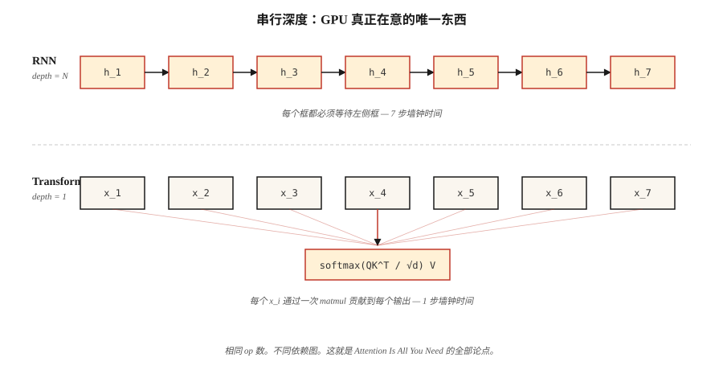

# 为什么 Transformers — RNNs 的问题

> RNNs 一次处理一个 Token。Transformers 一次处理所有 Tokens。这个单一的架构选择，改变了 2017 年之后 Deep Learning 中的每一条扩展曲线。

**类型：** 学习
**语言：** Python
**先修要求：** Phase 3 (Deep Learning Core), Phase 5 · 09 (Sequence-to-Sequence), Phase 5 · 10 (Attention Mechanism)
**时间：** ~45 分钟

## 问题

2017 年之前，地球上每一个最先进的序列模型——语言、翻译、语音——都是 recurrent Neural Network。LSTMs 和 GRUs 在相当于 ImageNet 地位的翻译基准上统治了半个十年。它们是当时所有人唯一可用的工具。

它们有三个致命弱点。顺序计算意味着你无法沿时间轴并行化：Token `t+1` 需要来自 Token `t` 的 hidden state。一个 1,024-Token 序列意味着在一个每个周期可以执行 1,000,000 次浮点操作的 GPU 上进行 1,024 个串行步骤。在为并行而设计的硬件上，训练的 wall-clock time 会随序列长度线性增长。

Vanishing gradients 意味着 50 个 Tokens 之前的信息已经被压缩穿过了 50 层非线性。Gated recurrent units（LSTM, GRU）缓解了这种压缩，但从未消除它。Long-range dependencies——“the book I read last summer on a plane to Kyoto was…”——经常失败。

固定宽度的 hidden states 意味着 encoder 会在 decoder 看到任何内容之前，把整个 source sequence 挤压进单个 Vector。source 是 5 个 Tokens 还是 500 个都无关紧要；瓶颈始终是相同形状。

2017 年论文 “Attention Is All You Need” 提出了一个激进想法：彻底抛弃 recurrence。让每个位置并行地 attend 到每个其他位置。用一次大型 Matrix multiplication 训练，而不是 1,024 次顺序计算。

到 2026 年，这个结果已经主导了所有 modality。语言（GPT-5, Claude 4, Llama 4）、视觉（ViT, DINOv2, SAM 3）、音频（Whisper）、生物学（AlphaFold 3）、机器人（RT-2）。相同的 block，不同的输入。

## 概念



**Recurrence 是瓶颈。** RNN 计算 `h_t = f(h_{t-1}, x_t)`。每一步都依赖前一步。你不能在 `h_4` 之前计算 `h_5`。在拥有 10,000+ 并行核心的现代 GPUs 上，这会在长序列上浪费 99% 的硅面积。

**Attention 是广播。** Self-attention 会为每一对 `(i, j)` 同时计算 `output_i = sum_j(a_ij * v_j)`。整个 N×N attention matrix 会在一次 batched matmul 中填满。没有任何步骤依赖另一个步骤。GPUs 喜欢这一点。

**加速不是常数。** 它是 `O(N)` serial depth 和 `O(1)` serial depth 之间的差别。实践中，在 N=512 且硬件相同的情况下，transformers 每个 epoch 的训练速度快 5–10×；随着序列长度增加，差距会继续扩大，直到触及 Attention 的 `O(N²)` memory wall（Flash Attention 后来修复了这一点——见 Lesson 12）。

**transformers 的代价。** Attention memory 按 `O(N²)` 扩展。2K context 没问题。128K context 则需要 sliding windows、RoPE extrapolation、Flash Attention tiling，或 linear attention variants。Recurrence 在时间和内存上都是 `O(N)`；transformers 用内存换时间，然后通过并行性把时间赢回来。

**Inductive bias 的转变。** RNNs 假设 locality 和 recency。Transformers 不做假设——每一对位置都是 Attention 的候选。这就是为什么 transformers 需要更多数据才能训练得好，但一旦拥有足够数据就能扩展得更远。Chinchilla（2022）形式化了这一点：给定足够多的 Tokens，Transformer 总是能击败相同参数量的 RNN。

## 构建它

这里没有 Neural Network——我们用数值方式模拟核心瓶颈，让你在自己的笔记本上感受差距。

### 步骤 1： 测量 serial depth

见 `code/main.py`。我们构建两个函数。一个把序列编码为加法链（串行，类似 RNN）。另一个把它编码为并行规约（广播，类似 Attention）。相同数学，不同 dependency graph。

```python
def rnn_style(xs):
    h = 0.0
    for x in xs:
        h = 0.9 * h + x   # can't parallelize: h depends on previous h
    return h

def attention_style(xs):
    return sum(xs) / len(xs)  # every x is independent
```

我们对长度最高 100,000 的序列分别计时。RNN 版本是 O(N)，并且使用单个 CPU pipeline。即使在纯 Python 中，attention-style reduction 在长度 ≥ 1,000 时也会胜出，因为 Python 的 `sum()` 是用 C 实现的，并且迭代时不会在每一步产生解释器开销。

### 步骤 2： 计算理论操作

两个算法都做 N 次加法。区别在于 *dependency depth*：在下一步能够开始之前，有多少操作必须顺序发生。RNN depth = N。Attention depth = log(N)，如果使用 tree reduction；或者在 parallel scan 中为 1。决定 GPU 时间的是 depth，而不是操作次数。

### 步骤 3： 长序列上的经验扩展

我们打印一个 timing table，让 O(N) 差距变得可见。在 2026 年的 Mac 笔记本上，少于 1,000 个元素的序列太快，难以测量。100,000 的序列会显示出清晰的线性扫描。把它扩展到一个 16,384-Token Transformer，并与一个 12-layer LSTM 等价模型比较，你就会明白为什么训练 wall-clock 在 2016 年是一个阻碍因素。

## 使用它

2026 年什么时候仍然选择 RNN：

| 情况 | 选择 |
|-----------|------|
| Streaming inference，一次一个 Token，常量内存 | RNN or state-space model (Mamba, RWKV) |
| 超长序列（>1M tokens），Attention memory 爆炸 | Linear attention, Mamba 2, Hyena |
| 没有 matmul accelerator 的 edge device | Depthwise-separable RNN 在 FLOPs/watt 上仍然胜出 |
| 其他任何情况（训练、batched inference、最高 128K 的 context） | Transformer |

State-space models（SSMs）如 Mamba，本质上是带有结构化参数化的 RNNs，使它们兼具两者优点：`O(N)` scan memory，以及通过 selective scan 实现的并行训练。它们以更好的 long-context scaling 恢复了 90% 的 Transformer 质量。到 2026 年，大多数 frontier labs 都在训练 hybrid SSM+transformer models（例如 Jamba, Samba）——recurrence 并没有死亡，它是一个组件。

## 交付它

见 `outputs/skill-architecture-picker.md`。该 skill 会根据长度、throughput 和 training-budget 约束，为一个新的序列问题选择架构。对于超过 1B Tokens 的训练运行，它必须始终拒绝推荐纯 RNN，除非明确说明 trade-off。

## 练习

1. **简单。** 从 `code/main.py` 中取出 `rnn_style`，把标量 hidden state 替换为长度为 64 的 hidden states Vector。重新测量。serial overhead 会随 hidden-state dimension 增长多少？
2. **中等。** 用纯 Python 实现 parallel prefix-sum（Hillis-Steele scan）。验证它在长度 1024 时产生与 serial scan 相同的数值输出。计算 depth。
3. **困难。** 把 attention-style reduction 移植到 GPU 上的 PyTorch。随着序列长度从 64 扫到 65,536，对两者计时。绘图并解释曲线形状。

## 关键术语

| 术语 | 人们常说 | 它实际意味着什么 |
|------|-----------------|-----------------------|
| Recurrence | “RNNs 是顺序的” | step `t` 依赖 step `t-1` 的计算方式，迫使执行沿时间轴串行进行。 |
| Serial depth | “图有多深” | 依赖操作的最长链；即使在无限硬件上也会限制 wall-clock。 |
| Attention | “让 Tokens 彼此查看” | Weighted sum `sum_j a_ij v_j`，其中 `a_ij` 来自位置 i 和 j 之间的相似度分数。 |
| Context window | “模型能看到多少” | 一个 Attention layer 可作为输入的位置数量；quadratic memory cost 在这里扩展。 |
| Inductive bias | “架构内置的假设” | 关于数据形态的先验；CNNs 假设 translation invariance，RNNs 假设 recency。 |
| State-space model | “背后有代数的 RNN” | 为通过结构化 state-space matrices 实现并行训练而参数化的 recurrence。 |
| Quadratic bottleneck | “为什么 context 这么昂贵” | Attention memory = 序列长度上的 `O(N²)`；Flash Attention 隐藏的是常数，而不是扩展规律。 |

## 延伸阅读

- [Vaswani et al. (2017). Attention Is All You Need](https://arxiv.org/abs/1706.03762) — 这篇论文终结了主流 NLP 中的 recurrence。
- [Bahdanau, Cho, Bengio (2014). Neural MT by Jointly Learning to Align and Translate](https://arxiv.org/abs/1409.0473) — Attention 的诞生之处，当时它被接在 RNN 上。
- [Hochreiter, Schmidhuber (1997). Long Short-Term Memory](https://www.bioinf.jku.at/publications/older/2604.pdf) — 原始 LSTM 论文，作为记录。
- [Gu, Dao (2023). Mamba: Linear-Time Sequence Modeling with Selective State Spaces](https://arxiv.org/abs/2312.00752) — 对 transformers 的现代 recurrent 回答。
