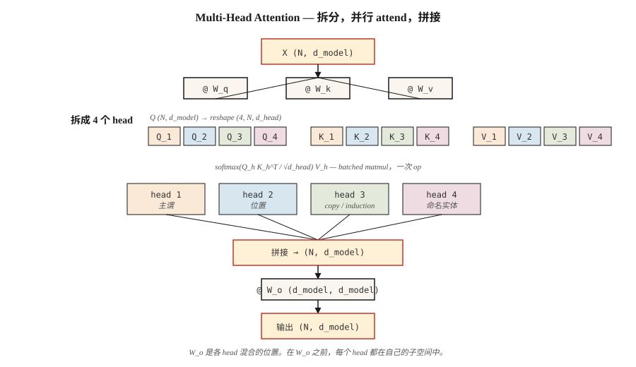

# Multi-Head Attention

> 一个 attention head 一次学习一种关系。八个 heads 学习八种。Heads 很便宜。多用几个。

**类型：** 构建
**语言：** Python
**前置知识：** Phase 7 · 02（Self-Attention from Scratch）
**时间：** ~75 分钟

## 问题

单个 self-attention head 会计算一个 attention matrix。这个 matrix 捕捉一种关系，通常是能在当前训练信号上最小化 loss 的那一种。如果你的数据里 subject-verb agreement、co-reference、long-range discourse 和 syntactic chunking 全部纠缠在一起，单个 head 会把它们抹进一个单一的 soft-max distribution，丢掉一半信号。

2017 年 Vaswani paper 给出的修复方式是：并行运行多个 attention functions，每个都有自己的 Q、K、V projections，然后把输出拼接起来。每个 head 都在维度为 `d_model / n_heads` 的更小子空间中运行。总参数量保持不变。表达能力上升。

Multi-head attention 是 2026 年所有 Transformer 的默认配置。唯一的争论在于要用*多少个* heads，以及 keys 和 values 是否共享 projections（Grouped-Query Attention、Multi-Query Attention、Multi-head Latent Attention）。

## 概念



**Split。** 取形状为 `(N, d_model)` 的 `X`。分别 projection 到形状为 `(N, d_model)` 的 Q、K、V。Reshape 为 `(N, n_heads, d_head)`，其中 `d_head = d_model / n_heads`。Transpose 为 `(n_heads, N, d_head)`。

**并行 Attend。** 在每个 head 内运行 scaled dot-product attention。每个 head 产生 `(N, d_head)`。这些 heads 在 Embedding 的不同子空间上运行，并且在 attention computation 本身期间不会彼此通信。

**Concatenate 并 project。** 将 heads stack 回 `(N, d_model)`，然后乘以形状为 `(d_model, d_model)` 的 learned output matrix `W_o`。`W_o` 是 heads 进行混合的位置。

**为什么有效。** 每个 head 都可以专门化，而不必和其他 heads 争抢表征预算。2019–2024 年的 probing studies 显示了不同的 head roles：positional heads、attends to the previous token 的 head、copy heads、named-entity heads、induction heads（它们构成 in-context learning 的底层机制）。

**2026 年的变体谱系：**

| Variant | Q heads | K/V heads | Used by |
|---------|---------|-----------|---------|
| Multi-head (MHA) | N | N | GPT-2, BERT, T5 |
| Multi-query (MQA) | N | 1 | PaLM, Falcon |
| Grouped-query (GQA) | N | G (e.g. N/8) | Llama 2 70B, Llama 3+, Qwen 2+, Mistral |
| Multi-head latent (MLA) | N | compressed to low-rank | DeepSeek-V2, V3 |

GQA 是现代默认方案，因为它能按 `N/G` 的倍数削减 KV-cache memory，同时几乎保持完整质量。MLA 更进一步，把 K/V 压缩进 latent space，然后在计算时 project 回来——它会消耗 FLOPs，但节省更多 memory。

## 构建它

### 步骤 1：从我们已有的 single-head attention 中 split heads

取 Lesson 02 里的 `SelfAttention`，用一对 split/concat 包起来。`code/main.py` 中有 numpy 实现；逻辑如下：

```python
def split_heads(X, n_heads):
    n, d = X.shape
    d_head = d // n_heads
    return X.reshape(n, n_heads, d_head).transpose(1, 0, 2)  # (heads, n, d_head)

def combine_heads(H):
    h, n, d_head = H.shape
    return H.transpose(1, 0, 2).reshape(n, h * d_head)
```

一次 reshape 和一次 transpose。没有 loop。这正是 PyTorch 在 `nn.MultiheadAttention` 下做的事。

### 步骤 2：按 head 运行 scaled-dot-product attention

每个 head 都拿到 Q、K、V 的自己的 slice。Attention 变成 batched matmul：

```python
def mha_forward(X, W_q, W_k, W_v, W_o, n_heads):
    Q = X @ W_q
    K = X @ W_k
    V = X @ W_v
    Qh = split_heads(Q, n_heads)         # (heads, n, d_head)
    Kh = split_heads(K, n_heads)
    Vh = split_heads(V, n_heads)
    scores = Qh @ Kh.transpose(0, 2, 1) / np.sqrt(Qh.shape[-1])
    weights = softmax(scores, axis=-1)
    out = weights @ Vh                    # (heads, n, d_head)
    concat = combine_heads(out)
    return concat @ W_o, weights
```

在真实硬件上，`Qh @ Kh.transpose(...)` 是一个 `bmm`。GPU 看到的是形状为 `(heads, N, d_head) × (heads, d_head, N) -> (heads, N, N)` 的单个 batched matmul。增加 heads 很便宜。

### 步骤 3：Grouped-Query Attention 变体

只有 key 和 value projections 会改变。Q 获得 `n_heads` 个 groups；K 和 V 获得 `n_kv_heads < n_heads` 个 groups，并被重复以匹配：

```python
def gqa_project(X, W, n_kv_heads, n_heads):
    kv = split_heads(X @ W, n_kv_heads)       # (kv_heads, n, d_head)
    repeat = n_heads // n_kv_heads
    return np.repeat(kv, repeat, axis=0)      # (n_heads, n, d_head)
```

在 inference 时，这会节省 memory，因为 KV cache 中只保存 `n_kv_heads` 份副本，而不是 `n_heads` 份。Llama 3 70B 使用 64 个 query heads 和 8 个 KV heads，也就是 8× 的 cache 缩减。

### 步骤 4：probe 每个 head 学到了什么

在一个短句上用 4 个 heads 运行 MHA。对每个 head，打印 `(N, N)` attention matrix。你会看到不同 heads 即使在 random initialization 下也会选出不同结构——这部分是信号，部分是子空间里的 rotational symmetry。

## 使用它

在 PyTorch 中，一行版本：

```python
import torch.nn as nn

mha = nn.MultiheadAttention(embed_dim=512, num_heads=8, batch_first=True)
```

PyTorch 2.5+ 中的 GQA：

```python
from torch.nn.functional import scaled_dot_product_attention

# scaled_dot_product_attention auto-dispatches Flash Attention on CUDA.
# For GQA, pass Q of shape (B, n_heads, N, d_head) and K,V of shape
# (B, n_kv_heads, N, d_head). PyTorch handles the repeat.
out = scaled_dot_product_attention(q, k, v, is_causal=True, enable_gqa=True)
```

**多少个 heads？** 来自 2026 年 production models 的经验规则：

| Model size | d_model | n_heads | d_head |
|------------|---------|---------|--------|
| Small (~125M) | 768 | 12 | 64 |
| Base (~350M) | 1024 | 16 | 64 |
| Large (~1B) | 2048 | 16 | 128 |
| Frontier (~70B) | 8192 | 64 | 128 |

`d_head` 几乎总是落在 64 或 128。它是一个 head 能“看到”多少内容的单位。低于 32，heads 就会开始和 scaling factor `sqrt(d_head)` 较劲；高于 256，你会失去“许多小型专家”的收益。

## 交付它

见 `outputs/skill-mha-configurator.md`。这个 skill 会根据 parameter budget、sequence length 和 deployment target，为新的 Transformer 推荐 head count、kv-head count 和 projection strategy。

## 练习

1. **简单。** 取 `code/main.py` 中的 MHA，在固定 `d_model=64` 的情况下把 `n_heads` 从 1 改到 16。在 synthetic copy task 上绘制一个 tiny one-layer model 的 loss。更多 heads 是有帮助、趋于平台，还是有害？
2. **中等。** 实现 MQA（所有 query heads 共享一个 KV head）。衡量 parameter count 相比 full MHA 下降了多少。计算 inference 时 N=2048 下 KV-cache size 缩小了多少。
3. **困难。** 实现一个 tiny 版本的 Multi-head Latent Attention：把 K,V 压缩到 rank-`r` latent，把 latent 存入 KV cache，在 attention time 解压。`r` 取到多少时，cache memory 会降到 full MHA 的 1/8 以下，同时质量仍保持在 validation ppl 的 1 bit 以内？

## 关键术语

| Term | What people say | What it actually means |
|------|-----------------|-----------------------|
| Head | “一个单独的 attention circuit” | 一个维度为 `d_head = d_model / n_heads` 的 Q/K/V projection，拥有自己的 attention matrix。 |
| d_head | “Head dimension” | Per-head hidden width；在 production 中几乎总是 64 或 128。 |
| Split / combine | “Reshape tricks” | Attention 前后的 `(N, d_model) ↔ (n_heads, N, d_head)` reshape+transpose。 |
| W_o | “Output projection” | Concatenating heads 之后应用的 `(d_model, d_model)` matrix；heads 在这里混合。 |
| MQA | “One KV head” | Multi-Query Attention：单个共享 K/V projection。KV cache 最小，但有一些质量损失。 |
| GQA | “The default since Llama 2” | `n_kv_heads < n_heads` 的 Grouped-Query Attention；通过重复来匹配 Q。 |
| MLA | “DeepSeek 的技巧” | Multi-head Latent Attention：K,V 被压缩到 low-rank latent，并在 attend time 解压。 |
| Induction head | “in-context learning 背后的 circuit” | 一对 heads，检测之前的出现位置，并复制其后跟随的内容。 |

## 延伸阅读

- [Vaswani et al. (2017). Attention Is All You Need §3.2.2](https://arxiv.org/abs/1706.03762) — 原始的 multi-head 规范。
- [Shazeer (2019). Fast Transformer Decoding: One Write-Head is All You Need](https://arxiv.org/abs/1911.02150) — MQA 论文。
- [Ainslie et al. (2023). GQA: Training Generalized Multi-Query Transformer Models from Multi-Head Checkpoints](https://arxiv.org/abs/2305.13245) — 如何在训练后把 MHA 转换为 GQA。
- [DeepSeek-AI (2024). DeepSeek-V2 Technical Report](https://arxiv.org/abs/2405.04434) — MLA，以及它为什么在 cache memory 上优于 MHA/GQA。
- [Olsson et al. (2022). In-context Learning and Induction Heads](https://transformer-circuits.pub/2022/in-context-learning-and-induction-heads/index.html) — 从 mechanistic 角度观察 heads 实际做了什么。
