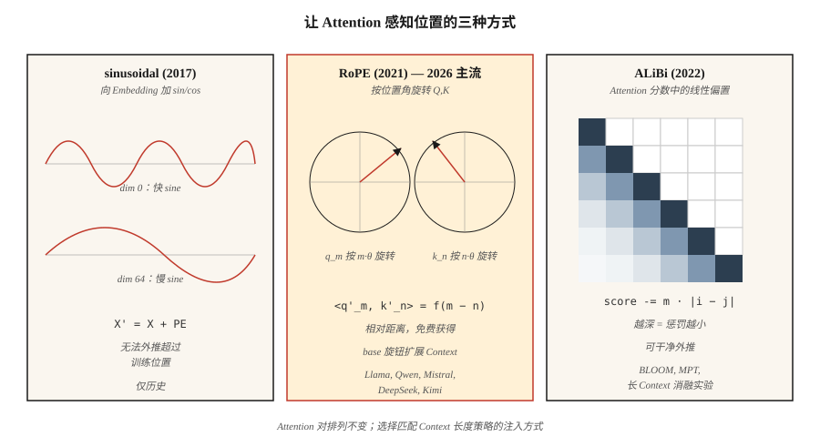

# Positional Encoding — Sinusoidal, RoPE, ALiBi

> Attention 对排列不敏感。没有 positional signal 时，“The cat sat on the mat”和“mat the on sat cat the”会产生相同输出。三种算法修复了它——每一种都对“position”的含义做了不同下注。

**Type:** Build
**Languages:** Python
**Prerequisites:** Phase 7 · 02 (Self-Attention), Phase 7 · 03 (Multi-Head Attention)
**Time:** ~45 分钟

## The Problem

Scaled dot-product attention 对顺序不敏感。attention matrix `softmax(Q K^T / √d) V` 由 pairwise similarities 计算得到。打乱 `X` 的行，输出的行也会以同样方式被打乱。Attention 内部没有任何东西关心 position。

这在 bag-of-words model 中不是 bug。但对 language、code、audio、video，以及任何 order 承载 meaning 的东西来说，这是致命的。

修复方法是以某种方式把 position 注入 embeddings。三个时代的答案：

1. **Absolute sinusoidal**（Vaswani 2017）。将 position 的 `sin/cos` 加到 embedding 上。简单、不需要学习参数，但对训练长度之外的 extrapolation 很差。
2. **RoPE — Rotary Position Embeddings**（Su 2021）。按与 position 成比例的角度旋转 Q 和 K vectors。直接在 dot product 中编码 *relative* position。2026 年的主流选择。
3. **ALiBi — Attention with Linear Biases**（Press 2022）。完全跳过 embeddings；根据 distance 给 attention scores 加上 per-head linear penalty。长度 extrapolation 极佳。

截至 2026 年，几乎所有 frontier open model 都使用 RoPE：Llama 2/3/4、Qwen 2/3、Mistral、Mixtral、DeepSeek-V3、Kimi。少数 long-context models 使用 ALiBi 或其现代变体。Absolute sinusoidal 已成为历史方案。

## The Concept



### Absolute sinusoidal

预先计算一个 shape 为 `(max_len, d_model)` 的固定 Matrix `PE`：

```
PE[pos, 2i]   = sin(pos / 10000^(2i / d_model))
PE[pos, 2i+1] = cos(pos / 10000^(2i / d_model))
```

然后在 attention 之前执行 `X' = X + PE[:N]`。每个 dimension 都是不同 frequency 的 sinusoid。模型学习从 phase pattern 中读取 position。超过 `max_len` 后会失败：当模型只见过 positions 0–2047 时，没有任何东西告诉它 position 2048 会发生什么。

### RoPE

旋转 Q 和 K vectors（不是 embeddings）。对一对 dimensions `(2i, 2i+1)`：

```
[q'_2i    ]   [ cos(pos·θ_i)  -sin(pos·θ_i) ] [q_2i   ]
[q'_2i+1  ] = [ sin(pos·θ_i)   cos(pos·θ_i) ] [q_2i+1 ]

θ_i = base^(-2i / d_head),  base = 10000 by default
```

对 position 为 `pos_k` 的 keys 应用相同旋转。dot product `q'_m · k'_n` 会变成只依赖 `(m - n)` 的函数。也就是说：**attention score 只依赖 relative distance**，尽管旋转是由 absolute positions 索引的。漂亮的技巧。

扩展 RoPE：可以缩放 `base`（NTK-aware、YaRN、LongRoPE），以便在不重新训练的情况下 extrapolate 到更长 context。Llama 3 就是用这种方式从 8K 扩展到 128K context。

### ALiBi

跳过 embedding 技巧。直接给 attention scores 加 bias：

```
attn_score[i, j] = (q_i · k_j) / √d  -  m_h · |i - j|
```

其中 `m_h` 是 head-specific slope（例如 `1 / 2^(8·h/H)`）。近处 tokens 得到 boost；远处 tokens 受到 penalty。没有训练时成本。论文显示，长度 extrapolation 优于 sinusoidal，并在原始训练长度上与 RoPE 持平。

### 2026 年该选什么

| Variant | Extrapolation | Training cost | Used by |
|---------|---------------|---------------|---------|
| Absolute sinusoidal | 差 | 免费 | original transformer, early BERT |
| Learned absolute | 无 | 很小 | GPT-2, GPT-3 |
| RoPE | 配合 scaling 时很好 | 免费 | Llama 2/3/4, Qwen 2/3, Mistral, DeepSeek-V3, Kimi |
| RoPE + YaRN | 极佳 | fine-tune stage | Qwen2-1M, Llama 3.1 128K |
| ALiBi | 极佳 | 免费 | BLOOM, MPT, Baichuan |

RoPE 胜出，是因为它可以直接插入 attention 而不改变 architecture，能编码 relative position，并且它的 `base` hyperparameter 为 long-context fine-tuning 提供了清晰旋钮。


```figure
rope-explorer
```

## Build It

### Step 1: sinusoidal encoding

见 `code/main.py`。4 行计算：

```python
def sinusoidal(N, d):
    pe = [[0.0] * d for _ in range(N)]
    for pos in range(N):
        for i in range(d // 2):
            theta = pos / (10000 ** (2 * i / d))
            pe[pos][2 * i]     = math.sin(theta)
            pe[pos][2 * i + 1] = math.cos(theta)
    return pe
```

在第一个 attention layer 之前，将它加到 embedding matrix 上。

### Step 2: 应用于 Q、K 的 RoPE

RoPE 会在 Q 和 K 上原地操作。对每对 dims：

```python
def apply_rope(x, pos, base=10000):
    d = len(x)
    out = list(x)
    for i in range(d // 2):
        theta = pos / (base ** (2 * i / d))
        c, s = math.cos(theta), math.sin(theta)
        a, b = x[2 * i], x[2 * i + 1]
        out[2 * i]     = a * c - b * s
        out[2 * i + 1] = a * s + b * c
    return out
```

关键：对 position `m` 的 Q 和 position `n` 的 K 应用同一个函数。它们的 dot product 会在每个 coordinate pair 上获得一个 `cos((m-n)·θ_i)` 因子。Attention 免费学到 relative position。

### Step 3: ALiBi slopes 和 bias

```python
def alibi_bias(n_heads, seq_len):
    # slope_h = 2 ** (-8 * h / n_heads) for h = 1..n_heads
    slopes = [2 ** (-8 * (h + 1) / n_heads) for h in range(n_heads)]
    bias = []
    for m in slopes:
        row = [[-m * abs(i - j) for j in range(seq_len)] for i in range(seq_len)]
        bias.append(row)
    return bias  # add to attention scores before softmax
```

将 `bias[h]` 加到 head `h` 的 `(seq_len, seq_len)` attention score matrix 上，然后 softmax。

### Step 4: 验证 RoPE 的 relative-distance property

选两个 random vectors `a, b`。先按 `(pos_a, pos_b)` 旋转。再按 `(pos_a + k, pos_b + k)` 旋转。两个 dot products 必须在 floating-point error 内相等。这个性质就是 RoPE 的全部意义——它对 absolute offset 不变，只关心 relative gap。

## Use It

PyTorch 2.5+ 在 `torch.nn.functional` 中提供 RoPE utilities。大多数生产代码使用 `flash_attn` 或 `xformers`，RoPE 会在 attention kernel 内部应用。

```python
from transformers import AutoModel
model = AutoModel.from_pretrained("meta-llama/Llama-3.2-3B")
# model.config.rope_scaling → {"type": "yarn", "factor": 32.0, "original_max_position_embeddings": 8192}
```

**2026 年的 Long-context 技巧：**

- **NTK-aware interpolation。** 从 4K 扩展到 16K+ 时，将 `base` 重新缩放为 `base * (scale_factor)^(d/(d-2))`。
- **YaRN。** 更聪明的 interpolation，可在 long contexts 上保留 attention entropy。Llama 3.1 128K 使用它。
- **LongRoPE。** Microsoft 2024 年方法，使用 evolutionary search 为每个 dimension 选择 scale factors。Phi-3-Long 使用它。
- **Position interpolation + fine-tuning。** 只需按 extension factor 缩小 positions，并 fine-tune 1–5B tokens。效果意外地好。

## Ship It

见 `outputs/skill-positional-encoding-picker.md`。该 skill 会根据 target context length、extrapolation needs 和 training budget，为新模型选择 encoding strategy。

## Exercises

1. **Easy。** 将 `max_len=512, d=128` 的 sinusoidal `PE` Matrix 绘制为 heatmap。确认“随着 dimension index 增大，stripes 变宽”的 pattern。
2. **Medium。** 实现 NTK-aware RoPE scaling。在 length 256 的 sequences 上训练 tiny LM，然后在 length 1024 上分别测试有 scaling 和无 scaling 的情况。测量 perplexity。
3. **Hard。** 在同一个 attention module 中实现 ALiBi 和 RoPE。在 length 512 的 sequences 上用 copy task 训练 4-layer transformer。测试时 extrapolate 到 2048。比较 degradation。

## Key Terms

| Term | What people say | What it actually means |
|------|-----------------|-----------------------|
| Positional encoding | “告诉 attention 顺序” | 添加到 embeddings 或 attention 中、用于编码 position 的任意 signal。 |
| Sinusoidal | “最初那个” | 以 geometric frequencies 加到 embeddings 上的 `sin/cos`；不能 extrapolate。 |
| RoPE | “Rotary embeddings” | 按 position-dependent angle 旋转 Q、K；dot product 编码 relative distance。 |
| ALiBi | “Linear bias trick” | 将 `-m·\|i-j\|` 加到 attention scores；不需要 embedding，extrapolation 很强。 |
| base | “RoPE 的旋钮” | RoPE 中的 frequency scaler；增大它可在 inference 时扩展 context。 |
| NTK-aware | “一种 RoPE scaling trick” | 重新缩放 `base`，让 context 扩展时 high-frequency dims 不会被挤压。 |
| YaRN | “高级那个” | 保留 attention entropy 的 per-dimension interpolation+extrapolation。 |
| Extrapolation | “能在训练长度之外工作” | position scheme 能否在训练时见过的 `max_len` 之外给出正确输出？ |

## Further Reading

- [Vaswani et al. (2017). Attention Is All You Need §3.5](https://arxiv.org/abs/1706.03762) — 原始 sinusoidal。
- [Su et al. (2021). RoFormer: Enhanced Transformer with Rotary Position Embedding](https://arxiv.org/abs/2104.09864) — RoPE paper。
- [Press, Smith, Lewis (2021). Train Short, Test Long: Attention with Linear Biases Enables Input Length Extrapolation](https://arxiv.org/abs/2108.12409) — ALiBi。
- [Peng et al. (2023). YaRN: Efficient Context Window Extension of Large Language Models](https://arxiv.org/abs/2309.00071) — state of the art RoPE scaling。
- [Chen et al. (2023). Extending Context Window of Large Language Models via Positional Interpolation](https://arxiv.org/abs/2306.15595) — Meta 的 Llama 2 long-context paper。
- [Ding et al. (2024). LongRoPE: Extending LLM Context Window Beyond 2 Million Tokens](https://arxiv.org/abs/2402.13753) — Microsoft 方法，被 Phi-3-Long 使用，并在 Use It 部分引用。
- [HuggingFace Transformers — `modeling_rope_utils.py`](https://github.com/huggingface/transformers/blob/main/src/transformers/modeling_rope_utils.py) — 各种 RoPE scaling scheme（default、linear、dynamic、YaRN、LongRoPE、Llama-3）的 production-grade implementations。
