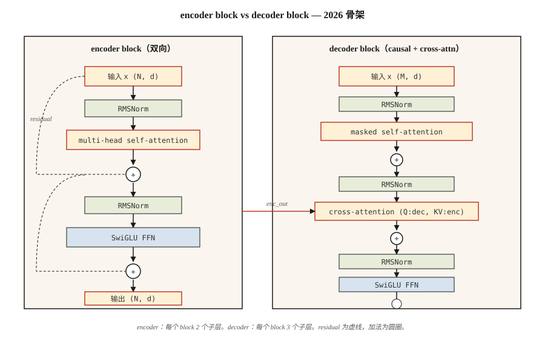

# The Full Transformer — Encoder + Decoder

> Attention 是主角。其他一切——residuals、normalization、feed-forward、cross-attention——都是让你能够把它堆得很深的脚手架。

**Type:** Build
**Languages:** Python
**先修要求:** Phase 7 · 02 (Self-Attention), Phase 7 · 03 (Multi-Head Attention), Phase 7 · 04 (Positional Encoding)
**Time:** ~75 minutes

## 问题
单个 attention layer 是特征提取器，不是一个 model。每层一次 matmul 对语言来说容量不够。你需要 depth，而如果没有正确的管线，depth 会失效。

2017 年的 Vaswani 论文打包了六个设计决策，把一个 attention layer 变成了可堆叠的 block。此后的每个 transformer——encoder-only (BERT)、decoder-only (GPT)、encoder-decoder (T5)——都继承了同一个骨架。到 2026 年，这些 block 已经被改进（RMSNorm、SwiGLU、pre-norm、RoPE），但骨架完全相同。

本课讲的是这个骨架。后续课程会专门展开——06 讲 encoders，07 讲 decoders，08 讲 encoder-decoder。

## 概念


### 六个组成部分

1. **Embedding + positional signal.** Tokens → Vectors。Position 通过 RoPE（现代）或 sinusoidal（经典）注入。
2. **Self-attention.** 每个 position 都 attends to 其他每个 position。在 decoders 中会 masked。
3. **Feed-forward network (FFN).** 按 position 作用的两层 MLP：`W_2 · activation(W_1 · x)`。默认 expansion ratio 为 4×。
4. **Residual connection.** `x + sublayer(x)`。没有它，gradients 在约 6 层之后会消失。
5. **Layer normalization.** `LayerNorm` 或 `RMSNorm`（现代）。稳定 residual stream。
6. **Cross-attention (decoder only).** Queries 来自 decoder，keys 和 values 来自 encoder output。

### Encoder block（BERT、T5 encoder 使用）

```
x → LN → MHA(self) → + → LN → FFN → + → out
                     ^              ^
                     |              |
                     └── residual ──┘
```

Encoder 是 bidirectional。没有 masking。所有 positions 都能看到所有 positions。

### Decoder block（GPT、T5 decoder 使用）

```
x → LN → MHA(masked self) → + → LN → MHA(cross to encoder) → + → LN → FFN → + → out
```

Decoder 每个 block 有三个 sublayers。中间那个——cross-attention——是信息从 encoder 流向 decoder 的唯一位置。在纯 decoder-only architecture（GPT）中，cross-attention 会被省略，只保留 masked self-attention + FFN。

### Pre-norm vs post-norm

原始论文：`x + sublayer(LN(x))` vs `LN(x + sublayer(x))`。Post-norm 在 2019 年左右失宠——如果没有仔细的 warmup，它很难训练得很深。Pre-norm（在 sublayer *之前* 使用 `LN`）是 2026 年的默认选择：Llama、Qwen、GPT-3+、Mistral 都使用它。

### 2026 年的现代化 block

Vaswani 2017 使用的是 LayerNorm + ReLU。现代 stack 替换了两者。生产级 block 实际看起来是这样：

| Component | 2017 | 2026 |
|-----------|------|------|
| Normalization | LayerNorm | RMSNorm |
| FFN activation | ReLU | SwiGLU |
| FFN expansion | 4× | 2.6×（SwiGLU 使用三个 matrices，总参数量匹配） |
| Position | Sinusoidal absolute | RoPE |
| Attention | Full MHA | GQA（或 MLA） |
| Bias terms | Yes | No |

RMSNorm 去掉了 LayerNorm 的 mean-centering（少一次 subtraction），节省 compute，并且从经验上看至少同样稳定。SwiGLU（`Swish(W1 x) ⊙ W3 x`）在 Llama、PaLM 和 Qwen 论文中稳定优于 ReLU/GELU FFN，ppl 约提升 0.5 个点。

### Parameter count

对于一个 `d_model = d` 且 FFN expansion 为 `r` 的 block：

- MHA: `4 · d²`（Q, K, V, O projections）
- FFN (SwiGLU): `3 · d · (r · d)` ≈ `3rd²`
- Norms: 可忽略

当 `d = 4096, r = 2.6, layers = 32`（大致对应 Llama 3 8B）时，总量为：`32 · (4·4096² + 3·2.6·4096²) ≈ 32 · (16 + 32) M = ~1.5B parameters per layer × 32 ≈ 7B`（再加上 embeddings 和 head）。与已发布的计数相符。


观察一个 Vector 如何流过单个 block：Attention 在位置之间混合信息，residual 把信号继续向前携带，FFN 做变换，而 norm 让 residual stream 保持稳定。

```figure
transformer-block
```

## 构建它
### 步骤 1： building blocks

使用 Lesson 03 中的小型 `Matrix` class（为了独立性已复制到这个文件）：

- `layer_norm(x, eps=1e-5)` — 减去 mean，除以 std。
- `rms_norm(x, eps=1e-6)` — 除以 RMS。不减去 mean。
- `gelu(x)` 和 `silu(x) * W3 x` (SwiGLU)。
- `ffn_swiglu(x, W1, W2, W3)`。
- `encoder_block(x, params)` 和 `decoder_block(x, enc_out, params)`。

完整 wiring 见 `code/main.py`。

### 步骤 2： wire 一个 2-layer encoder 和一个 2-layer decoder

把它们堆叠起来。将 encoder output 传入每个 decoder cross-attention。在 output projection 前添加最终 LN。

```python
def encode(tokens, params):
    x = embed(tokens, params.emb) + sinusoidal(len(tokens), params.d)
    for block in params.encoder_blocks:
        x = encoder_block(x, block)
    return x

def decode(target_tokens, encoder_out, params):
    x = embed(target_tokens, params.emb) + sinusoidal(len(target_tokens), params.d)
    for block in params.decoder_blocks:
        x = decoder_block(x, encoder_out, block)
    return x
```

### 步骤 3： 在 toy example 上运行 forward

输入一个 6-token source 和一个 5-token target。验证 output shape 是 `(5, vocab)`。不训练——本课关注 architecture，而不是 loss。

### 步骤 4： 换成 RMSNorm + SwiGLU

用 RMSNorm 和 SwiGLU 替换 LayerNorm 和 ReLU-FFN。确认 shapes 仍然匹配。这就是 2026 年的现代化，只需一次 function 替换。

## 使用它
PyTorch/TF reference implementations：`nn.TransformerEncoderLayer`、`nn.TransformerDecoderLayer`。但大多数 2026 年的生产代码会自己实现 block，因为：

- Flash Attention 是在 attention 内部调用的，而不是通过 `nn.MultiheadAttention`。
- GQA / MLA 不在 stdlib reference 中。
- RoPE、RMSNorm、SwiGLU 不是 PyTorch defaults。

HF `transformers` 有清晰的 reference blocks，值得阅读：`modeling_llama.py` 是 2026 年 canonical decoder-only block。它约 500 行，值得完整走读一次。

**Encoder vs decoder vs encoder-decoder — 什么时候选择：**

| Need | Pick | Example |
|------|------|---------|
| Classification、embeddings、基于文本的 QA | Encoder-only | BERT, DeBERTa, ModernBERT |
| Text generation、chat、code、reasoning | Decoder-only | GPT, Llama, Claude, Qwen |
| Structured input → structured output（translation、summarization） | Encoder-decoder | T5, BART, Whisper |

Decoder-only 在语言任务中胜出，因为它最容易干净地 scale，并且同时处理 comprehension 和 generation。当 input 具有明确的“source sequence”身份时（translation、speech recognition、structured tasks），encoder-decoder 仍然是最佳选择。

## 交付它
见 `outputs/skill-transformer-block-reviewer.md`。该 skill 会根据 2026 年默认配置 review 一个新的 transformer block implementation，并标记缺失部分（pre-norm、RoPE、RMSNorm、GQA、FFN expansion ratio）。

## 练习
1. **Easy.** 统计你的 encoder_block 在 `d_model=512, n_heads=8, ffn_expansion=4, swiglu=True` 时的 parameters。通过实现该 block 并使用 `sum(p.numel() for p in block.parameters())` 验证。
2. **Medium.** 从 post-norm 切换到 pre-norm。初始化两者，并在 random input 上测量堆叠 12 层后的 activation norm。Post-norm 的 activations 应该会爆炸；pre-norm 的 activations 应该保持有界。
3. **Hard.** 在 toy copy task（复制反转后的 `x`）上实现一个 4-layer encoder-decoder。训练 100 steps。报告 loss。换成 RMSNorm + SwiGLU + RoPE——loss 是否下降？

## 关键术语
| Term | What people say | What it actually means |
|------|-----------------|-----------------------|
| Block | “一个 transformer layer” | norm + attention + norm + FFN 的 stack，并包在 residual connections 中。 |
| Residual | “Skip connection” | `x + f(x)` output；让 gradients 能够流过 deep stacks。 |
| Pre-norm | “先 normalize，不是之后” | 现代形式：`x + sublayer(LN(x))`。无需 warmup 技巧也能训练得更深。 |
| RMSNorm | “没有 mean 的 LayerNorm” | 除以 RMS；少一个 op，经验稳定性相同。 |
| SwiGLU | “大家都切换过去的 FFN” | `Swish(W1 x) ⊙ W3 x → W2`。在 LM ppl 上优于 ReLU/GELU。 |
| Cross-attention | “decoder 如何看到 encoder” | Q 来自 decoder、K/V 来自 encoder outputs 的 MHA。 |
| FFN expansion | “中间 MLP 有多宽” | hidden-size 与 d_model 的比率，通常为 4（LayerNorm）或 2.6（SwiGLU）。 |
| Bias-free | “去掉 +b 项” | 现代 stacks 在线性层中省略 biases；ppl 略有提升，model 更小。 |

## 延伸阅读
- [Vaswani et al. (2017). Attention Is All You Need](https://arxiv.org/abs/1706.03762) — 原始 block spec。
- [Xiong et al. (2020). On Layer Normalization in the Transformer Architecture](https://arxiv.org/abs/2002.04745) — 为什么 pre-norm 在深层中优于 post-norm。
- [Zhang, Sennrich (2019). Root Mean Square Layer Normalization](https://arxiv.org/abs/1910.07467) — RMSNorm。
- [Shazeer (2020). GLU Variants Improve Transformer](https://arxiv.org/abs/2002.05202) — SwiGLU 论文。
- [HuggingFace `modeling_llama.py`](https://github.com/huggingface/transformers/blob/main/src/transformers/models/llama/modeling_llama.py) — canonical 2026 decoder-only block。
