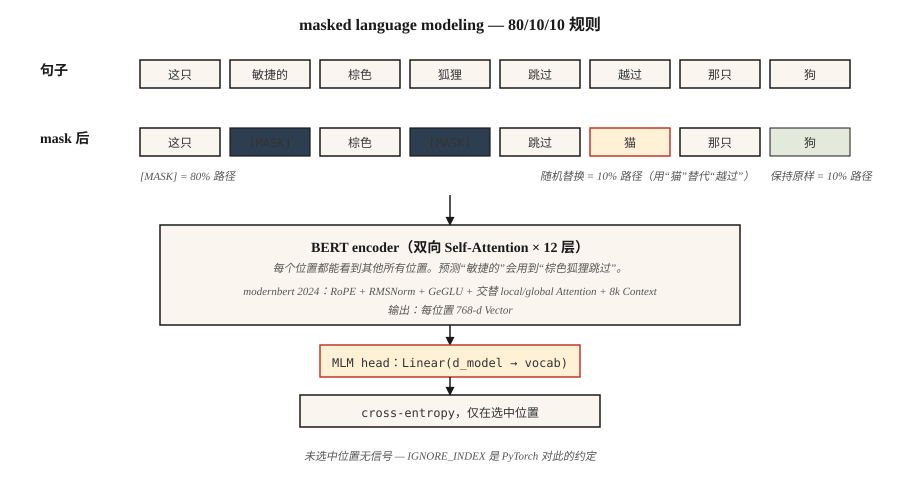

# BERT — Masked Language Modeling

> GPT 预测下一个词。BERT 预测缺失的词。只差一句话，却带来了半个十年的各种 Embedding 形态。

**类型:** 构建
**语言:** Python
**先修:** Phase 7 · 05 (Full Transformer), Phase 5 · 02 (文本表示)
**时间:** ~45 分钟

## 问题

2018 年，每个 NLP 任务——情感分析、NER、QA、entailment——都会在自己的标注数据上从头训练自己的模型。当时还没有可以 fine-tune 的 pre-trained “理解英语” checkpoint。ELMo (2018) 证明了可以用 bidirectional LSTM pre-train contextual Embeddings；它有帮助，但泛化能力不够。

BERT (Devlin et al. 2018) 提出了一个问题：如果我们拿一个 Transformer encoder，在互联网上的每个句子上训练它，并强制它根据两侧上下文预测缺失的词，会怎样？然后你只需要在下游任务上 fine-tune 一个 head。参数效率带来的提升令人震撼。

结果是：在 18 个月内，BERT 及其变体 (RoBERTa, ALBERT, ELECTRA) 统治了当时所有 NLP leaderboard。到 2020 年，地球上每个搜索引擎、内容审核 pipeline 和 semantic-search 系统里都有一个 BERT。

到 2026 年，encoder-only 模型仍然是 classification、retrieval 和结构化抽取的正确工具——它们每个 Token 的运行速度比 decoder 快 5–10×，而它们的 Embeddings 是每个现代 retrieval stack 的骨架。ModernBERT (Dec 2024) 用 Flash Attention + RoPE + GeGLU 将架构推进到 8K context。

## 核心概念



### 训练信号

取一个句子：`the quick brown fox jumps over the lazy dog`。

随机 mask 15% 的 Token：

```
input:  the [MASK] brown fox jumps [MASK] the lazy dog
target: the  quick brown fox jumps  over  the lazy dog
```

训练模型在被 mask 的位置预测原始 Token。因为 encoder 是 bidirectional 的，所以在位置 1 预测 `[MASK]` 时，可以使用位置 2+ 的 `brown fox jumps`。这正是 GPT 做不到的事情。

### BERT mask 规则

在被选中用于预测的 15% Token 中：

- 80% 被替换为 `[MASK]`。
- 10% 被替换为随机 Token。
- 10% 保持不变。

为什么不总是用 `[MASK]`？因为 `[MASK]` 在推理时从不会出现。如果训练模型在 100% 的 masked 位置都期待 `[MASK]`，就会在 pretraining 和 fine-tuning 之间产生分布偏移。10% 随机 + 10% 不变能让模型保持稳健。

### Next Sentence Prediction (NSP)——以及为什么它被移除

原始 BERT 还训练了 NSP：给定两个句子 A 和 B，预测 B 是否跟在 A 后面。RoBERTa (2019) 对它做了消融实验，证明 NSP 有害无益。现代 encoder 会跳过它。

### 2026 年的变化：ModernBERT

2024 年的 ModernBERT 论文用 2026 年的基础组件重建了 block：

| Component | Original BERT (2018) | ModernBERT (2024) |
|-----------|----------------------|-------------------|
| Positional | Learned absolute | RoPE |
| Activation | GELU | GeGLU |
| Normalization | LayerNorm | Pre-norm RMSNorm |
| Attention | Full dense | Alternating local (128) + global |
| Context length | 512 | 8192 |
| Tokenizer | WordPiece | BPE |

而且不同于 2018 年的 stack，它原生支持 Flash-Attention。在 sequence length 8K 时，推理速度比 DeBERTa-v3 快 2–3×，同时 GLUE 分数更好。

### 2026 年仍然选择 encoder 的用例

| Task | 为什么 encoder 胜过 decoder |
|------|------------------------------|
| Retrieval / semantic search embeddings | Bidirectional context = 每个 Token 更好的 Embedding 质量 |
| Classification (sentiment, intent, toxicity) | 一次 forward pass；没有生成开销 |
| NER / token labeling | 逐位置输出，天然 bidirectional |
| Zero-shot entailment (NLI) | encoder 顶部的 classifier head |
| Reranker for RAG | Cross-encoder scoring，比 LLM rerankers 快 10x |


```figure
transformer-residual
```

## 构建它

### 步骤 1： masking logic

见 `code/main.py`。函数 `create_mlm_batch` 接收一个 Token ID 列表、vocab size 和 mask probability。返回 input IDs（已应用 mask）和 labels（只在 masked 位置有值，其他位置为 -100——这是 PyTorch 的 ignore index 约定）。

```python
def create_mlm_batch(tokens, vocab_size, mask_prob=0.15, rng=None):
    input_ids = list(tokens)
    labels = [-100] * len(tokens)
    for i, t in enumerate(tokens):
        if rng.random() < mask_prob:
            labels[i] = t
            r = rng.random()
            if r < 0.8:
                input_ids[i] = MASK_ID
            elif r < 0.9:
                input_ids[i] = rng.randrange(vocab_size)
            # else: keep original
    return input_ids, labels
```

### 步骤 2： 在一个微型 corpus 上运行 MLM prediction

在包含 20 个词的 vocabulary、200 个句子上训练一个 2-layer encoder + MLM head。没有 Gradient——我们只做 forward-pass sanity checks。完整训练需要 PyTorch。

### 步骤 3： 比较 mask 类型

展示三路规则如何让模型在没有 `[MASK]` 的情况下仍然可用。在未 mask 的句子和 masked 句子上分别预测。两者都应该产生合理的 Token 分布，因为模型在训练中见过两种模式。

### 步骤 4： fine-tune head

在一个 toy sentiment dataset 上，用 classification head 替换 MLM head。只训练 head；encoder 冻结。这就是每个 BERT 应用遵循的模式。

## 使用它

```python
from transformers import AutoModel, AutoTokenizer

tok = AutoTokenizer.from_pretrained("answerdotai/ModernBERT-base")
model = AutoModel.from_pretrained("answerdotai/ModernBERT-base")

text = "Attention is all you need."
inputs = tok(text, return_tensors="pt")
out = model(**inputs).last_hidden_state   # (1, N, 768)
```

**Embedding models 是 fine-tuned BERT。** `sentence-transformers` 中像 `all-MiniLM-L6-v2` 这样的模型，是用 contrastive loss 训练的 BERT。encoder 是同一个。变的是 Loss。

**Cross-encoder rerankers 也是 fine-tuned BERT。** 在 `[CLS] query [SEP] doc [SEP]` 上做 pair-classification。query 和 doc 之间的 bidirectional attention，正是 cross-encoder 相比 bi-encoder 具有质量优势的原因。

**2026 年什么时候不该选 BERT。** 任何生成式任务。encoder 没有合理方式 autoregressively 生成 Token。另外：任何 1B params 以下、其中小型 decoder 能以更高灵活性达到相同质量的任务 (Phi-3-Mini, Qwen2-1.5B)。

## 交付它

见 `outputs/skill-bert-finetuner.md`。这个 skill 会为新的 classification 或 extraction 任务界定 BERT fine-tune 的范围（backbone 选择、head 规格、数据、eval、停止条件）。

## 练习

1. **Easy.** 运行 `code/main.py`，并打印 10,000 个 Token 上的 mask 分布。确认约 15% 被选中，其中约 80% 变成 `[MASK]`。
2. **Medium.** 实现 whole-word masking：如果一个词被 Tokenizer 切成 subwords，则一起 mask 所有 subwords，或全部不 mask。衡量这是否能在 500-sentence corpus 上提升 MLM accuracy。
3. **Hard.** 在来自公共 dataset 的 10,000 个句子上训练一个 tiny (2-layer, d=64) BERT。为 SST-2 sentiment fine-tune `[CLS]` Token。与 params 匹配的 decoder-only baseline 比较——谁赢？

## 关键术语

| Term | 人们常说 | 实际含义 |
|------|----------|----------|
| MLM | "Masked language modeling" | 训练信号：随机将 15% 的 Token 替换为 `[MASK]`，预测原始 Token。 |
| Bidirectional | "双向看" | Encoder Attention 没有 causal mask——每个位置都能看到其他所有位置。 |
| `[CLS]` | "The pooler token" | 一个添加到每个 sequence 开头的特殊 Token；它的最终 Embedding 用作句子级表示。 |
| `[SEP]` | "Segment separator" | 分隔成对的 sequence（例如 query/doc、sentence A/B）。 |
| NSP | "Next sentence prediction" | BERT 的第二个 pretraining 任务；在 RoBERTa 中被证明无用，2019 年后被移除。 |
| Fine-tuning | "适配一个任务" | 基本保持 encoder 冻结；在其上训练一个小 head 来完成下游任务。 |
| Cross-encoder | "一个 reranker" | 一个同时接收 query 和 doc 作为输入，并输出相关性分数的 BERT。 |
| ModernBERT | "2024 refresh" | 用 RoPE、RMSNorm、GeGLU、交替 local/global attention、8K context 重建的 encoder。 |

## 延伸阅读

- [Devlin et al. (2018). BERT: Pre-training of Deep Bidirectional Transformers for Language Understanding](https://arxiv.org/abs/1810.04805) — 原始论文。
- [Liu et al. (2019). RoBERTa: A Robustly Optimized BERT Pretraining Approach](https://arxiv.org/abs/1907.11692) — 如何正确训练 BERT；移除 NSP。
- [Clark et al. (2020). ELECTRA: Pre-training Text Encoders as Discriminators Rather Than Generators](https://arxiv.org/abs/2003.10555) — 在相同 compute 下，replaced-token detection 胜过 MLM。
- [Warner et al. (2024). Smarter, Better, Faster, Longer: A Modern Bidirectional Encoder](https://arxiv.org/abs/2412.13663) — ModernBERT 论文。
- [HuggingFace `modeling_bert.py`](https://github.com/huggingface/transformers/blob/main/src/transformers/models/bert/modeling_bert.py) — 标准 encoder 参考。
