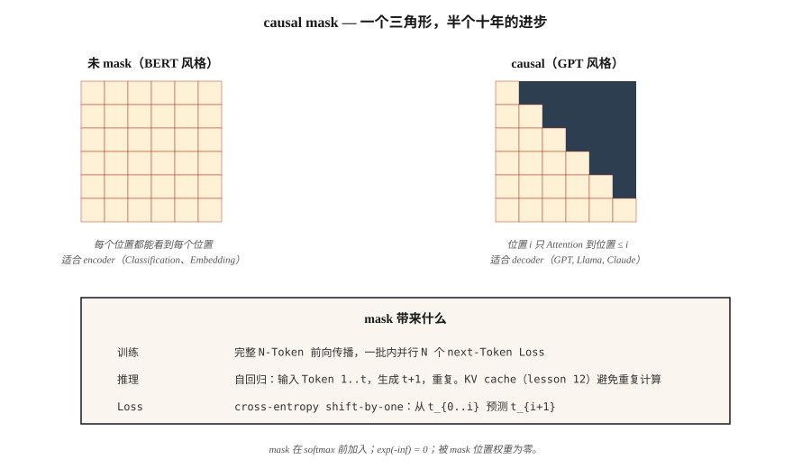

# GPT — Causal Language Modeling

> BERT 能看到两侧。GPT 只能看到过去。triangle mask 是现代 AI 中影响最深远的一行代码。

**Type:** Build
**Languages:** Python
**先修要求:** Phase 7 · 02 (Self-Attention), Phase 7 · 05 (Full Transformer), Phase 7 · 06 (BERT)
**Time:** ~75 分钟

## 问题

language model 回答一个问题：给定前 `t-1` 个 tokens，token `t` 上的概率分布是什么？用这个信号训练，也就是 next-token prediction，你就会得到一个可以一次生成一个 token、生成任意文本的模型。

要在整个 sequence 上并行进行端到端训练，你需要让每个位置的预测只依赖更早的位置。否则模型会通过偷看答案轻易作弊。

causal mask 做的就是这件事。它是一个由 `-inf` 值组成的上三角 matrix，在 softmax 之前加到 attention scores 上。softmax 之后，这些位置会变成 0。每个位置只能 attend 到自身和更早的位置。因为你把它一次性应用到整个 sequence 上，所以一次 forward pass 就能得到 N 个并行的 next-token predictions。

GPT-1 (2018), GPT-2 (2019), GPT-3 (2020), GPT-4 (2023), GPT-5 (2024), Claude, Llama, Qwen, Mistral, DeepSeek, Kimi —— 它们都是 decoder-only causal transformers，核心循环相同。只是规模更大、数据更好、RLHF 更好。

## 概念



### mask

给定长度为 `N` 的 sequence，构建一个 `N × N` matrix：

```
M[i, j] = 0       if j <= i
M[i, j] = -inf    if j > i
```

在 softmax 之前，把 `M` 加到原始 attention scores 上。`exp(-inf) = 0`，所以被 mask 的位置贡献的权重为零。attention matrix 的每一行都只是对先前位置的概率分布。

实现成本：一次 `torch.tril()` 调用。计算时间：纳秒级。对整个领域的影响：一切。

### 并行训练，串行推理

训练：对整个 `(N, d_model)` sequence 做一次 forward-pass，计算 N 个 cross-entropy losses（每个位置一个），求和，backprop。沿 sequence 并行。这就是 GPT 训练能够扩展的原因：你可以在一次 GPU pass 中处理 batch 里的 1M tokens。

推理：你逐个 token 生成。输入 `[t1, t2, t3]`，得到 `t4`。输入 `[t1, t2, t3, t4]`，得到 `t5`。输入 `[t1, t2, t3, t4, t5]`，得到 `t6`。KV cache（Lesson 12）保存 `t1…tn` 的 hidden states，这样你就不必在每一步重新计算它们。但推理时的串行深度 = 输出长度。这就是 autoregressive tax，也是每个 LLM 解码成为延迟瓶颈的原因。

### loss —— shift-by-one

给定 tokens `[t1, t2, t3, t4]`：

- Input: `[t1, t2, t3]`
- Targets: `[t2, t3, t4]`

对每个位置 `i`，计算 `-log P(target_i | inputs[:i+1])`。求和。这就是整个 sequence 的 cross-entropy。

你听说过的每一个 transformer LM 都用这个 loss 训练。Pre-training、fine-tuning、SFT —— loss 相同，数据不同。

### Decoding strategies

训练之后，sampling 选择比人们想象的更重要。

| Method | What it does | When to use |
|--------|--------------|-------------|
| Greedy | 每一步取 Argmax | 确定性任务、code completion |
| Temperature | 将 logits 除以 T，然后 sample | 创造性任务，T 越高多样性越强 |
| Top-k | 只从 top-k tokens 中 sample | 消除低概率长尾 |
| Top-p (nucleus) | 从累计概率 ≥ p 的最小集合中 sample | 2020+ 默认选择；会适应分布形状 |
| Min-p | 保留 `p > min_p * max_p` 的 tokens | 2024+；比 top-p 更擅长拒绝长尾 |
| Speculative decoding | draft model 提出 N 个 tokens，big model 验证 | 在质量相同的情况下减少 2–3× 延迟 |

在 2026 年，对于 open-weights models，min-p + temperature 0.7 是一个合理默认值。Speculative decoding 是任何生产 inference stack 的基本配置。

### 让 “GPT recipe” 起作用的因素

1. **Decoder-only.** 没有 encoder 开销。每层一次 Attention + FFN pass。
2. **Scaling.** 124M → 1.5B → 175B → trillions。Chinchilla scaling laws（Lesson 13）告诉你如何分配 compute。
3. **In-context learning.** 大约在 6B–13B 时涌现。模型无需 fine-tuning 就能跟随 few-shot examples。
4. **RLHF.** 基于人类偏好的 post-training 把原始 pretrained 文本模型转化为 chat assistants。
5. **Pre-norm + RoPE + SwiGLU.** 支撑大规模稳定训练。

自 GPT-2 以来，核心架构没有太大变化。真正有趣的变化都发生在数据、规模和 post-training 上。

## 构建它

### 步骤 1： causal mask

见 `code/main.py`。一行代码：

```python
def causal_mask(n):
    return [[0.0 if j <= i else float("-inf") for j in range(n)] for i in range(n)]
```

在 softmax 之前把它加到 attention scores 上。这就是完整机制。

### 步骤 2： 一个 2-layer GPT-ish model

堆叠两个 decoder blocks（masked self-attention + FFN，无 cross-attention）。添加 token embedding、positional encoding 和 unembedding（与 token embedding matrix 绑定，这是自 GPT-2 以来的标准技巧）。

### 步骤 3： next-token prediction，端到端

在一个 20-token toy vocab 上，在每个位置产生 logits。针对 shift-by-one target 计算 cross-entropy loss。无 Gradient —— 这是一个 forward-pass sanity check。

### 步骤 4： sampling

实现 greedy、temperature、top-k、top-p、min-p。在固定 prompt 上运行每一种并比较输出。一个 sampling function 只需要 10 行。

## 使用它

PyTorch，2026 idiom：

```python
from transformers import AutoModelForCausalLM, AutoTokenizer
model = AutoModelForCausalLM.from_pretrained("meta-llama/Llama-3.2-3B-Instruct")
tok = AutoTokenizer.from_pretrained("meta-llama/Llama-3.2-3B-Instruct")

prompt = "Attention is all you need because"
inputs = tok(prompt, return_tensors="pt")
out = model.generate(
    **inputs,
    max_new_tokens=64,
    temperature=0.7,
    top_p=0.9,
    do_sample=True,
)
print(tok.decode(out[0]))
```

在底层，`generate()` 运行 forward pass，取出 final-position logits，sample 下一个 token，追加它，然后重复。每个生产级 LLM inference stack（vLLM, TensorRT-LLM, llama.cpp, Ollama, MLX）都用重度优化实现同一个循环 —— batched prefill、continuous batching、KV cache paging、speculative decoding。

**GPT vs BERT，各用一句话：** GPT 预测 `P(x_t | x_{<t})`。BERT 预测 `P(x_masked | x_unmasked)`。loss 决定模型是否能够生成。

## 交付它

见 `outputs/skill-sampling-tuner.md`。这个 skill 会为新的 generation task 选择 sampling parameters，并在需要 deterministic decoding 时标记出来。

## 练习

1. **Easy.** 运行 `code/main.py`，验证 softmax 之后的 causal attention matrix 是下三角的。抽查：第 3 行应该只在第 0–3 列有权重。
2. **Medium.** 实现宽度为 4 的 beam search。在 10 个短 prompts 上比较 beam-4 与 greedy 的 perplexity。beam 总是会赢吗？（提示：通常对翻译是这样，但对 open-ended chat 不是。）
3. **Hard.** 实现 speculative decoding：使用一个微型 2-layer model 作为 draft，用一个 6-layer model 作为 verifier。测量 100 个长度为 64 的 completions 上的 wall-clock speedup。确认输出与 verifier 的 greedy 输出匹配。

## 关键术语

| Term | What people say | What it actually means |
|------|-----------------|-----------------------|
| Causal mask | “三角形” | 加到 attention scores 上的上三角 `-inf` matrix，使位置 `i` 只能看到位置 `≤ i`。 |
| Next-token prediction | “loss” | 模型在每个位置上的分布与真实下一个 token 之间的 cross-entropy。 |
| Autoregressive | “一次生成一个” | 将输出反馈为输入；并行性只存在于训练阶段，不存在于生成阶段。 |
| Logits | “pre-softmax scores” | softmax 之前 LM head 的原始输出；sampling 就发生在这些值上。 |
| Temperature | “创造力旋钮” | 将 logits 除以 T；T→0 = greedy，T→∞ = uniform。 |
| Top-p | “Nucleus sampling” | 将分布截断为累计和 ≥p 的最小集合；从剩余部分 sample。 |
| Min-p | “比 top-p 更好” | 保留满足 `p ≥ min_p × max_p` 的 tokens；会根据分布尖锐程度调整 cutoff。 |
| Speculative decoding | “draft + verify” | 便宜模型提出 N 个 tokens；大模型并行验证。 |
| Teacher forcing | “训练技巧” | 训练时输入真实的前一个 token，而不是模型的预测。每个 seq2seq LM 的标准做法。 |

## 延伸阅读

- [Radford et al. (2018). Improving Language Understanding by Generative Pre-Training](https://cdn.openai.com/research-covers/language-unsupervised/language_understanding_paper.pdf) —— GPT-1。
- [Radford et al. (2019). Language Models are Unsupervised Multitask Learners](https://cdn.openai.com/better-language-models/language_models_are_unsupervised_multitask_learners.pdf) —— GPT-2。
- [Brown et al. (2020). Language Models are Few-Shot Learners](https://arxiv.org/abs/2005.14165) —— GPT-3 和 in-context learning。
- [Leviathan, Kalman, Matias (2023). Fast Inference from Transformers via Speculative Decoding](https://arxiv.org/abs/2211.17192) —— spec decoding 论文。
- [HuggingFace `modeling_llama.py`](https://github.com/huggingface/transformers/blob/main/src/transformers/models/llama/modeling_llama.py) —— 标准 causal-LM 参考代码。
