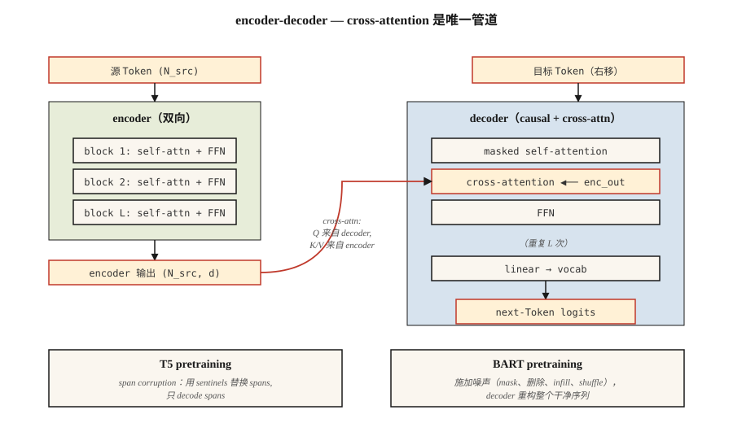

# T5, BART — Encoder-Decoder Models

> Encoder 负责理解。Decoder 负责生成。把它们重新组合在一起，就得到一个专为 input → output 任务构建的模型：翻译、总结、改写、转录。

**Type:** Learn
**Languages:** Python
**先修要求:** Phase 7 · 05 (Full Transformer), Phase 7 · 06 (BERT), Phase 7 · 07 (GPT)
**Time:** ~45 minutes

## 问题

decoder-only GPT 和 encoder-only BERT 都为了不同目标对 2017 年的架构做了精简。但许多任务天然就是 input-output：

- Translation: English → French.
- Summarization: 5,000-Token 文章 → 200-Token 摘要。
- Speech recognition: 音频 Token → 文本 Token。
- 结构化抽取: 散文 → JSON。

对于这些任务，encoder-decoder 是最贴合的形式。encoder 生成源内容的密集表示。decoder 生成输出，并在每一步对该表示执行 cross-attention。训练是在输出侧进行 shift-by-one。Loss 与 GPT 相同，只是以 encoder 输出为条件。

两篇论文定义了现代做法：

1. **T5** (Raffel et al. 2019). "Text-to-Text Transfer Transformer." 将每个 NLP 任务都重新表述为 text-in, text-out。单一架构、单一词表、单一 Loss。在 masked span prediction 上预训练（破坏输入中的 span，在输出中 decode 它们）。
2. **BART** (Lewis et al. 2019). "Bidirectional and Auto-Regressive Transformer." 去噪 autoencoder：以多种方式破坏输入（shuffle、mask、delete、rotate），让 decoder 重建原始内容。

到 2026 年，encoder-decoder 格式仍然存在于输入结构很重要的地方：

- Whisper (speech → text).
- Google 的翻译技术栈。
- 一些具有明确 context-and-edit 结构的 code-completion / repair 模型。
- 用于 structured reasoning 任务的 Flan-T5 及其变体。

decoder-only 赢得了聚光灯，但 encoder-decoder 从未消失。

## 概念



### 前向循环

```
source tokens ─▶ encoder ─▶ (N_src, d_model)  ──┐
                                                 │
target tokens ─▶ decoder block                   │
                 ├─▶ masked self-attention       │
                 ├─▶ cross-attention ◀───────────┘
                 └─▶ FFN
                ↓
              next-token logits
```

关键在于，encoder 对每个输入只运行一次。decoder 以 autoregressive 方式运行，但每一步都 cross-attend 到同一个 encoder 输出。缓存 encoder 输出，对长输入来说是免费的加速。

### T5 预训练 — span corruption

随机选择输入中的 span（平均长度 3 个 Token，总计 15%）。用唯一的 sentinel 替换每个 span：`<extra_id_0>`、`<extra_id_1>` 等等。decoder 只输出被破坏的 span，并带上对应的 sentinel 前缀：

```
source: The quick <extra_id_0> fox jumps <extra_id_1> dog
target: <extra_id_0> brown <extra_id_1> over the lazy
```

相比预测整个序列，这是一种更便宜的信号。在 T5 论文的 ablation 中，它与 MLM (BERT) 和 prefix-LM (UniLM) 具备竞争力。

### BART 预训练 — multi-noise denoising

BART 尝试了五种 noising function：

1. Token masking.
2. Token deletion.
3. Text infilling（mask 一个 span，decoder 插入正确长度的内容）。
4. Sentence permutation.
5. Document rotation.

text infilling + sentence permutation 的组合产生了最好的下游结果。decoder 始终重建原始内容。BART 的输出是完整序列，而不仅仅是被破坏的 span，所以预训练 compute 高于 T5。

### 推理

与 GPT 相同的 autoregressive generation。greedy / beam / top-p sampling 都适用。Beam search（宽度 4–5）是翻译和摘要的标准做法，因为输出分布比 chat 更窄。

### 2026 年何时选择各个变体

| Task | Encoder-decoder? | Why |
|------|------------------|-----|
| Translation | 是，通常如此 | 明确的源序列；固定的输出分布；beam search 有效 |
| Speech-to-text | 是 (Whisper) | 输入 modality 与输出不同；encoder 塑造音频特征 |
| Chat / reasoning | 否，decoder-only | 没有持久的“input”——对话本身就是序列 |
| Code completion | 通常否 | decoder-only 搭配长上下文更强；像 Qwen 2.5 Coder 这样的代码模型是 decoder-only |
| Summarization | 两者皆可 | BART、PEGASUS 超过了早期 decoder-only baseline；现代 decoder-only LLMs 已经能与它们匹配 |
| Structured extraction | 两者皆可 | T5 很干净，因为“text → text”可以吸收任何输出格式 |

自约 2022 年以来的趋势是：decoder-only 接管了过去由 encoder-decoder 主导的任务，因为 (a) instruction-tuned decoder-only LLMs 可以通过 prompting 泛化到任何任务，(b) 单一架构比两个架构更容易扩展，(c) RLHF 假设使用 decoder。encoder-decoder 仍然保留在输入 modality 不同（speech、images）或 beam search 质量很重要的场景。

## 构建它

见 `code/main.py`。我们为一个 toy corpus 实现 T5 风格的 span corruption——这是本课最有用的单个部分，因为它出现在此后几乎每个 encoder-decoder 预训练配方中。

### 步骤 1： span corruption

```python
def corrupt_spans(tokens, mask_rate=0.15, mean_span=3.0, rng=None):
    """Pick spans summing to ~mask_rate of tokens. Return (corrupted_input, target)."""
    n = len(tokens)
    n_mask = max(1, int(n * mask_rate))
    n_spans = max(1, int(round(n_mask / mean_span)))
    ...
```

target 格式遵循 T5 约定：`<sent0> span0 <sent1> span1 ...`。corrupted input 会把未改变的 Token 与 span 位置上的 sentinel Token 交错排列。

### 步骤 2： verify round-trip

给定 corrupted input 和 target，重建原始句子。如果你的 corruption 是可逆的，那么 forward pass 就是良定义的。这是一个 sanity check——真实训练从不这么做，但这个测试成本很低，并且能捕捉 span bookkeeping 中的 off-by-one bug。

### 步骤 3： BART noising

五个函数：`token_mask`、`token_delete`、`text_infill`、`sentence_permute`、`document_rotate`。组合其中两个并展示结果。

## 使用它

HuggingFace 参考：

```python
from transformers import T5ForConditionalGeneration, T5Tokenizer
tok = T5Tokenizer.from_pretrained("google/flan-t5-base")
model = T5ForConditionalGeneration.from_pretrained("google/flan-t5-base")

inputs = tok("translate English to French: Attention is all you need.", return_tensors="pt")
out = model.generate(**inputs, max_new_tokens=32)
print(tok.decode(out[0], skip_special_tokens=True))
```

T5 的技巧：任务名称进入输入文本。同一个模型可以处理数十种任务，因为每个任务都是 text-in, text-out。到 2026 年，这一模式已经被 instruction-tuned decoder-only 模型泛化，但 T5 最先将其规范化。

## 交付它

见 `outputs/skill-seq2seq-picker.md`。该 skill 会根据 input-output 结构、延迟和质量目标，为一个新任务在 encoder-decoder 和 decoder-only 之间做选择。

## 练习

1. **Easy.** 运行 `code/main.py`，对一个 30-Token 句子应用 span corruption，验证将 non-sentinel source tokens 与 decoded target spans 拼接后可以复现原始句子。
2. **Medium.** 实现 BART 的 `text_infill` noise：用单个 `<mask>` Token 替换随机 span，decoder 必须推断正确的 span 长度和内容。展示一个示例。
3. **Hard.** 在一个很小的 English → pig-Latin corpus（200 对）上 fine-tune `flan-t5-small`。在 held-out 50-pair set 上测量 BLEU。与在相同数据和相同 compute 下 fine-tune `Llama-3.2-1B` 的结果进行比较。

## 关键术语

| Term | What people say | What it actually means |
|------|-----------------|-----------------------|
| Encoder-decoder | “Seq2seq transformer” | 两个 stack：用于输入的 bidirectional encoder，以及带 cross-attention、用于输出的 causal decoder。 |
| Cross-attention | “源内容与目标内容对话的地方” | decoder 的 Q × encoder 的 K/V。这是 encoder 信息进入 decoder 的唯一位置。 |
| Span corruption | “T5 的预训练技巧” | 用 sentinel Token 替换随机 span；decoder 输出这些 span。 |
| Denoising objective | “BART 的游戏” | 对输入应用 noise function，训练 decoder 重建 clean sequence。 |
| Sentinel token | “`<extra_id_N>` 占位符” | 特殊 Token，用于在 source 中标记被破坏的 span，并在 target 中重新标记它们。 |
| Flan | “Instruction-tuned T5” | 在超过 1,800 个任务上 fine-tuned 的 T5；让 encoder-decoder 在 instruction-following 上具备竞争力。 |
| Beam search | “Decoding strategy” | 在每一步保留 top-k 个 partial sequence；是翻译/摘要的标准做法。 |
| Teacher forcing | “Training-time input” | 训练期间，把真实的前一个输出 Token 喂给 decoder，而不是采样出来的 Token。 |

## 延伸阅读

- [Raffel et al. (2019). Exploring the Limits of Transfer Learning with a Unified Text-to-Text Transformer](https://arxiv.org/abs/1910.10683) — T5。
- [Lewis et al. (2019). BART: Denoising Sequence-to-Sequence Pre-training for Natural Language Generation, Translation, and Comprehension](https://arxiv.org/abs/1910.13461) — BART。
- [Chung et al. (2022). Scaling Instruction-Finetuned Language Models](https://arxiv.org/abs/2210.11416) — Flan-T5。
- [Radford et al. (2022). Robust Speech Recognition via Large-Scale Weak Supervision](https://arxiv.org/abs/2212.04356) — Whisper，2026 年的 canonical encoder-decoder。
- [HuggingFace `modeling_t5.py`](https://github.com/huggingface/transformers/blob/main/src/transformers/models/t5/modeling_t5.py) — 参考实现。
