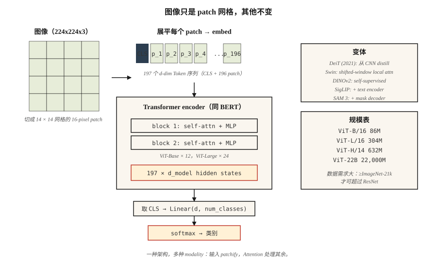

# Vision Transformers (ViT)

> 一张图像是由 patch 组成的网格。一个句子是由 Token 组成的网格。同一个 Transformer 都能处理。

**Type:** Build
**Languages:** Python
**先修要求:** Phase 7 · 05 (Full Transformer), Phase 4 · 03 (CNNs), Phase 4 · 14 (Vision Transformers intro)
**Time:** ~45 minutes

## 问题

在 2020 年之前，computer vision 基本就意味着 convolution。ImageNet、COCO 和 detection benchmark 上的所有 SOTA 都使用 CNN backbone。Transformers 则用于 language。

Dosovitskiy et al. (2020) 的 “An Image is Worth 16x16 Words” 表明，你可以完全去掉 convolution。把图像切成固定大小的 patches，将每个 patch 线性投影到一个 Embedding，再把这个序列送入一个普通的 transformer encoder。在足够大的规模下（ImageNet-21k pretraining 或更大），ViT 可以匹配甚至超过基于 ResNet 的模型。

ViT 是 2026 年更大趋势的开端：一种架构，多种 modalities。Whisper 将 audio Tokenize。ViT 将 images Tokenize。robotics 使用 action tokens。video 使用 pixel tokens。Transformer 并不关心输入是什么，只要给它一个序列，它就能学习。

到 2026 年，ViT 及其后继者（DeiT、Swin、DINOv2、ViT-22B、SAM 3）已经占据了 vision 的大部分领域。CNNs 仍然在 edge devices 和 latency-sensitive tasks 上胜出。除此之外，几乎所有系统的 stack 里某处都有一个 ViT。

## 概念



### Step 1 — patchify

将一个 `H × W × C` 图像拆成一个 `N × (P·P·C)` 的扁平 patch 序列。典型设置是：`224 × 224` 图像，`16 × 16` patches → 196 个 patch，每个包含 768 个值。

```
image (224, 224, 3) → 14 × 14 grid of 16x16x3 patches → 196 vectors of length 768
```

Patch size 是关键控制杆。更小的 patches = 更多 tokens、更好的分辨率、二次方 Attention 成本。更大的 patches = 更粗糙、更便宜。

### Step 2 — linear embedding

一个单独的 learned matrix 将每个扁平 patch 投影到 `d_model`。这等价于 kernel size 为 `P`、stride 为 `P` 的 convolution。在 PyTorch 中这实际上就是 `nn.Conv2d(C, d_model, kernel_size=P, stride=P)`，只需要 2 行即可实现。

### 步骤 3 — 前置 `[CLS]` token，添加 positional embeddings

- 在开头添加一个可学习的 `[CLS]` token。它的最终 hidden state 会作为用于 Classification 的图像表示。
- 添加可学习的 positional embeddings（ViT 原版）或 sinusoidal 2D（后续变体）。
- 在 2024 年之后，RoPE 被扩展到 2D position，有时不再需要显式 Embedding。

### 步骤 4 — 标准 Transformer encoder

堆叠 L 个 `LayerNorm → Self-Attention → + → LayerNorm → MLP → +` blocks。与 BERT 完全相同。没有 vision-specific layers。这就是这篇论文在教学上的核心结论。

### Step 5 — head

对于 Classification：取 `[CLS]` hidden state → linear → softmax。对于 DINOv2 或 SAM，则丢弃 `[CLS]`，直接使用 patch embeddings。

### 重要变体

| Model | Year | Change |
|-------|------|--------|
| ViT | 2020 | 原始版本。固定 patch size，完整 global attention。 |
| DeiT | 2021 | Distillation；只用 ImageNet-1k 就能训练。 |
| Swin | 2021 | 使用 shifted windows 的层级结构。固定的 sub-quadratic 成本。 |
| DINOv2 | 2023 | Self-supervised（无 labels）。最好的通用 vision features。 |
| ViT-22B | 2023 | 22B 参数；scaling laws 适用。 |
| SigLIP | 2023 | ViT + language pair，sigmoid contrastive loss。 |
| SAM 3 | 2025 | Segment anything；ViT-Large + promptable mask decoder。 |

### 为什么它花了一段时间才成功

ViT 需要大量数据才能匹配 CNNs，因为它没有 CNN 的 inductive biases（translation invariance、locality）。如果没有超过 100M 的 labeled images 或强大的 self-supervised pretraining，在相同 compute 下 CNNs 仍然更强。DeiT 在 2021 年用 distillation 技巧修复了这一点；DINOv2 在 2023 年用 self-supervision 更彻底地解决了这个问题。

## 构建它

参见 `code/main.py`。纯 stdlib 的 patchify + linear embedding + sanity checks。不进行训练，因为任何现实规模的 ViT 都需要 PyTorch 和数小时的 GPU 时间。

### 步骤 1： fake image

一个 24 × 24 RGB 图像，用 `(R, G, B)` tuples 的行列表表示。我们使用 6×6 patches → 16 个 patches，每个 patch 的 Embedding Vector 长度为 108。

### 步骤 2： patchify

```python
def patchify(image, P):
    H = len(image)
    W = len(image[0])
    patches = []
    for i in range(0, H, P):
        for j in range(0, W, P):
            patch = []
            for di in range(P):
                for dj in range(P):
                    patch.extend(image[i + di][j + dj])
            patches.append(patch)
    return patches
```

Raster order：按网格的 row-major 顺序排列。所有 ViT 都使用这种顺序。

### 步骤 3： linear embed

将每个扁平 patch 乘以一个随机的 `(patch_flat_size, d_model)` matrix。添加 `[CLS]` 后，验证输出 shape 为 `(N_patches + 1, d_model)`。

### 步骤 4: 统计真实 ViT 的参数量

打印 ViT-Base 的参数量：12 layers、12 heads、d=768、patch=16。与 ResNet-50（~25M）比较。ViT-Base 大约是 ~86M。ViT-Large ~307M。ViT-Huge ~632M。

## 使用它

```python
from transformers import ViTImageProcessor, ViTModel
import torch
from PIL import Image

processor = ViTImageProcessor.from_pretrained("google/vit-base-patch16-224-in21k")
model = ViTModel.from_pretrained("google/vit-base-patch16-224-in21k")

img = Image.open("cat.jpg")
inputs = processor(img, return_tensors="pt")
out = model(**inputs).last_hidden_state   # (1, 197, 768): [CLS] + 196 patches
cls_emb = out[:, 0]                       # image representation
```

**DINOv2 embeddings 是 2026 年 image features 的默认选择。** 冻结 backbone，训练一个很小的 head。适用于 Classification、retrieval、detection、captioning。Meta 的 DINOv2 checkpoints 在所有非文本 vision task 上都超过 CLIP。

**Patch-size 选择。** 小模型使用 16×16（ViT-B/16）。Dense prediction（segmentation）使用 8×8 或 14×14（SAM、DINOv2）。超大模型使用 14×14。

## 交付它

参见 `outputs/skill-vit-configurator.md`。这个 skill 会根据 dataset size、resolution 和 compute budget，为新的 vision task 选择一个 ViT variant 和 patch size。

## 练习

1. **Easy.** 运行 `code/main.py`。验证 patch 数量等于 `(H/P) * (W/P)`，扁平 patch 维度等于 `P*P*C`。
2. **Medium.** 实现 2D sinusoidal positional embeddings，即为每个 patch 的 `row` 和 `col` 创建两个独立的 sinusoidal codes，并将它们拼接。把它们送入一个小型 PyTorch ViT，并在 CIFAR-10 上比较它与 learnable positional embeddings 的 accuracy。
3. **Hard.** 构建一个 3-layer ViT（PyTorch），使用 4×4 patches 在 1,000 张 MNIST 图像上训练。测量 test accuracy。然后在同样的 1,000 张图像上加入 DINOv2 pretraining（简化版：只训练 encoder 根据 masked patches 预测 patch embeddings）。Accuracy 是否提升？

## 关键术语

| Term | What people say | What it actually means |
|------|-----------------|-----------------------|
| Patch | “vision-transformer token” | 图像中一个 `P × P × C` 区域的 pixel values 所组成的扁平 Vector。 |
| Patchify | “Chop + flatten” | 将图像切成不重叠的 patches，并将每个 patch flatten 成一个 Vector。 |
| `[CLS]` token | “图像摘要” | 添加在开头的可学习 token；它的最终 Embedding 是图像表示。 |
| Inductive bias | “模型预设的假设” | ViT 的 priors 比 CNNs 少；需要更多数据来弥补差距。 |
| DINOv2 | “Self-supervised ViT” | 使用 image augmentation + momentum teacher，在没有 labels 的情况下训练。2026 年最好的通用 image features。 |
| SigLIP | “CLIP 的继任者” | ViT + text encoder，使用 sigmoid contrastive loss 训练；在相同 compute 下优于 CLIP。 |
| Swin | “Windowed ViT” | 带有 local attention + shifted windows 的层级 ViT；sub-quadratic。 |
| Register tokens | “2023 trick” | 几个额外的可学习 tokens，用来吸收 attention sinks；可以改进 DINOv2 features。 |

## 延伸阅读

- [Dosovitskiy et al. (2020). An Image is Worth 16x16 Words: Transformers for Image Recognition at Scale](https://arxiv.org/abs/2010.11929) — ViT 论文。
- [Touvron et al. (2021). Training data-efficient image transformers & distillation through attention](https://arxiv.org/abs/2012.12877) — DeiT。
- [Liu et al. (2021). Swin Transformer: Hierarchical Vision Transformer using Shifted Windows](https://arxiv.org/abs/2103.14030) — Swin。
- [Oquab et al. (2023). DINOv2: Learning Robust Visual Features without Supervision](https://arxiv.org/abs/2304.07193) — DINOv2。
- [Darcet et al. (2023). Vision Transformers Need Registers](https://arxiv.org/abs/2309.16588) — DINOv2 的 register-token 修复方案。
