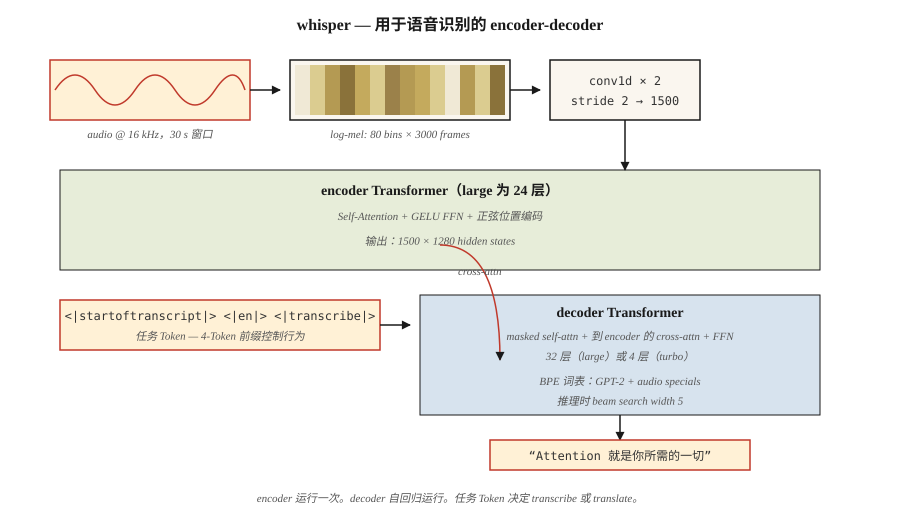

# Audio Transformers — Whisper Architecture

> Audio 是 frequency 随 time 变化形成的图像。Whisper 是一个吃 mel spectrograms 并吐回文字的 ViT。

**Type:** Learn
**Languages:** Python
**Prerequisites:** Phase 7 · 05 (Full Transformer), Phase 7 · 08 (Encoder-Decoder), Phase 7 · 09 (ViT)
**Time:** ~45 分钟

## The Problem

在 Whisper（OpenAI，Radford et al. 2022）之前，state-of-the-art automatic speech recognition（ASR）意味着 wav2vec 2.0 和 HuBERT——self-supervised feature extractors 加上 fine-tuned head。质量高，但 data pipeline 昂贵，而且对 domain 脆弱。Multilingual speech recognition 需要按 language family 使用不同模型。

Whisper 做了三个下注：

1. **Train on everything。** 从互联网抓取的 680,000 小时 weakly-labeled audio，覆盖 97 种语言。没有干净的 academic corpus。没有 phoneme labels。
2. **Multi-task single model。** 一个 decoder 通过 task tokens 联合训练 transcription、translation、voice activity detection、language ID 和 timestamping。
3. **标准 encoder-decoder transformer。** Encoder 消耗 log-mel spectrograms。Decoder 以 autoregressive 方式生成 text tokens。没有 vocoder，没有 CTC，没有 HMM。

结果：Whisper large-v3 对 accents、noise，以及没有干净 labeled data 的语言都很稳健。到 2026 年，它已是每个 open-source voice assistant 和多数商业 voice assistant 的默认 speech front-end。

## The Concept



### Step 1 — resample + window

Audio 为 16 kHz。clip/pad 到 30 秒。计算 log-mel spectrogram：80 个 mel bins，10 ms stride → 约 3,000 frames × 80 features。这就是 Whisper 看到的“input image”。

### Step 2 — convolutional stem

两个 Conv1D layers，kernel 3、stride 2，将 3,000 frames 降到 1,500。在不增加大量 parameters 的情况下将 sequence length 减半。

### Step 3 — encoder

一个 24-layer（large 版本）transformer encoder，处理 1,500 个 timesteps。Sinusoidal positional encoding、self-attention、GELU FFN。生成 1,500 × 1,280 hidden states。

### Step 4 — decoder

一个 24-layer transformer decoder。它从 BPE vocabulary 中 autoregressively 生成 tokens；这个 vocabulary 是 GPT-2 vocabulary 的 superset，并额外包含少量 audio-specific special tokens。

### Step 5 — task tokens

Decoder prompt 以 control tokens 开头，告诉模型要做什么：

```
<|startoftranscript|>  <|en|>  <|transcribe|>  <|0.00|>
```

或

```
<|startoftranscript|>  <|fr|>  <|translate|>   <|0.00|>
```

模型就是按这种约定训练的。你通过 prefix 控制 task。这相当于 2026 年的 instruction-tuning，只是应用在 speech 上。

### Step 6 — output

Beam search（width 5）配合 log-prob threshold。当 `<|notimestamps|>` token 不存在时，timestamps 会按 audio 的每 0.02 秒预测一次。

### Whisper sizes

| Model | Params | Layers | d_model | Heads | VRAM (fp16) |
|-------|--------|--------|---------|-------|-------------|
| Tiny | 39M | 4 | 384 | 6 | ~1 GB |
| Base | 74M | 6 | 512 | 8 | ~1 GB |
| Small | 244M | 12 | 768 | 12 | ~2 GB |
| Medium | 769M | 24 | 1024 | 16 | ~5 GB |
| Large | 1550M | 32 | 1280 | 20 | ~10 GB |
| Large-v3 | 1550M | 32 | 1280 | 20 | ~10 GB |
| Large-v3-turbo | 809M | 32 | 1280 | 20 | ~6 GB（4-layer decoder） |

Large-v3-turbo（2024）将 decoder 从 32 layers 削减到 4。解码速度快 8×，WER 回退小于 1 个点。这个 decode speed unlock 正是 Whisper-turbo 在 2026 年成为 real-time voice agents 默认选择的原因。

### Whisper 不做什么

- 不做 diarization（谁在说话）。这部分搭配 pyannote。
- 原生不做 real-time streaming——30 秒窗口是固定的。现代 wrappers（`faster-whisper`、`WhisperX`）通过 VAD + overlap 补上 streaming。
- 没有 external chunking 时，不支持超过 30 s 的 long-form context。实践中效果很好，因为人类 speech 在 transcription 中很少需要 long-range context。

### 2026 landscape

| Task | Model | Notes |
|------|-------|-------|
| English ASR | Whisper-turbo, Moonshine | Moonshine 在 edge 上快 4× |
| Multilingual ASR | Whisper-large-v3 | 97 种语言 |
| Streaming ASR | faster-whisper + VAD | 可达到 150 ms latency targets |
| TTS | Piper, XTTS-v2, Kokoro | Encoder-decoder pattern，但形状类似 Whisper |
| Audio + language | AudioLM, SeamlessM4T | Text tokens + audio tokens 在一个 transformer 中 |

## Build It

见 `code/main.py`。我们不训练 Whisper——我们构建 log-mel spectrogram pipeline + task-token prompt formatter。这些才是你在生产中实际会触碰的部分。

### Step 1: synthesize audio

生成一个采样率为 16 kHz、频率 440 Hz、时长 1 秒的 sine wave。16,000 samples。

### Step 2: log-mel spectrogram（简化版）

完整 mel spectrogram 需要 FFT。我们做一个简化的 framing + per-frame energy 版本，用来展示 pipeline，而不需要 `librosa`：

```python
def frame_signal(x, frame_size=400, hop=160):
    frames = []
    for start in range(0, len(x) - frame_size + 1, hop):
        frames.append(x[start:start + frame_size])
    return frames
```

Frame = 25 ms，hop = 10 ms。与 Whisper 的 windowing 匹配。Per-frame energy 在教学上代替 mel bins。

### Step 3: pad 到 30 s

Whisper 始终处理 30 秒 chunks。将 spectrogram pad（或 clip）到 3,000 frames。

### Step 4: 构建 prompt tokens

```python
def whisper_prompt(lang="en", task="transcribe", timestamps=True):
    tokens = ["<|startoftranscript|>", f"<|{lang}|>", f"<|{task}|>"]
    if not timestamps:
        tokens.append("<|notimestamps|>")
    return tokens
```

这就是完整的 task-control surface。一个 4-token prefix。

## Use It

```python
import whisper
model = whisper.load_model("large-v3-turbo")
result = model.transcribe("meeting.wav", language="en", task="transcribe")
print(result["text"])
print(result["segments"][0]["start"], result["segments"][0]["end"])
```

更快、兼容 OpenAI：

```python
from faster_whisper import WhisperModel
model = WhisperModel("large-v3-turbo", compute_type="int8_float16")
segments, info = model.transcribe("meeting.wav", vad_filter=True)
for s in segments:
    print(f"{s.start:.2f} - {s.end:.2f}: {s.text}")
```

**2026 年何时选择 Whisper：**

- 使用一个模型做 Multilingual ASR。
- 对嘈杂、多样 audio 的稳健 transcription。
- Research / prototype ASR——最快起点。

**何时选择别的方案：**

- edge 上的 ultra-low latency streaming——Moonshine 在相同质量下优于 Whisper。
- 需要 <200 ms 的 real-time conversational AI——使用专用 streaming ASR。
- Speaker diarization——Whisper 不做这个；接上 pyannote。

## Ship It

见 `outputs/skill-asr-configurator.md`。该 skill 会为新的 speech application 选择 ASR model、decoding parameters 和 preprocessing pipeline。

## Exercises

1. **Easy。** 运行 `code/main.py`。确认 16 kHz、10 ms hop 的 1 秒 signal frame count 约为 100 frames。30 秒则约为 3,000 frames。
2. **Medium。** 使用 `numpy.fft` 构建完整 log-mel spectrogram。验证 80 个 mel bins 与 `librosa.feature.melspectrogram(n_mels=80)` 在数值误差内匹配。
3. **Hard。** 实现 streaming inference：将 audio 切成 10 s windows，2 s overlap，对每个 chunk 运行 Whisper，再合并 transcripts。测量与 5 分钟 podcast sample 单次处理相比的 word-error rate。

## Key Terms

| Term | What people say | What it actually means |
|------|-----------------|-----------------------|
| Mel spectrogram | “Audio image” | 2D representation：一个轴是 frequency bins，另一个轴是 time frames；每个 cell 是 log-scaled energy。 |
| Log-mel | “Whisper 看到的东西” | 经过 log 的 Mel spectrogram；近似人类对 loudness 的感知。 |
| Frame | “一个 time slice” | 25 ms 的 samples window；以 10 ms stride overlap。 |
| Task token | “speech 的 prompt prefix” | decoder prompt 中类似 `<\|transcribe\|>` / `<\|translate\|>` 的 special tokens。 |
| Voice activity detection (VAD) | “找到 speech” | 在 ASR 前移除 silence 的 gate；大幅降低 cost。 |
| CTC | “Connectionist Temporal Classification” | 用于 alignment-free training 的经典 ASR loss；Whisper 不使用它。 |
| Whisper-turbo | “小 decoder，完整 encoder” | large-v3 encoder + 4-layer decoder；解码快 8×。 |
| Faster-whisper | “生产 wrapper” | CTranslate2 reimplementation；int8 quantization；比 OpenAI reference 快 4×。 |

## Further Reading

- [Radford et al. (2022). Robust Speech Recognition via Large-Scale Weak Supervision](https://arxiv.org/abs/2212.04356) — Whisper paper。
- [OpenAI Whisper repo](https://github.com/openai/whisper) — reference code + model weights。阅读 `whisper/model.py`，可以在约 400 行内自顶向下看到 Conv1D stem + encoder + decoder。
- [OpenAI Whisper — `whisper/decoding.py`](https://github.com/openai/whisper/blob/main/whisper/decoding.py) — Steps 5–6 中描述的 beam-search + task-token logic 在这里；500 行，完全可读。
- [Baevski et al. (2020). wav2vec 2.0: A Framework for Self-Supervised Learning of Speech Representations](https://arxiv.org/abs/2006.11477) — 前身；在某些场景下仍是 SOTA features。
- [SYSTRAN/faster-whisper](https://github.com/SYSTRAN/faster-whisper) — production wrapper，比 reference 快 4×。
- [Jia et al. (2024). Moonshine: Speech Recognition for Live Transcription and Voice Commands](https://arxiv.org/abs/2410.15608) — 2024 年 edge-friendly ASR，形状类似 Whisper 但更小。
- [HuggingFace blog — "Fine-Tune Whisper For Multilingual ASR with 🤗 Transformers"](https://huggingface.co/blog/fine-tune-whisper) — canonical fine-tuning recipe，包含 mel spectrogram preprocessor 和 token-timestamp handling。
- [HuggingFace `modeling_whisper.py`](https://github.com/huggingface/transformers/blob/main/src/transformers/models/whisper/modeling_whisper.py) — 完整实现（encoder、decoder、cross-attention、generation），与本 lesson 的 architecture diagram 对应。
