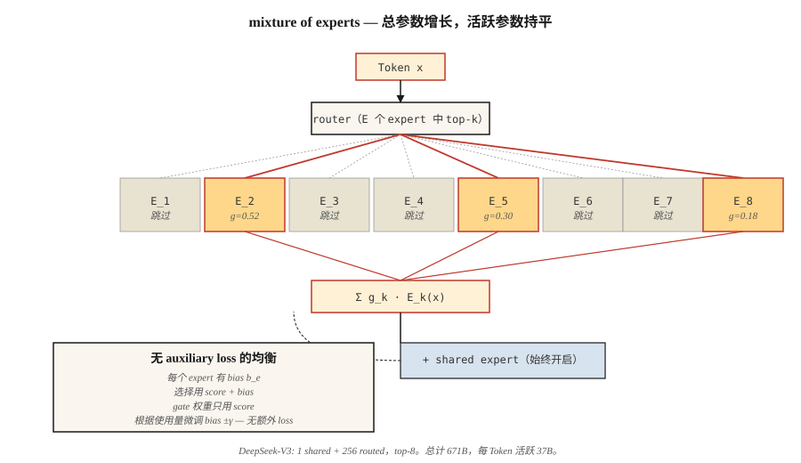

# Mixture of Experts (MoE)

> 一个 dense 70B Transformer 会为每个 Token 激活所有参数。一个 671B MoE 每个 Token 只激活 37B 参数，却在所有 benchmark 上胜过它。稀疏性是这个十年最重要的 scaling 思想。

**Type:** Build
**Languages:** Python
**先修要求:** Phase 7 · 05 (Full Transformer), Phase 7 · 07 (GPT)
**Time:** ~45 minutes

## 问题

dense Transformer 在 inference 时的 FLOPs 等于它的参数量（forward pass 乘以 2）。扩展一个 dense model 时，每个 Token 都要支付完整计算成本。到 2024 年，frontier 已经撞上了 compute wall：要显著变得更聪明，你需要每个 Token 指数级更多的 FLOPs。

Mixture of Experts 打破了这种关联。把每个 FFN 替换成 `E` 个独立 experts + 一个为每个 Token 选择 `k` 个 experts 的 router。总参数量 = `E × FFN_size`。每个 Token 的活跃参数量 = `k × FFN_size`。典型的 2026 配置：`E=256`，`k=8`。存储随 `E` 扩展，计算随 `k` 扩展。

2026 年的 frontier 几乎全是 MoE：DeepSeek-V3（671B total / 37B active）、Mixtral 8×22B、Qwen2.5-MoE、Llama 4、Kimi K2、gpt-oss。在 Artificial Analysis 的独立 leaderboard 上，排名前 10 的开源模型全都是 MoE。

## 概念



### FFN 替换

dense Transformer block：

```
h = x + attn(norm(x))
h = h + FFN(norm(h))
```

MoE block：

```
h = x + attn(norm(x))
scores = router(norm(h))              # (N_tokens, E)
top_k = argmax_k(scores)              # pick k of E per token
h = h + sum_{e in top_k}(
        gate(scores[e]) * Expert_e(norm(h))
    )
```

每个 expert 都是一个独立 FFN（通常是 SwiGLU）。router 是一个单线性层。每个 Token 选择自己的 `k` 个 experts，并获得它们输出的 gated mixture。

### load-balancing 问题

如果 router 让 90% 的 Token 都经过 expert 3，其他 experts 就会被饿死。已经尝试过三种修复方式：

1. **Auxiliary load-balancing loss**（Switch Transformer、Mixtral）。添加一个与 expert 使用率方差成正比的惩罚项。有效，但会增加一个 hyperparameter 和第二个 Gradient 信号。
2. **Expert capacity + token dropping**（早期 Switch）。每个 expert 最多处理 `C × N/E` 个 Token；溢出的 Token 跳过该层。会损害质量。
3. **Auxiliary-loss-free balancing**（DeepSeek-V3）。添加一个可学习的 per-expert bias，用来偏移 router 的 top-k 选择。bias 在 training loss 外部更新。不对主目标添加惩罚。这是 2024 年的重要突破。

DeepSeek-V3 的做法：每个 training step 后，对每个 expert 检查其使用率是高于还是低于目标。按 `±γ` 微调 bias。选择时使用 `scores + bias`。用于 gating 的 expert probabilities 仍然使用未修改的原始 `scores`。这将 routing 与 expression 解耦。

### Shared experts

DeepSeek-V2/V3 还把 experts 拆分为 *shared* 和 *routed*。每个 Token 都会经过所有 shared experts。Routed experts 通过 top-k 选择。Shared experts 捕获通用知识；routed experts 负责专门化。V3 运行 1 个 shared expert，加上从 256 个 routed experts 中 top-8。

### Fine-grained experts

经典 MoE（GShard、Switch）：每个 expert 和完整 FFN 一样宽。`E` 较小（8-64），`k` 较小（1-2）。

现代 fine-grained MoE（DeepSeek-V3、Qwen-MoE）：每个 expert 更窄（1/8 FFN size）。`E` 很大（256+），`k` 更大（8+）。总参数量相同，但组合数量扩展快得多。`C(256, 8) = 400 trillion` 种可能的每 Token “experts”。质量提升，latency 保持不变。

### 成本画像

每个 Token、每层：

| Config | Active params / token | Total params |
|--------|-----------------------|--------------|
| Mixtral 8×22B | ~39B | 141B |
| Llama 3 70B (dense) | 70B | 70B |
| DeepSeek-V3 | 37B | 671B |
| Kimi K2 (MoE) | ~32B | 1T |

DeepSeek-V3 在几乎所有 benchmark 上都胜过 Llama 3 70B（dense），同时 **每个 Token 使用更少的活跃 FLOPs**。更多参数 = 更多知识。更多活跃 FLOPs = 每个 Token 更多计算。MoE 将它们解耦。

### 代价：memory

无论哪些 experts 被触发，所有 experts 都必须驻留在 GPU 上。一个 671B 模型需要约 1.3 TB VRAM 来存放 fp16 weights。frontier MoE deployment 需要 expert parallelism：把 experts 分片到多个 GPUs 上，通过网络 route tokens。Latency 主要由 all-to-all communication 主导，而不是 matmul。

## 构建它

参见 `code/main.py`。一个使用纯 stdlib 的紧凑 MoE layer，包含：

- `n_experts=8` 个近似 SwiGLU 的 experts（为便于说明，每个只有一个 linear）
- top-k=2 routing
- softmax-normalized gating weights
- 通过 per-expert bias 实现 auxiliary-loss-free balancing

### 步骤 1：router

```python
def route(hidden, W_router, top_k, bias):
    scores = [sum(h * w for h, w in zip(hidden, W_router[e])) for e in range(len(W_router))]
    biased = [s + b for s, b in zip(scores, bias)]
    top_idx = sorted(range(len(biased)), key=lambda i: -biased[i])[:top_k]
    # softmax over ORIGINAL scores of the chosen experts
    chosen = [scores[i] for i in top_idx]
    m = max(chosen)
    exps = [math.exp(c - m) for c in chosen]
    s = sum(exps)
    gates = [e / s for e in exps]
    return top_idx, gates
```

Bias 影响选择，而不影响 gate weight。这就是 DeepSeek-V3 的技巧：bias 在不引导模型预测的情况下修正负载不均衡。

### 步骤 2：让 100 个 Token 通过 router

跟踪哪些 experts 被触发以及触发频率。没有 bias 时，使用率会偏斜。加入 bias update loop（过度使用的 experts 用 `-γ`，使用不足的用 `+γ`）后，使用率会在几轮迭代内收敛到均匀分布。

### 步骤 3：参数量对比

打印一个 MoE config 的 “dense equivalent”。DeepSeek-V3 形状：256 routed + 1 shared，8 active，d_model=7168。总参数量非常惊人。活跃参数量只有 dense Llama 3 70B 的七分之一。

## 使用它

HuggingFace 加载：

```python
from transformers import AutoModelForCausalLM, AutoTokenizer
model = AutoModelForCausalLM.from_pretrained("mistralai/Mixtral-8x22B-v0.1")
```

2026 年的 production inference：vLLM 原生支持 MoE routing。SGLang 拥有最快的 expert-parallel path。两者都会自动处理 top-k selection 和 expert parallelism。

**何时选择 MoE：**
- 你希望以更低的每 Token inference cost 获得 frontier quality。
- 你拥有 VRAM / expert-parallel infrastructure。
- 你的 workload 是 token-heavy（chat、code），而不是 context-heavy（long docs）。

**何时不要选择 MoE：**
- Edge deployment：你会为任何 active FLOP 支付完整存储成本。
- Latency-critical single-user serving：expert routing 会增加 overhead。
- 小模型（<7B）：MoE 的质量优势只会在超过某个 compute threshold（约 6B active params）后出现。

## 交付它

参见 `outputs/skill-moe-configurator.md`。该 skill 会根据 parameter budget、training tokens 和 deployment target，为新的 MoE 选择 E、k 和 shared-expert layout。

## 练习

1. **Easy.** 运行 `code/main.py`。观察 auxiliary-loss-free bias update 如何在 50 次迭代中拉平 expert usage。
2. **Medium.** 用 hash-based router（确定性、无需学习）替换 learned router。比较 quality 和 balance。为什么 learned router 更好？
3. **Hard.** 实现 GRPO-style “rollout-matched routing”（DeepSeek-V3.2 技巧）：记录 inference 期间哪些 experts 被触发，在 Gradient 计算期间强制使用相同 routing。在一个 toy policy-gradient setup 上测量效果。

## 关键术语

| Term | 人们常说 | 实际含义 |
|------|----------|----------|
| Expert | “众多 FFN 中的一个” | 一个独立 feed-forward network；参数专用于 FFN 计算中的一个稀疏切片。 |
| Router | “gate” | 一个很小的 linear layer，用来为每个 Token 对每个 expert 打分；执行 top-k selection。 |
| Top-k routing | “每个 Token 有 k 个 active experts” | 每个 Token 的 FFN 计算恰好经过 k 个 experts，并由 gate 加权。 |
| Auxiliary loss | “Load-balance penalty” | 一个额外 Loss term，用来惩罚偏斜的 expert usage。 |
| Auxiliary-loss-free | “DeepSeek-V3 的技巧” | 只在 router 的 selection 上通过 per-expert bias 实现 balance；没有额外 Gradient。 |
| Shared expert | “Always on” | 每个 Token 都会经过的额外 expert；捕获通用知识。 |
| Expert parallelism | “按 expert 分片” | 将不同 experts 分配到不同 GPUs；通过网络 route tokens。 |
| Sparsity | “active params < total params” | 比率 `k × expert_size / (E × expert_size)`；DeepSeek-V3 为 37/671 ≈ 5.5%。 |

## 延伸阅读

- [Shazeer et al. (2017). Outrageously Large Neural Networks: The Sparsely-Gated Mixture-of-Experts Layer](https://arxiv.org/abs/1701.06538) — 这个思想的来源。
- [Fedus, Zoph, Shazeer (2022). Switch Transformer: Scaling to Trillion Parameter Models with Simple and Efficient Sparsity](https://arxiv.org/abs/2101.03961) — Switch，经典 MoE。
- [Jiang et al. (2024). Mixtral of Experts](https://arxiv.org/abs/2401.04088) — Mixtral 8×7B。
- [DeepSeek-AI (2024). DeepSeek-V3 Technical Report](https://arxiv.org/abs/2412.19437) — MLA + auxiliary-loss-free MoE + MTP。
- [Wang et al. (2024). Auxiliary-Loss-Free Load Balancing Strategy for Mixture-of-Experts](https://arxiv.org/abs/2408.15664) — 基于 bias 的 balancing 论文。
- [Dai et al. (2024). DeepSeekMoE: Towards Ultimate Expert Specialization in Mixture-of-Experts Language Models](https://arxiv.org/abs/2401.06066) — 本课 router 使用的 fine-grained + shared-expert split。
- [Kim et al. (2022). DeepSpeed-MoE: Advancing Mixture-of-Experts Inference and Training](https://arxiv.org/abs/2201.05596) — 最早的 shared-expert 论文。
